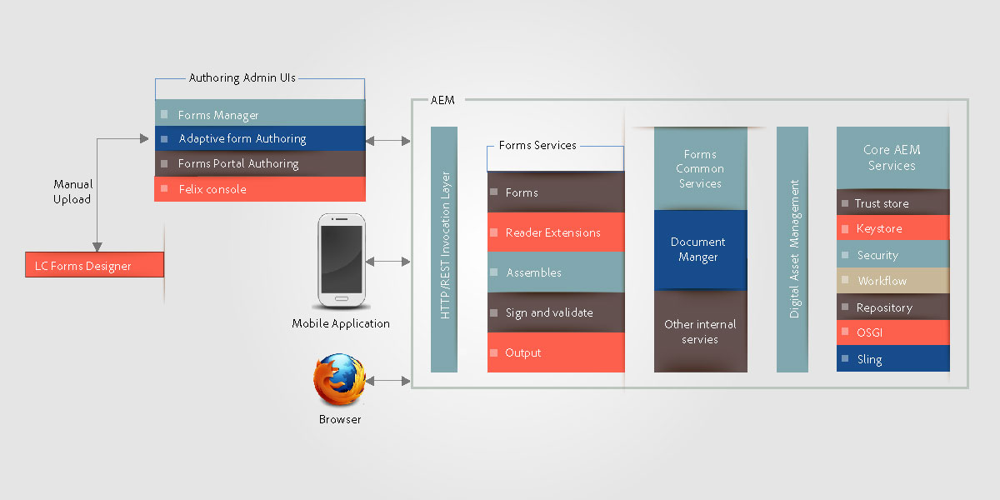

# HTML5形式{#architecture-of-html-forms}

## 架構 {#architecture}

HTML5表單功能作為包部署在嵌入式實AEM例中，並使用REST風格作為REST端點通過HTTP/S展示 [Apache Sling體系結構](https://sling.apache.org/)。

### 使用Sling框架 {#using-sling-framework}

[阿帕奇斯林](https://sling.apache.org/) 以資源為中心。 它使用請求URL首先解析資源。 每個資源 **sling:resourceType** 或 **sling:resourceSuperType**)屬性。 基於該屬性、請求方法和請求URL的屬性，然後選擇sling指令碼來處理請求。 此sling指令碼可以是JSP或servlet。 對於HTML5表， **配置檔案** 節點充當Sling資源 **配置檔案呈現器** 充當sling指令碼，處理使用特定配置檔案呈現移動表單的請求。 A **配置檔案呈現器** 是從請求讀取參數並調用FormsOSGi服務的JSP。

有關REST端點和支援的請求參數的詳細資訊，請參見 [呈現表單模板](/help/forms/using/rendering-form-template.md)。

當用戶從客戶端設備(如iOS或Android™瀏覽器)發出請求時，Sling首先根據請求URL解析配置式節點。 從此配置檔案節點讀取 **sling:resourceSuperType** 和 **sling:resourceType** 確定可處理此表單呈現請求的所有可用指令碼。 然後，它使用Sling請求選擇器和request方法來標識最適合處理此請求的指令碼。 請求到達配置檔案呈現器JSP後，JSP將調用FormsOSGi服務。

有關sling指令碼解析的詳細資訊，請參見 [SlingAEM作弊表](https://experienceleague.adobe.com/docs/experience-manager-release-information/aem-release-updates/previous-updates/aem-previous-versions.html?lang=zh-Hant) 或 [Apache Sling Url分解](https://sling.apache.org/documentation/the-sling-engine/url-decomposition.html)。

#### 典型表單處理調用流 {#typical-form-processing-call-flow}

HTML5表單快取處理第一個請求上的表單所需的所有中間對象（格式副本或提交）。 它不快取依賴於資料的對象，因為此類對象可能會更改。

移動表單維護兩個不同級別的快取，PreRender快取和Render快取。 preRender快取包含已解析模板的所有片段和影像，而Render快取包含已呈現的內容，如HTML。

HTML5表單工作流

HTML5表單不會快取缺少片段和影像引用的模板。 如果HTML5表單所花費的時間超過正常時間，則檢查伺服器日誌中是否缺少引用和警告。 另外，請確保未達到對象的最大大小。

FormsOSGi服務分兩步處理請求：

* **佈局和初始表單狀態生成**:FormsOSGi呈現服務調用Forms快取元件以確定表單是否已快取且未失效。 如果表單已快取且有效，則它為從快取生成的HTML提供服務。 如果表單無效，則FormsOSGi呈現服務將生成XML格式的初始表單佈局和表單狀態。 此XML將由FormsOSGi服務轉換為HTML佈局和初始JSON表單狀態，然後快取以備後續請求使用。
* **預聚Forms**:在呈現時，如果用戶請求具有預填充資料的表單，則FormsOSGi呈現服務調用Forms服務容器並生成具有合併資料的新表單狀態。 但是，由於佈局已在上述步驟中生成，因此此呼叫比第一次呼叫快。 此調用僅執行資料合併並對資料運行指令碼。

如果有任何形式的更新或表單內部使用的任何資產，則表單快取元件檢測到它，並且該特定表單的快取無效。 FormsOSGi服務完成處理後，配置檔案呈現器jsp將JavaScript庫引用和樣式添加到此表單，並將響應返回給客戶端。 典型的Web伺服器，如 [阿帕奇](https://httpd.apache.org/) 可在此處與HTML壓縮一起使用。 Web伺服器將顯著減少響應大小、網路流量以及在伺服器和客戶機之間傳輸資料所需的時間。

當用戶提交表單時，瀏覽器將JSON格式的表單狀態發送到 [提交服務代理](../../forms/using/service-proxy.md);然後，提交服務代理使用JSON資料生成資料XML，並提交該資料XML以提交終結點。

## 元件 {#components}

您需要AEM Forms附加包才能啟用HTML5窗體。 有關安裝AEM Forms載入項軟體包的資訊，請參見 [安裝和配置AEM Forms](../../forms/using/installing-configuring-aem-forms-osgi.md)。

### OSGi元件(adobe-lc-forms-core.jar) {#osgi-components-adobe-lc-forms-core-jar}

**AdobeXFAForms呈現器(com.adobe.livecycle.adobe-lc-forms-core)** 是從Felix管理控制台的「捆綁」視圖查看HTML5窗體OSGi捆綁包的顯示名稱(https://)[主機]:[埠]/system/console/bundles)。

此元件包含用於呈現、快取管理和配置設定的OSGi元件。

#### FormsOSGi服務 {#forms-osgi-service}

此OSGi服務包含將XDP呈現為HTML的邏輯，並處理表單的提交以生成資料XML。 此服務使用Forms服務容器。 Forms服務容器內部調用本機元件 `XMLFormService.exe` 執行處理。

如果接收到呈現請求，則此元件將調用Forms服務容器以生成佈局和狀態資訊，並進一步處理這些佈局和狀態資訊以生成HTML和JSON表單DOM狀態。

此元件還負責從提交的表單狀態JSON生成資料XML。

#### 快取元件 {#cache-component}

HTML5表單使用快取來優化吞吐量和響應時間。 您可以配置快取服務的級別，以微調效能和空間利用率之間的權衡。

<table>
 <tbody>
  <tr>
   <th>快取策略</th>
   <th>說明</th>
  </tr>
  <tr>
   <td>無</td>
   <td>不快取對象  </td>
  </tr>
  <tr>
   <td>保守</td>
   <td>僅快取在呈現包含內嵌片段和影像的表單模板之前生成的中間對象</td>
  </tr>
  <tr>
   <td>攻擊性</td>
   <td>快取呈現的HTML內容  快取在「保守」級別中快取的所有對象。  <strong>注釋</strong>:此策略會獲得最佳效能，但會消耗更多記憶體來儲存快取的偽像。</td>
  </tr>
 </tbody>
</table>

HTML5表單使用LRU策略執行記憶體內快取。 如果快取策略設定為「無」，則不會建立快取，並且現有的快取資料（如果有）將被清除。 除了快取策略外，您還可以配置記憶體中的快取總大小，這有助於在快取大小上達到最大限制，如果超出限制，則會使用LRU模式釋放快取資源。

>[!NOTE]
>
>記憶體快取未在群集節點之間共用。

#### 配置服務 {#configuration-service}

Configuration Service可為HTML5表單調整配置參數和快取設定。

要更新這些設定，請轉至CQ FelixAdmin Console(可從https://&lt;&#39;獲得)[伺服器]:[埠]「/system/console/configMgr)，搜索並選擇「移動Forms配置」。

可以使用配置服務配置快取大小或禁用快取。 也可以使用「調試選項」參數啟用調試。 有關調試表單的詳細資訊，請訪問 [調試HTML5窗體](/help/forms/using/debug.md)。

### 運行時元件(adobe-lc-forms-runtime-pkg.zip) {#runtime-components-adobe-lc-forms-runtime-pkg-zip}

運行時包包含用於呈現HTML表單的客戶端庫。

**作為運行時包的一部分可用的重要元件：**

#### 指令碼引擎 {#scripting-engine}

AdobeXFA實現支援兩種指令碼語言，以在表單中啟用用戶定義的邏輯執行：JavaScript和FormCalc。

HTMLForms的指令碼引擎是用JavaScript編寫的，用於支援這兩種語言的XFA指令碼API。

在呈現時，FormCalc指令碼將轉換（並快取）為對用戶或設計器透明的伺服器上的JavaScript。

此指令碼引擎使用ECMAScript5的某些功能，如Object.defineProperty。 引擎/庫以CQ客戶端庫的形式提供，其類別名稱為 **xfaforms.profile**。 它還提供 **FormBridge API** 啟用外部門戶或應用與窗體交互。 使用FormBridge，外部應用程式可以以寫程式方式隱藏某些元素、獲取或設定其值或更改其屬性。

有關詳細資訊，請參閱 [窗體橋](/help/forms/using/form-bridge-apis.md) 文章。

#### 佈局引擎 {#layout-engine}

HTML5表單的佈局和視覺方面基於SVG1.1、jQuery、BackBone和CSS3功能。 在伺服器上生成並快取表單的初始外觀。 該初始佈局的微調以及對表單佈局的任何進一步增量更改都在客戶端上進行管理。 為此，運行時包包含一個以JavaScript編寫並基於jQuery/Backbone的佈局引擎。 此引擎處理所有動態行為，如添加/刪除可重複實例、可增長對象佈局。 此佈局引擎每次將表單呈現一頁。 最初，用戶只查看一頁，水準捲動條僅對第一頁進行查看。 但是，當用戶向下滾動時，下一頁將開始呈現。 此逐頁格式副本減少了在瀏覽器中呈現第一頁所需的時間，並增強了表單的感知效能。 此引擎/庫是CQ客戶端庫的一部分，其類別名稱 **xfaforms.profile**。

佈局引擎還包含一組小部件，用於從用戶捕獲表單域的值。 這些小部件建模為 [j查詢UI小部件](https://api.jqueryui.com/jQuery.widget/) 執行某些附加合同以與Layout引擎無縫協作。

有關小部件和相應合同的詳細資訊，請參閱 [HTML5窗體的自定義小部件](/help/forms/using/introduction-widgets.md)。

#### 樣式 {#styling}

與HTML元素關聯的樣式是內聯的或基於嵌入式CSS塊添加的。 某些不依賴於表單的常用樣式是CQ客戶端庫的一部分，其類別名稱為xfaforms.profile。

除了預設的樣式屬性外，每個表單元素還包含基於元素類型、名稱和其他屬性的某些CSS類。 使用這些類，可以通過指定其自己的CSS來重新設定元素的樣式。

有關預設樣式和類的詳細資訊，請參閱 [樣式簡介](/help/forms/using/css-styles.md)。

#### 伺服器端指令碼和Web服務 {#server-side-script-and-web-services}

任何標籤為在伺服器上運行或標籤為調用Web服務的指令碼（無論其標籤為執行的位置）始終在伺服器上執行。

客戶端指令碼引擎：

1. 以JSON形式對傳遞當前窗體狀態的伺服器進行同步調用
1. 在伺服器上執行指令碼或Web服務
1. 生成新的JSON狀態
1. 在返迴響應時合併客戶端上的新JSON狀態。

#### 本地化資源包 {#localization-resource-bundles}

HTML5表單支援義大利語(it)、西班牙語(es)、巴西葡萄牙語(pt_BR)、簡體中文(zh_CN)、繁體中文（僅限支援）(zh_TW)、韓語(ko_KR)、英語(en_US)、法語(fr_FR)、德語(de_DE)和日語(ja)。 根據在請求標頭中接收的區域設定，相應的資源包被發送到客戶端。 此資源包將作為具有類別名稱的CQ客戶端庫添加到配置檔案JSP中 **xfaforms.I18N**。 您可以覆蓋配置檔案中提取區域設定包的邏輯。

### Sling元件(adobe-lc-forms-content-pkg.zip) {#sling-components-adobe-lc-forms-content-pkg-zip}

Sling軟體包包含與「配置檔案」和「配置檔案呈現器」相關的內容。

#### 設定檔 {#profiles}

配置檔案是sling中表示窗體或Forms族的資源節點。 在CQ級別，這些配置檔案是JCR節點。 節點位於 **/內容** 資料夾，並且可以位於 **/內容** 的子菜單。

#### 配置檔案呈現者 {#profile-renderers}

配置檔案節點具有屬性 **sling:resourceSuperType** 值 **xfaforms/profile**。 此屬性在內部向位於以下位置的配置檔案節點的sling指令碼發送轉發請求 **/libs/xfaforms/profile** 的子菜單。 這些指令碼是JSP頁，是用於將HTML表單和所需的JS/CSS對象組合在一起的容器。 這些頁面包括對以下內容的引用：

* **xfaforms.I18N。&lt;locale>**:此庫包含本地化資料。
* **xfaforms.profile**:此庫包含XFA指令碼和佈局引擎的實現。

這些庫被建模為CQ客戶端庫，它利用了CQ框架JavaScript庫的自動連接、縮放和壓縮功能。
有關CQ客戶端庫的詳細資訊，請參見 [CQ客戶端庫文檔](https://experienceleague.adobe.com/docs/experience-manager-release-information/aem-release-updates/previous-updates/aem-previous-versions.html?lang=zh-Hant)。

如上所述，配置檔案呈現器JSP通過sling include調用Forms服務。 此JSP還根據管理員配置或請求參數設定各種調試選項。

HTML5表單允許開發人員建立配置檔案和配置檔案呈現器以自定義表單的外觀。 例如，HTML表單允許開發人員將表單整合到面板或 &lt;div> 的下界。
有關建立自定義配置檔案的詳細資訊，請參閱 [建立自定義配置檔案](/help/forms/using/custom-profile.md)。
