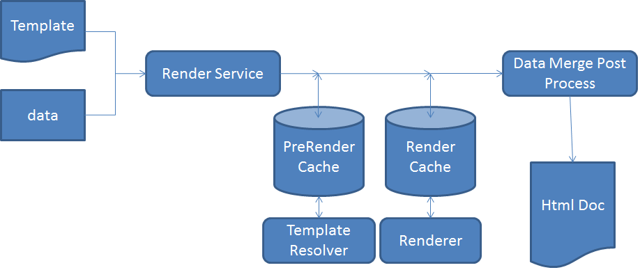

# HTML5表單的架構{#architecture-of-html-forms}

## 架構 {#architecture}

HTML5表單功能會部署為內嵌例項中的套件，AEM並使用RESTful [Apache Sling Architecture](https://sling.apache.org/)，以HTTP/S的REST端點形式公開。

### 使用Sling Framework {#using-sling-framework}

[Apache ](https://sling.apache.org/) Slingis以資源為中心。它會使用請求URL，先解析資源。 每個資源都有&#x200B;**sling:resourceType**（或&#x200B;**sling:resourceSuperType**）屬性。 根據此屬性、request方法和request URL的屬性，接著會選取sling指令碼來處理請求。 此sling指令碼可以是JSP或servlet。 對於HTML5表單，**Profile**&#x200B;節點充當sling資源，而&#x200B;**Profile Renderer**&#x200B;則當作sling指令碼，處理使用特定描述檔來呈現行動表單的請求。 **描述檔轉譯器**&#x200B;是一個JSP，它從請求中讀取參數並調用FormsOSGi服務。

有關REST端點和支援的請求參數的詳細資訊，請參見[ Rendering Form Template](/help/forms/using/rendering-form-template.md)。

當使用者從用戶端裝置（例如iOS或Android瀏覽器）提出請求時，Sling會先根據請求URL解析描述檔節點。 從此描述檔節點，它會讀取&#x200B;**sling:resourceSuperType**&#x200B;和&#x200B;**sling:resourceType**，以決定所有可處理此Form Render請求的可用指令碼。 然後使用Sling請求選擇器以及request方法來識別最適合處理此請求的指令碼。 當請求到達描述檔轉譯器JSP時，JSP會呼叫FormsOSGi服務。

如需sling指令碼解析度的詳細資訊，請參閱AEM[Sling Cheat Sheet](https://docs.adobe.com/content/docs/en/cq/current/developing/sling_cheatsheet.html)或[Apache Sling Url decomposition](https://sling.apache.org/site/url-decomposition.html)。

#### 典型表單處理呼叫流{#typical-form-processing-call-flow}

HTML5表單會快取第一個請求時處理表單（轉譯或提交）所需的所有中介物件。 它不會快取依賴於資料的對象，因為這些對象可能會更改。

Mobile Form會維護兩種不同的快取層級： PreRender快取和Render快取。 preRender快取包含已解析範本的所有片段和影像，而Render快取則包含已轉譯的內容，例如HTML。

HTML5表單工作流程

HTML5表格不會快取遺失片段和影像參照的範本。 如果HTML5表單所花的時間超過正常時間，請檢查伺服器記錄檔是否遺失參照和警告。 同時，請確保未達到對象的最大大小。

FormsOSGi服務會以兩個步驟處理請求：

* **版面配置和初始表單狀態產生**:FormsOSGi轉譯服務會呼叫Forms快取元件，以判斷表單是否已快取且未失效。如果表單已快取且有效，則會從快取中支援產生的HTML。 如果表單無效，FormsOSGi演算服務會以XML格式產生初始表單版面配置和表單狀態。 此XML會由FormsOSGi服務轉換為HTML版面配置和初始JSON表單狀態，然後快取以備後續要求使用。
* **預先填入的Forms**:在呈現時，如果使用者以預先填入的資料來要求表單，FormsOSGi呈現服務會呼叫Forms服務容器，並產生具有合併資料的新表單狀態。不過，由於版面已在上述步驟中產生，因此此呼叫比第一次呼叫更快。 此調用僅執行資料合併並對資料運行指令碼。

如果表單或表單內使用的資產有任何更新，表單快取元件會偵測到該更新，而該特定表單的快取會失效。 在FormsOSGi服務完成處理後，描述檔轉譯器jsp會將JavaScript程式庫參考和樣式新增至此表單，並傳回回應給用戶端。 此處可搭配HTML壓縮使用典型的Web伺服器，如[Apache](https://httpd.apache.org/)。 Web伺服器可大幅降低回應大小、網路流量，以及在伺服器與用戶端機器之間串流資料所需的時間。

當使用者提交表單時，瀏覽器會以JSON格式傳送表單狀態給[submit service proxy](../../forms/using/service-proxy.md);然後，提交服務proxy會使用JSON資料產生資料XML，並提交該資料XML以提交端點。

## 元件 {#components}

您需要AEM Forms附加套件才能啟用HTML5表單。 有關安裝AEM Forms附加軟體包的資訊，請參見[安裝和配置AEM Forms](../../forms/using/installing-configuring-aem-forms-osgi.md)。

### OSGi元件(adobe-lc-forms-core.jar){#osgi-components-adobe-lc-forms-core-jar}

**AdobeXFAForms轉譯器(com.adobe.livecycle.adobe-lc-forms-core)** ，是從Felix管理控制台的Bundle檢視時，HTML5表單OSGi套件的顯示名稱(https://[ Host]:[port]/system/console/bundles)。

此元件包含用於演算、快取管理和組態設定的OSGi元件。

#### FormsOSGi服務{#forms-osgi-service}

此OSGi服務包含將XDP轉換為HTML的邏輯，並處理表單的提交以產生資料XML。 此服務使用Forms服務容器。 Forms服務容器內部調用執行處理的本地元件`XMLFormService.exe`。

如果收到演算請求，此元件會呼叫Forms服務容器以產生版面配置和狀態資訊，並進一步處理這些資訊以產生HTML和JSON表單DOM狀態。

此元件也負責從提交的表單狀態JSON產生資料XML。

#### 快取元件{#cache-component}

HTML5表單使用快取來最佳化總處理能力和回應時間。 您可以配置快取服務級別，以微調效能和空間利用率之間的權衡。

<table>
 <tbody>
  <tr>
   <th>快取策略</th>
   <th>說明</th>
  </tr>
  <tr>
   <td>無</td>
   <td>不快取對象  </td>
  </tr>
  <tr>
   <td>保守派</td>
   <td>只快取在轉譯表單（例如包含內嵌片段和影像的範本）之前產生的中介對象</td>
  </tr>
  <tr>
   <td>攻擊性</td>
   <td>快取轉譯的HTML內容 快取在「保守」層級快取的所有物件。  <strong>注意</strong>:此策略可產生最佳效能，但會耗用更多記憶體來儲存快取的工件。</td>
  </tr>
 </tbody>
</table>

HTML5表格會使用LRU策略執行記憶體內快取。 如果快取策略設定為「無」，則不會建立快取，並且現有的快取資料（如果有）將被清除。 除了快取策略外，您也可以設定記憶體內快取總大小，以協助達到快取大小上限，如果超過此限制，則會使用LRU模式釋放快取資源。

>[!NOTE]
>
>記憶體快取不在群集節點之間共用。

#### 配置服務{#configuration-service}

Configuration Service可讓您調整HTML5表單的設定參數和快取設定。

若要更新這些設定，請前往CQ FelixAdmin Console(可在https://&lt;&#39;[server]:[port]&#39;/system/console/configMgr取得)，搜尋並選取「行動Forms組態」。

您可以使用配置服務配置快取大小或禁用快取。 您也可以使用「除錯選項」參數啟用除錯。 有關除錯表單的詳細資訊，請參閱[除錯HTML5表單](/help/forms/using/debug.md)。

### Runtime元件(adobe-lc-forms-runtime-pkg.zip){#runtime-components-adobe-lc-forms-runtime-pkg-zip}

「執行時期套件」包含用於轉換HTML表單的用戶端程式庫。

**Runtime套件中提供的重要元件：**

#### 指令碼引擎{#scripting-engine}

AdobeXFA實作支援兩種指令碼語言，讓使用者定義的邏輯在表單中執行：JavaScript和FormCalc。

HTMLForms的指令碼引擎是以JavaScript編寫，以支援這兩種語言的XFA指令碼API。

在演算時，FormCalc指令碼會轉譯（並快取）至使用者或設計人員透明的伺服器上的JavaScript。

此指令碼引擎使用ECMAScript5的某些功能，例如Object.defineProperty。 引擎／庫以類別名稱&#x200B;**xfaforms.profile**&#x200B;的CQ客戶端庫的形式提供。 它也提供&#x200B;**FormBridge API**，讓外部入口網站或應用程式與表單互動。 使用FormBridge，外部應用程式可以程式設計方式隱藏某些元素、取得或設定其值，或變更其屬性。

如需詳細資訊，請參閱[Form Bridge](/help/forms/using/form-bridge-apis.md)文章。

#### 版面引擎{#layout-engine}

HTML5表單的版面配置和視覺化方面是以SVG 1.1、jQuery、BackBone和CSS3功能為基礎。 在伺服器上產生並快取表單的初始外觀。 在用戶端上管理該初始版面的調整以及對表單版面的任何進一步遞增變更。 為此，Runtime套件包含以JavaScript撰寫並以jQuery/Backbone為基礎的版面引擎。 此引擎可處理所有動態行為，例如「新增／移除可重複執行個體」、「可成長」物件配置。 此版面引擎會一次轉譯一個表單一頁。 一開始，使用者只檢視一頁，而水準捲軸則僅代表第一頁。 不過，當使用者向下捲動時，下一頁會開始呈現。 此逐頁轉譯可減少在瀏覽器中呈現第一頁所需的時間，並增強表單的效能。 此引擎／庫是CQ客戶端庫的一部分，類別名稱為&#x200B;**xfaforms.profile**。

「版面引擎」也包含一組Widget，用來擷取使用者表單欄位的值。 這些Widget模型化為[jQuery UI Widgets](https://api.jqueryui.com/jQuery.widget/)，可實施特定的額外合約，以便與版面引擎順暢運作。

如需Widget和相應合約的詳細資訊，請參閱[HTML5表單的自訂Widget](/help/forms/using/introduction-widgets.md)。

#### 樣式 {#styling}

與HTML元素關聯的樣式會以內嵌或內嵌的CSS區塊為基礎來新增。 某些不依賴表單的常見樣式是CQ Client Lib的一部分，類別名稱為xfaforms.profile。

除了預設樣式屬性外，每個表單元素也包含某些以元素類型、名稱和其他屬性為基礎的CSS類別。 使用這些類別，您可以透過指定其專屬的CSS來重新設定元素樣式。

有關預設樣式和類的詳細資訊，請參閱[樣式簡介](/help/forms/using/css-styles.md)。

#### 伺服器端指令碼和網站服務{#server-side-script-and-web-services}

任何標籤為在伺服器上執行或標籤為呼叫Web服務（不論其標籤為執行的位置）的指令碼一律會在伺服器上執行。

用戶端指令碼引擎：

1. 對以JSON格式傳遞目前表單狀態的伺服器進行同步呼叫
1. 在伺服器上執行指令碼或Web服務
1. 產生新的JSON狀態
1. 當回應傳回時，會合併用戶端上的新JSON狀態。

#### 本地化資源包{#localization-resource-bundles}

HTML5表單支援義大利文(it)、西班牙文(es)、巴西葡萄牙文(pt_BR)、簡體中文(zh_CN)、繁體中文（僅限支援zh_TW）、韓文(ko_KR)、英文(en_US)、法文(fr_FR)、德文(de_DE)和日文(ja)語言。 根據在請求標題中收到的地區設定，將對應的資源組合傳送至用戶端。 此資源包將作為CQ客戶端庫添加到配置檔案JSP中，類別名為&#x200B;**xfaforms.I18N**。 您可以覆寫描述檔中擷取地區設定封裝的邏輯。

### Sling Components(adobe-lc-forms-content-pkg.zip){#sling-components-adobe-lc-forms-content-pkg-zip}

Sling套件包含與Profiles和Profile Renderer相關的內容。

#### 設定檔 {#profiles}

Profiles是sling中代表表單或Forms族的資源節點。 在CQ級別，這些配置檔案是JCR節點。 節點位於JCR儲存庫的&#x200B;**/content**&#x200B;資料夾下，可位於&#x200B;**/content**&#x200B;資料夾下的任何子資料夾內。

#### 描述檔轉譯器{#profile-renderers}

Profile節點具有&#x200B;**sling:resourceSuperType**&#x200B;屬性，其值為&#x200B;**xfaforms/profile**。 此屬性會在內部傳送轉發請求至位於&#x200B;**/libs/xfaforms/profile**&#x200B;資料夾中之Profile節點的sling指令碼。 這些指令碼是JSP頁面，是用於組合HTML表單和必要JS/CSS對象的容器。 這些頁面包含對以下項目的參考：

* **xfaforms.I18N。&lt;locale>**:此程式庫包含本地化資料。
* **xfaforms.profile**:此程式庫包含XFA指令碼和版面引擎的實作。

這些程式庫會建模為CQ Client Libraries，以善用CQ架構JavaScript程式庫的自動串連、精簡化和壓縮功能。
有關CQ客戶機庫的詳細資訊，請參閱[CQ客戶機庫文檔](https://docs.adobe.com/docs/en/cq/current/developing/components/clientlibs.html)。

如上所述，描述檔轉譯器JSP會透過sling include呼叫Forms服務。 此JSP也會根據管理員組態或請求參數設定各種除錯選項。

HTML5表單可讓開發人員建立描述檔和描述檔轉譯器，以自訂表單的外觀。 例如，HTML表單可讓開發人員將表單整合在現有HTML入口網站的面板或&lt;div>區段中。
如需建立自訂描述檔的詳細資訊，請參閱[建立自訂描述檔](/help/forms/using/custom-profile.md)。
