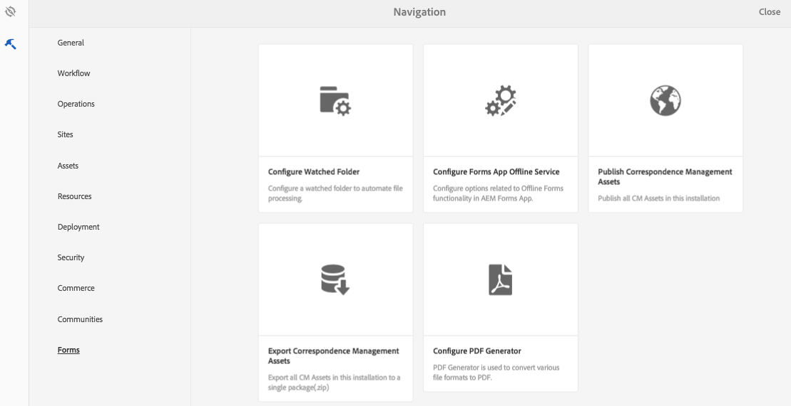

# 匯入資產並匯出至AEM Forms{#importing-and-exporting-assets-to-aem-forms}

您可以在不同的AEM Forms例項之間移動表單和相關資產、主題、資料字典、檔案片段和字母。 當遷移系統或將表單從舞台伺服器移動到生產伺服器時需要這樣的移動。 對於支援透過AEM Forms UI上傳和匯入的資產，建議使用Forms UI進行匯出或匯入。 不建議使用AEM Package Manager來匯出或匯入此類資產。

>[!NOTE]
>
>* 在AEM 6.4 Forms中，crx-repository的結構和路徑已變更。 如果您從舊版匯入資產至AEM 6.4 Forms，而表單對舊版結構有某些相依性，您必須手動匯出相依性。 如需資料庫結構和路徑變更的詳細資訊，請參閱「AEM中的 [資料庫重組」](/help/sites-deploying/repository-restructuring.md)。
>

## 下載或上傳表單與檔案資產 {#download-or-upload-forms-amp-documents-assets}

AEM Forms使用者介面可讓您從AEM例項將資產下載為AEM CRX套件或二進位檔案，以匯出資產。 然後，您可以將下載的AEM CRX-package或二進位檔案匯入另一個AEM例項。

除「最適化表單」範本和「最適化表單」內容原則外，所有資產都支援透過AEM Forms使用者介面匯出和匯入。 因此，從AEM Forms UI匯出最適化表單時，相關的最適化表單範本和內容原則不會像其他相關資產一樣自動匯出。

對於這些資產類型，您必須使用AEM Package Manager在來源AEM伺服器上建立CRX套件，並在目標伺服器上安裝套件。 有關建立和安裝軟體包的資訊，請參 [閱使用軟體包](/help/sites-administering/package-manager.md)。

### 下載表單與檔案資產 {#download-forms-amp-documents-assets}

若要下載表單與檔案資產：

1. 登入AEM Forms例項。
1. 點選Experience Manager  >導覽指南  >表單>表單與檔案。
1. 選取表單資產，並點選「下 **載** 」圖示。
1. 在「下載資產」中，選擇下列其中一個選項，然後點選「下 **載」**。

   * **下載為CRX套件：** 使用選項，從AEM Forms例項下載所有選取的資產及相關相依性，並將其移至另一個。 它會將所有資產和資料夾下載為crx套件。 任何表單資產，包括以AEM（最適化表單、互動式通訊和最適化表單片段）製作的表單、表單集、表單範本、PDF檔案和資源（XSD、XFS、影像），都可從AEM Forms UI下載為套件。
將資產下載為套件的好處是，它也會下載被選取要下載的資產使用的資產。 例如，如果您有使用表單範本、XSD和影像的最適化表單。 當您選取此最適化表單並將其下載為套件時，下載的套件也包含表單範本、XSD和影像。 也會下載與資產相關聯的所有中繼資料屬性（包括自訂屬性）。

   * **以二進位檔案形式下載資產：** 使用以下選項僅下載表單範本(XDP)、PDF表單(PDF)、檔案(PDF)和資源（影像、結構描述、樣式表）。 您可以使用外部應用程式編輯這些資產。 它會以。zip檔案的形式下載具有二進位檔的表單資產，例如XSD、XDP、影像、PDF和XDP。
您無法使用下載資產做為二進位檔案選項，下載最適化表單、互動式通訊、最適化表 **單片段、主題和表單集** 。 若要下載這些資產，您應使用「下 **載為CRX套件** 」選項。
   選取的資產會下載為封存（.zip檔案）。

   >[!NOTE]
   >
   >AEM套件和二進位檔案都會下載為封存檔（.zip檔案）。 資產的範本不會與資產一起下載。 您需要個別匯出資產範本。

### 上傳表單與檔案資產 {#upload-forms-amp-documents-assets}

若要上傳表單與檔案資產：

>[!VIDEO](https://vimeo.com/)

1. 登入AEM Forms例項。
1. 點選Experience Manager  >導覽指南  >表單>表單與檔案。
1. 點選「 **建立** >**檔案上傳**」。 此時會出現上傳表格或封裝對話方塊。
1. 在對話方塊中，瀏覽並選取要匯入的套件或封存檔。 您也可以選取PDF檔案、XSD、影像、樣式表和XDP表單。 點選「 **開啟**」。 您選擇的資料夾或檔案名不得包含任何特殊字元。

   在對話方塊中，確認所上傳資產的詳細資料，然後點選「上 **傳」**。

   萬一您上傳現有的表單資產，資產就會更新。

   >[!NOTE]
   >
   >上傳套件不會取代現有的資料夾階層。 例如，如果您有一個名為&#39;Training&#39;的最適化表單，位於單一伺服器上的/content/dam/formsanddocuments位置。 您下載最適化表單，然後在另一台伺服器上傳表單。 第二個伺服器在相同位置也有名稱為&#39;Training&#39;的資料夾/content/dam/formsanddocuments。 上傳失敗。

## 下載或上傳主題 {#downloading-or-uploading-a-theme}

有了AEM Forms，您可以建立、下載或上傳主題。 主題的建立方式與其他資產（例如表單、檔案和字母）類似。 您可以建立主題、下載主題，然後將主題上傳至個別的例項，以重複使用主題。 如需主題的詳細資訊，請參閱「AEM [表格中的主題」](../../forms/using/themes.md)。

### 下載主題 {#downloading-a-theme}

您可以匯出AEM Forms中的主題，以便用於其他專案或例項。 AEM可讓您以zip檔案的形式下載主題，您可以上傳至例項。

若要下載主題：

1. 登入AEM Forms例項。
1. 點選Experience Manager  >導覽指南  >表單>主題。
1. 選取主題並點選「 **下載」**。 主題會下載為封存（.zip檔案）。

### 上傳主題 {#uploading-a-theme}

您可以在專案中使用已建立的主題和樣式預設集。 您可以將其他人建立的主題套件上傳至您的專案，以匯入這些主題套件。

若要上傳主題：

1. 在Experience Manager中，導覽至「表 **單>主題」**。
1. 在「主題」頁面中，按一下「 **建立>檔案上傳」**。
1. 在「檔案上傳」提示中，瀏覽並選取電腦上的主題套件，然後按一下「上 **傳**」。
已上傳的主題可在主題頁面中使用。

1. 登入AEM Forms例項。
1. 點選Experience Manager  >導覽指南  >表單>主題。
1. 按一 **下「建立** >檔案 **上傳」**。 在「檔案上傳」提示中，瀏覽並選取電腦上的主題套件，然後按一下「上 **傳**」。 主題已上傳。

## 在Oracle Commenting中匯入和匯出資產 {#import-and-export-assets-in-correspondence-management}

若要在兩個不同的通訊管理實作之間共用資產，例如資料字典、字母和檔案片段，您可以建立和共用。cmp檔案。 .cmp檔案可包含一或多個資料字典、字母、檔案片段和表單。

### 匯出檔案片段、字母和／或資料字典 {#export-document-fragments-letters-and-or-data-dictionaries}

1. 在字母、檔案片段或資料字典頁面中，點選並選取您要匯出至單一套件的資產，然後點選「佇列以供下載」。 這些資產排成一列，供出口。
1. 視需要，重複上述步驟以新增字母、檔案片段和資料字典。
1. 點選「 **下載**」。
1. 「對應管理」會顯示「下載資產」對話方塊，以及匯出清單中的資產清單。

   

1. 要查看導出的從屬關係，請按一下「解決」。 或跳至下一步。 即使您未點選解析，依賴項仍會匯出。
1. 若要下載。cmp檔案，請點選「 **確定**」。
1. 「通信管理」會將。cmp檔案下載至您的電腦。

   .cmp檔案包含匯出的資產。 您可以與其他人共用。cmp檔案。 其他使用者可以將。cmp檔案匯入不同的伺服器，以取得新伺服器中的所有資產。

### 將所有Correponsement Management資產匯出為套件 {#export-all-the-correspondence-management-assets-as-a-package}

使用這個選項，從AEM表單例項將所有Correponsement Management資產和相關相依性下載為套件。

例如，如果「對應管理」有使用影像和文字的字母，則下載的套件也會包含影像和與字母相關的文字。 也會下載與資產相關聯的所有中繼資料屬性（包括自訂屬性）。 下載套件(.cmp)後，您就可以將套 [件匯入至不同的AEM Forms例項](../../forms/using/import-export-forms-templates.md#p-upload-forms-documents-assets-p)。

要將所有Correponsement Management資產和相關依賴項作為包下載，請完成以下步驟：

1. 以表單使用者身分登入AEM Forms伺服器。
1. 在全 **域導覽列中點選** 「Adobe Experience Manager」。
1. 點選工具( )，然後點選 **表單**。
1. Tap **Export Correspondence Management Assets**.

   

   (&quot;Export All Corresponces Management Assets&quot;頁面出現，顯示上次嘗試導出進程的資訊，以及下載上次成功導出的包的連結。

   

1. 點選 **「Export** （匯出）」 **，然後在確認訊息中點選「** OK（確定）」。

   批次處理完成後，會更新上次執行的詳細資料和下載套件的連結。 這包括管理員登錄以及批處理是否成功運行或失敗等資訊。 資產會匯出至套件，並出現「下載匯出的套件」連結。

   >[!NOTE]
   >
   >啟動後，「匯出所有資產」程式便無法取消。 此外，匯出所有作業都在進行中時，請勿建立、刪除、修改或發佈任何資產，或啟動「發佈所有資產」程式。a

1. 點選「下 **載匯出的套件** 」連結以下載套件檔案。

   若要將套件中的資產新增至另一個Correponsement Management例項， [請將套件匯入AEM Forms例項](../../forms/using/import-export-forms-templates.md#p-upload-forms-documents-assets-p)。

### 將檔案片段、字母和／或資料字典匯入對應管理 {#import-document-fragments-letters-and-or-data-dictionaries-into-correspondence-management}

您可以匯入匯出至。cmp檔案的資產。 .cmp檔案可包含一或多個字母、資料字典、檔案片段和相依資產。

>[!NOTE]
>
>在匯入舊的Correponse Management資產進行移轉時，請使用管理員帳戶登入。 如需有關移轉舊對應管理資產的詳細資訊，請參 [閱「將對應管理資產移轉至AEM 6.1表格](/help/forms/using/migration-utility.md)」。

1. 在資料字典、字母或檔案片段頁面上，點選「 **建立>檔案上傳** 」並選取。cmp檔案。
1. 「對應管理」會顯示「匯入資產」對話方塊，其中包含已匯入的資產清單。 點選「 **匯入**」。

   匯入資產後，資產的下列屬性會更新，而其他屬性則保持不變：

   * 作者：顯示將資產匯入伺服器的使用者ID
   * 已修改：將資產匯入伺服器的時間
   >[!NOTE]
   >
   >若要能夠上傳XDP（作為cmp檔案的一部分或其他部分），您必須是表單使用者群組的一部分。 如需存取權限，請聯絡管理員。

## 匯出工作流程應用程式 {#export-a-workflow-application}

您可以使用AEM套件管理員來匯出工作流程應用程式。 該過程如下所列：

1. 開啟AEM Forms套件管理員。 包管理器的URL是https://&lt;server>:&lt;port>/crx/packmgr。
1. 按一 **[!UICONTROL 下「建立套件]**」。 將出 **[!UICONTROL 現「新建包]** 」對話框。
1. 指定套件的名稱、版本和群組。 按一下 **[!UICONTROL 確定]**。
1. 按一 **[!UICONTROL 下「編輯]** 」並開啟「 **[!UICONTROL 篩選]** 」標籤。 按一 **[!UICONTROL 下新增篩選]**。 指定工作流程應用程式的路徑。 例如，/etc/fd/dashboard/startpoints/homemortgage。 按一 **[!UICONTROL 下新增規則]**。

1. 開啟「進 **[!UICONTROL 階]** 」標籤。 在「 **[!UICONTROL ACL處理]** 」欄位中 **[!UICONTROL 選擇「合併]** 」或「覆蓋」。 按一下&#x200B;**[!UICONTROL 「儲存」]**。
1. 按一下 **[!UICONTROL Build]** （生成）建立包。

   建立套件後，您可下載套件並匯入至其他伺服器。 工作流程應用程式會出現在上傳套件的伺服器上。

   >[!NOTE]
   >
   >為了使工作流應用程式正常工作，還導出了相應的自適應表單和工作流模型。

## 資料夾和組織資產 {#folders-and-organizing-assets}

AEM Forms使用者介面使用資料夾來排列資產。 這些檔案夾可用來排列在AEM Forms使用者介面中建立的資產。 您可以重新命名、建立子檔案夾，以及將資產和檔案儲存在這些檔案夾中。 將檔案和資產組織在資料夾中，可讓您將檔案分組，以方便管理。 您可以選取資料夾，然後選擇下載或刪除它。

要建立資料夾，請完成以下步驟：

### 建立資料夾 {#create-a-folder}

1. 請登入AEM Forms使用者介面，網址為 `https://<server>:<port>/aem/forms.html`。
1. 導覽至您要建立資料夾的位置。
1. 點選「建立>資料夾」。
1. 輸入以下詳細資訊：

   * **標題：** 資料夾的顯示名稱
   * **名稱：** (必 *要)* ，要在儲存庫中儲存資料夾的節點名
   >[!NOTE]
   >
   >依預設，名稱欄位的值會自動從標題填入。 名稱只能包含英數字元，或連字型大小(-)和底線(_)特殊字元。 在標題中輸入的任何其他特殊字元都會自動取代為連字型大小，並提示您確認新名稱。 您可以選擇繼續使用建議的名稱，或進一步編輯。

1. 資產清單中的目前位置會顯示含有您所定義標題的新資料夾。

   如果資料夾存在指定的名稱，則提交將失敗並出現錯誤。 您可以將滑鼠指標暫留在名稱欄位旁  的錯誤aem6forms_error_alert圖示上，以檢視錯誤訊息。

   您可以點選新建立的檔案夾，進入檔案夾內，並在檔案夾內建立資產或檔案夾。 此外，您可以選取檔案夾，並選擇將檔案夾排入佇列以供下載、刪除或編輯檔案夾名稱。

   

### 建立一或多個資產或信件的復本 {#create-copies-of-one-or-more-assets-or-letters}

您可以使用現有的資產和字母，快速建立具有類似屬性、內容和繼承資產的資產和字母。 您可以複製和貼上資料字典、檔案片段和字母。

完成下列步驟以建立資產和信件的復本：

1. 在相關的「資產」或「信件」頁面中，選取一或多個資產／信件。 UI會顯示「複製」圖示。
1. 點選「 複製」。UI會顯示「貼上」圖示。 您也可以選擇在貼上前在資料夾內進行／導覽。 不同的檔案夾可以包含具有相同名稱的資產。 如需資料夾的詳細資訊，請參 [閱資料夾和組織資產](#folders-and-organizing-assets)。
1. 點選「貼上」。 將出現「貼上」對話框。 系統會自動為資產／字母的新副本生成名稱和標題，但您可以編輯資產／字母的標題和名稱。

   如果您要在同一位置複製和貼上資產／字母，則會將尾碼&quot;-CopyXX&quot;新增至資產／字母的現有名稱。 如果複製的資產／信件沒有標題，則自動產生的標題欄位會保留空白。

1. 如有需要，請編輯您要儲存資產／信件副本的標題和名稱。
1. 點選「貼上」。 會建立複製資產的新副本。

## 搜尋 {#search-forms}

AEM Forms UI可讓您搜尋內容。 使用頂端列，您可以點選「搜尋 **[A]** 」來搜尋您的內容，以尋找資源，例如資產和檔案。

當您搜尋資產時，AEM Forms會顯示側面板。 您也可以點  >篩選器 **[B]** 」來叫用側面板。 使用側面板中的各種濾鏡，您可以縮小搜尋範圍。 側面板還允許您保存搜索。

**答：** 搜索 **B.** 篩選

側面板——濾鏡

在側面板上，您可以使用下列項目縮小搜尋結果：

* 搜尋目錄
* 標記
* 搜索標準；例如，修改日期、發佈狀態、LiveCopy狀態。

側面板還允許您將搜索設定保存為自己選擇的名稱。

如需使用搜尋、篩選、儲存的搜尋和側面板的詳細資訊和指示，請參閱 [搜尋](/help/sites-authoring/search.md)。
