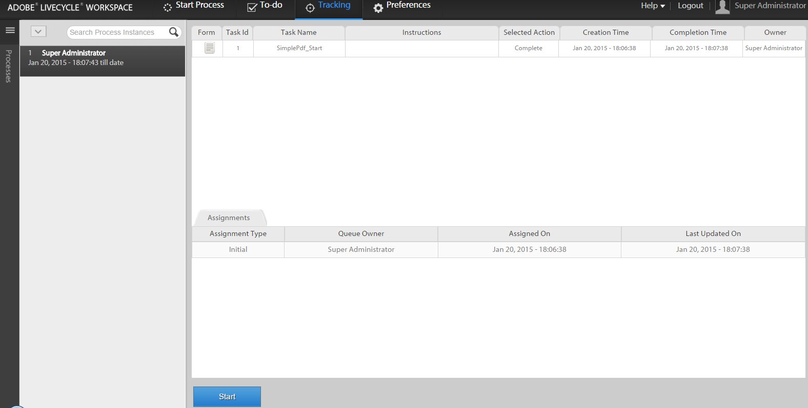

# 利用AEM Forms工作區的現有流程資料啟動新流程{#initiating-a-new-process-with-existing-process-data-in-aem-forms-workspace}

可以使用現有流程資料的資料啟動新流程。 需要從現有流程資料中啟動新流程，因為我們必須經常使用同一表單，而且內容幾乎沒有更改，如帶薪時間的表單。 此功能可節省用戶的時間和工作量，尤其是當流程需要填寫的時間較長時。

以下是從現有流程資料啟動新流程的步驟：-

1. 執行以下操作之一：

   * 在跟蹤中，按一下要使用其資料的進程實例。 在右窗格的「進程歷史記錄」視圖中，按一下與起始點對應的任務行。
   * 在跟蹤中，選擇搜索模板以顯示進程實例清單。 選擇要使用其資料的實例。
   * 在 **[!UICONTROL 待辦事項]** 頁籤。 按一下 **[!UICONTROL 歷史]** ，然後選擇啟動流程實例的任務。

    

1. 在「任務」操作工具欄中，按一下 **[!UICONTROL 開始]**。 新進程實例的自適應表單將顯示預填充資料。

1. 根據需要更新資料，然後按一下 **[!UICONTROL 完成]** 或表格上的相應按鈕。
