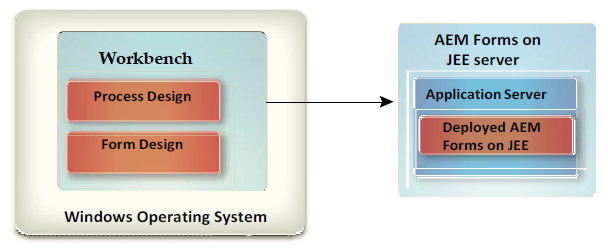

# 安裝工作台 {#install-workbench}

本檔案提供安裝和設定AEM Forms Workbench的指示。 安裝程式也會安裝Forms Designer。

## 誰應該閱讀本檔案？ {#who-should-read-this-doc}

本檔案適用於負責安裝、設定、管理或部署Workbench的管理員或開發人員。 此外，還包含設定系統以支援升級AEM Forms程式的必要資訊。 所提供的資訊是基於以下假設：閱讀本檔案的人熟悉Microsoft® Windows®作業系統。

## 其他資訊 {#additional-information}

此表格中的資源可協助您進一步瞭解並開始使用AEM Forms。
<table>
 <tbody>
  <tr>
   <td>
<strong>如需相關資訊</strong>
 </td>
   <td>
<strong>請參閱</strong>
 </td>
  </tr>
  <tr>
   <td>
Workbench的程式資訊
 </td>
   <td>
<a href="https://helpx.adobe.com/content/dam/help/en/experience-manager/6-5/forms/pdf/WorkbenchHelp.pdf">工作台說明</a>   
 </td>
  </tr>
  <tr>
   <td>
AEM Forms的一般資訊，以及它如何與其他Adobe產品整合
 </td>
   <td>
<a href="http://adobe.com/go/learn_aemforms_introduction_65">AEM Forms概觀</a>   
 </td>
  </tr>
  <tr>
   <td>
AEM Forms的所有檔案
 </td>
   <td>
<a href="http://adobe.com/go/learn_aemforms_introduction_65">AEM Forms檔案</a>   
 </td>
  </tr>
  <tr>
   <td>
此產品版本的修補程式更新、技術說明及其他資訊
 </td>
   <td>
聯絡Adobe企業支援</a>   
 </td>
  </tr>
 </tbody>
</table>

>[!NOTE]
>
>AEM Forms不建議使用Flex Workspace。 它適用於AEM Forms版本。

## 安裝前 {#before-you-install}

### 工作台安裝概觀 {#workbench-installation-overview}

Workbench是一套整合式開發環境(IDE)，開發人員和表單製作人員可使用它來建立自動化商業程式和表單。 它還用於管理流程和表單所使用的資源和服務。

下圖說明Workbench安裝，包括：
* 使用Workbench進行流程設計
* 使用設計工具進行表單設計

>[!NOTE]
>
>AEM Forms伺服器需要個別的安裝程式。 如需詳細資訊，請參閱JEE上的AEM Forms安裝檔案。

## 系統先決條件 {#system-prerequisites}

本節概述硬體和軟體需求以及支援的平台。

### 最低硬體和軟體需求 {#minimum-hardware-software-requirements}

**Workbench**&#x200B;建議使用下列最低需求：安裝的磁碟空間：
* 僅限工作台680 MB。
* 在單一磁碟機上安裝2.15 GB，以完整安裝Workbench、Designer和樣本元件。
* 臨時安裝目錄400 MB —— 用戶\temp目錄為200 MB,Windows臨時目錄為200 MB。

>[!NOTE]
>
>如果所有這些位置都駐留在單個驅動器上，則安裝期間必須有1.5 GB的可用空間。 安裝完成後，將刪除複製到臨時目錄的檔案。

* 硬體需求：Intel® Pentium® 4或AMD相當等級，1 GHz處理器。
* Java™ Runtime Environment(JRE)7.0將51或更新版本更新為7.0。
* 16位元色彩或更高的螢幕解析度，最低1024 X 768像素或更高。
* TCP/IPv4或TCP/IPv6網路連線至AEM Forms伺服器。
* 安裝Visual C++ Redistributable Runtime Packages 2012 32位元。
* 安裝Visual C++ Redistributable Runtime Packages 2013 32位元。

>[!NOTE]
>
>您必須擁有管理權限才能安裝Workbench。 如果您使用非管理員帳戶進行安裝，安裝程式會提示您輸入適當帳戶的認證。

### 支援的平台 {#supported-platforms}

請參閱「 [AEM Forms支援的平台」中Workbench的完整支援平台清單](http://adobe.com/go/learn_aemforms_supportedplatforms_65)。

## 設計人員安裝注意事項 {#designer-installation-considerations}

依預設，Workbench安裝包含對應的英文版設計工具。 如果Workbench安裝應用程式在您的電腦上檢測到現有的Designer版本，則安裝可能會終止，並且您必須先刪除當前版本的Designer，然後才能繼續。
下表列出您在安裝Workbench時可能遇到的Designer安裝方案以及您必須執行的任何操作的完整清單。

<table>
 <tbody>
  <tr>
   <td>
<strong>當前安裝的Designer版本</strong>
 </td>
   <td>
<strong>必要動作</strong>
 </td>
  </tr>
  <tr>
   <td>
Acrobat pro或Acrobat Pro Extended（包括設計人員）
 </td>
   <td>
無.  
Workbench安裝會偵測您電腦上與Acrobat pro或Acrobat Pro Extended一起安裝的Designer例項。 
Designer的不同版本可以共存於同一系統，例如Workbench 6.4的Designer 6.4.x和Workbench 6.5的Designer 6.5.0.x。您不需要解除安裝隨Acrobat 10 pro或Acrobat 10 Pro Extended或更新版本安裝的Designer版本。
 
 </td>
  </tr>
  <tr>
   <td>
設計人員（獨立）
 </td>
   <td>
無.  Workbench隨附的Designer版本僅提供英文版。  Workbench安裝程式不會重新安裝新版Designer。 Workbench安裝程式隨附的更新版本將會修補。 這也可讓您在Workbench中使用您的本地化版本的設計人員。  
 </td>
  </tr>
 </tbody>
</table>

### 在Windows 10上卸載Designer（獨立） {#uninstall-designer-standalone-windows10}

1. 前往「控 **制面板>程式集>程式和功能」**
1. 在「目前安裝的程式」清單中，選取 **Adobe Designer**。
1. 按一 **下「解除安裝** 」，然後按 **「是」**。

## 安裝工作台 {#installing-workbench}

本章介紹如何安裝Workbench。

### 安裝和執行Workbench {#installing-and-running-workbench}

在安裝Workbench之前，您必須確保您的環境包含執行Workbench所需的軟體和硬體(請參閱章節：安 **裝前**)。

**要安裝並運行Workbench，請執行以下操作：**

1. 執行下列任務之一：
   * 導覽至安裝媒體上的\workbench目錄，然後按兩下run_windows_installer.bat檔案。
   * 將Workbench下載並解壓縮至您的檔案系統。 下載後，導覽至\workbench目錄，然後按兩下run_windows_installer.bat檔案。
   >[!IMPORTANT]
   >
   >Workbench安裝程式僅從本機磁碟機執行。 無法從遠程站點運行。

   >[!NOTE]
   >
   >如果您遇到錯誤&quot;Could not create the Java Virtual Machine&quot;，請使用值-Xmx512M建立名為_JAVA_OPTIONS的環境變數並執行安裝程式。

1. 在「簡介」畫面上，按一下「下一步」。
1. 閱讀產品授權合約，選擇「我接受授權合約條款」，然後按「下一步」。
1. （可選）如果您需要此工具來建立和修改表單，請選取「安裝Adobe Designer」。

   >[!NOTE]
   >
   >您可以取消選取此選項，繼續使用隨Acrobat 10安裝的Designer。

1. 接受列出的預設目錄，或按一下「選擇」並導覽至您要安裝Workbench的目錄，然後按一下「下一步」。

   >[!NOTE]
   >
   >安裝目錄路徑不應包含#（井號）和$（井號）字元。

1. 查看預安裝摘要，然後按一下「安裝」。 安裝程式顯示安裝進度。
1. 查看安裝摘要。 選取「啟動AEM Forms Workbench」以啟動「工作台」，然後按一下「下一步」。
1. 檢閱發行說明，然後按一下完成。
1. 您的電腦現在安裝了下列項目：
   * **工作台**:若要從「開始」功能表執行「工作台」，請選取「所有程式集> AEM Forms > Workbench」（如果您選擇將捷徑檔案夾儲存在此處）。 如需詳細資訊，請參閱「使 <a href="https://helpx.adobe.com/content/dam/help/en/experience-manager/6-5/forms/pdf/WorkbenchHelp.pdf">用工作台</a> 」檔案。
   * **設計人員**:您可以從Workbench內部存取設計人員。 如需詳細資訊，請參閱設計人員說明中的 <a href="https://helpx.adobe.com/content/dam/help/en/experience-manager/6-5/forms/pdf/using-designer.pdf">快速入門主題</a>。
   * **AEM Forms SDK**:如需使用SDK的詳細資訊，請參閱「使 <a href="http://www.adobe.com/go/learn_aemforms_programming_65">用AEM表格進行程式設計」</a>。

## 升級程式 {#upgrading-processes}

JEE程式上的AEM Forms可使用「升級精靈」升級至AEM Forms應用程式。 如需詳細資訊，請參閱工作台說明中的升級舊式物件檔案。

### 配置並登錄到伺服器 {#configuring-and-logging-server}

若要使用Workbench，您必須執行AEM Forms的例項，通常是在個別電腦上。 您必須有使用者名稱和密碼才能登入AEM Forms，以及伺服器位置的詳細資訊。

>[!NOTE]
>
>如果您已將AEM Forms配置為使用EMC Documentum或IBM FileNet儲存庫提供程式，並且您想要登錄到除在AEM Forms管理控制台中配置為預設值的儲存庫以外的儲存庫，請提供用戶名為username@Repository。

### 配置超時設定 {#configuring-timeout-settings}

依預設，Workbench會在兩小時後逾時，不論活動或閒置。 若要編輯逾時設定，請參閱管理控制台說明中的「設定使用者管理>設定進階 <a href="https://docs.adobe.com/content/help/en/experience-manager-65/forms/administrator-help/configure-user-management/configure-advanced-system-attributes.html">系統屬性」</a>。

### 設定Workbench以透過HTTPS連線 {#configuring-workbench-to-connect-over-HTTPS}

若要透過HTTPS將Workbench連接至AEM Forms伺服器，您必須確保核發公開金鑰的憑證授權機構(CA)被Workbench認為受信任。 如果證書未被識別為來自受信任的源，則必須更新 [Workbench_HOME]/workbench/jre/lib/security目錄中的cacert檔案。

>[!NOTE]
>
>[Workbench_HOME] 代表您安裝Workbench的目錄。 預設位置為C:\Program Files (x86)\Adobe Experience Manager表單工作台。

請確定您使用憑證中指定的名稱來連線至HTTPS。 此名稱通常是完全限定的主機名。

**要更新cacert檔案**:
1. 請確定您有安全通訊端層(SSL)憑證的副本。 請聯絡設定SSL伺服器的管理員，或使用網頁瀏覽器匯出憑證。

   >[!NOTE]
   >
   >若要匯出憑證，請開啟Web瀏覽器並登入管理主控台，在瀏覽器中安裝憑證，然後將憑證從瀏覽器匯出至暫存位置(或直接匯出至 [Workbench_HOME]/workbench/jre/lib/security目錄)。

1. 將憑證複製至 [Workbench_HOME]/workbench/jre/lib/security目錄。

1. 開啟命令提示視窗，導覽至 [Workbench_HOME]/workbench/jre/bin，然後輸入下列命令：
   `keytool -import -storepass changeit -file [Workbench_HOME]\workbench\jre\lib\security\ssl_cert_for_certname.cer -keystore [Workbench_HOME]\workbench\jre\lib\security\cacerts -alias example`
其中：
   * changeit是快取密鑰庫的預設密碼。
   * certname是您在步驟1中選擇的證書。
   * 示例是您為證書選擇的別名。 此值可以變更

1. 當系統提示您信任憑證時，請輸入「是」並按一下「輸入」金鑰。 keytool會繼續將cacerts檔案匯入 [Workbench_HOME]/workbench/jre/lib/security目錄。

1. 關閉並重新啟動Workbench以套用變更。

### 為動態生成的模板配置快取設定 {#configuring-cache-settings-for-dynamically-generated-templates}

如果您的應用程式會自動更新XFA內容，以即時產生唯一範本，則應考慮下列快取操作方面。 實際上，每個交易都使用新的唯一範本。

當表單產生器或輸出在快取中搜尋或更新特定表單範本的項目時，它會使用數個索引鍵值來找出將要存取的特定快取項目。

* **範本檔案名稱**:用作快取表單主要唯一識別碼的範本位置和檔案名稱。
* **時間戳**:範本檔案包含用來決定表單上次更新時間的時間戳記。
* **範本UUID**:設計人員會在每個範本中插入表單及其版本的唯一識別碼(UUID)。 每次更新表單時，就會更新內嵌的UUID。 例如，XDP範本可能會顯示下列內容：

   `<?xml version="1.0" encoding="UTF-8"?>`
   `<?xfa generator="AdobeAEM formsDesignerES_V8.2" APIVersion="2.6.7185.0"?><xdp:xdp xmlns:xdp=http://ns.adobe.com/xdp/ timeStamp="2008-07-29T21:22:12Z" uuid="823e538f-ff6c-4961-b759-f7626978a223"><template xmlns="http://www.xfa.org/schema/xfa-template/2.6/">`

* **演算選項**:在渲染的表單快取中，對於每組唯一渲染選項分別儲存快取內容。

Forms服務會參照檔案名稱或儲存庫位置，或參照記憶體中的XML物件值來接收範本。
* **參考傳遞的範本**:使用內容根目錄和表單名稱。 如果使用此方法在每個請求中傳遞具有不同檔案名的唯一模板，則磁碟快取將不斷增長，並且永遠不會重複使用。 為避免此情況，應以相同檔案名稱傳遞唯一範本，以確保所有請求都會更新相同的快取。
* **以值傳遞的範本**:使用theinDataDoc參數，使用與資料一起傳遞的範本位元組。 如果使用此方法傳遞具有不同UUID的唯一模板，磁碟快取將會無限增長，並且永遠不會重複使用。 為避免這種情況，應從所有模板中刪除UUID屬性，以確保不為模板建立快取。 或者，傳遞相同的非空UUID允許建立快取對象，但確保同一快取會隨每個請求而更新。

為防止快取無限成長，請考量下列因素，以使用新的AEM Forms API（即renderHTMLForm2和renderPDFForm2）來轉換動態產生的範本。

使用新API時，範本會以檔案物件的形式傳遞，這會在Forms服務中根據它是否被鈍化處理。

對於以UUID和內容根目錄作為快取鍵的鈍化文檔，請考慮以下方面：
* 不為沒有UUID的鈍化輸入模板建立快取。
* 如果傳遞多個具有相同UUID和內容根目錄的鈍化輸入模板，則會覆寫相同的快取。

對於檔案名和內容根目錄用作快取鍵的非鈍化文檔，請考慮以下方面：
* 對於未鈍化的輸入模板，快取取決於生成文檔的內容根目錄和檔案名。
相同的快取僅用於具有相同內容根目錄和範本檔案名稱的請求。
下列最佳實務可確保動態產生的範本傳送至Forms服務時，快取不會無限增加：
   * 移除UUID或在所有動態產生的範本中傳遞相同的UUID。
   * 通過模板位元組或磁碟上相同檔案名生成文檔。

### 解除安裝工作台 {#uninstalling-workbench}

使用「控制面板」中的「添加或刪除程式」功能啟動卸載程式。 Workbench和Designer應用程式有個別的解除安裝程式。

## 設定AEM Forms XDC編輯器 {#configuring-aem-forms-xdc-editor}

使用XDC編輯器，網路印表機管理員可以建立和修改XML Forms架構裝置組態(XDC)檔案。 XDC檔案描述了打印機的功能，如打印機語言或紙張大小和紙盒位置之間的關聯。

在網路打印機管理員使用XDC編輯器之前，請重新定位示例XDC檔案，並參閱使用XDC編輯器建立設備配置檔案。

**要獲取示例XDC檔案**:
1. 在AEM Forms伺服器上，在 [AEM Forms根目錄\sdk\samples\Output\IVS中找到XDC資]料夾。
1. 將此資料夾的內容複製至可從Workbench或Eclipse系統存取的目錄。

**要獲取XDC編輯器幫助**:
1. 前往AEM Forms檔案網站。
1. 按一下「 **開發** 」標籤，並導覽至「使用XDC編輯器建立裝置描述檔」。 下載xdc_editor_help_web.zip檔案，並依照讀我檔案中的指示安裝說明檔案。

