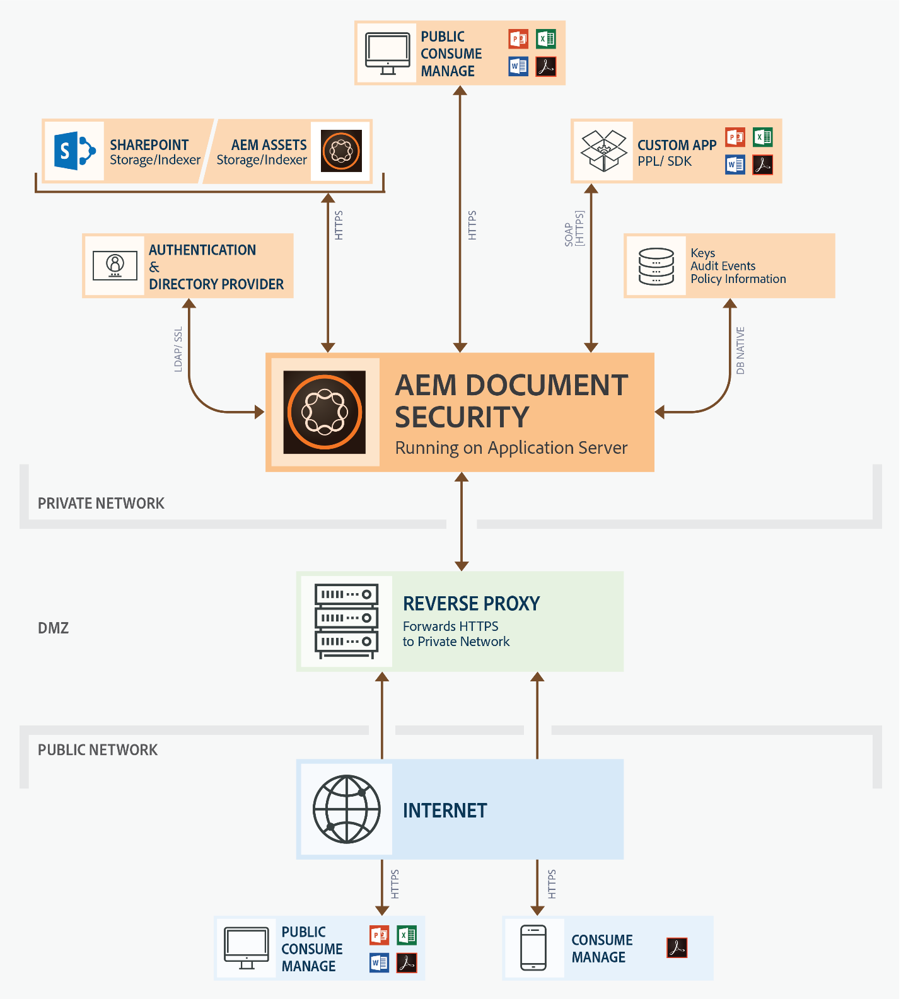

# 安裝和設定Document Security伺服器 {#installing-and-configuring-the-document-security-server}

使用檔案安全性，安全地散布您以支援格式儲存的任何資訊。 只有授權的使用者才能存取受保護的檔案。

Adobe Experience Manager Forms檔案安全性可確保只有授權使用者才能使用您的檔案。 使用檔案安全性，您可以安全地散布您以支援格式儲存的任何資訊。 支援的檔案格式包括Adobe可攜式檔案格式(PDF)和Microsoft Word、Excel和PowerPoint檔案。

您可以使用原則來保護檔案。 您在原則中指定的機密設定會決定收件者如何使用您套用原則的檔案。 例如，您可以指定收件者是否可以列印或複製文字、編輯文字，或在受保護的檔案中新增簽名和留言。

這些原則會儲存在Document Security伺服器上；您可以透過用戶端應用程式將原則套用至檔案。 將原則套用至檔案時，原則中指定的機密設定會保護檔案所包含的資訊。 您可以將受原則保護的檔案分發給受原則授權的收件者。

檔案安全性也提供用戶端、檢視器和索引器，以保護檔案、檢視受保護的檔案，以及為受保護的檔案建立索引。 如需檔案安全性的詳細資訊，請參閱 [檔案安全性](/help/forms/using/admin-help/document-security.md)。

## 部署拓撲 {#deployment-topology}

檔案安全性功能僅適用於JEE上的AEM Forms。 您需要JEE上的單一AEM Forms實例。 您也可以視需要建立AEM Forms伺服器的叢集或群組。 以下拓撲是指示性拓撲，用於運行文檔安全功能。 如需拓撲的詳細資訊，請參 [閱「AEM Forms的架構和部署拓撲」](aem-forms-architecture-deployment.md)。

<!--fix above link-->

下圖顯示AEM Forms Document Security的典型架構：

## 在JEE上安裝AEM Forms {#installing-aem-forms-on-jee}

請執行下列步驟，在JEE上安裝及設定AEM Forms:

1. 從 [Adobe授權網站(LWS)下載AEM 6.5 Forms on JEE安裝程式](https://licensing.adobe.com/)。 您需要有效的維護與支援合約才能下載安裝程式。
1. 閱讀「 [JEE支援平台上的AEM表格」檔案](/help/forms/using/aem-forms-jee-supported-platforms.md) ，並確保已準備好軟體、硬體、作業系統、應用程式伺服器、資料庫、JDK和其他基礎架構，可在JEE上安裝AEM表格。
1. （僅限非完整安裝）閱讀「 [Preparing to install AEM Forms single server](https://www.adobe.com/go/learn_aemforms_prepareInstallsingle_64) 」（準備安裝AEM Forms單一伺服器）或「 [Preparing to install AEM Forms server cluster](https://www.adobe.com/go/learn_aemforms_prepareInstallcluster_64) 」（準備安裝AEM Forms伺服器叢集），並讓您的環境在JEE上安裝和設定AEMForms。
1. 根據您的環境和應用程式伺服器，選擇以下文檔之一併按照說明完成安裝

   * [使用JBoss統包功能在JEE上安裝和部署AEM Forms](https://www.adobe.com/go/learn_aemforms_installTurnkey_64)
   * [在JEE for JBoss上安裝和部署AEM Forms](https://www.adobe.com/go/learn_aemforms_installJBoss_64)
   * [在JEE for webLogic上安裝和部署AEM Forms](https://www.adobe.com/go/learn_aemforms_installWebLogic_64)
   * [在JEE for webSphere上安裝和部署AEM Forms](https://www.adobe.com/go/learn_aemforms_installWebSphere_64)
   * [在JBoss叢集的JEE上設定AEM Forms](https://www.adobe.com/go/learn_aemforms_clusterJBoss_64)
   * [在WebLogic叢集的JEE上設定AEM Forms](https://www.adobe.com/go/learn_aemforms_clusterWebLogic_64)
   * [在WebSphere叢集的JEE上設定AEM Forms](https://www.adobe.com/go/learn_aemforms_clusterWebSphere_64)
   >[!NOTE]
   >
   >在JEE組態管理員上AEM Forms的「模組選取」畫面上，選取「Document Security」選項。 「Document Security」(Document Security)選項不需要選取任何其他模組。

## 後續步驟 {#next-steps}

* [配置客戶端和伺服器選項](/help/forms/using/admin-help/configuring-client-server-options.md)
* [建立和管理策略](/help/forms/using/admin-help/creating-policies.md)
* [建立和管理策略集](/help/forms/using/admin-help/creating-policy-sets.md)
