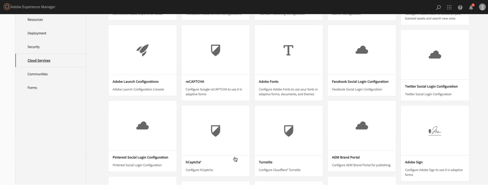
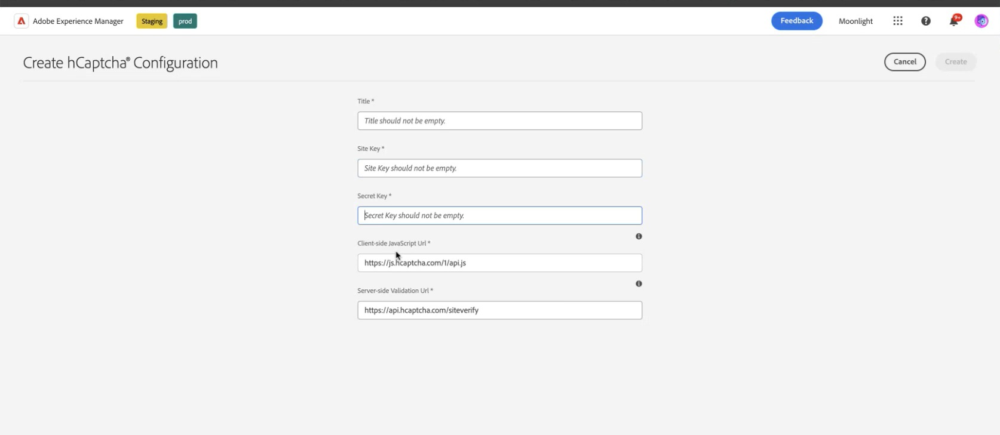

# 使用hCaptcha連線您的AEM Forms環境® {#connect-your-forms-environment-with-hcaptcha-service}

<!--

 This feature is under the Early Adopter Program. You can write to aem-forms-ea@adobe.com from your official email id to join the early adopter program and request access to the capability. 

-->

此功能在早期採用者計畫下。 如果您有興趣加入我們對此功能的搶先存取計畫，請從您的官方地址傳送電子郵件至aem-forms-ea@adobe.com以要求存取

CAPTCHA （完全自動化公用圖靈測試來區分電腦和人之間的差異）是一種常用於線上交易的程式，以區分人和自動化程式或機器人。 這會帶來挑戰，並評估使用者的回應，以判斷其是否為人類或機器人與網站互動。 它可防止使用者在測試失敗時繼續進行，並透過防止機器人張貼垃圾郵件或惡意目的來確保線上交易的安全。

除了hCaptcha®，AEM Forms 6.5也支援下列CAPTCHA解決方案：

* [Google reCAPTCHA](/help/forms/using/captcha-adaptive-forms.md)
* [Cloudflare Turnstile](/help/forms/using/integrate-adaptive-forms-turnstile.md)

## 將AEM Forms環境與hCaptcha整合®

hCaptcha®服務可保護您的表單免受機器人、垃圾郵件和自動濫用的侵擾。 這會提出核取方塊Widget質詢，並評估使用者回應，以判斷它是人類還是機器人與表單互動。 它可防止使用者在測試失敗時繼續進行，並透過防止機器人張貼垃圾郵件或惡意活動來確保線上交易的安全。

AEM 6.5最適化Forms支援hCaptcha&amp;reg。 您可以用它來在表單提交時顯示核取方塊Widget挑戰。

<!-- -->

### 將AEM Forms環境與hCaptcha整合的必要條件® {#prerequisite}

若要使用AEM Forms設定hCaptcha®，您必須從hCaptcha®網站取得[hCaptcha®網站金鑰和秘密金鑰](https://docs.hcaptcha.com/switch/#get-your-hcaptcha-sitekey-and-secret-key)。

### 設定驗證碼® {#steps-to-configure-hcaptcha}

若要將AEM Forms與hCaptcha®服務整合，請執行以下步驟：

1. 在您的AEM Forms環境中建立設定容器，其中包含用來將AEM連線至外部服務的雲端設定。 若要建立組態容器：
   1. 開啟您的AEM Forms環境。
   1. 前往&#x200B;**[!UICONTROL 工具 > 一般 > 設定瀏覽器]**。
   1. 在「組態瀏覽器」中，您可以選取現有資料夾或建立新資料夾：
      * 若要建立新資料夾並啟用雲端設定：
         1. 在組態瀏覽器中，按一下&#x200B;**[!UICONTROL 建立]**。
         1. 在[建立設定]對話方塊中，指定名稱、標題，並檢查&#x200B;**[!UICONTROL 雲端設定]**。
         1. 按一下&#x200B;**[!UICONTROL 建立]**。
      * 若要啟用現有資料夾的雲端設定：
         1. 在組態瀏覽器中，選取資料夾並選取&#x200B;**[!UICONTROL 屬性]**。
         1. 在[組態內容]對話方塊中，啟用&#x200B;**[!UICONTROL 雲端組態]**。
         1. 按一下&#x200B;**[!UICONTROL 儲存並關閉]**&#x200B;以儲存設定並結束對話方塊。

1. 設定您的Cloud Service：
   1. 在您的AEM作者執行個體上，前往 > **[!UICONTROL Cloud Service]**，然後按一下&#x200B;**[!UICONTROL hCaptcha®]**。
      ui中的
   1. 選取已建立或已更新的設定容器，如上一節所述。 選取「**[!UICONTROL 建立]**」。
      
   1. 指定&#x200B;**[!UICONTROL 標題]**，<!--**[!UICONTROL Name]**--> 已在](#prerequisite)先決條件中取得hCaptcha®服務[的&#x200B;**[!UICONTROL 網站金鑰]**&#x200B;和&#x200B;**[!UICONTROL 秘密金鑰]**。
   1. 按一下&#x200B;**[!UICONTROL 建立]**。

      

   >[!NOTE]
   > 使用者不需要修改[使用者端JavaScript驗證URL](https://docs.hcaptcha.com/#add-the-hcaptcha-widget-to-your-webpage)和[伺服器端驗證URL](https://docs.hcaptcha.com/#verify-the-user-response-server-side)，因為它們已預先填入hCaptcha®驗證。

   設定hCAPTCHA服務後，就可在最適化表單中使用。

## 在最適化Forms {#using-hCaptcha-in-aem-6.5}中使用hCaptcha®

1. 開啟您的AEM Forms環境。
1. 移至&#x200B;**[!UICONTROL Forms]** > **[!UICONTROL Forms和檔案]**。
1. 選取最適化表單並按一下&#x200B;**[!UICONTROL 屬性]**。
1. 在&#x200B;**[!UICONTROL 設定容器]**&#x200B;中，選取您的hCaptcha®雲端設定。
1. 按一下「**[!UICONTROL 儲存並關閉]**」。

   如果您沒有這類設定容器，請參閱[使用hCaptcha®](#connect-your-forms-environment-with-hcaptcha-service)連線您的AEM Forms環境一節，以瞭解如何建立設定容器。

   

1. 選取最適化表單，然後按一下&#x200B;**[!UICONTROL 編輯]**&#x200B;以在編輯器中開啟表單。
1. 從元件瀏覽器中，拖放或新增&#x200B;**[!UICONTROL 最適化表單hCaptcha®]**&#x200B;元件至最適化表單。
1. 選取&#x200B;**[!UICONTROL 最適化表單hCaptcha®]**&#x200B;元件，然後按一下屬性以開啟屬性對話方塊。 指定下列屬性：

   

   * **[!UICONTROL 標題]：**&#x200B;指定驗證碼元件的標題。
   * **[!UICONTROL 驗證訊息]：**&#x200B;在表單提交或使用者動作時，提供驗證碼驗證的驗證訊息。
   * **[!UICONTROL 驗證碼服務]：**&#x200B;選取表單提交的驗證碼服務，這裡選取hCaptcha®。
   * **[!UICONTROL 組態設定]：**&#x200B;選取您為hCaptcha®設定的雲端組態。
     >[!NOTE]
     >基於類似目的，您的環境中可以有多個雲端設定。 因此，請謹慎選擇服務。 如果未列出任何服務，請參閱[使用hCaptcha®](#connect-your-forms-environment-with-hcaptcha-service)連線您的AEM Forms環境，以瞭解如何建立將AEM Forms環境與hCaptcha®服務連線的Cloud Service。
   * **錯誤訊息：**&#x200B;提供驗證碼提交失敗時向使用者顯示的錯誤訊息。
   * **驗證碼大小：**&#x200B;您可以選取hCaptcha®挑戰對話方塊的顯示大小。 使用&#x200B;**[!UICONTROL Compact]**&#x200B;選項可顯示較小的大小，使用&#x200B;**[!UICONTROL Normal]**&#x200B;可顯示相對較大的hCaptcha®挑戰對話方塊，或使用&#x200B;**[!UICONTROL Invisible]**&#x200B;驗證hCaptcha®而不需在使用者介面上明確轉譯核取方塊Widget。

1. 選取「**[!UICONTROL 完成]**」。

現在，只有合法的表單，表單填寫者才能成功清除hCaptcha®服務帶來的挑戰，才能用於表單提交。 hCaptcha®

**hCaptcha®是Intuition Machines， Inc.的註冊商標。**

## 常見問題

* **問：我可以在最適化表單中使用多個驗證碼元件嗎？**
* **Ans：**&#x200B;不支援在最適化表單中使用一個以上的Captcha元件。 此外，不建議在片段或標示為延遲載入的面板中使用驗證碼元件。

## 另請參閱 {#see-also}

* [在最適化表單中使用驗證碼](/help/forms/using/captcha-adaptive-forms.md)
* [在最適化表單中使用Turnstile驗證碼](/help/forms/using/integrate-adaptive-forms-turnstile.md)
