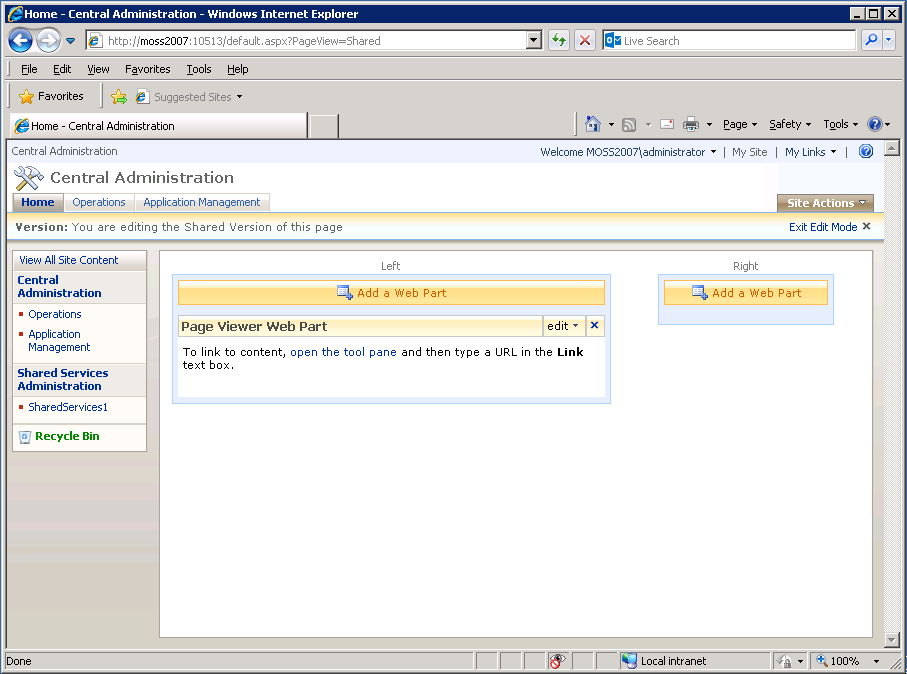

# 將AEM表單工作區與Microsoft Office SharePoint server整合{#integrating-aem-forms-workspace-with-microsoft-office-sharepoint-server}

**-需求**

**先決知**&#x200B;識：您必須先擁有SharePoint伺服器的存取權限，並且必須知道存取工作區的URL，才能將AEM Forms Workspace新增至SharePoint伺服器。 以下步驟假設您對SharePoint server了如指掌。 有關SharePoint server中Web部件的詳細資訊，請參閱Windows sharePoint services中的Web部件。

**用戶級**&#x200B;開始

您可以在Microsoft Office SharePoint Server（例如Microsoft Office SharePoint Server 2007）中將AEM Forms Workspace當做Web Part。 使用者可以使用網頁瀏覽器連線至您的SharePoint伺服器，以存取AEM Forms Workspace，提供統一的體驗。 在本文中，您將學習在Microsoft Office SharePoint server中將AEM Forms Workspace顯示為Web Part的基本步驟。 您可以執行本文所述的步驟，以提供統一的體驗，讓連線至SharePoint伺服器的使用者可以從相同的連接埠存取AEM Forms Workspace。

>[!NOTE]
>
>本文中列出的步驟是特定的Microsoft SharePoint Server 2007。 您也可以使用其他支援版本的Microsoft SharePoint來設定HTML工作區。

## 將AEM Forms Workspace與Microsoft Office sharePoint Server 2007整合 {#integrate-aem-forms-workspace-with-microsoft-office-sharepoint-server}

執行下列步驟，將AEM Forms Workspace整合至Web Part:

1. 在Web瀏覽器中，導航到SharePoint站點， `https://[myMOSSserver]:44299/default.aspx` 如 `[myMOSSserver]` 其中是Sharepoint伺服器的名稱或IP地址。

   >[!NOTE]
   >
   >44299是SharePoint伺服器的預設埠號。 埠號取決於您安裝的SharePoint伺服器。

1. 在網頁的右上側，按一下「網站動作」 **並選取** 「編輯 **頁面」**。
1. 按一下「 **添加Web部件」(Add a Web Part** )按鈕。
1. 在「添加Web部件——網頁對話框」的「其他」下，選擇「頁面查看器Web部件」 **，然後按一下「** 添加」 ****。
1. 在「頁面檢視器Web部件」方塊中，按一下「編 **輯** 」並選 **取「修改共用Web部件」**。

   >[!NOTE]
   >
   >「Page Viewer Web Part（頁面檢視器網頁部件）」方塊會出現在您在步驟3中按一下的「 **Add a Web Part** （新增網頁部件）」按鈕下方，如下圖所示（圖1）:

   

   圖1. - Microsoft Office sharePoint伺服器中的「頁面檢視器網頁部件」方塊。

1. 在「頁面檢視器」頁面上，執行下列工作：

   1. 在「連結」方塊中，輸入AEM Forms Workspace的URL，例如 `https://[AEM_forms_Server]:8080/lc/ws` 其中 `[AEM_forms_Server]` 代表AEM Forms伺服器的IP或名稱。
   1. 按一 **下「外觀** 」並修改高度、寬度和標題，讓您可以查看整個工作區使用者介面。 例如，您可以分別將高度和寬度設定為6英吋和11英吋。
   1. 按一 **下測試連結**。 隨即出現新的網頁瀏覽器視窗，其中會顯示「工作區」。
   1. （可選）按一下「 **版面** 」，並修改「網頁零件」中「工作區」的版面。
   1. （可選）按一 **下「進階** 」(Advanced)並修改其他設定，例如說明，以及「Web零件」中的「工作區」是否可最小化或關閉。

      按一 **下套用**。

1. 按一 **下「退出編輯模式** 」，並確認您可以存取工作區。

完成上述步驟後，您的SharePoint網站看起來類似下圖（圖2）:

圖2 —— 與Microsoft Office sharePoint server整合的AEM Forms工作區

