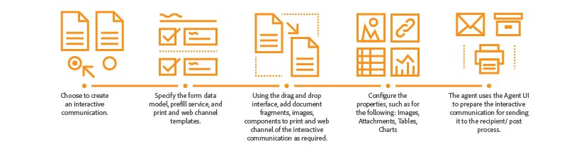

# 互動式通信概述 {#interactive-communications-overview}

本文包括概述、示例使用案例、建立工作流以及交互通信和字母之間的區別。

互動式通信集中管理安全、個性化和互動式通信的建立、匯編和交付，如業務通信、文檔、聲明、利益通知、營銷郵件、帳單和歡迎套件。

## 關鍵功能 {#key-capabilities}

以下是交互通信的關鍵功能：

- 與表單資料模型的現成整合，可輕鬆、簡化地訪問後端資料庫和其他CRM系統，如MS® Dynamics
- 用於打印和Web通道的整合創作介面，其能夠從打印通道自動生成Web通道
- 在印刷品和Web中以易於理解的可視格式顯示資訊的圖表
- 文檔片段支援規則編輯器和表單資料模型
- 代理用戶介面顯示互動式通信的打印和Web預覽
- 拖放元件以快速構建打印和Web通道

## 互動式通信建立 {#interactive-communication-creation}

### 工作流程 {#workflow}

要建立互動式通信，請 [建築](#buildingblocks) 為「Interactive Communication ready（互動式通信就緒）」，然後完成以下步驟：

1. 選擇 [建立互動式通信](/help/forms/using/create-interactive-communication.md)。

1. 指定 [表單資料模型](/help/forms/using/data-integration.md)、預填充服務和 [打印和Web頻道模板](/help/forms/using/web-channel-print-channel.md)。 您可以選擇從打印通道生成Web通道。

1. 使用 [拖放介面](/help/forms/using/introduction-interactive-communication-authoring.md)，根據需要添加要打印的文檔片段、影像、元件和Interactive Communication的Web通道。
1. 配置插入的元件的屬性，如：

   1. [影像](/help/forms/using/create-interactive-communication.md#step2)
   1. [表](/help/forms/using/create-interactive-communication.md#tables) （包括佈局片段）
   1. [圖表](/help/forms/using/chart-component-interactive-communications.md)
   1. [文檔片段](/help/forms/using/create-interactive-communication.md#document-fragment-properties)

1. 預覽打印和Web頻道，並根據需要編輯互動式通信。
1. 代理使用代理UI [準備互動式通信](/help/forms/using/prepare-send-interactive-communication.md) 發送給收件人/帖子進程。

### 建置區塊 {#buildingblocks}

以下是建立互動式通信所需的構造塊：

- [窗體資料模型](/help/forms/using/data-integration.md)
- [打印和Web渠道模板](/help/forms/using/web-channel-print-channel.md)
- [文檔片段](/help/forms/using/document-fragments.md)
- 影像
- [主題](/help/forms/using/themes.md) Web頻道

## 互動式通信與通信管理 {#interactive-communications-vs-correspondence-management}

互動式通信是建立客戶通信的預設和推薦的方法。 要繼續使用在6.3AEMForms和6.2AEMForms建立的字母， [安裝相容性包](/help/forms/using/compatibility-package.md)。 以下是交互通信和字母功能的比較。

<table>
 <tbody>
  <tr>
   <td><strong>功能</strong></td>
   <td><strong>互動式通訊</strong></td>
   <td><strong>字母</strong></td>
  </tr>
  <tr>
   <td>輸出</td>
   <td>打印和Web</td>
   <td>列印</td>
  </tr>
  <tr>
   <td>Schema</td>
   <td>窗體資料模型 </td>
   <td>資料字典 </td>
  </tr>
  <tr>
   <td>本土化</td>
   <td>窗體資料模型中不支援</td>
   <td>資料字典中支援</td>
  </tr>
  <tr>
   <td>規則編輯器</td>
   <td>
    <ul>
     <li>用於建立內聯條件的文本和條件支援規則編輯器</li>
     <li>互動式通信編輯器支援在Web通道元件上應用規則</li>
    </ul> </td>
   <td>沒有用於建立條件表達式的UI</td>
  </tr>
  <tr>
   <td>編寫</td>
   <td>用於構造打印和Web通道的拖放介面</td>
   <td>無拖放機構 </td>
  </tr>
  <tr>
   <td>圖表</td>
   <td>在打印和Web通道中支援的圖表</td>
   <td>不支援</td>
  </tr>
  <tr>
   <td>主題</td>
   <td>將主題用於樣式化Web頻道</td>
   <td>不支援主題</td>
  </tr>
   <tr>
   <td>草稿</td>
   <td>支援</td>
   <td>支援</td>
  </tr>
   <tr>
   <td>提交</td>
   <td>支援</td>
   <td>支援</td>
  </tr>
  <tr>
  <tr>
   <td>審計</td>
   <td>不支援</td>
   <td>支援</td>
  </tr>
   <tr>
   <td>版本設定</td>
   <td>不支援</td>
   <td>支援</td>
  </tr>
   <td>批處理</td>
   <td>支援 </td>
   <td>支援</td>
  </tr>
  <tr>
   <td>代理簽名</td>
   <td>不支援</td>
   <td>支援</td>
  </tr>
  <tr>
   <td>遠程函式</td>
   <td>不支援</td>
   <td>支援</td>
  </tr>
 </tbody>
</table>
