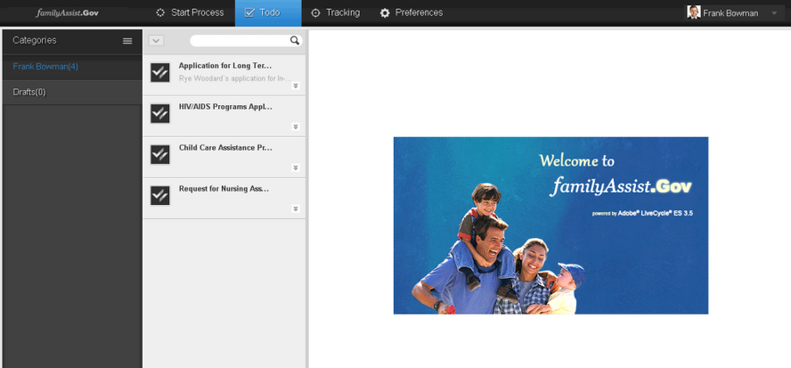

# 自訂AEM表單工作區簡介{#introduction-to-customizing-aem-form-workspace}

AEM表單工作區提供修改其介面之呈現語義和功能的功能。 變更樣式、版面、格式、品牌和核心功能的自訂類型如下所述。

自訂工作區的範例

## 自訂類型 {#types-of-customizations}

AEM Forms工作區支援多種自訂設定，以更新使用者介面的版面、外觀、功能等。 這些定制包括更新以下一個或多個內容：

* 使用者介面的外觀
* 使用語義定製的功能
* 在其他應用程式中重複使用HTML元件

### 使用者介面變更 {#user-interface-changes}

您可以變更AEM Forms工作區的外觀、版面和其他表現語義。 自訂CSS、HTML範本和JavaScript™檔案，以變更工作區。 所有預設檔案都在預設安裝中提供。

AEM Forms工作區自訂的一般步 [驟中涵蓋最常用的步驟](../../forms/using/generic-steps-html-workspace-customization.md)。 如需此類自訂的特定範例，包括詳細步驟，請參閱本文結尾的相關文章。

#### 瞭解樣式表 {#understanding-the-style-sheet}

在自訂工作區之前，請熟悉AEM Forms隨附的預設樣式表，網址為/libs/ws/css/style.css。

若要自訂工作區，建議您熟悉位於/libs/ws/css資料夾的現有樣式表style.css。 以下說明幾個主要元件。

<table>
 <tbody>
  <tr>
   <th>
CSS元素
 </th>
   <th>
已修改用戶介面元件
 </th>
  </tr>
  <tr>
   <td>
#頁首
 </td>
   <td>
AEM Forms工作區的頁首
 </td>
  </tr>
  <tr>
   <td>
.categoryList
 </td>
   <td>
類別清單
 </td>
  </tr>
  <tr>
   <td>
.categoryList .header
 </td>
   <td>
類別清單的標題
 </td>
  </tr>
  <tr>
   <td>
.categories, .filters
 </td>
   <td>
類別清單下方的空格
 </td>
  </tr>
  <tr>
   <td>
.category, .filter
 </td>
   <td>
類別
 </td>
  </tr>
  <tr>
   <td>
.category:hover, .category.selected, .filter:hover, .filter.selected
 </td>
   <td>
選定類別和將滑鼠置於類別樣式上
 </td>
  </tr>
  <tr>
   <td>
categoryListBar .tool、categoryListBar .content
 </td>
   <td>
「啟動流程」頁（已關閉的類別清單）
 </td>
  </tr>
  <tr>
   <td>
filterListBar .tool、filterListBar .content
 </td>
   <td>
要執行頁面（關閉的篩選清單）
 </td>
  </tr>
  <tr>
   <td>
processNameListBar .tool、processNameListBar .content
 </td>
   <td>
追蹤頁面（已關閉的流程名稱清單）
 </td>
  </tr>
  <tr>
   <td>
.startPointList, .tasklist
 </td>
   <td>
起始點清單或任務清單
 </td>
  </tr>
  <tr>
   <td>
.startPointList .header、.tasklist .header
 </td>
   <td>
起始點清單或任務清單的標題
 </td>
  </tr>
  <tr>
   <td>
.startpoint.selected, .task.selected
 </td>
   <td>
所選起點或任務
 </td>
  </tr>
  <tr>
   <td>
.startpoint.selected .description, .task.selected .description
 </td>
   <td>
所選起點或任務的說明
 </td>
  </tr>
  <tr>
   <td>
#taskarea
 </td>
   <td>
任務區
 </td>
  </tr>
  <tr>
   <td>
#header.dropdown
 </td>
   <td>
標題中的使用者下拉式清單
 </td>
  </tr>
  <tr>
   <td>
.sortDrop dd ul
 </td>
   <td>
排序任務下拉式清單
 </td>
  </tr>
 </tbody>
</table>

#### CSS {#css}

AEM Forms工作區的外觀是從CSS中借用其外觀。 透過自訂CSS，您可以變更工作區的呈現語義，例如字型、顏色、品牌和版面。

CSS自訂的頂層步驟為：

* 建立CSS檔案。
* 新增樣式項目至此CSS。 如需詳細資訊，請參閱瞭解CSS樣式。
* 在中更新其引用 `html.jsp`。

如需進行這些自訂的確切步驟，請參閱「AEM Forms工 [作區自訂的一般步驟」](../../forms/using/generic-steps-html-workspace-customization.md)。 AEM Forms工作區隨附的CSS檔案位於/libs/ws/css/。 若為CSS相關自訂，請使用 [Ship Package](../../forms/using/introduction-customizing-html-workspace.md#p-crx-package-p)。 如需CSS相關自訂的特定範例，請參閱本文結尾的相關說明主題。

#### 影像 {#image}

您可以自訂AEM Forms工作區，以新增使用者的變數，或新增組織的標誌。 對於這些自訂項目，請使 [用Ship Package](../../forms/using/introduction-customizing-html-workspace.md#p-crx-package-p)。

自訂影像的頂層步驟為：

* 安裝和設定WebDAV。
* 新增影像。
* 新增與新增影像對應的樣式。
* 連結至檔案中的新CSS `html.jsp` 檔案。

若要開始自訂AEM Forms工作區中的影像，請依照「AEM Forms工作區自 [訂的一般步驟」進行](../../forms/using/generic-steps-html-workspace-customization.md)。 如需影像相關自訂的特定範例，請參閱本文結尾的相關說明主題。

#### HTML範本 {#html-template}

HTML範本可協助定義工作區使用者介面的外觀和版面。 透過更新預設HTML範本，您可以自訂版面預設使用者介面。

自訂HTML範本的頂層步驟為：

* 在用戶建立的資料夾中，複製所需的預設檔案。
* 在使用者定義的資料夾中新增範本。
* 對複製的檔案進行相關更新，例如新範本的路徑。

如需此類自訂的特定範例，請參閱本文結尾提供的「說明」主題。 根據要自 [訂的範本](../../forms/using/introduction-customizing-html-workspace.md#p-crx-package-p) ，選擇「發 運套件」或「開發套件」。

### 語義變化 {#semantic-changes}

若要修改AEM Forms工作區功能，請變更JavaScript原始碼。 核心功能中的修改會標示為「語義變更」。 您可修改AEM Forms工作區原始碼中提供的模型、檢視和範本。

進行語義變更以修改AEM Forms工作區功能的頂層步驟為：

* 在用戶建立的資料夾中，複製相應的預設檔案。
* 在用戶定義的資料夾中添加新模型和視圖。
* 進行相關更新，例如更新預設JavaScript檔案中新增模型和檢視的路徑。
* 精簡套件以最佳化效能。

如需屬於原始碼一部分的元件的詳細概念資訊，請參閱可重 [復使用元件的說明](/help/forms/using/description-reusable-components.md)。 對於這些自定義，請使用「開發包」。

### 可重複使用的元件 {#reusable-components}

由於AEM Forms工作區是以元件為基礎的軟體，因此可輕鬆自訂和重複使用。 您可輕鬆將工作區元件與您的Web應用程式整合。

如需更多概念資訊，請參閱「可重 [復使用元件的說明](/help/forms/using/description-reusable-components.md) 」，以及如需使用元件的說明，請參閱「在Web應用程式中整 [合AEM Forms工作區元件」](/help/forms/using/description-reusable-components.md)。

## 建立AEM Forms工作區代碼 {#building-html-workspace-code}

### SDK套件 {#sdk-package}

套件包含AEM Forms工作區的原始碼。 此套件可在取得 `[LC root]\sdk\html-workspace\adobe-lc-workspace-src.zip`。

它主要用於定制，因為它提供了生成：

* CRX套件，適用於出貨、除錯和開發描述檔(在 [CRX套件中提及](../../forms/using/introduction-customizing-html-workspace.md#p-crx-package-p))。
* 自訂程式碼的精簡版（用於語義變更）。

#### WS內容 {#ws-content}

* client-pkg:

   * src —— 包含建立CRX節點所需的對象。
   * pom.xml —— 為各種配置檔案構建部署包的指令碼WS-Deploy包

* client-html:

   * assembly —— 包含指令碼用於建立AEM Forms工作區SDK的zip.xml。
   * src/main/webapp -

      * css —— 包含AEM Forms工作區的樣式表。
      * 影像——包含用於AEM Forms工作區的影像。
      * js:

         * libs —— 包含AEM Forms工作區中使用的所有協力廠商程式庫。
         * 授權——包含HTML和JS檔案的授權，以及將這些授權首碼放在個別來源檔案的程式碼。
         * Minifier —— 用於自訂Javascript程式碼的組合、精簡和醜化。
         * resourcejs_optimizer —— 用於Javascript來源的組合、精簡和優化。
         * resource_generator —— 用於生成register.js和modelcontrollerpath.js。
         * 執行時期：

            * 初始設定式——包含用來初始化AEM Forms工作區中主幹檢視和模型的初始設定式。js。
            * 模型——包含AEM Forms工作區中所有元件的骨幹模型。
            * routes —— 包含javascript檔案和HTML檔案，這些檔案會在AEM Forms工作區中載入開始程式、工作、追蹤和偏好設定。
            * 服務——包含用於AEM Forms工作區的service.js。 所有伺服器呼叫都是透過service.js進行。
            * 範本——包含所有範本，即AEM Forms工作區中所有檢視的HTML檔案。
            * util —— 包含AEM Forms工作區中使用的所有公用程式檔案(javascript)。
            * 檢視——包含AEM Forms工作區中所有元件的骨幹檢視。
         * main.js
         * router.js
      * libs/ws:pdf.html和pluginPing.pdf用於在AEM Forms工作區中載入PDF表格，而WSNextAdapter.swf用於在AEM Forms工作區中載入SWF表格和參考線。
      * 地區設定：

         * de-DE —— 包含德文版的translation.json。
         * en-US —— 包含英文版的translation.json。
         * fr-FR —— 包含法文版的translation.json。
         * ja-JP —— 包含日文版的translation.json。
         * html.jsp —— 包含程式碼，以找出目前的瀏覽器地區設定。
      * html.jsp
      * GET.jsp

### CRX套件 {#crx-package}

CRX軟體包可部署在CRX™儲存庫上。 您可從以下網址取得 `[LC root]\crx-repository\install\adobe-lc-workspace-pkg.zip`:

此套件可使用下述三個描述檔來建立。

| **設定檔** | **說明** | **使用狀況** |
|---|---|---|
| 出貨設定檔 | 此配置檔案使用精簡功能建立盡可能小的CRX包。 此套件最有效率。 所有JavaScript™檔案都會合併並精簡為單一JS檔案。 | 在JS檔案中不需要進一步的語義變更時，請使用此描述檔。 |
| 除錯設定檔 | 此配置檔案建立一個中等效率的CRX包。 套件的大小比使用「發運描述檔」建立的套件稍大。 此套件將大部分的JavaScript檔案結合為單一JS檔案。 | 使用此設定檔進行除錯。 |
| 開發設定檔 | 此配置檔案會建立最大大小的CRX包。 所有JavaScript檔案都是個別提供的，因為它們都位於SDK套件中。 | 在合併語義更改時使用此配置檔案。 |

#### 發運描述檔 {#ship-profile}

#### 命令 {#command}

* mvn clean -P Ship install on client-pkg folder of Source package shipped to client.
* 發運配置檔案命令執行僅在64位JVM上工作。

#### WS內容 {#ws-content-1}

* css —— 包含style.css、ie.css和jquery-ui.css。
* 影像——包含所有影像。
* js:

   * libs:

      * require —— 包含require.js。
      * jqueryui —— 包含jquery.ui.datepicker.ja.js。
   * 執行時期：

      * 範本——包含所有範本，即AEM Forms工作區中所有元件的HTML檔案。
   * main.js（結合、精簡和增強）。
   * registry.js

* libs:

   * ws —— 包含pluginPing.pdf、pdf.html和WSNextAdapter.swf。

* 地區——包含。content.xml。
* 地區設定：

   * de-DE —— 包含德文版的translation.json。
   * en-US —— 包含英文版的translation.json。
   * fr-FR —— 包含法文版的translation.json。
   * ja-JP —— 包含日文版的translation.json。
   * html.jsp —— 包含程式碼，以找出目前的瀏覽器地區設定。

* 索引——包含。content.xml
* profile —— 包含offline.jsp。
* GET.jsp
* html.jsp
* content.xml
* _rep_policy.xml

#### 除錯設定檔 {#debug-profile}

#### 命令 {#command-1}

* mvn clean -P在client-pkg上安裝調試
* 除錯設定檔指令執行僅適用於64位元JVM。

#### WS內容 {#ws-content-2}

* css —— 包含style.css、ie.css和jqueri-ui.css。
* 影像——包含所有影像。
* js:

   * libs:

      * require —— 包含require.js。
      * jqueryui —— 包含jquery.ui.datepicker.ja.js。
   * 執行時期：

      * 範本——包含所有範本，即AEM Forms工作區中所有元件的HTML檔案。
   * main.js（結合）。
   * registry.js

* libs:

   * ws —— 包含pluginPing.pdf、pdf.html和WSNextAdapter.swf。

* 地區——包含。content.xml。
* 地區設定：

   * de-DE —— 包含德文版的translation.json。
   * en-US —— 包含英文版的translation.json。
   * fr-FR —— 包含法文版的translation.json。
   * ja-JP —— 包含日文版的translation.json。
   * html.jsp —— 包含程式碼，以找出目前的瀏覽器地區設定。

* 索引——包含。content.xml
* profile —— 包含offline.jsp。
* GET.jsp
* html.jsp
* content.xml
* _rep_policy.xml

#### 開發設定檔 {#dev-profile}

#### 命令 {#command-2}

mvn clean -P Dev安裝在client-pkg上

#### WS內容 {#ws-content-3}

* css —— 包含style.css、ie.css和jqueri-ui.css。
* 影像——包含所有影像。
* js:

   * libs —— 包含AEM Forms工作區中使用的所有程式庫。
   * require —— 包含require.js
   * jqueryui —— 包含jquery.ui.datepicker.ja.js
   * 執行時期：

      * 初始設定式——包含初始設定式。js和modelcontrollerpath.js。
      * 模型——包含AEM Forms工作區中所有元件的模型。
      * routes —— 包含javascript檔案和HTML檔案，這些檔案會在AEM Forms工作區中載入開始程式、工作、追蹤和偏好設定。
      * 服務——包含用於AEM Forms工作區的service.js。
      * 範本——包含所有範本，即AEM Forms工作區中所有元件的HTML檔案。
      * util —— 包含AEM Forms工作區中使用的所有公用程式檔案(JavaScript)。
      * 檢視——包含AEM Forms工作區中所有元件的檢視。
   * main.js
   * registry.js
   * router.js

* libs:

   * ws —— 包含pluginPing.pdf、pdf.html和WSNextAdapter.swf。

* 地區——包含。content.xml。
* 地區設定：

   * de-DE —— 包含德文版的translation.json。
   * en-US —— 包含英文版的translation.json。
   * fr-FR —— 包含法文版的translation.json。
   * ja-JP —— 包含日文版的translation.json。
   * html.jsp —— 包含程式碼，以找出目前的瀏覽器地區設定。

* 索引——包含。content.xml
* profile —— 包含offline.jsp。
* GET.jsp
* html.jsp
* content.xml
* _rep_policy.xml

[聯絡支援](https://www.adobe.com/account/sign-in.supportportal.html)
