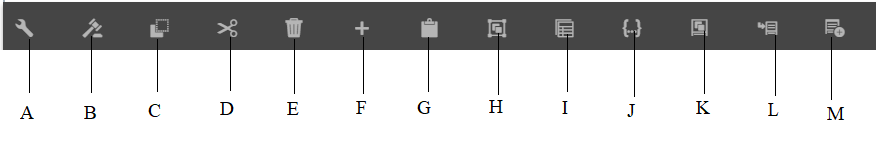

# 互動式通信創作UI簡介{#introduction-to-interactive-communication-authoring-ui}

用於創作的用戶介面 [互動式通信](/help/forms/using/interactive-communications-overview.md) 直觀，並提供以下內容以創作互動式通信的打印和Web通道：

* WYSIWYG拖放文檔編輯器
* 資產整合儲存庫 — 上載到伺服器並在伺服器上建立的資產可在交互通信創作介面的資產瀏覽器中找到

當你 [新建或編輯現有交互通信](../../forms/using/create-interactive-communication.md)，可使用以下用戶介面元素：

* [側欄](#sidebar)
* [頁面工具欄](#page-toolbar)
* [元件工具欄](#component-toolbar)
* 內容區域

**答：** 提要欄 **B** 頁面工具欄 **C.** 內容區域

## 側欄 {#sidebar}

**答：** 頻道瀏覽器 **B** 內容瀏覽器 **C.** 屬性瀏覽器 **D** 資產瀏覽器 **E.** 元件瀏覽器 **F.** 資料源瀏覽器 — 資料模型 **G.** 資料源瀏覽器 — 主內容

<!-- Click to enlarge

-->

該提要欄包括以下內容：

* **頻道瀏覽器**

通道瀏覽器可幫助您在互動式通信的打印通道和Web通道之間切換。 根據您在頻道瀏覽器中選擇的頻道，諸如「內容」和「元件」等瀏覽器將顯示選項。

* **內容瀏覽器**
在內容瀏覽器中，您可以看到所選頻道的文檔的對象層次結構。 作者可以在「文檔對象樹」中按一下該元素來導航到特定元件。 作者可以在Web通道中搜索對象，並從此樹中重新排列它們。

* **屬性瀏覽器**

   用於編輯元件的屬性。 屬性會根據元件而更改。 例如，要查看文檔容器的屬性：選擇元件，然後點擊  > **文檔容器**，然後按一下 。

* **資產瀏覽器**
隔離不同類型的內容，如佈局片段、影像、文檔、頁面、視頻。 作者可以將資產拖放到交互通信中。

* **元件瀏覽器**
包括可用於構建文檔的打印和Web通道的元件。 您可以將元件拖到交互通信中以添加元素，並根據要求配置添加的元素。 下表介紹了在「元件」瀏覽器中列出的用於打印和Web通道的元件：

| **Component** | **Print Channel** | **Web Channel** | **功能** |
|---|---|---|---|
| 圖表 | ✓ | ✓ | 添加一個圖表，可在互動式通信中使用該圖表，以可視化地表示從表單資料模型集合項檢索到的二維資料。 |
| 文件片段 | ✓ | ✓ | 允許您將可重用的元件、文本、清單或條件添加到交互通信中。 您添加到交互通信的可重用元件可以是基於表單資料模型的元件，也可以是沒有表單資料模型的元件。 |
| 影像 | ✓ | ✓ | 讓您插入影像。 |
| 面板 | - | ✓ | 「面板」元件是用於將其他元件分組在一起的佔位符，它控制一組元件在交互通信中的佈局方式。 面板元件還允許您使一組元件對最終用戶可重複執行，例如在填寫教育證書所需的多個條目中。 將每個面板用於具有多個頁籤的互動式通信的頁籤也是一種良好的做法。 |
| 表格 | &#42; | ✓ | 新增表格以整理行和欄中的資料。 |
| 目標區域 | &#42;&#42; | ✓ | 在Web通道中插入目標區域以組織Web通道特定的元件。 |
| 文字 | - | ✓ | 將文本添加到交互通信的Web通道。 文本可以利用表單資料模型對象使內容動態化。 |

&#42; 使用「打印」通道中的「佈局片段」添加表。

&#42;&#42; 在打印通道中，目標區域在XDP/打印模板中預定義。 不能使用交互通信創作UI添加新目標區域。

* **資料源瀏覽器**
資料源瀏覽器在建立交互通信時以所選表單資料模型顯示可用資料源。

### 使用元件的關鍵點 {#key-points-for-working-with-components}

使用互動式通信元件時的要點如下：

* 每個元件都具有控制其外觀和功能的關聯屬性。 要配置元件的屬性，請點擊該元件並點擊  在「屬性」瀏覽器中開啟元件屬性。
* 元件用其元素名稱標識。 點擊 ，可通過更改屬性瀏覽器中的「元素名稱」欄位值來更改元件的名稱。 「元素名稱」欄位僅接受字母、數字、連字元(-)和下划線(_)。 不允許使用其他特殊字元，元素名稱應以字母開頭。
* 只要在互動式通信中可看到標題，您就可以在編輯器中以內嵌方式修改互動式通信元件的「標題」屬性，而不開啟「屬性」瀏覽器。 為此：

   1. 按一下以選擇具有「標題」屬性且其「隱藏標題」屬性被禁用的元件。
   1. 點擊  的子菜單。

   1. 修改標題並點擊「Return（返回）」鍵，或點擊元件外部的任何位置以保存更改。 按一下Esc鍵放棄更改。

## 元件工具欄 {#component-toolbar}

選擇元件時，將看到一個工具欄，可供您使用。 您可以獲取剪切、貼上、移動和指定元件屬性的選項。 您的選項包括：

答：**配置**:點擊 **配置**，元件屬性在邊欄中可見。

B **編輯規則**:按一下「編輯規則」(Edit Rules)時，將出現「規則編輯器」(Rule Editor)，可在其中編輯和建立選定元件的規則。 在規則編輯器中，還可以選擇其他表單對象（元件），並編輯/建立這些表單對象的規則。

C.**複製**:可以使用複製選項複製元件並將其貼上到交互通信中的其他位置。

D **剪切**:在「交互通信」中，可以使用剪切選項將元件從一個位置移動到另一個位置。

E. **刪除**:用於從交互通信中刪除元件。

F. **插入元件**:用於在選定元件上方插入元件。

G. **貼上**:允許您使用上述選項貼上剪切或複製的元件。

H **組**:如果要剪切、複製或貼上多個元件，則允許您選擇多個元件。

我。 **父級**:用於選擇元件的父項。

J **查看SOM表達式：** 允許您查看 [SOM表達](../../forms/using/using-som-expressions-adaptive-forms.md) 的子菜單。

K: **對面板中的對象進行分組：** 允許您將面板中的元件分組，以便能夠同時對這些元件執行操作。 有關詳細資訊，請參閱 [對面板中的對象進行分組](create-interactive-communication.md#groupobjectspanel)。

L **添加子面板** （僅適用於面板）:用於向面板添加子面板。

M: **添加面板工具欄** （僅適用於面板）：用於添加面板元件的工具欄。 然後，可以在工具欄上執行更多操作。

另外， **替換** 的子菜單。 該選項不適用於Panel元件。

## 頁面工具欄 {#page-toolbar}

頂部的「頁面」工具欄提供了選項，您可以預覽互動式通信並更改其屬性。 在創作互動式通信時，可以預覽它，並相應地進行更改。 在頁面工具欄中，您會看到：

* 切換側面板 :用於顯示或隱藏邊欄。
* 頁面資訊 :用於查看頁面屬性。
* 模擬器 :讓您模擬不同顯示大小（如平板電腦和電話）的互動式通信外觀。
* 編輯：允許您選擇其它模式，如：編輯、樣式、開發人員和設計。

   * 編輯：用於編輯互動式通信及其元件的屬性。 例如，添加元件、刪除影像並指定必需欄位。
   * 樣式：允許您設定交互通信元件外觀的樣式。 例如，在樣式模式下，可以選擇面板並指定其背景顏色。
   * 開發人員：允許開發人員：

      * 瞭解互動式通信由什麼組成。
      * 調試在何處和何時發生的情況，這反過來有助於解決問題。
   * 目標：用於啟用或禁用自定義元件或未列在提要欄中的現成元件。

* 預覽：用於預覽發佈互動式通信時的外觀。
