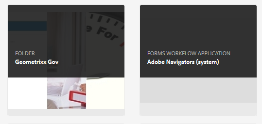

# 管理表單簡介 {#introduction-to-managing-forms}

AEM [!DNL Forms] 提供簡化而功能強大的用戶介面，用於建立和管理表單、文檔、主題、字母、文檔片段、資料字典和相關資產。 它有助於管理表單、文檔和相關資產的完整生命週期 — 從開發人員的案頭到在面向最終用戶的門戶伺服器上提供它。 您可以使用 [!DNL Forms] 用戶介面：

* 訪AEM問 [!DNL Forms] 元件
* 訪AEM問 [!DNL Forms] 配置

>[!NOTE]
>
>有關其他工具和選AEM項的詳細資訊，請參見 [創作](/help/sites-authoring/author.md)。

## 訪問AEM Forms元件 {#access-aem-forms-components}

除了建立表單、文檔和相關資產的選項AEM外，還提供了建立站點、資產、管AEM理實例等選項。 您可以按一下  Experience Manager徽標以導航到所有可用工具。 除了指向其他元件的控制台的連結外，它還包含用於 [!DNL Forms]。 導航至 [!DNL Forms]，按一下Experience Manager徽標  >導航  > **[!UICONTROL Forms]**。 將顯示以下控制台的連結：

* 表單與文件
* 主題
* 字母
* 文件片段
* 資料字典

   

### 表單與文件  {#forms-documents}

Forms和文檔提供了建立互動式通信、自適應表單、自適應表單片段和表單集的選項。 僅AEM用於 [!DNL Forms] 在JEE上，Forms和文檔提供了從本地儲存和同步導入檔案的選AEM項 [!DNL Forms] Workbench中的資產。

「建立」按鈕是建立或上載過程的起點AEM [!DNL Forms] 的下界。 它提供了建立選項：

* **互動式通信**:互動式通信是基於HTML的個性化、交互和設備友好的數字通信、語句或文檔。 互動式通信在本質上是響應的，並且根據用戶設備和設定自動更改佈局和設計。 有關詳細資訊，請參見 [互動式通信概述](/help/forms/using/interactive-communications-overview.md)

* **自適應格式：** 自適應形式是接合和響應形式。 您可以根據用戶響應、設備或工作環境添加或刪除表單部分，建立自適應表單以動態適應用戶輸入。 的 [創作自適應表單簡介](../../forms/using/introduction-forms-authoring.md) 文章提供了有關自適應表單的詳細資訊。

* **自適應格式片段：** 雖然每個表單都是為特定目的而設計的，但大多數表單中有一些常見的段落，例如提供姓名和地址、家庭詳細資訊、收入詳細資訊等個人詳細資訊。 您可以為此類節建立單個資產。 這些可重用的獨立片段稱為自適應形式片段。 有關詳細資訊，請參見 [自適應形式片段](../../forms/using/adaptive-form-fragments.md) 文章。

* **表單集：** 表單集是HTML5表單的集合，這些表單組合在一起，並作為單個表單集呈現給最終用戶。 當最終用戶開始填寫表單集時，表單將從一個表單無縫轉換到另一個表單。 最後，用戶只需按一下一次即可將所有表單作為單個實體提交。 有關詳細資訊，請參見 [AEM Forms背景](../../forms/using/formset-in-aem-forms.md)。

* **資料夾：** AEM [!DNL Forms] 用戶介面使用資料夾來排列資產。 它支援兩種類型的資料夾：

   * **常規資料夾：** 這些資料夾用於在以下位置建立的AEM資產 [!DNL Forms] 用戶介面。 這些資料夾沒有嚴格的資料夾結構。 您可以更名、建立子資料夾，並在這些資料夾中儲存自適應表單、交互通信、自適應表單片段、表單模板(XDP)、PDF forms、文檔和相關資產。
   * **Forms Workflow資料夾：** Forms工作流資料夾是在Workbench進程(LiveCycle存檔)遷移並與同步時創AEM建的 [!DNL Forms] 用戶介面。 不允許更名、建立子資料夾、建立互動式通信、自適應表單片段或互動式通信。 也不允許刪除版本資料夾或建立和上載與版本資料夾並行的自適應表單、自適應表單片段或互動式通信。

   

   **答：** 常規資料夾 **B** Forms Workflow資料夾

「Forms和文檔」面板還提供以下選項：

* **從本地儲存導入檔案：** 您可以導入PDF forms和文檔、表單模板（XFA表單）和其他資源（XSD的映像和XML架構）。 有關逐步說明，請參見 [向AEM Forms進口和出口資產](../../forms/using/import-export-forms-templates.md)。
* **將AEM Forms資產與Workbench同步：** 您可以使用「從工作台中的檔案」選項在AEM Forms用戶介面和Workbench之間同步資產。 它確保所有資產都可AEM用 [!DNL Forms] 用戶介面和Workbench的crx-repository資產選擇。

### 主題  {#themes}

主題包含元件和面板的樣式詳細資訊。 主題具有獨立的身份。 因此，您可以在多個自適應表單上重用主題。 可以指定元件的樣式，或修改表單中使用的各種元件的CSS屬性。 樣式包括背景顏色、狀態顏色、透明度和大小等屬性。 您可以將自定義內容保存在主題中，並將它們作為預設定在窗體元件上。 將主題添加到表單時，指定的樣式會反映在表單的相應元件上。 帶AEM6.2 [!DNL Forms]，您可以建立主題並將其應用於窗體。

有關建立和使用主題的資訊，請參見 [AEM Forms主題](../../forms/using/themes.md)。

### 字母  {#letters}

安AEM [!DNL Forms] 信件是一種安全、個性化和互動式的信件。 你可以AEM [!DNL Forms] 以簡化的流程從預先批准和自定義創作的內容中快速組合字母（也稱為對應）。

有關建立和使用字母的資訊，請參見 [建立字母](../../forms/using/create-letter.md)。

### 文件片段 {#document-fragments}

文檔片段是可重複使用的部分或通信的元件，您可以使用這些元件合成字母。 文檔片段的類型為文本、清單、條件和佈局片段。 有關建立和使用文檔片段的資訊，請參見 [建立文檔片段](/help/forms/using/document-fragments.md)。

### 資料字典 {#data-dictionaries}

通常，業務用戶不需要對元資料表示(如XSD（XML架構）和Java類)有所瞭解。 但是，它們通常需要訪問這些資料結構和屬性來構建解決方案。 AEM [!DNL Forms] 使用資料字典，使業務用戶能夠使用來自後端資料源的資訊，而無需瞭解其基礎資料模型的技術詳細資訊。

有關建立和使用資料字典的資訊，請參閱建立 [資料字典文章](../../forms/using/data-dictionary.md)

## 訪AEM問 [!DNL Forms] 配置 {#accessing-aem-forms-configurations}

「工AEM具」面板包含各種元件的工具。 要導航至AEM Forms特定工具，請按一下Experience Manager徽標  >工具  > **[!UICONTROL Forms]**。 將顯示用於執行以下功能的工具：

* **配置監視資料夾：** 管理員可以配置網路資料夾（稱為監視資料夾），以便當用戶將檔案(例如PDF檔案)放置在監視資料夾中時，啟動預配置的操作並操作該檔案。 有關詳細資訊，請參見 [建立和配置監視資料夾](/help/forms/using/creating-configure-watched-folder.md)。
* **配置Forms應用離線服務：** AEM [!DNL Forms] app offline service快取表單中所用資源的路徑或URL。 快取表單中使用的資源的路徑或URL可提高伺服器端效能。 要配置AEM Forms應用的伺服器端離線元件，請參見 [在離線模式下工作](/help/forms/using/work-offline-mode.md)。

   

* **配置PDF生成器：** 管理員可以配AEM置 [!DNL Forms] PDF生成器設定、添加用戶帳戶以及將配置導入或導出到PDF生成器。
* **發佈信件管理資產：** AEM [!DNL Forms] 允許您同時發佈作者實例中的所有字母、文檔片段和資料詞典及相關依賴項。 已發佈的資產包括所有Tergement Management資產和相關依存項。 有關詳細資訊，請參見 [發佈和取消發佈表單和文檔](../../forms/using/publishing-unpublishing-forms.md#publishallthecorrespondencemanagementassets)。
* **導出信件管理資產：** 您可以將所有Tergement Management資產和相關依賴項作為包從 [!DNL Forms] 實例。 有關詳細步驟，請參見 [向AEM Forms進口和出口資產](../../forms/using/import-export-forms-templates.md#importandexportassetsincorrespondencemanagement)

## 用戶介面的常用元素 {#commonelements}

* **左滑軌：** 可按一下左滑軌表徵圖  顯示時間軸和引用功能AEM [!DNL Forms]。

   * **時間軸：** 您可以添加和查看可在時間軸中查看的資產的注釋。 有關詳細說明，請參見 [建立和管理表單中資產的審閱](../../forms/using/create-reviews-forms.md)。
   * **引用：** 安AEM [!DNL Forms] 可在多個中使AEM用 [!DNL Forms] 資產。 例如，文檔片段可以用於多個字母。 引用是選定資產使用的資產清單（其他表單或資源），也是選定資產使用的其他資產清單。

* **麵包屑：** Breadcrumb表示當前控制台或資料夾的標題。 您可以按一下「Breadcrumb」選項在層次中較高的資料夾級別之間導航。
* **視圖切換器：** 可以按一下「視圖切換器」表徵圖  或  在清單和卡視圖之間快速切換。 有關常用用戶介面元件的詳細資訊，請參見 [創作](/help/sites-authoring/author.md)。
* **搜索：** 搜索選項  提供了快速查找和跳轉到所需內容和工具的功能。 鍵入內容或產品功能的名稱，然後從建議中進行選擇，例如，鍵入「文檔」以快速查找並導航至 **[!UICONTROL Forms和文檔]** 或「文檔片段」控制台。 有關搜索的詳細資訊，請AEM參見6.2 [搜索](/help/sites-authoring/search.md) 文章

* **操作工具欄**:在選擇資產時，操作工具欄將出現在資產清單的上方。 它包含所選資產的所有管理工具。 可以將滑鼠懸停在工具表徵圖上查看描述其功能的工具提示

>[!NOTE]
>
>當用戶執行搜索Forms和文檔的任何控制台時，該滑軌僅包含 **篩選器和選項**。 可以使用「篩選器和選項」執行高級搜索。

* **操作工具欄**:在選擇資產時，操作工具欄將出現在資產清單的上方。 它包含所選資產的所有管理工具。 可以將滑鼠懸停在工具表徵圖上查看描述其功能的工具提示

   

   自適應表單的操作工具欄
