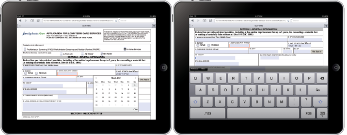

# HTML5表單簡介{#introduction-to-html-forms}

HTML5表格是Adobe Experience Manager 6.0(AEM 6.0)軟體中的新功能，可提供HTML5格式的XFA表格範本轉換。 這項功能可讓您在不支援XFA PDF的行動裝置和案頭瀏覽器上轉換表單。 HTML5表格不僅支援XFA表格範本的現有功能，還新增了行動裝置的新功能，例如塗鴉簽名。

HTML5表格會根據標準HTML5結構產生檔案。 您可以在所有支援HTML5的現代瀏覽器中檢視HTML5表格。 它不需要為瀏覽器安裝任何額外的瀏覽器外掛程式。 如需支援瀏覽器的詳細資訊，請參閱「支 [援的用戶端平台](https://adobe.com/go/learn_aemforms_supportedplatforms_63)」。

## HTML5表格的主要功能 {#key-capabilities-of-html-forms-br}

* 在所有相容的瀏覽器上都支援轉譯HTML5中的現有XFA表格。
* 運用標準的XFA表單設計功能，針對行動裝置建立表單。
* 使用HTML5格式的動態XFA功能。
* 使用高精確度的SVG文字版面(SVG 1.1)來比對PDF文字版面。
* 提供對JavaScript和FormCalc的支援。
* 根據資料導向事件或使用者輸入，將片段動態組合成互動式表單。
* 支援自訂CSS，以符合您的企業標準的表單外觀。
* 啟用自訂Widget，以提供豐富的資料擷取體驗。
* 支援與網頁應用程式整合。

### 多管道出版 {#multichannel-publishing}

表單開發人員可使用XFA範本，以PDF和HTML5格式轉換表單。 在您擁有大量XFA表單的情況下，這項功能會有所助益，因為這些表單需要進行最少的變更，才能適應HTML5表單的設計實務。 您可將現有的XFA表單轉譯為HTML5，以針對尚未支援XFA PDF的各種裝置。

## 管理HTML5表格 {#manage-html-forms}

AEM也提供統一檢視，以列出並管理使用AEM Forms UI的所有表單範本。 您可以啟用、停用、發佈和預覽表單。 如需詳細資訊，請參 [閱管理表單的簡介](../../forms/using/introduction-managing-forms.md)。

### 自訂表單 {#forms-customization}

HTML5表格會使用標準HTML5結構轉換表單範本。 這可讓您輕鬆使用網頁技術（主要是CSS和JavaScript），自訂和擴充HTML5格式的表單。 您可以輕鬆自訂現有Widget的外觀、建立您自己的自訂Widget，或在表單中使用自訂樣式。 如需建立自訂Widget和自訂現有Widget的詳細資訊，請參 [閱「使用HTML5表格插入自訂Widget](../../forms/using/custom-widgets.md)」。

[聯絡支援](https://www.adobe.com/account/sign-in.supportportal.html)
