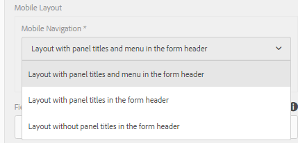

# 自適應表單的佈局功能{#layout-capabilities-of-adaptive-forms}

Adobe Experience Manager(AEM)允許您建立易於使用的自適應表單，為最終用戶提供動態體驗。 窗體佈局控制在自適應窗體中顯示項目或元件的方式。

## 先決知識 {#prerequisite-knowledge}

在瞭解自適應表單的不同佈局功能之前，請閱讀以下文章以瞭解有關自適應表單的更多資訊。

[AEM Forms簡介](../../forms/using/introduction-aem-forms.md)

[創作表單簡介](../../forms/using/introduction-forms-authoring.md)

## 佈局類型 {#types-of-layouts}

自適應表單提供了以下類型的佈局：

**面板佈局** 控制面板內的項目或元件在設備上的顯示方式。

**移動佈局** 控制移動設備上表單的導航。 如果設備寬度為768像素或更多，則該佈局被視為移動佈局並針對移動設備進行優化。

**工具欄佈局** 控制窗體中工具欄或面板工具欄中「操作」按鈕的位置。

所有這些面板佈局都在以下位置定義：

`/libs/fd/af/layouts`。

>[!NOTE]
>
>要更改自適應表單的佈局，請使用中的「創作模式」AEM。


## 面板版面配置 {#panel-layout}

表單作者可以將佈局與包括根面板的自適應表單的每個面板相關聯。

「面板」佈局可在 `/libs/fd/af/layouts/panel` 位置。


自適應表單中的面板佈局清單

### 響應 — 無需導航即可將所有內容放在一頁上 {#responsive-everything-on-one-page-without-navigation-br}

使用此面板佈局可建立響應佈局，該佈局可根據設備的螢幕大小進行調整，而無需進行任何專用導航。

使用此佈局，可以放置多個 **[!UICONTROL 面板自適應窗體]** 在面板中一個接一個的元件。


使用小螢幕上顯示的響應佈局的表單


使用大螢幕上顯示的響應佈局的表單

### 嚮導 — 一次顯示一步的多步驟窗體 {#wizard-a-multi-step-form-showing-one-step-at-a-time}

使用此面板佈局可在窗體中提供引導導航。 例如，當要在逐步引導用戶的同時捕獲表單中的必需資訊時，請使用此佈局。

使用 `Panel adaptive form` 元件，用於在面板內提供分步導航。 使用此佈局時，用戶僅在當前步驟完成後才移動到下一步

```javascript
window.guideBridge.validate([], this.panel.navigationContext.currentItem.somExpression)
```


多步驟窗體的嚮導佈局中的步驟完成表達式


使用嚮導的窗體

### 手風琴設計佈局 {#layout-for-accordion-design}

使用此佈局，可以 `Panel adaptive form` 元件。 使用此佈局，還可以建立可重複面板。 可重複面板使您能夠根據需要動態添加或刪除面板。 您可以定義面板重複的最小次數和最大次數。 此外，可以根據在面板項目中提供的資訊動態地確定面板的標題。

摘要表達式可用於在最小化面板的標題中顯示最終用戶提供的值。


使用折疊式佈局建立的可重複面板

### 頁籤式佈局 — 頁籤顯示在左側 {#tabbed-layout-tabs-appear-on-the-left}

使用此佈局，可以 `Panel adaptive form` 元件。 這些頁籤放置在面板內容的左側。


顯示在面板左側的頁籤

### 頁籤式佈局 — 頁籤顯示在頂部 {#tabbed-layout-tabs-appear-on-the-top}

使用此佈局，可以 `Panel adaptive form` 帶制表符導航的面板中的元件。 這些頁籤放置在面板內容的頂部。


顯示在面板頂部的制表符

## 移動佈局 {#mobile-layouts}

移動佈局允許在螢幕相對較小的移動設備上進行用戶友好的導航。 移動佈局使用頁籤式樣式或嚮導式樣進行表單導航。 應用移動佈局為整個表單提供單個佈局。

此佈局使用導航欄和導航菜單控制導航。 導航欄顯示 **&lt;** 和 **>** 表徵圖 **下** 和 **上** 中選擇相應的選項。

Mobile Layouts可在 `/libs/fd/af/layouts/mobile/` 位置。 預設情況下，以下移動佈局在自適應表單中可用。



自適應表單中的移動佈局清單

當使用移動佈局時，通過點擊表格菜單可訪問各種表格面板  表徵圖

### 在表單標題中包含面板標題的佈局 {#layout-with-panel-titles-in-the-form-header}

如名稱所示，此佈局顯示面板標題以及導航菜單和導航欄。 此佈局還提供了「下一步」和「上一步」表徵圖以用於導航。


具有表單標題中的面板標題的移動佈局

### 窗體標題中沒有面板標題的佈局 {#layout-without-panel-titles-in-the-form-header}

如名稱所示，此佈局僅顯示沒有面板標題的導航菜單和導航欄。 此佈局還提供了「下一步」和「上一步」表徵圖以用於導航。


表單標題中沒有面板標題的移動佈局

## 工具欄佈局 {#toolbar-layouts}

工具欄佈局控制添加到自適應表單中的任何操作按鈕的定位和顯示。 佈局可以在表單級或面板級添加。


自適應表單中的工具欄佈局清單

工具欄佈局可在 `/libs/fd/af/layouts/toolbar` 位置。 預設情況下，自適應表單提供以下工具欄佈局。

### 工具欄的預設佈局 {#default-layout-for-toolbar}

在自適應表單中添加任何操作按鈕時，此佈局被選作預設佈局。 選擇此佈局將顯示台式機和移動設備的相同佈局。

此外，還可以添加包含使用此佈局配置的操作按鈕的多個工具欄。 操作按鈕與表單控制項關聯。 可以將工具欄配置為在面板之前或之後。


工具欄的預設視圖

### 工具欄的移動固定佈局 {#mobile-fixed-layout-for-toolbar}

選擇此佈局可為台式機和移動設備提供備用佈局。

對於案頭佈局，可以使用某些特定標籤添加「操作」按鈕。 只能使用此佈局配置一個工具欄。 如果為此佈局配置了多個工具欄，則移動設備存在重疊，並且只有一個工具欄可見。 例如，可以在表單的底部或頂部或表單中的面板後或前面設定工具欄。

對於移動佈局，可以使用表徵圖添加操作按鈕。


工具欄的移動固定佈局
