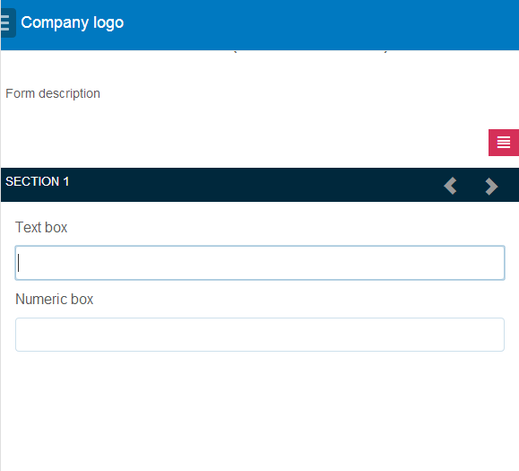
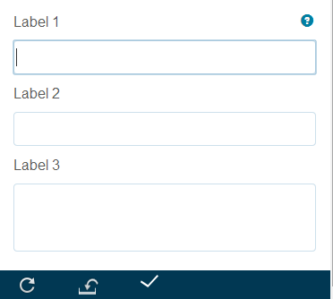

# 調適型表單的版面配置功能{#layout-capabilities-of-adaptive-forms}

<span class="preview">Adobe 建議使用新式且可擴充的資料擷取[核心元件](https://experienceleague.adobe.com/docs/experience-manager-core-components/using/adaptive-forms/introduction.html?lang=zh-Hant)，用來[建立新的最適化表單](/help/forms/using/create-an-adaptive-form-core-components.md)或[將最適化表單新增到 AEM Sites 頁面](/help/forms/using/create-or-add-an-adaptive-form-to-aem-sites-page.md)。這些元件代表最適化表單建立方面的重大進步，可確保令人印象深刻的使用者體驗。本文會介紹使用基礎元件編寫最適化表單的舊方法。</span>

| 版本 | 文章連結 |
| -------- | ---------------------------- |
| AEM as a Cloud Service  | [按一下這裡](https://experienceleague.adobe.com/docs/experience-manager-cloud-service/content/forms/adaptive-forms-authoring/authoring-adaptive-forms-foundation-components/configure-layout-of-an-adaptive-form/layout-capabilities-adaptive-forms.html?lang=zh-Hant) |
| AEM 6.5 | 本文章 |


Adobe Experience Manager (AEM)可讓您建立簡單易用的調適型表單，為使用者提供動態體驗。 表單版面配置會控制專案或元件在調適型表單中的顯示方式。

## 必備條件知識 {#prerequisite-knowledge}

在了解調適型表單的不同版面功能之前，請閱讀以下文章以進一步了解調適型表單。

[AEM Forms簡介](../../forms/using/introduction-aem-forms.md)

[製作表單簡介](../../forms/using/introduction-forms-authoring.md)

## 版面型別 {#types-of-layouts}

最適化表單提供您下列型別的版面：

**面板配置**&#x200B;控制面板內的專案或元件在裝置上的顯示方式。

**行動佈局**&#x200B;控制行動裝置上表單的導覽。 如果裝置寬度為768畫素或以上，則配置會視為行動裝置配置且已針對行動裝置最佳化。

**工具列配置**&#x200B;控制動作按鈕在表單工具列或面板工具列中的位置。

所有這些面板配置都在下列位置定義：

`/libs/fd/af/layouts`。

>[!NOTE]
>
>若要變更最適化表單的版面，請使用AEM中的「撰寫模式」 。


## 面板版面配置 {#panel-layout}

表單作者可以將版面配置與最適化表單的每個面板建立關聯，包括根面板。

面板配置可在`/libs/fd/af/layouts/panel`位置使用。


調適型表單中的面板配置清單

### Responsive — 全部於單頁無需導覽 {#responsive-everything-on-one-page-without-navigation-br}

使用此面板佈局可建立回應式佈局，此佈局會根據裝置的熒幕大小進行調整，而無需任何專門的導覽。

使用此版面，您可以將多個&#x200B;**[!UICONTROL 面板最適化表單]**&#x200B;元件逐一放置在面板內。


使用回應式版面的表單（如小熒幕所示）


使用大熒幕上所見回應式版面的表單

### 精靈 — 一次顯示一個步驟的多步驟表單 {#wizard-a-multi-step-form-showing-one-step-at-a-time}

使用此面板配置在表單內提供引導式導覽。 例如，當您想要在表單中擷取必要資訊，同時逐步引導使用者時，請使用此版面。

使用`Panel adaptive form`元件在面板中提供逐步導覽。 使用此版面配置時，使用者只會在目前步驟完成後才移至下一個步驟

```javascript
window.guideBridge.validate([], this.panel.navigationContext.currentItem.somExpression)
```

多步驟表單的精靈配置中的

多步驟表單的精靈版面配置中的步驟完成運算式


使用精靈的表單

### 摺疊式功能表設計的配置 {#layout-for-accordion-design}

使用此版面，您可以將`Panel adaptive form`元件放置在具有摺疊式功能表樣式導覽的面板中。 使用此版面，您也可以建立可重複的面板。 可重複面板可讓您視需要動態新增或移除面板。 您可以定義面板重複的最小和最大次數。 此外，面板的標題可以根據面板專案中提供的資訊動態決定。

摘要運算式可用來顯示一般使用者在最小化面板標題中提供的值。


使用摺疊式佈局建立的可重複面板

### 索引標籤版面配置 — 索引標籤顯示在左側 {#tabbed-layout-tabs-appear-on-the-left}

使用此配置，您可以將`Panel adaptive form`元件放置在具有索引標籤導覽的面板中。 標籤會放置在面板內容的左側。


出現在面板左側的索引標籤

### 索引標籤版面配置 — 索引標籤顯示在頂端 {#tabbed-layout-tabs-appear-on-the-top}

使用此配置，您可以將`Panel adaptive form`元件放置在含有索引標籤導覽的面板中。 索引標籤會放置在面板內容的頂端。

在最適化表單中有索引標籤的

出現在面板頂端的索引標籤

## 行動版面配置 {#mobile-layouts}

行動版面配置可在熒幕較小之行動裝置上進行方便好用的導覽。 行動版面配置會使用索引標籤或精靈樣式來進行表單導覽。 套用行動版面配置可為整個表單提供單一版面配置。

此版面配置會使用導覽列和導覽功能表來控制導覽。 導覽列顯示&#x200B;**&lt;**&#x200B;和&#x200B;**>**&#x200B;圖示，以表示表單中的&#x200B;**下一個**&#x200B;和&#x200B;**上一個**&#x200B;導覽步驟。

行動版面配置可在`/libs/fd/af/layouts/mobile/`位置取得。 下列行動版面預設為可在調適型表單中使用。


調適型表單中的行動版面配置清單

使用行動版面配置時，點選圖示即可使用表單功能表來存取各種表單面板。

### 在表單標題中使用面板標題的佈局 {#layout-with-panel-titles-in-the-form-header}

如名稱所建議，此版面會顯示面板標題以及導覽功能表和導覽列。 此版面配置也提供用於導覽的「下一個」和「上一個」圖示。


行動版面配置與表單標題中的面板標題

### 在表單標題中不使用面板標題進行佈局 {#layout-without-panel-titles-in-the-form-header}

如名稱所建議，此版面只會顯示導覽功能表與導覽列，而不會顯示面板標題。 此版面配置也提供用於導覽的「下一個」和「上一個」圖示。



行動版面沒有表單標題中的面板標題

## 工具列配置 {#toolbar-layouts}

工具列版面配置可控制您新增至最適化表單之任何動作按鈕的位置和顯示。 版面配置可在表單層級或面板層級新增。


調適型表單中的工具列配置清單

工具列配置可在`/libs/fd/af/layouts/toolbar`位置使用。 最適化表單預設提供下列工具列配置。

### 工具列的預設配置 {#default-layout-for-toolbar}

當您在調適型表單中新增任何動作按鈕時，此版面會選取為預設版面。 選取此配置時，桌上型電腦和行動裝置會顯示相同的配置。

此外，您也可以新增多個工具列，其中包含使用此配置設定的動作按鈕。 動作按鈕與表單控制項相關聯。 您可以將工具列設定為面板之前或之後。


工具列的預設檢視

### 行動工具列的固定版面配置 {#mobile-fixed-layout-for-toolbar}

選取此配置以提供案頭和行動裝置的替代配置。

對於案頭版面配置，您可以使用某些特定標籤來新增動作按鈕。 此配置只能設定一個工具列。 如果多個工具列已設定此版面，行動裝置會出現重疊，且只會顯示一個工具列。 例如，您可以在表單底部或頂部有一個工具列，或者在表單中的面板之後或之前。

對於行動版面配置，您可以使用圖示新增動作按鈕。



行動工具列的固定版面配置
