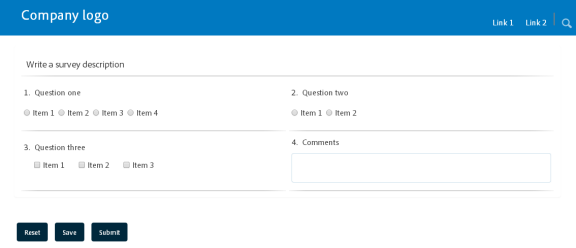
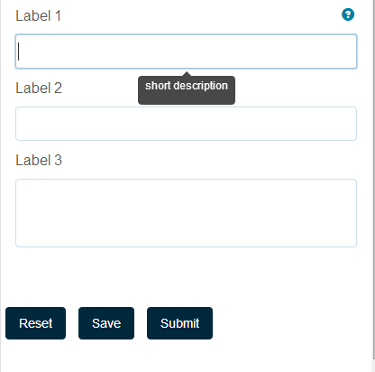

# 最適化表單的版面功能{#layout-capabilities-of-adaptive-forms}

Adobe Experience Manager(AEM)可讓您建立簡單易用的調適性表單，為使用者提供動態體驗。 表單版面控制項目或元件在最適化表單中的顯示方式。

## 先決條件知識{#prerequisite-knowledge}

在瞭解最適化表單的不同版面功能之前，請先閱讀下列文章，以進一步瞭解最適化表單。

[AEM Forms簡介](../../forms/using/introduction-aem-forms.md)

[製作表單簡介](../../forms/using/introduction-forms-authoring.md)

## 版面類型{#types-of-layouts}

最適化表單提供下列類型的版面：

**面板** 配置控制面板內的項目或元件在裝置上的顯示方式。

**行動** 版面控制行動裝置上表單的導覽。如果裝置寬度為768像素或以上，則版面會視為行動版面，並針對行動裝置最佳化。

**工具列** 版面控制表格中工具列或面板工具列中「動作」按鈕的位置。

所有這些面板版面都定義在下列位置：

`/libs/fd/af/layouts`。

>[!NOTE]
>
>若要變更最適化表單的版面配置，請使用AEM中的「編寫模式」。


## 面板布局 {#panel-layout}

表單作者可以將版面與最適化表單的每個面板（包括根面板）建立關聯。

在`/libs/fd/af/layouts/panel`位置可使用面板佈局。


最適化表單中的面板版面清單

### 回應式——單一頁面上的所有項目，無導覽{#responsive-everything-on-one-page-without-navigation-br}

使用此面板版面可建立回應式版面，可根據裝置的螢幕大小進行調整，而不需進行特殊導覽。

使用此版面，您可以在面板中逐一放置多個&#x200B;**[!UICONTROL 面板最適化表單]**&#x200B;元件。


使用回應式版面的表單，如小螢幕上所見



使用回應式版面的表單，如大螢幕上所見

### 嚮導——一個多步驟表單，每次顯示一個步驟{#wizard-a-multi-step-form-showing-one-step-at-a-time}

使用此面板版面，在表單中提供引導導覽。 例如，當您想要在表單中擷取必要資訊，並逐步引導使用者時，請使用此版面。

使用`Panel adaptive form`元件在面板中提供逐步導覽。 當您使用此版面時，使用者只有在目前步驟完成後才會移至下一個步驟

```javascript
window.guideBridge.validate([], this.panel.navigationContext.currentItem.somExpression)
```


精靈版面中多步驟表單的步驟完成運算式


使用精靈的表單

### accordion設計的版面{#layout-for-accordion-design}

使用此版面，您可以使用accordion樣式導覽將`Panel adaptive form`元件置於面板中。 使用此版面配置，您也可以建立可重複的面板。 可重複的面板可讓您視需要動態新增或移除面板。 您可以定義面板重複的最小和最大次數。 此外，根據在面板項目中提供的資訊，可以動態地確定面板的標題。

摘要運算式可用來在最小化面板的標題中顯示使用者提供的值。


使用Accordion版面建立的可重複面板

### 標籤式版面——標籤出現在左側{#tabbed-layout-tabs-appear-on-the-left}

使用此配置，您可以將`Panel adaptive form`元件置於具有標籤導覽的面板中。 標籤會置於面板內容的左側。


顯示在面板左側的標籤

### 標籤式版面——標籤出現在頂端的{#tabbed-layout-tabs-appear-on-the-top}

使用此佈局，您可以將`Panel adaptive form`元件放置在帶有頁籤導航的面板中。 標籤會置於面板內容的頂端。


顯示在面板頂部的標籤

## 行動版面{#mobile-layouts}

行動版面可讓使用者在螢幕較小的行動裝置上輕鬆導覽。 行動版面使用標籤式或精靈樣式來導覽表單。 套用行動版面為整個表單提供單一版面。

此版面會使用導覽列和導覽選單來控制導覽。 導覽列顯示&#x200B;****&#x200B;和&#x200B;****&#x200B;圖示，以指示表單中的&#x200B;**next**&#x200B;和&#x200B;**previous**&#x200B;導覽步驟。

行動版面可在`/libs/fd/af/layouts/mobile/`位置取得。 依預設，下列行動版面會以最適化表單提供。


最適化表單中的行動版面清單

使用行動版面時，可點選圖示來存取各種表單面板的表單功能表。

### 版面配置，面板標題為{#layout-with-panel-titles-in-the-form-header}

如名稱所示，此版面會顯示面板標題以及導覽選單和導覽列。 此版面也提供「下一頁」和「上一頁」圖示以進行導覽。


在表格標題中包含面板標題的行動版面

### 表格標題{#layout-without-panel-titles-in-the-form-header}中不含面板標題的版面

如名稱所示，此版面僅顯示導覽選單和導覽列，而無面板標題。 此版面也提供「下一頁」和「上一頁」圖示以進行導覽。


在表格標題中不含面板標題的行動版面

## 工具列版面{#toolbar-layouts}

「工具列配置」可控制您新增至最適化表單的任何動作按鈕的定位和顯示。 您可在表單層級或面板層級新增版面。


最適化表單中的工具列版面清單

在`/libs/fd/af/layouts/toolbar`位置提供工具列版面。 最適化表單預設提供下列工具列版面。

### 工具列{#default-layout-for-toolbar}的預設版面

當您在最適化表單中新增任何動作按鈕時，此版面會選取為預設版面。 選取此版面會針對桌上型電腦和行動裝置顯示相同的版面。

此外，您也可以新增多個工具列，其中包含使用此配置設定的動作按鈕。 動作按鈕與表單控制項相關聯。 您可以將工具列設定為在面板之前或之後。



工具列的預設檢視

### 工具列{#mobile-fixed-layout-for-toolbar}的行動固定版面

選取此版面，為桌上型電腦和行動裝置提供替代版面。

對於案頭版面，您可以使用某些特定標籤來新增動作按鈕。 只能使用此版面配置一個工具列。 如果使用此版面配置了多個工具列，則行動裝置會有重疊，而且只會顯示一個工具列。 例如，您可以在表格底部或上方有工具列，或在表格中的面板後或之前。

對於行動版面，您可以使用圖示來新增動作按鈕。


工具列的行動固定版面

