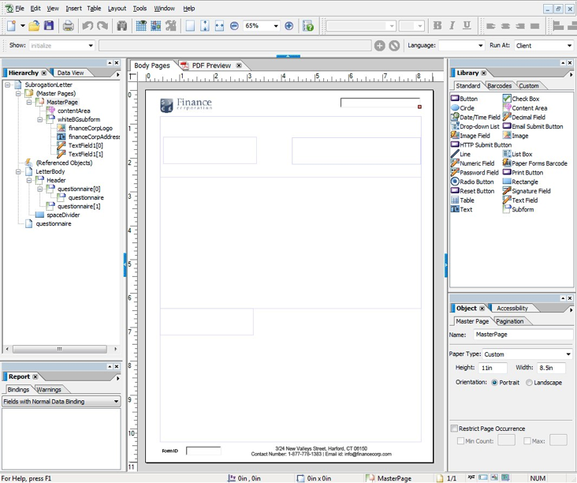

# 版面設計{#layout-design}

XFA表單範本或XDP是下列範本：

* [字母](/help/forms/using/create-letter.md)
* [互動式通訊](/help/forms/using/web-channel-print-channel.md#printchannel) 的 [列印頻道](/help/forms/using/interactive-communications-overview.md)

* 布局片段

XDP是在Adobe Forms Designer中設計。 本文提供如何設計XDP以建立有效的通訊／互動式通訊的詳細資訊，例如在何處使用表單欄位或目標區域，以及何時使用版面片段。

## 建立字母版面或互動式通訊的列印頻道版面 {#creating-a-layout-for-letters-or-for-interactive-communications-print-channel}

版面定義互動式通訊的字母／列印頻道的圖形版面。 版面可包含「位址」和「參考編號」等典型表單欄位。 它還包含表示目標區域的空子表單。 在表單設計人員中建立版面，當應用程式專員將它上傳至AEM伺服器時。 在此處，您可以在建立互動式通訊的對應範本或列印頻道時，選取版面。

請依照下列步驟，建立互動式通訊的字母／列印頻道版面：

1. 分析版面並判斷所有頁面重複的內容；頁首和頁尾通常適合此類別。 此內容會置於版面的主版頁面上。 其餘內容會移至版面的內文頁面。 在原則夾克中，標誌和公司位址可新增至主版頁首和頁尾。 例如，取消通知使用相同的版面。
1. 設計內文頁面時，請將頁面內容分成幾個區段。 每個區段都設計為內嵌於版面本身的子表單或片段版面。 如果截麵包含表，則將截面建模為佈局片段。
1. 版面可設計如下：

   1. 將每個區段作為包含區段所有元素的單獨子表單。
   1. 將每個節子表單子表單子表單的子表單設定為相同父子表單。 父子表單的版面配置設定為流動，以允許區段在下方移動，以防大型資料合併到先前的區段。
   1. Section Primary residence也可在其他版面中重複使用。 建立為片段版面。
   1. 章節其他興趣詳細資料只包含兩個元素，其中一個元素位於另一個下方，可包含大型資料，且設計為流。
   1. 其他區段會在特定位置包含元素，因此會設計為定位版面。
   1. 如果區段包含特定位置的元素，且這些元素包含大量資料，則將區段劃分為子表單。 然後排列子表單，以達到所需的行為。
   1. 對於「主要居住區」區段，新增預留位置目標區域。 此預留位置將綁定到在字母／互動式通信設計時將主要住宅分割。
   1. 將版面(以及使用版面的片段（如果有）上傳到AEM Forms伺服器。

### 在XDP範本中使用子表單 {#usesubformxdp}

分析建立互動式通訊所需的版面後，您就可以使用Forms Designer在XDP範本中建立子表單。 XDP範本中使用的空白子表單元件，會在互動式通訊的列印頻道中顯示目標區域。

>[!NOTE]
>
>將內容新增至互動式通訊的列印頻道，而非將內容新增至XDP範本的子表單元件。 使用檔案片段、圖表、影像和版面片段，將內 [容新增至列印頻道的目標區域](../../forms/using/create-interactive-communication.md#main-pars-header-741471925)。

執行以下步驟以在XDP模板中使用子表單：

1. 開啟表單設計器，選擇「 **檔案** 」>「新建 **」>「** 使用空格表單」，點選 ************ NextFinish並點選Finish，然後開啟表單以建立模板。

   確保從「窗 **口」菜單中選** 擇「對象庫」和「對象 ******** 」選項。

1. 將子表單元件從 **對象庫** ( **Object Library** )拖放到表單中。

   

1. 選擇子表單，在右窗格的「對象」( **Object** )窗口中顯示子表單的選項。
1. 選取「 **子表單** 」標籤，並從「內容 **」下拉式清** 單中選取「 **** Flued」。 拖動子表單的左端點以調整長度。

   

1. 在「系 **結** 」標籤中：

   1. 在「名稱」欄位中指定子表 **單的名** 稱。
   1. 從「 **資料系結** 」下拉式清 **單中選取「無資料系結** 」。

1. 同樣地，從左窗格中選擇根子表單。

   

1. 選取「 **子表單** 」標籤，並從「內容 **」下拉式清** 單中選取「 **** Flued」。 在「系 **結** 」標籤中：

   1. 在「名稱」欄位中指定子表 **單的名** 稱。
   1. 從「 **資料系結** 」下拉式清 **單中選取「無資料系結** 」。
   重複步驟2到5，向XDP模板添加更多子表單。 只 [有在編寫互動式通訊時，才能將文字、檔案片段](../../forms/using/create-interactive-communication.md#main-pars-header-741471925) 、影像和圖表新增至目標區域。

1. 選擇 **「檔案** 」>「另 **** 存新檔」，將檔案保存到本地檔案系統：

   1. 導覽至儲存檔案的位置，並指定XDP範本的名稱。
   1. 從「另 **存為類型」(** Save as type **)下拉清單中選擇** .xdp。

   1. 點選「 **儲存**」。

### 在XDP範本中使用影像欄位元件 {#use-image-field-component-in-an-xdp-template}

使用XDP範本中的「影像欄位」或「子表單」元件，並在製作互動式通訊時新增影像。

>[!NOTE]
>
>將影像新增至互動式通訊的列印頻道，而非將影像新增至XDP範本的影像欄位或子表單元件。 如需詳細資訊，請 [參閱新增內容至互動式通訊](../../forms/using/create-interactive-communication.md#step2)。

執行以下步驟以在XDP模板中使用映像欄位元件：

1. 將「影像欄位」元 **件從「物件庫** 」拖放 **至表單中** 。
1. 選擇子表單，在右窗格的「對象」( **Object** )窗口中顯示子表單的選項。
1. 在「系 **結** 」標籤中：

   1. 在「名稱」欄位中指定影像欄位 **的名稱** 。
   1. 從「 **資料系結** 」下拉式清 **單中選取「無資料系結** 」。

### 建立版面片段的XDP範本 {#xdplayoutfragments}

使用Forms Designer中的表格元件來建立版面片段，然後在製作互動式通訊的列印頻道時使用這些片段來建立表格。 使用版面片段來建立表格，可確保當使用列印頻道自動產生網頁頻道時，表格內容會保留結構。

>[!NOTE]
>
>在表格儲存格中輸入文字，或 [僅在編寫互動式通訊時，才建立與表單資料模型物件](../../forms/using/create-interactive-communication.md#main-pars-header-570999227) 的系結。

使用Forms Designer在XDP模板中使用表元件，請執行以下步驟：

1. 將表元件從對 **像庫拖放** 到表單中 **** 。
1. 在「插 **入表** 」對話框中：

   1. 指定表格的列數和欄數。
   1. 選中「 **在表中包括表頭行** 」複選框，以包括表頭的行。
   1. 點選「 **確定**」。

1. 在表 **名旁的左窗格中點選+** ，以滑鼠右鍵按一下標題和其他列所包含的儲存格名稱，然後選取「重新命名物件 **** 」來重新命名表格儲存格。
1. 按一下「設計視圖」( **Design View)中的表頭文本欄位** ，然後重新命名它們。
1. 將「文字欄位」元 **件從「物件庫** 」拖放至「設計檢視」中的每個表格儲存格 ********。 執行此步驟，可在編寫互動式通訊時，將表格儲存格與表單資料模型物件系結。

   

1. 從左窗格中選擇行的名稱，然後為每個資料項 **目選擇** 「對象」>「綁定 **」** >「重 **復行」**。 執行此步驟，以確保如果在此行的表單元格之間建立具有收集類型表單資料模型對象的綁定，則會自動為資料庫中的每個可用資料項重複表行。

   在表格儲存格中輸入文字，或 [僅在編寫互動式通訊時，才建立與表單資料模型物件](../../forms/using/create-interactive-communication.md#main-pars-header-570999227) 的系結。

1. 選擇 **「檔案** 」>「另 **** 存新檔」，將檔案保存到本地檔案系統：

   1. 導覽至儲存檔案的位置，並指定XDP範本的名稱。
   1. 從「另 **存為類型」(** Save as type **)下拉清單中選擇** .xdp。

   1. 點選「 **儲存**」。

### 上傳XDP範本至AEM Forms伺服器 {#uploadxdptemplate}

使用Forms Designer建立XDP範本後，您必須將它上傳至AEM Forms伺服器，以便在建立互動通訊時使用範本。

1. 選擇「 **表單** 」>「 **表單與檔案」**。
1. 點選「 **建立** >檔案 **上傳」**。
1. 導覽至本機檔案系統上的XDP範本位置，然後點選「 **Open** 」（開啟），將XDP範本匯入AEM Forms伺服器。

## 使用架構 {#using-schema}

您可以在版面或版面片段中使用架構，但不是必要的。 如果您使用架構，請確定：

1. 字母／互動式通訊中使用的版面和所有片段版面都使用與字母／互動式通訊相同的架構。
1. 所有填入資料所需的欄位都系結至架構。

## 建立可關聯欄位 {#creating-relatable-fields}

依預設，所有欄位都可視為與各種其他資料來源相關。 如果您的版麵包含任何與資料來源不相關的欄位，請使用「_int」（內部）字尾為欄位命名；例如pageCount_int。

可關聯欄位必須：

* 是XFA &lt;field>或&lt;exclGroup>
* 具有XFA綁定引用
* 如果是&lt;exclGroup>，則必須至少有一個子單選按鈕欄位；否則，其值類型無法確定

可關聯欄位必須：

* 名字

可關聯欄位不能：

* 在其名稱中包含&quot;_int&quot;尾碼
* 已將系結設為「無」
* 是&lt;exclGroup>元素的子項

只要可關聯欄位符合上述標準，它就可以位於版面中任何位置和任何巢狀深度。 您可以在主版頁面中使用可關聯欄位。

欄位的版面配置比目標區域子表單更有彈性；但它們會系結至單一值類型。 您可以將欄位變大，或將欄位設為固定寬度和高度，依此類推。 已解析的模組或規則結果將推送到欄位中。

## 決定何時使用子表單和文字欄位 {#deciding-when-to-use-subforms-and-text-nbsp-fields}

如果您想要在自上而下的垂直排版中擷取多個模組內容（多個段落或影像），請使用子表單。 您的版面必須處理子表單依高度成長以容納其內容的事實。 如果您無法確定與子表單／目標相關聯的內容長度從未超過版面中為子表單保留的空間，請將子表單建立為子表單容器內的子表單。 此程式可確保子表單下方的版面物件隨著子表單的成長而向下流動。

如果您想要將模組資料或資料字典元素資料擷取到版面的架構中（因為欄位會系結至資料）或在主版頁面上顯示模組內容，請使用欄位。 請記住，主版頁面中的內容無法與內文頁面內容一起流動，因此您必須確保影像欄位被用作標題標誌。 此表格提供更多標準，以決定在版面中使用子表單或欄位的時機。

<table>
 <tbody>
  <tr>
   <td>
<strong>在</strong>
 </td>
   <td>
<strong>在</strong>
 </td>
  </tr>
  <tr>
   <td>
它包含元素的組合，例如姓氏和名字
 </td>
   <td>
它包含單一元素，如「原則編號」。
 </td>
  </tr>
  <tr>
   <td>
它包含多個段落
 </td>
   <td>
文字已包住並對齊
 </td>
  </tr>
  <tr>
   <td>
重複、可選和條件式資料群組會系結至子表單，以降低使用指令碼產生相同結果時可能發生的設計錯誤風險
 </td>
   <td>
您的組織標誌和位址等元素會顯示在信件／互動式通訊的所有頁面上。 在這種情況下，請為這些元素建立表格欄位，並將它們放在主版頁面上。 如果將欄位綁定設定為「無資料綁定」，則沒有欄位將顯示為字母／互動式通信編輯器中可關聯的欄位。 如果您要將某些類型的內容與這些欄位建立關聯，這些欄位必須具有系結。
 
如果您的公司地址包含多行資料，請使用含有「允許多行」選項的文字欄位來代表版面上的地址。
 
如果文本欄位的資料類型設定為純文字檔案，則使用模組輸出的純文字檔案版本，而不是富格文本版本（所有格式都將被丟棄）。 若要保留格式，請將文字欄位的資料類型設為豐富式文字。
 </td>
  </tr>
  <tr>
   <td>
文字已溢排
 </td>
   <td>
文字欄位和影像欄位會用於主版頁面。 主版頁面無法將子表單用作目標區域。
 </td>
  </tr>
  <tr>
   <td>
物件會分組並組織，而不將子表單系結至資料元素
 </td>
   <td>
 
 </td>
  </tr>
  <tr>
   <td>
子表單內有一個文字欄位。 子表單可以增加，而不會覆寫版面上其下的其他物件。
 </td>
   <td>
您需要在後置程式中輕鬆存取其資料。
 </td>
  </tr>
 </tbody>
</table>

## 設定重複性要素 {#setting-up-repetitive-elements}

當您組織的標誌和位址等元素出現在信件／互動式通訊的所有頁面上時，請為這些元素建立表格欄位，並將它們放在主版頁面上。 請為這些欄位使用名稱（欄位名稱）系結。

## 指定伺服器演算格式 {#specify-the-server-nbsp-render-format}

將版面的伺服器轉譯格式使用至動態XML表單；否則，任何基於此版面的字母／互動式通訊都無法正確呈現。 預設情況下，Forms Designer中的伺服器渲染格式設定為動態XML表單。 要確保使用正確的格式：

* 在設計工具中，按一 **下「檔案** >表單屬性 **>預設值******」，並確定「PDF演算／格式」設定已設為「動態XML表單」。

