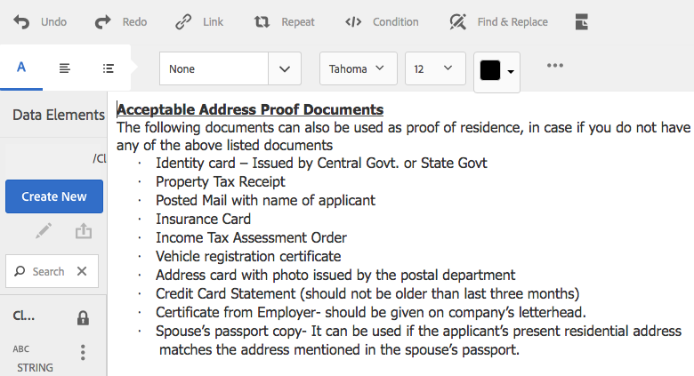

# 文件片段{#document-fragments}

## 文件片段 {#document-fragments-1}

文檔片段是通信的可重用部件/元件，您可以使用這些部件/元件合成信件/通信。 文檔片段的類型如下：

* **文本**:文本資產是由一個或多個文本段落組成的內容。 段落可以是靜態的或動態的。
* **清單**:清單是一組文檔片段，包括文本、清單、條件和影像。 清單元素的順序可以是固定的或可編輯的。 建立字母時，可以使用部分或全部清單元素複製可重用的元素模式。
* **條件**:條件使您能夠根據提供的資料定義在建立通信時包括的內容。 該條件用控制變數描述。 控制變數可以是資料字典元素或佔位符。
* **佈局片段**:佈局片段是可在一個或多個字母內使用的佈局。 佈局片段用於建立可重複模式，特別是動態表。 佈局可包含典型的表單域，如「地址」和「引用編號」。 它還包含表示目標區域的空子窗體。 佈局(XDP)在設計器中建立，然後上載到AEM Forms。

## 文字 {#text}

文本資產是由一個或多個文本段落組成的內容。 段落可以是靜態的或動態的。 動態段落包含對資料元素的引用，資料元素的值在運行時提供。 例如，字母稱呼中的客戶名稱可以是動態資料元素，其值在運行時可用。 通過更改這些值，可以使用相同的字母模板為不同的客戶生成字母。

「對應管理解決方案」支援兩種動態資料項（可變資料）:

* **資料字典元素**:這些元素綁定到資料字典並從提供的資料源中獲取其值。 資料字典變數可以受到保護或不受保護。 在建立對應時，用戶可以修改未受保護的資料字典變數的預設值，但不能修改受保護的字典變數。
* **佔位符**:這些變數未綁定到後端資料源。 它們要求用戶在建立通信期間填寫值。 預設情況下，佔位符不受保護。

>[!NOTE]
>
>在建立佔位符時，「對應管理」模板不會強制您建立唯一名稱。 如果建立兩個具有相同名稱的佔位符（如文本和條件），並在字母模板中同時使用它們，則上次插入佔位符的值將用於這兩個佔位符。 如果兩個佔位符具有相同的名稱，則比較它們的類型。 如果類型不同，則其類型將變為「字串」。 但是，在模組中，不能建立具有相同名稱的多個佔位符。

### 建立文本 {#create-text}

1. 選擇 **Forms** > **文檔片段**。
1. 點擊 **建立** > **文本** 或選擇文本資產並點擊 **編輯**。
1. 指定文本的以下資訊：

   * **標題：（可選）** 輸入文本資產的標題。 標題不必唯一，可以有特殊字元和非英文字元。 文本由其標題（如果可用）引用，例如在縮略圖和資產屬性中。
   * **名稱：** 文本資產的唯一名稱。 任何狀態中不能存在兩個資產（文本、條件或清單），且其名稱相同。 在「名稱」欄位中，只能輸入英語字元、數字和連字元。 「名稱」(Name)欄位將基於「標題」(Title)欄位自動填充。 在「標題」欄位中輸入的特殊字元、空格、數字和非英文字元將替換為「名稱」欄位中的連字元。 儘管「標題」(Title)欄位中的值會自動複製到「名稱」(Name)中，但您可以編輯該值。
   * **說明**:鍵入資產說明。
   * **資料字典**:（可選）選擇要映射的資料字典。 此屬性使您能夠向文本資產中的資料字典元素添加引用。
   * **標籤**:（可選）要建立自定義標籤，請在文本欄位中輸入值，然後按Enter。 您可以在標籤的文本欄位下看到您的標籤。 保存此文本時，還會建立新添加的標籤。

1. 點擊 **下一個**。 Oracle Tergence Management顯示「編輯器」頁，在該頁中可以向文本添加文本段落和資料元素。

   瀏覽器中的預設拼寫檢查器在文本編輯器中檢查拼寫。 要管理拼寫和語法檢查，可以編輯瀏覽器的拼寫檢查器設定或安裝瀏覽器插件/地址以檢查拼寫和語法。

   還可以使用文本編輯器中的各種鍵盤快捷鍵來管理、編輯和格式化文本。 有關 [文本編輯器](/help/forms/using/keyboard-shortcuts.md#p-formatting-p) 「通信管理」「鍵盤快捷鍵」中的鍵盤快捷鍵。

1. 開啟文本編輯器，輸入文本。 使用頁面頂部的工具欄來設定文本格式、插入條件、連結和分頁符。

   

   * **連結**:插入 [超文本](#insert-hyperlink) 的子菜單。
   * **重複**:使用分隔符重複打印資料字典中的收集元素。
   * **條件**:點擊以插入條件。 根據條件插入文本。 如果條件為true，則文本以字母形式顯示，否則不顯示。
   * **添加說明**:向文本添加註釋。 這是作者可見的元資料，但不是建立的字母的一部分。
   * **分頁符**:如果將文本模組的分頁屬性設定為false，則文本模組不會跨頁分頁。

   將開啟文本編輯器。 輸入文本。 工具欄會根據您選擇的編輯類型而更改：段落、對齊或清單：

   

   選擇工具欄類型：段落、對齊或清單

   

   段落工具欄
   對齊工具欄

   

   列出工具欄（按一下以開啟全尺寸影像）

1. 要重新使用另一個應用程式中存在的多個文本段落之一，請將文本複製並貼上到文本編輯器中。 複製文本的格式將保留在文本編輯器中。

   可以在可編輯的文本模組中複製和貼上一個或多個文本段落。 例如，您可以有MS Word文檔，其中帶有可接受居住證明的項目符號清單，如下所示：

   

   您可以直接將文本從MS Word文檔複製並貼上到可編輯的文本模組。 文本模組中保留了項目符號清單、字型和文本顏色等格式。

   

   >[!NOTE]
   >
   >但是，貼上的文本的格式有 [限制](https://helpx.adobe.com/aem-forms/kb/cm-copy-paste-text-limitations.html)。

1. 如果需要，請在文檔片段中插入特殊字元。 例如，可以使用「特殊字元」調色板插入：

   * 貨幣符號，如€、¥和英鎊
   * 數學符號∑、√、∂和^
   * 標點符號，如&quot;和&quot;

   

   Tergement Management為210個特殊字元提供了支援。 管理員可以 [通過自定義添加對更多/自定義特殊字元的支援](/help/forms/using/custom-special-characters.md)。

1. 要在可編輯的內聯模組中突出顯示\突出顯示部分文本，請選擇文本並點擊「突出顯示顏色」。

   

   可以直接點擊基本顏色 `**[A]**` 在「基本顏色」調色板中顯示或點擊 **選擇** 使用滑塊後 `**[B]**` 的雙曲餘切值。

   （可選）您還可以轉到「高級」頁籤以選擇適當的「色相」、「明度」和「飽和度」 `**[C]**` 建立精確顏色，然後點擊「選擇」 `**[D]**` 按鈕。

   

1. 從資料面板中，將拖放資料字典元素和佔位符元素拖放到文本中。

   至:

   * 在文本中添加資料字典元素，從清單中選擇資料元素，然後點擊插入( )。 如果選擇「受保護」，則資料字典元素為只讀並顯示在字母編輯器中，但不顯示在「建立對應」用戶介面或「對應建立器」中。
   * 在文本中添加佔位符元素，在「資料元素」面板中按一下「新建」，輸入新資料元素的詳細資訊，然後按一下「建立」將新元素添加到清單。 新佔位符可以以與資料字典元素相同的方式插入到文本中。 要編輯佔位符，請選擇佔位符，然後點擊「編輯」。

   

   資料字典的示例資料檔案中指定的佔位符元素

   

   CCR視圖中的佔位符元素值從資料字典變數中填充，如示例資料檔案中指定

   也可以使用@符號搜索資料字典和佔位符元素並將其添加到文本編輯器中。 將游標置於要插入元素的位置。 鍵入@ ，然後鍵入搜索字串。 文本編輯器對文本文檔片段中可用的所有資料字典和佔位符元素執行搜索操作。 搜索操作將檢索並顯示包含搜索字串的元素作為下拉清單。 在搜索結果中導航，然後按一下要在游標位置插入的元素。 按Esc隱藏搜索結果。

1. 您可以使用內聯條件並重複，使字母具有高度的上下文和良好的結構。 有關內聯條件和重複的詳細資訊，請參見 [內聯條件並以字母重複](/help/forms/using/cm-inline-condition.md)。
1. 點擊 **保存**。

#### 在文本中插入超連結 {#insert-hyperlink}

執行以下步驟以在文本資產中建立超連結：

1. 在文本編輯器中選擇文本或資料模型對象。

2. 點擊 **[!UICONTROL 連結]**。 點擊 **[!UICONTROL 替代文字]** 欄位以刪除現有資料模型對象名稱或文本。

3. 指定URL並點擊 。

#### 搜索和替代文字 {#searching-and-replacing-text}

使用包含大量文本的文本元素時，需要搜索特定的文本字串。 您可能還需要用替代字串替換特定文本字串。

「查找和替換」功能允許您搜索（和替換）文本元素中的任何文本字串。 該功能還包括功能強大的規則運算式搜索。

#### 在文本模組中搜索文本 {#to-search-text-in-a-text-module}

1. 在文本編輯器中開啟文本模組。

1. 按一下「Find &amp; Replace（查找和替換）」。
1. 在「查找」文本框中輸入要搜索的文本，然後按「查找」。 搜索文本在文本模組中突出顯示。
1. 要搜索文本的下一個實例，請再次按「查找」。

   如果繼續按「查找」按鈕，搜索將繼續在頁面下進行。 在找到文本的最後一個實例後， **已到達模組末尾** 表示找不到更多搜索結果。

   但是，如果在文本模組中找不到搜索文本的實例，則顯示的消息是： **找不到匹配項**。

1. 如果再次按「查找」，則搜索將繼續在頁面頂部進行。

#### 搜索選項 {#search-options}

**匹配大小寫：** 搜索返回的結果只包含相同大小寫。

**全字：** 搜索僅返回整個單詞。

>[!NOTE]
>
>如果在「查找」文本框中輸入任何特殊字元，則「全字」選項將被禁用。

**注：** 使用規則運算式進行搜索。 例如，以下規則運算式在文本模組中搜索電子郵件地址：

`[a-zA-Z0-9._%+-]+@[a-zA-Z0-9.-]+\.[a-zA-Z]{2,4}`

#### 在文本模組中搜索和替代文字 {#to-search-and-replace-text-in-a-text-module}

1. 在文本編輯器中開啟文本模組。
1. 按一下「Find &amp; Replace（查找和替換）」。
1. 在「查找」文本框中輸入要搜索的文本，並輸入要替換查找文本的文本，然後按「替換」。
1. 如果找到搜索文本，則文本將替換為「替換」文本。

   * 如果找到搜索文本的另一個實例，則該實例會在文本模組中突出顯示。 如果再次按「替換」(Replace)，則會替換突出顯示的實例，並且如果找到第三個實例，游標會向前移動。
   * 如果找不到另一個實例，游標將停止在最後一個替換實例處。

1. 如果再次按「查找」，則搜索將繼續在頁面頂部進行。

   使用「全部替換」選項替代文字模組中文本的所有實例。 執行「」操作時，「查找和替換」對話框中將顯示一條消息。

#### 文本模組的最佳做法/技巧和技巧 {#best-practices-tips-and-tricks-for-text-modules}

* 使用一致的命名約定來避免重複。
* 在文本模組中使用適當的資料字典綁定。
* 更改文本資產時，使用文本編輯器時適用以下規則：

   * **添加變數：** 允許
   * **刪除變數：** 允許
   * **更新屬性：** 允許
   * **更改資料字典：** 在未使用資料字典元素之前允許。 更新時不能更改資料字典。

## 清單 {#list}

清單是一組文檔片段，包括文本、（其它）清單、條件和影像。 清單元素的順序可以是固定的或可編輯的。 建立字母時，可以使用部分或全部清單元素複製可重用的元素模式。 清單基本上以可嵌套在其他目標中的目標的方式運行。

### 實現清單 {#implementing-lists}

實施清單包括兩個步驟：

1. 定義核心屬性，如名稱、說明、資料字典。
1. 屬於清單一部分的內容部分，然後設定清單的鎖定順序和庫訪問權限等屬性。

### 建立清單 {#create-a-list}

清單是一組相關內容，可在字母模板中作為單個單元使用。 任何類型的內容都可以添加到清單中。 清單也可以嵌套。 清單模組可指定為：

* **已訂購**:在「建立對應」運行時中無法更改訂單。
* **庫訪問**:用戶可以將模組添加到清單。 此標誌指定是否啟用庫訪問。 如果啟用（開啟），則用戶可以在預覽信件時將模組添加到清單中。
* 建立清單時，可以指定類型，如：
* **平面**:清單不應用其他樣式格式。
* **項目符號**:用簡單項目符號格式化的清單。
* **編號**:選擇標準(1,2,...)、上羅馬(I,II,...)和下羅馬(i,ii,...)數字的數字清單。
* **字母**:按字母順序排列的清單，可選擇小寫(a,b,...)和大寫(A,B,...)字母。
* **自定義**:您可以建立所選的任何「編號/字母」類型以及前置詞和尾碼值。

1. 選擇 **Forms** > **文檔片段**。

1. 選擇 **建立** > **清單**。

1. 為清單指定以下資訊：

   * **標題（可選）:輸入** 的子菜單。 標題不必唯一，可以有特殊字元和非英文字元。 清單由其標題（如果可用）引用，例如在縮略圖和資產屬性中。
   * **名稱：** 清單的唯一名稱。 任何狀態中不能存在兩個資產（文本、條件或清單），且其名稱相同。 在「名稱」欄位中，只能輸入英語字元、數字和連字元。 「名稱」(Name)欄位會自動填充「標題」(Title)欄位中的值。 在「標題」欄位中輸入的特殊字元、空格、數字和非英文字元將替換為「名稱」欄位中的連字元。 儘管「標題」(Title)欄位中的值會自動複製到「名稱」(Name)中，但您可以編輯該值。
   * **說明（可選）**:鍵入資產說明。
   * **資料字典（可選）**:（可選）選擇要連接的資料字典。 只能將與清單使用相同資料字典的資產或未分配資料字典的資產添加到清單中。 為清單分配資料字典使建立字母模板的人員更容易找到相應的清單。
   * **標籤（可選）**:選擇要應用的標籤。 也可以鍵入新標籤的名稱並建立它。 (按一下時將建立新標籤 **保存**。)

1. 點擊 **下一個**。
1. 點擊 **添加資產**。
1. 要將資產添加到清單，請在「選擇資產」頁中選擇它們，然後點擊 **完成**。

   

1. 資產將添加到「清單項」頁。
要更改清單中資產的順序，請點擊並按住箭頭表徵圖(  )和拖放。 當用戶在「建立對應」用戶介面中開啟信件模板時，內容將按您在此處定義的順序進行裝配。

   

1. 您可以選擇以下選項以指定清單在CCR用戶介面中的行為方式：

   * **庫訪問**:要啟用庫訪問以添加資源，請點擊庫訪問。 啟用「庫訪問」後，聲明調整器可向清單添加更多內容。 否則，「索賠調整器」將限於您為清單定義的內容。
   * **鎖定順序**:要鎖定清單中資產的順序，以便Claims Adjustor無法更改順序，請點擊Lock Order。 如果未選擇此選項，「索賠調整器」可以更改清單項的順序。

   * **添加項目符號**:使用此選項可將項目符號或編號樣式應用於模組。 可以使用預設計清單樣式或自定義清單樣式。 還可以指定在每個清單項之前和之後顯示的文本。
   * **分頁符**:選擇此選項( )以在清單內容之間添加分頁符。 未選擇此選項時( )，如果清單的內容溢出到下一頁，則整個清單將移到下一頁，而不是在清單之間的頁面中斷。

   * **分配配置**:使用此選項可指定可添加到清單的資產的最小和最大數量。

1. 您可以選擇以下選項來指定清單中每個資產在運行時的行為方式：

   * **可編輯：** 選擇此選項後，可以在「建立對應」用戶介面中編輯內容。 （此選項不適用於「清單」和「映像」模組。）
   * **必需：** 選中此選項後，「建立對應」用戶介面中需要內容。
   * **選定：** 選擇此選項後，將在「建立對應」用戶介面中預選內容。
   * **跳過樣式：** 選擇此選項後，內容將跳過「建立對應」用戶介面中的項目符號和編號。 (此選項不適用於映像模組。 此外，在「跳過樣式」、「複合」和「忽略清單樣式」之間，只能將其中一個選項應用於模組。 選擇「為模組添加項目符號」時，其中一個選項可用於模組。)
   * **縮進：** 可以更改作為「清單」一部分選擇的每個模組/內容的縮進級別。 縮進按「級別」（從零開始）指定，因此每個縮進級別對應36分的填充。
   * **複合：** 選中後，複合編號將作為外部（父級）清單的樣式和它自己的樣式的組合應用。 此嵌套清單上的複合編號基於此嵌套清單在外部清單中顯示的順序。
   * **忽略清單樣式：** 如果取消選擇「複合編號」選項，則啟用「忽略清單樣式」選項。 此選擇忽略嵌套清單的樣式，從外部清單繼續編號。 因此，嵌套清單的模組被視為外部清單本身的一部分，而不考慮在嵌套清單中指定的任何樣式。 如果為嵌套清單取消選擇「忽略清單樣式」選項，則作為該嵌套清單一部分的模組有其自己的編號樣式。
   * **繼續下一步：** 設定清單中所包含資產的分頁符。 如果將清單中一個資產的「與下一項保持」屬性設定為 **開**&#x200B;資產和下一個資產保留在同一頁。 這意味著所選資產和下一資產的內容不會跨頁中斷。

1. 點擊 **保存**。

### 最佳做法/技巧和技巧 {#best-practices-tips-and-tricks}

* 使用一致的命名約定來避免重複。
* 使用適當的資料字典綁定
* 使用「清單編輯器」更改清單時，適用以下規則：

   * 更新屬性：允許
   * **更改資料字典：** 在沒有與使用資料字典的項關聯之前允許。 更新時不能更改資料字典。

## 條件 {#conditions}

條件使您能夠根據提供的資料定義在信件建立時包括的內容。 該條件用控制變數描述。 添加條件時，您可以根據控制變數具有的值選擇包括資產。

根據您選擇的選項，僅根據當前條件變數計算發現為true的第一個表達式或計算所有條件。 在「建立對應」(CCR)中填寫信時，條件將顯示為「白色框」。 如果條件導致清單，則將輸出清單的所有必需項和預選項。 如果其中任何項目是條件或清單本身，則其生成的內容也將以自上而下的深度優先順序輸出為文本和影像內容的平面清單。 條件結果可以是任何類型（文本、清單、條件或影像）。

### 實施條件 {#implementing-conditions}

條件編輯器附帶 [表達式生成器](/help/forms/using/expression-builder.md) 支援使用多個佔位符和資料字典元素建立表達式的用戶介面。 可以在此類表達式中使用常用操作數和本地/全局函式。 每個表達式都可以與某些內容關聯，如果任何表達式的計算結果都不為true，則可以有一個預設節。 所有表達式都按定義它們的順序計算，並且選擇返回true的第一個表達式，其關聯內容由該條件模組返回。

例如，如果字母中的條款和條件文本因客戶所處的狀態而不同，並且資料字典包含一個名為「state」的元素，則可以按如下方式添加該條件：·狀態= NY，選擇T&amp;C_NY文本段落·狀態= NC，選擇T&amp;C_NC文本段落

條件編輯器允許您指定預設條件。 如果控制變數的值與任何條件都不匹配，則使用與預設條件關聯的內容。 在上一個示例之後，可以添加此條件行：·預設，選擇T&amp;C_Rest

### 建立條件 {#create-a-condition}

1. 選擇 **Forms** > **文檔片段**。
1. 選擇 **建立>條件**。
1. 為清單指定以下資訊：

   * **標題（可選）:** 輸入條件的標題。 標題不必唯一，可以有特殊字元和非英文字元。 條件由其標題（如果可用）引用，例如在縮略圖和資產屬性中。
   * **名稱：** 條件的唯一名稱。 任何狀態中不能存在兩個資產（文本、條件或清單），且其名稱相同。 在「名稱」欄位中，只能輸入英語字元、數字和連字元。 「名稱」(Name)欄位將基於「標題」(Title)欄位自動填充。 在「標題」欄位中輸入的特殊字元、空格、數字和非英文字元將替換為「名稱」欄位中的連字元。 儘管「標題」(Title)欄位中的值會自動複製到「名稱」(Name)中，但您可以編輯該值。
   * **說明（可選）** 鍵入條件說明。
   * **資料字典（可選）**:（可選）選擇要連接的資料字典。 只能將與條件使用相同資料字典的資產或未分配資料字典的資產添加到清單中。 將資料字典分配給清單使建立字母模板的人更容易找到適當的條件。
   * **標籤（可選）**:（可選）選擇要應用的標籤。 也可以鍵入新標籤的名稱並建立它。 (按一下時將建立新標籤 **保存**。)

1. 點擊 **下一個**。
1. 點擊 **添加資產**。
1. 要將資產添加到條件，請在「選擇資產」頁中選擇它，然後點擊 **完成**。 資產將添加到「表達式」窗格。
1. 您可以選擇以下選項來指定條件在運行時的行為方式：

   * **禁用多個結果評估\啟用多個結果評估**:啟用此選項（顯示為「啟用多個……」）後，將評估所有條件，結果是所有真實條件的總和。 如果禁用此選項（顯示為「禁用多個……」），則只計算發現為true的第一個條件，並成為該條件的輸出。
   * **分頁符**:選擇此選項( )以在條件的模組之間添加分頁符。 未選擇此選項時( )，如果條件溢出到下一頁，則整個條件將移到下一頁，而不是在條件之間的頁中斷。

1. 要更改條件中資產的順序，請點擊並按住箭頭表徵圖(  )和拖放。 當用戶在「建立對應」用戶介面中開啟信件模板時，內容將按您在此處定義的順序進行裝配。
1. 點擊 **刪除** 的子菜單。 如果在預設行中按一下「刪除」，則僅清除資產資訊。
1. 點擊 **複製** 複製行。
1. 點擊 **編輯** 更改資產或編輯表達式。

   進一步：

   * 要更新資產，請按一下「資產」列下的資料夾表徵圖。
   * 要開啟表達式生成器以插入表達式，請按一下「表達式」列下的資料夾表徵圖。 有關表達式生成器的詳細資訊，請參見 [表達式生成器](/help/forms/using/expression-builder.md)。

### 最佳做法/技巧和技巧 {#best-practices-tips-and-tricks-1}

* 使用一致的命名約定來方便搜索並避免重複。
* 條件的行為與大小寫語句類似，因此條件的順序非常重要。 返回第一個匹配。
* 使用適當的資料字典綁定
* 使用條件編輯器編輯條件時適用以下規則：

   * **添加變數：** 允許
   * **刪除變數：** 允許
   * **更新屬性：** 允許
   * **更改資料字典：** 在未使用資料字典元素之前允許。

## 布局片段 {#layoutfragments}

佈局片段基於在設計器中建立的XDP。 要建立佈局片段，需要建立XDP和 [上傳到AEM Forms](/help/forms/using/import-export-forms-templates.md)。

一個或多個佈局片段可以形成字母的部分並定義這些部分的圖形佈局。 佈局片段可以包含典型的表單域（如「地址」和「引用編號」），以及表示目標區域的空子表單。 此外，佈局片段允許您建立表並將其插入字母中。

常見的使用情形是在字母中查找可重複使用的佈局模式，並為其建立佈局片段。 例如，字母的稱呼、地址和主題部分，它以同一順序顯示多個字母。 另一個示例可以是在多個字母中使用的行和列數相似的表。

可以基於現有XDP建立佈局片段。 佈局片段可以由欄位和目標區域或一個或多個表組成。 佈局中的表可以是靜態的或動態的。 XDP在Designer中建立， [上傳到AEM Forms](/help/forms/using/import-export-forms-templates.md)。 XDP可以形成佈局片段或字母的結構。 有關 [佈局設計](/help/forms/using/layout-design-details.md)。

使用綁定到目標區域的片段允許在創作時更改字母。 可以建立具有不同尺寸的佈局片段，並且可以將適當的片段綁定到目標區域。 佈局片段還允許您自定義一些表屬性：

1. 可以增加行和列計數。
1. 可以為更多行和列指定頁眉和頁腳文本。
1. 可以定義表列寬的比率。 運行時表列根據定義的比率和可用空間調整大小。 寬度比之和必須為100。 否則不適用。
1. 如果表是佔位符（僅包含單個空白單元格），則可以定義新列的類型（目標區域/欄位）。
1. 可以隱藏頁眉和頁腳行。

在執行此過程之前，請使用設計器建立XFA片段。 片段可以包含用於組織欄位和目標區域的表。 設計器允許建立兩種類型的表：靜態和動態。 靜態表包含固定數量的行。 靜態表可以包含目標區域和欄位。 這些目標區域和欄位不能綁定到重複的DDE。 動態表也可以具有單行。 綁定到表單元格的資料確定動態表的行數。 動態表只能包含欄位。 DDE可以是重複的或非重複的。

設計表時請考慮以下幾點：

1. 可以在建立佈局片段時自定義表。 但是，僅當表的父子窗體被流動時，才啟用自定義選項。
1. 對於動態表，所有欄位、可重複行和表都使用「使用名稱」綁定來正確合併資料。
1. 對於動態表，綁定到表欄位的所有重複DDE都屬於同一層次。 對於非重複DDE，沒有此限制。
1. 在將佈局片段合併到父目標區域表時，會根據可用空間調整大小，但只有在佈局片段不包含任何直接位於頂層子窗體中的目標區域或欄位時才會調整大小。 允許使用表中的目標區域和欄位。
1. 可以建立佔位符表。 佔位符表只有一個空白單元格。

* 對於佔位符表，可以在建立片段時自定義以下屬性。

   * 行計數
   * 列計數
   * 每列的頁眉和頁腳
   * 每列的類型（目標區域/欄位）
   * 每列寬比

* 對於非佔位符表，可以自定義以下屬性：

   * 行計數
   * 列計數
   * 附加列的頁眉和頁腳
   * 每列寬比

你可以把碎片嵌在信里。 這意味著您可以在片段內添加片段。 Tergement Management解決方案支援信函中多達四個嵌套級別： **信**->**片段**->**片段**->**片段**->**碎片。**

有關在佈局片段中使用靜態和動態表的詳細示例，請參見 [示例檔案：在字母中使用靜態表和動態表](#examplewithsamplefiles)。

### 建立佈局片段 {#creating-a-layout-fragment}

1. 選擇 **建立** > **佈局片段**。
1. Oracle Tergement顯示可用的XDP。 選擇要作為佈局片段基礎的XDP，然後點擊 **下一個**。
1. 指定佈局的以下資訊：

   * **標題（可選）:** 輸入佈局片段的標題。 標題不必唯一，可以有特殊字元和非英文字元。 佈局片段由其標題（如果可用）引用，例如在縮略圖和資產屬性中。
   * **名稱：** 佈局片段的唯一名稱。 任何狀態中不能存在兩個資產（文本、條件或清單），且其名稱相同。 在「名稱」欄位中，只能輸入英語字元、數字和連字元。 「名稱」(Name)欄位將基於「標題」(Title)欄位自動填充。 在「標題」欄位中輸入的特殊字元、空格、數字和非英文字元將替換為「名稱」欄位中的連字元。 儘管「標題」(Title)欄位中的值會自動複製到「名稱」(Name)中，但您可以編輯該值。 此名稱顯示在「管理資產」用戶介面的清單中。
   * **說明（可選）**:在「管理資產」用戶介面的清單中顯示的說明。
   * **標籤（可選）**:（可選）選擇要應用於條件的標籤。 也可以鍵入新標籤的名稱並建立它。

1. 點擊 **表格** ，然後為佈局指定以下資訊：

   * **配置**:選擇要配置的表。如果表是靜態表，則下拉清單中表名的尾碼為（靜態）；如果表是動態表，則表名為（動態）。 靜態表包含固定數量的行。 靜態表可以包含目標區域和欄位。 這些目標區域和欄位不能綁定到重複的DDE。 綁定到表單元格的資料確定動態表的行數。

   * **行**:選擇佈局的行數。 配置的行計數必須大於或等於原始行計數。
   * **列**:選擇佈局的列數。 配置的列計數必須大於或等於原始列計數。

   對於每列，需要以下詳細資訊：

   * **標題**:要為標題顯示的文本
   * **頁腳**:要為頁腳顯示的文本
   * **類型**:附加列的類型。 欄位或目標區域。 為靜態佔位符表啟用類型。 類型可以在列級別定義，而不能在單元格級別定義。 擴展列中的所有單元格類型相同。 對於動態表，所有列均為「欄位」類型。 對於非佔位符表，不能定義附加列的類型。 在這種情況下，擴展列中附加單元格的類型與該行中最後一列的類型相同；並且附加行中單元格的類型與該列中最後一個單元格的類型相同。
   * **寬度比：** 表列寬的比率。

   有關在佈局片段中使用靜態和動態表的詳細示例，請參見 [示例檔案：在字母中使用靜態表和動態表](#examplewithsamplefiles)。

1. 點擊 **保存**。

### 將XDP上載到通信管理 {#upload-an-xdp-to-correspondence-management}

有關將XDP上載/導入到通信管理的說明，請參閱 [向AEM Forms進口和出口資產](/help/forms/using/import-export-forms-templates.md)。

### 最佳做法/技巧和技巧 {#best-practices-tips-and-tricks-2}

#### 設定預設子窗體綁定 {#set-the-default-subform-binding}

在Designer中建立目標區域時，將所有新子窗體的預設綁定設定為「無」會有所幫助。

設定預設綁定：

1. 在設計器中，點擊 **工具** > **選項** > **資料綁定** > **子窗體綁定**。

1. 在「新建子表單的預設綁定」清單中，選擇 **無資料綁定**。

這可確保使用「插入」>「子表單」命令或從對象元件面板拖放插入的子表單在預設情況下具有「無」綁定。 這意味著，預設情況下，任何新子表單都是目標區域，除非您向其添加內容、更改其綁定設定或將子表單命名為「_int」尾碼。

#### 第508節遵約 {#section-compliance}

如果在「建立對應」用戶介面中建立的已完成信函用於填充以後的工作流。 在建立佈局時，請遵循與Section 508相關的建議。 否則，字母PDF將用於顯示，您可以忽略以下建議：

* 佈局中的所有目標區域子窗體和所有欄位都有制表符順序。
* 預設情況下，帶字幕的欄位符合508。 預設情況下，欄位的/field/assist/speak@priority屬性設定為「custom」，這意味著除非提供自定義螢幕閱讀器文本，否則螢幕閱讀器會讀取欄位的標題。
* 沒有標題的欄位指定工具提示，並指示螢幕閱讀器通過設定

`/field/assist/speak@priority="toolTip"` 指定工具提示文本 `/field/assist/toolTip`。

#### Designer和Asset Configuration Manager中的日期格式 {#date-formats-in-designer-and-asset-configuration-manager}

在設計器中設計佈局時，請確保日期欄位的格式與資料顯示格式中指定的日期格式匹配 [通信管理配置屬性](/help/forms/using/cm-configuration-properties.md)。 有關詳細資訊，請參閱設計器幫助中的「設定欄位值格式和使用模式」。

#### 捕獲日期範圍 {#capturing-date-ranges}

處理日期組合時，使用單個子表單來確保在完成的字母中正確對齊，並將欄位數減到最小。

#### 設定窗體級綁定 {#setting-form-level-binding}

當佈局包含許多映射到單個XML元素的欄位和目標區域時，請使用表單級綁定並為每個元素建立一個單獨的節點。 在Oracle Tergement中映射資料時，在窗體級別綁定的欄位將被忽略。

#### 不在母版頁中使用子窗體目標區域 {#do-not-use-subform-target-areas-in-a-master-page}

首頁中的子表單目標區域在管理資產用戶介面中不可見，資料無法映射到它們。

#### 為目標區域選擇適當的職位和類型 {#choosing-appropriate-positions-and-types-for-target-areas}

在設計佈局時，在選擇子窗體時要小心。 如果佈局包含單個子窗體，則它可以是流類型。 在子窗體中放置欄位後，可以用另一個子窗體對其進行包絡，這樣包裝的子窗體也會流動，佈局不會受到干擾。

#### 在母版頁上放置欄位 {#placing-fields-on-master-pages}

在母版頁上放置欄位時，請注意以下事項：

* 將母版頁欄位的綁定設定為使用全局資料
* 不要將欄位直接放置在母版頁的根PageArea下。
* 在命名子窗體中對欄位進行包裝，並確保將命名子窗體的綁定設定為「使用名稱」。

## 使用佈局片段建立表 {#creating-tables-using-layout-fragments}

許多字母模板都包含表。 表可以是靜態的，如術語和條件表，其中每行代表一個條件，每個部件都顯示在單獨的列中。 表也可以是動態的，如帳戶資訊，其中包含諸如客戶名稱、帳戶ID、事務編號和事務金額等資訊。

* **靜態表**:有時建立表時使用具有不同列數的行，如術語和條件表。 其中，每行代表一個條件，每個條件可以具有不同的子部件。 每個部件都顯示在單獨的列中。
* **動態表**:佈局片段提供了將動態表的欄位綁定到收集DDE的功能。 在字母生成表行時，根據集合DDE的大小生成。

DD具有集合元素Nomineed_details，該集合元素具有三個基元元素的複合元素：Nomineed_name、Nomineed_address和Nomineed_gederm。
動態XDP也具有相同的標頭。 因此，可以將動態XDP欄位與上述DD欄位映射。

### 示例檔案：在字母中使用靜態和動態表 {#examplewithsamplefiles}

此示例說明如何建立動態表和靜態表，將動態表綁定到DDE，然後建立包含這兩個表的字母。 使用此示例時，您可以從頭建立檔案或使用步驟中提供的輸入檔案。

1. 建立要在示例中使用的資料字典(DD)，如圖所示。

   然後選擇DD並導出示例資料。 您獲取的XML檔案包含Employee資料和Nomineed_details的三個實例(預設情況下，下載3個實例。 您可以根據需要添加或刪除)。 更新值，然後以DD格式導入test資料。 CMP檔案是包，其中包含DD。 因此，將DD導入到「通信管理」。

   有關使用資料字典和test資料的詳細資訊，請參閱 [資料字典](/help/forms/using/data-dictionary.md#p-working-with-test-data-p)。

   

[取得檔案](assets/exportpackage_1431709897770.cmp.zip)

1. 在設計器中，建立兩個XDP（佈局片段）:動態表和靜態表。 對於兩個佈局：

   * 將子窗體添加到表列。 確保將表的父子表單的佈局更改為流並刪除表中子表單的綁定。
   * 向表單元格添加子窗體。 確保將表的父子表單的佈局更改為流並刪除表中子表單的綁定。

   或者，使用隨此步驟附加的靜態和動態XDP。

   有關使用版式片段的詳細資訊，請參見 [佈局片段](#layoutfragments)。
有關設計佈局的詳細資訊，請參見 [設計器幫助](https://help.adobe.com/en_US/AEMForms/6.1/DesignerHelp/)。

[取得檔案](assets/static.xdp.zip)

[取得檔案](assets/dynamic.xdp.zip)

1. 將XDP上傳到AEM Forms。
1. 基於動態XDP建立佈局片段。 屬性的「表」(Table)頁籤顯示表是動態的(「配置」(Configuration For)欄位)。 行(1)和列(3)的數目從XDP/佈局片段中派生。

   此佈局的欄位稍後會綁定到導入的DD，在字母中，根據test資料檔案（隨DD附加的XML資料檔案）中的記錄數動態建立行數。

   

   按一下以開啟全尺寸影像

1. 基於靜態XDP建立佈局片段。 屬性的「表」頁籤顯示表是靜態的（「配置」欄位）。 行(1)和列(3)的數目從XDP/佈局片段中派生。

   您可以在此處更改列和行數。 根據您在此螢幕中選擇的內容，靜態表的行數和列數在使用此佈局建立的字母中保持不變。
   

1. 使用其中的佈局片段建立字母。 在字母中插入動態XDP時，將其欄位的綁定設定為資料字典的收集元素。

   有關建立字母和字母模板的詳細資訊，請參閱 [建立字母](/help/forms/using/create-letter.md)。

1. 保存信件並預覽。 預覽字母時，「資料字典」中的值將顯示在字母中。 對於動態表，有三行。 這是因為test資料有三條這些行的記錄。

   對於靜態表，在建立佈局片段時指定的行和列數量相同。

   

   對於動態表，根據test資料檔案中的記錄數顯示這三行。 這是因為在將佈局添加到字母時，在動態表的欄位和資料字典的集合元素之間建立了綁定。 「名稱」、「地址」和「性別」值將從您使用的test資料檔案中填充。

   

## 建立文檔片段的副本 {#create-a-copy-of-a-document-fragment}

要快速建立具有類似於現有文檔片段的屬性和內容的文檔片段，可以複製並貼上它。

1. 從文檔片段清單中，選擇一個或多個文檔片段。 UI顯示「複製」表徵圖。
1. 點選「 複製」。UI顯示「貼上」表徵圖。 您還可以選擇在貼上之前進入資料夾。 不同的資料夾可以包含具有相同名稱的資產。 有關資料夾的詳細資訊，請參見 [資料夾和組織資產](/help/forms/using/import-export-forms-templates.md#folders-and-organizing-assets)。
1. 按一下「貼上」。 此時將出現「貼上」對話框。 如果在同一位置複製和貼上文檔片段，系統會自動為字母的新副本指定名稱和標題，但您可以編輯字母的標題和名稱。
1. 如果需要，請編輯要保存文檔片段副本的標題和名稱。
1. 按一下「貼上」。 建立文檔片段的副本。
