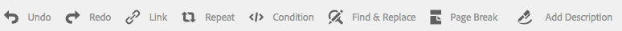
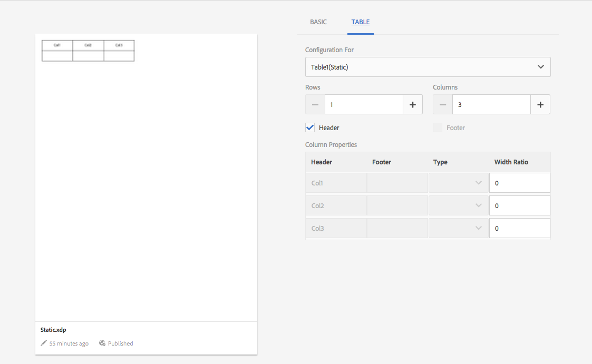

# 文件片段{#document-fragments}

## 文件片段 {#document-fragments-1}

檔案片段是可重複使用的信函部分/元件，您可使用此信函/通信撰寫。 檔案片段的類型如下：

* **文字**:文字資產是由一或多段文字組成的內容。 段落可以是靜態的或動態的。
* **清單**:清單是一組檔案片段，包括文字、清單、條件和影像。 清單元素的順序可以固定或可編輯。 建立信函時，您可以使用部分或全部清單元素來複製可重複使用的元素模式。
* **條件**:條件可讓您根據提供的資料，定義建立通信時包含的內容。 條件以控制變數的形式說明。 控制變數可以是資料字典元素或預留位置。
* **版面片段**:版面片段是可用於一或多個字母的版面。 配置片段用於建立可重複的模式，尤其是動態表格。 版面可包含典型的表單欄位，例如「地址」和「參考編號」。 它還包含表示目標區域的空子形式。 配置(XDP)在Designer中建立，然後上傳至AEM Forms。

## 文字 {#text}

文字資產是由一或多段文字組成的內容。 段落可以是靜態的或動態的。 動態段落包含對資料元素的引用，這些資料元素的值在運行時提供。 例如，信函稱號中的客戶名稱可以是動態資料元素，其值可在執行階段使用。 通過更改這些值，可以使用相同的信函模板為不同的客戶生成信函。

通信管理解決方案支援兩種動態資料項目（變數資料）:

* **資料字典元素**:這些元素會系結至資料字典，並從提供的資料來源取得其值。 資料字典變數可受保護或不受保護。 在通信建立期間，用戶可以修改未受保護的資料字典變數的預設值，但無法修改受保護的字典變數。
* **預留位置**:這些變數未系結至後端資料來源。 它們要求使用者在建立通信期間填入值。 預設情況下，預設不會保護佔位符。

>[!NOTE]
>
>建立預留位置時，通信管理範本不會強制您建立唯一名稱。 如果建立兩個具有相同名稱的佔位符（如文本和條件），並在信函模板中同時使用它們，則最後插入的佔位符的值將用於這兩個佔位符。 如果兩個預留位置具有相同名稱，則會比較其類型。 如果類型不同，則其類型變為字串。 不過，您無法在模組內建立多個名稱相同的預留位置。

### 建立文字 {#create-text}

1. 選擇 **Forms** > **檔案片段**.
1. 點選 **建立** > **文字** 或選取文字資產並點選 **編輯**.
1. 指定文字的下列資訊：

   * **標題：（可選）** 輸入文字資產的標題。 標題不一定唯一，可以有特殊字元和非英文字元。 文字會以其標題（如果有）來參照，例如縮圖和資產屬性中。
   * **名稱：** 文字資產的唯一名稱。 任何狀態中的兩個資產（文字、條件或清單）都不能存在且名稱相同。 在「名稱」欄位中，您只能輸入英文字元、數字和連字型大小。 系統會根據「標題」欄位自動填入「名稱」欄位。 在「標題」欄位中輸入的特殊字元、空格、數字和非英文字元在「名稱」欄位中會以連字型大小取代。 雖然「標題」欄位中的值會自動複製到「名稱」，但您可以編輯值。
   * **說明**:輸入資產的說明。
   * **資料字典**:（可選）選擇要映射的資料字典。 此屬性可讓您將參考新增至文字資產中的資料字典元素。
   * **標籤**:（可選）要建立自定義標籤，請在文本欄位中輸入值，然後按Enter。 您可以在標籤的文字欄位下看到您的標籤。 儲存此文字時，也會建立新新增的標籤。

1. 點選 **下一個**. 「通信管理」會顯示「編輯器」頁面，您可在此將文欄位落和資料元素新增至文字。

   瀏覽器中的預設拼字檢查程式會在文字編輯器中檢查拼字。 若要管理拼字和語法檢查，您可以編輯瀏覽器的拼字檢查程式設定，或安裝瀏覽器外掛程式/附加程式以檢查拼字和語法。

   您也可以使用文字編輯器中的各種鍵盤快速鍵來管理、編輯及格式化文字。 如需 [文字編輯器](/help/forms/using/keyboard-shortcuts.md#p-formatting-p) 通信管理鍵盤快速鍵中的鍵盤快速鍵。

1. 文字編輯器隨即開啟，請輸入文字。 使用頁面頂端的工具列來設定文字、插入條件、連結和分頁格式。

   

   * **連結**:插入 [超文本](#insert-hyperlink) 連結。
   * **重複**:使用分隔字元，在資料字典中重複列印收集元素。
   * **條件**:點選以插入條件。 根據條件插入文字。 若條件為true，則文字會以字母顯示，否則不會。
   * **新增說明**:將注釋添加到文本中。 這是作者可見的中繼資料，但不是所建立信函的一部分。
   * **分頁符**:如果您將文字模組的分頁符屬性設為false，則文字模組不會跨頁面分頁。

   文字編輯器隨即開啟。 輸入文字。 工具列會根據您選擇進行的編輯類型而變更：段落、對齊或清單：

   

   選擇工具欄類型：段落、對齊或清單

   

   段落工具欄
   對齊工具欄

   

   清單工具欄（按一下以開啟全尺寸影像）

1. 要重複使用其他應用程式中存在的一個或多個文本段落(如從MS Word或HTML頁)，請將文本複製並貼到文本編輯器中。 複製文本的格式將保留在文本編輯器中。

   您可以在可編輯的文字模組中複製並貼上一或多段文字。 例如，您可能有MS Word文檔，其中包含可接受居留校樣的項目符號清單，如下所示：

   

   您可以直接將MS Word檔案中的文字複製並貼到可編輯的文字模組。 文本模組中將保留項目符號清單、字型和文本顏色等格式。

   

   >[!NOTE]
   >
   >但貼上文字的格式有一些 [限制](https://helpx.adobe.com/aem-forms/kb/cm-copy-paste-text-limitations.html).

1. 如果需要，請在文檔片段中插入特殊字元。 例如，您可以使用「特殊字元」浮動視窗來插入：

   * 貨幣符號，如€、¥和£
   * 數學符號，如∑、√、∂和^
   * 標點符號，例如&quot;和&quot;

   

   通信管理內建支援210個特殊字元。 管理員可 [新增支援更多/自訂特殊字元，可依自訂](/help/forms/using/custom-special-characters.md).

1. 要在可編輯的內嵌模組中突出顯示\強調部分文本，請選擇文本並點選「突出顯示顏色」。

   

   您可以直接點選基本顏色 `**[A]**` 顯示在「基本顏色」調色板中或點選 **選擇** 使用滑桿後 `**[B]**` 來選擇適當的顏色。

   （可選）您也可以轉到「高級」頁簽，以選擇適當的「色相」、「明度」和「飽和度」 `**[C]**` 要建立精確顏色，然後點選「選擇」 `**[D]**` ，以應用顏色來突出顯示文本。

   

1. 從資料面板，將資料字典元素和預留位置元素拖放至文字。

   至:

   * 在文字中新增資料字典元素、從清單中選取資料元素，然後點選「插入」( )。 如果選擇「受保護」，則資料字典元素是只讀的，會出現在信函編輯器中，但不會出現在「建立通信」用戶介面或「通信建立器」中。
   * 在文本中添加佔位符元素，在「資料元素」面板中點選「新建」，輸入新資料元素的詳細資訊，然後點選「建立」以將新元素添加到清單中。 新放置器可以與資料字典元素相同的方式插入到文本中。 若要編輯預留位置，請選取預留位置，然後點選「編輯」。

   

   資料字典的範例資料檔案中指定的預留位置元素

   

   從資料字典變數填入的CCR檢視中的預留位置元素值，如範例資料檔案中所指定

   您也可以使用@符號來搜尋資料字典和預留位置元素，並將其新增至文字編輯器。 將游標置於要插入元素的位置。 鍵入@，後跟搜索字串。 文本編輯器對文本文檔片段中可用的所有資料字典和佔位符元素執行搜索操作。 搜尋操作會擷取並顯示包含搜尋字串的元素作為下拉式清單。 瀏覽搜索結果，然後按一下要在游標位置插入的元素。 按Esc鍵可隱藏搜索結果。

1. 您可以使用內嵌條件並重複，讓信函具有高度情境化和良好結構。 如需內嵌條件和重複的詳細資訊，請參閱 [內嵌條件並在字母中重複](/help/forms/using/cm-inline-condition.md).
1. 點選 **儲存**.

#### 在文本中插入超連結 {#insert-hyperlink}

執行下列步驟以在文字資產中建立超連結：

1. 在文本編輯器中選擇文本或資料模型對象。

2. 點選 **[!UICONTROL 連結]**. 點選 **[!UICONTROL 替代文字]** 欄位，移除現有的資料模型物件名稱或文字。

3. 指定URL並點選 .

#### 搜索和替代文字 {#searching-and-replacing-text}

使用包含大量文字的文字元素時，需要搜尋特定的文字字串。 您也可能需要將特定文字字串取代為替代字串。

「尋找和取代」功能可讓您搜尋（和取代）文字元素中的任何文字字串。 此功能也包含強大的規則運算式搜尋功能。

#### 要搜索文本模組中的文本 {#to-search-text-in-a-text-module}

1. 在文字編輯器中開啟文字模組。

1. 點選「尋找和取代」。
1. 在「查找」文本框中輸入要搜索的文本，然後按「查找」。 搜尋文字會在文字模組中強調顯示。
1. 要搜索下一個文本實例，請再次按「查找」。

   如果繼續按「查找」按鈕，搜索將繼續到頁面下。 找到文字的最後一個例項後，訊息 **已到模組結束** 表示找不到更多搜索結果。

   不過，如果在文字模組中找不到搜尋文字的例項，則顯示的訊息為： **未找到匹配項**.

1. 如果您再次按「尋找」，搜尋會繼續在頁面頂端進行。

#### 搜尋選項 {#search-options}

**符合案例：** 搜尋只會傳回大小寫相同的結果。

**全字：** 搜尋只會傳回整個字詞。

>[!NOTE]
>
>如果在「查找」文本框中輸入任何特殊字元，則禁用「全字」選項。

**註冊表例：** 使用規則運算式進行搜尋。 例如，下列規則運算式會在文字模組中搜尋電子郵件地址：

`[a-zA-Z0-9._%+-]+@[a-zA-Z0-9.-]+\.[a-zA-Z]{2,4}`

#### 要搜索和替代文字模組中的文本 {#to-search-and-replace-text-in-a-text-module}

1. 在文字編輯器中開啟文字模組。
1. 點選「尋找和取代」。
1. 在「查找」文本框中輸入要搜索的文本，並輸入要用替換查找文本的文本，然後按替換。
1. 如果找到搜索文本，則文本將替換為替代文字。

   * 如果找到搜尋文字的其他例項，該例項會在文字模組中反白顯示。 如果再次按Replace（替換），則替換突出顯示的實例，並且如果找到第三個實例，游標將向前移動。
   * 如果找不到另一個實例，游標將停在最後一個替換的實例。

1. 如果您再次按「尋找」，搜尋會繼續在頁面頂端進行。

   使用「全部取代」選項來取代文字模組中文字的所有例項。 當「」執行此操作時，替換項的數量將在「查找和替換」對話框中顯示為一條消息。

#### 文字模組的最佳實務/提示與秘訣 {#best-practices-tips-and-tricks-for-text-modules}

* 使用一致的命名慣例來避免重複。
* 在文字模組中使用適當的資料字典系結。
* 變更文字資產時，使用文字編輯器時會套用下列規則：

   * **變數新增：** 允許
   * **移除變數：** 允許
   * **屬性更新：** 允許
   * **資料字典的變更：** 在未使用資料字典元素之前允許。 更新時無法變更資料字典。

## 清單 {#list}

清單是一組檔案片段，包括文字、（其他）清單、條件和影像。 清單元素的順序可以固定或可編輯。 建立信函時，您可以使用部分或全部的清單元素來複製可重複使用的元素模式。 清單基本上會以可嵌套在其他目標內的目標的形式運作。

### 實作清單 {#implementing-lists}

實作清單包含兩個步驟：

1. 定義核心屬性，例如名稱、說明、資料字典。
1. 屬於清單一部分的內容區段，然後設定屬性，如鎖定順序和清單的程式庫存取。

### 建立清單 {#create-a-list}

清單是一組相關內容，可在信函範本中以單一單位使用。 任何類型的內容都可新增至清單。 清單也可以巢狀。 清單模組可指定為：

* **已訂購**:無法在「建立通信」運行時更改順序。
* **程式庫存取**:使用者可將模組新增至清單。 此標幟會指定是否啟用程式庫存取。 如果已啟用（開啟），則使用者可在預覽信函時將模組新增至清單。
* 建立清單時，您可以指定類型，例如：
* **純**:清單不應用其他樣式格式。
* **項目符號**:使用簡單項目符號格式的清單。
* **編號**:選擇標準(1,2,...)、高羅曼數字(I,II,...)和低羅曼數字(i,ii,...)的數字清單。
* **已字母**:字母順序清單，可選擇小寫(a,b,...)和大寫(A,B,...)字母。
* **自訂**:您可以建立任何您選擇的編號/字母類型、首碼和尾碼值。

1. 選擇 **Forms** > **檔案片段**.

1. 選擇 **建立** > **清單**.

1. 指定清單的下列資訊：

   * **標題（可選）:輸入** 清單的標題。 標題不一定唯一，可以有特殊字元和非英文字元。 清單會以其標題（如果有）參照，例如縮圖和資產屬性中。
   * **名稱：** 清單的唯一名稱。 任何狀態中的兩個資產（文字、條件或清單）都不能存在且名稱相同。 在「名稱」欄位中，您只能輸入英文字元、數字和連字型大小。 「名稱」欄位會自動填入「標題」欄位中的值。 在「標題」欄位中輸入的特殊字元、空格、數字和非英文字元在「名稱」欄位中會以連字型大小取代。 雖然「標題」欄位中的值會自動複製到「名稱」，但您可以編輯值。
   * **說明（可選）**:輸入資產的說明。
   * **資料字典（選用）**:（可選）選擇要連接的資料字典。 只能將與清單使用相同資料字典的資產，或未指派資料字典的資產新增至清單。 將資料字典指派給清單可讓建立信函範本的人員更容易找到適當的清單。
   * **標籤（選用）**:選取要套用的標籤。 您也可以輸入新標籤的名稱並加以建立。 (當您點選 **儲存**.)

1. 點選 **下一個**.
1. 點選 **新增資產**.
1. 若要將資產新增至清單，請在「選取資產」頁面中選取資產，然後點選 **完成**.

   

1. 資產會新增至「清單項目」頁面。
若要變更清單中資產的順序，請點選並按住箭頭圖示(  )和拖放。 當用戶在「建立通信」用戶介面中開啟信函模板時，內容將按照您在此處定義的順序組合。

   

1. 您可以選擇以下選項以指定清單在CCR用戶介面中的行為：

   * **程式庫存取**:若要啟用新增資產的程式庫存取，請點選「程式庫存取」。 啟用「庫訪問」後，聲明調整器可以向清單添加更多內容。 否則，索賠調整器僅限於您為清單定義的內容。
   * **鎖定順序**:要鎖定清單中資產的順序，使「聲明調整器」無法更改順序，請點選「鎖定順序」。 如果不選擇此選項，「報銷申請調整器」可以更改清單項的順序。

   * **新增項目符號**:使用此選項可將項目符號或編號樣式應用到模組。 您可以使用預先設計的清單樣式或自訂的清單樣式。 您也可以指定要在每個清單項目之前和之後顯示的文字。
   * **分頁符**:選取此選項( )，在清單內容之間新增分頁符。 未選取此選項時( )，則如果清單的內容溢出至下一頁，則整個清單會移至下一頁，而非在清單之間的頁面中中斷。

   * **分配配置**:使用此選項可指定可新增至清單的資產數量上限和下限。

1. 您可以選取下列選項，以指定清單中每個資產在執行階段的行為：

   * **可編輯：** 選取此選項時，可在「建立通信」使用者介面中編輯內容。 （此選項不適用於清單和影像模組。）
   * **強制：** 選取此選項時，建立通信使用者介面中需要內容。
   * **已選取：** 選取此選項時，會在建立通信使用者介面中預先選取內容。
   * **跳過樣式：** 選取此選項時，內容會在「建立通信」使用者介面中略過項目符號和編號。 (此選項不適用於影像模組。 此外，在「跳過樣式」、「複合」和「忽略清單樣式」之間，只能將其中一個選項應用於模組。 選取「為模組新增項目符號」時，其中一個選項可用於模組。)
   * **縮排：** 您可以更改作為「清單」一部分選擇的每個模組/內容的縮進級別。 縮進是按「級別」（從零開始）指定的，因此每個級別的縮進對應於36點的邊框間距。
   * **複合：** 選中後，複合編號將作為外部（父）清單的樣式及其自身樣式的組合應用。 此嵌套清單上的複合編號基於此嵌套清單在外部清單中的顯示順序。
   * **忽略清單樣式：** 如果取消選擇「複合編號」選項，則啟用「忽略清單樣式」選項。 此選項將忽略嵌套清單的自有樣式，編號將從外部清單繼續。 因此，嵌套清單的模組被視為外部清單本身的一部分，忽略嵌套清單上指定的任何樣式。 如果為嵌套清單取消選擇「忽略清單樣式」選項，則屬於該嵌套清單的模組有其自己的編號樣式。
   * **接下來：** 為清單中包含的資產設定分頁符。 如果您將清單中某個資產的Keep With Next屬性設為 **開啟**，則該資產和下一個資產會保留在相同頁面上。 這表示所選資產和下一個資產的內容不會跨頁面中斷。

1. 點選 **儲存**.

### 最佳實務/秘訣與技巧 {#best-practices-tips-and-tricks}

* 使用一致的命名慣例來避免重複。
* 使用適當的資料字典綁定
* 使用清單編輯器變更清單時，會套用下列規則：

   * 屬性更新：允許
   * **資料字典的變更：** 允許直到沒有使用資料字典的項目與其相關聯為止。 更新時無法變更資料字典。

## 條件 {#conditions}

條件可讓您根據提供的資料，定義在通信/信函建立時包含的內容。 條件以控制變數的形式說明。 新增條件時，您可以選擇根據控制變數的值包含資產。

根據您選擇的選項，僅根據當前條件變數評估第一個發現為true的表達式或所有條件。 在「建立通信(CCR)」中填寫信函時，條件的行為如同「白盒」。 如果條件導致清單，則會輸出清單的所有必要和預先選取的項目。 如果其中任何項目是條件或列出本身，則其產生的內容也會以由上到下、深度優先的順序輸出為文本和影像內容的平面清單。 條件結果可以是任何類型（文字、清單、條件或影像）。

### 實施條件 {#implementing-conditions}

條件編輯器隨附 [運算式產生器](/help/forms/using/expression-builder.md) 支援使用多個預留位置和資料字典元素建立運算式的使用者介面。 您可以在這類運算式中使用通用運算元和本機/全域函式。 每個運算式都可與某些內容相關聯，如果沒有任何運算式評估為true，則可能會有預設區段。 所有運算式都會依其定義的順序進行評估，並選取傳回true的第一個運算式，且該條件模組會傳回其相關內容。

例如，如果信函中的詞語和條件文字會依客戶所處的狀態而有所不同，且資料字典包含稱為「state」的元素，則您可以依下列方式新增條件：
* state = NY，選擇T&amp;C_NY文本段落
* 狀態= NC，選擇T&amp;C_NC文本段落

條件編輯器可讓您指定預設條件。 如果控制變數的值不符合任何條件，則會使用與預設條件相關聯的內容。 依照上一個範例，您可以新增此條件列：
* 預設，選擇T&amp;C_Rest

### 建立條件 {#create-a-condition}

1. 選擇 **Forms** > **檔案片段**.
1. 選擇 **建立>條件**.
1. 指定清單的下列資訊：

   * **標題（可選）:** 輸入條件的標題。 標題不一定唯一，可以有特殊字元和非英文字元。 條件會以其標題（如果有）參照，例如縮圖和資產屬性中。
   * **名稱：** 條件的唯一名稱。 任何狀態中的兩個資產（文字、條件或清單）都不能存在且名稱相同。 在「名稱」欄位中，您只能輸入英文字元、數字和連字型大小。 系統會根據「標題」欄位自動填入「名稱」欄位。 在「標題」欄位中輸入的特殊字元、空格、數字和非英文字元在「名稱」欄位中會以連字型大小取代。 雖然「標題」欄位中的值會自動複製到「名稱」，但您可以編輯值。
   * **說明（可選）** 輸入條件的說明。
   * **資料字典（選用）**:（可選）選擇要連接的資料字典。 只能將使用與條件相同資料字典的資產，或未指派資料字典的資產新增至清單。 將資料字典指派給清單可讓建立信函範本的人員更容易找到適當的條件。
   * **標籤（選用）**:（可選）選擇要應用的標籤。 您也可以輸入新標籤的名稱並加以建立。 (當您點選 **儲存**.)

1. 點選 **下一個**.
1. 點選 **新增資產**.
1. 若要將資產新增至條件，請在「選取資產」頁面中選取資產，然後點選 **完成**. 資產會新增至「運算式」窗格。
1. 您可以選取下列選項，以指定條件在執行階段的行為：

   * **禁用多結果評估\啟用多結果評估**:啟用此選項時（顯示為「啟用多個……」），將評估所有條件，結果是所有真實條件的總和。 如果禁用此選項（顯示為「禁用多個……」），則僅評估發現為true的第一個條件，並成為該條件的輸出。
   * **分頁符**:選取此選項( )，在條件的模組之間新增分頁符。 未選取此選項時( )，如果條件溢出至下一頁，則整個條件會移至下一頁，而非在條件之間的頁面中中斷。

1. 若要變更條件內的資產順序，請點選並按住箭頭圖示(  )和拖放。 當用戶在「建立通信」用戶介面中開啟信函模板時，內容將按照您在此處定義的順序組合。
1. 點選 **刪除** 刪除行。 如果您點選預設列的「刪除」，則只會清除資產資訊。
1. 點選 **複製** 複製列。
1. 點選 **編輯** 變更資產或編輯運算式。

   進一步：

   * 若要更新資產，請點選「資產」欄下方的資料夾圖示。
   * 若要開啟「運算式產生器」以插入運算式，請點選「運算式」欄下的資料夾圖示。 如需運算式產生器的詳細資訊，請參閱 [運算式產生器](/help/forms/using/expression-builder.md).

### 最佳實務/秘訣與技巧 {#best-practices-tips-and-tricks-1}

* 使用一致的命名慣例來輕鬆搜尋並避免重複。
* 條件的行為與大小寫陳述式類似，因此條件順序很重要。 會傳回第一個相符項目。
* 使用適當的資料字典綁定
* 使用條件編輯器編輯條件時，會套用下列規則：

   * **變數新增：** 允許
   * **移除變數：** 允許
   * **屬性更新：** 允許
   * **資料字典的變更：** 在未使用資料字典元素之前允許。

## 布局片段 {#layoutfragments}

版面片段是以在Designer中建立的XDP為基礎。 若要建立版面片段，您需要建立XDP和 [上傳至AEM Forms](/help/forms/using/import-export-forms-templates.md).

一個或多個佈局片段可以形成字母的一部分並定義這些部分的圖形佈局。 版面片段可包含典型的表單欄位，例如「位址」和「參考編號」，以及表示目標區域的空子表單。 此外，版面片段可讓您建立表格並將其插入字母中。

常見的使用案例是在信函中找出可重複使用的版面模式，並為其建立版面片段。 例如，字母的稱呼、地址和主旨部分，按同一順序顯示多個字母。 另一個範例是表格，類似於多個字母中使用的列數和欄數。

您可以根據現有XDP建立版面片段。 版面片段可由欄位和目標區域或一或多個表格組成。 佈局中的表可以是靜態的或動態的。 XDP是在Designer和 [上傳至AEM Forms](/help/forms/using/import-export-forms-templates.md). XDP可以形成版面片段或字母的結構。 有關 [版面設計](/help/forms/using/layout-design-details.md).

使用綁定到目標區域的片段，可以在編寫時更改信函。 可以建立具有不同維度的版面片段，並將適當的片段綁定至目標區域。 版面片段也可讓您自訂某些表格屬性：

1. 您可以增加列和欄的計數。
1. 您可以為更多列和欄指定頁首和頁尾文字。
1. 您可以定義表格欄寬的比率。 在運行時表列根據定義的比率和可用空間調整大小。 寬度比之和必須為100。 否則則不適用。
1. 如果表格是佔位符（僅包含單個空白單元格），則可以定義新列的類型（目標區域/欄位）。
1. 您可以隱藏頁首和頁尾列。

執行此程式之前，請使用Designer建立XFA片段。 片段可包含用於組織欄位和目標區域的表格。 Designer允許建立兩種類型的表：靜態和動態。 靜態表包含固定的行數。 靜態表可以包含目標區域和欄位。 這些目標區域和欄位不能綁定到重複的DDE。 動態表格也可以有單一列。 綁定到表單元格的資料決定動態表的行數。 動態表格只能包含欄位。 DDE可以是重複的，也可以是非重複的。

設計表格時，請考量下列幾點：

1. 可在建立版面片段時自訂表格。 不過，只有在流動表格的父子表單時，才會啟用自訂選項。
1. 對於動態表，所有欄位、可重複行和表使用「使用名稱」綁定來正確合併資料。
1. 對於動態表，所有綁定到表欄位的重複DDE都是同一層次的一部分。 對於非重複DDE，沒有此類限制。
1. 將版面片段合併為父目標區域表格時，會根據可用空間調整大小，但只有當版面片段未直接在頂層子表單內包含任何目標區域或欄位時，才會重新調整大小。 允許目標區域和表內的欄位。
1. 可以建立佔位符表。 佔位符表只有一個空白單元格。

* 對於佔位符表，您可以在建立片段時自定義以下屬性。

   * 列計數
   * 欄計數
   * 每欄的頁首和頁尾
   * 每列的類型（目標區域/欄位）
   * 每列的寬度比

* 對於非佔位符表，可以自定義以下屬性：

   * 列計數
   * 欄計數
   * 其他列的頁眉和頁腳
   * 每列的寬度比

您可以在信函中巢狀內嵌片段。 這表示您可以在片段中新增片段。 通信管理解決方案支援信函中最多四個層級的巢狀： **信函**->**片段**->**片段**->**片段**->**片段。**

如需在版面片段中使用靜態和動態表格的詳細範例，請參閱 [範例檔案：在字母中使用靜態和動態表](#examplewithsamplefiles).

### 建立版面片段 {#creating-a-layout-fragment}

1. 選擇 **建立** > **版面片段**.
1. 「通信管理」會顯示可用的XDP。 選取您要設為版面片段基礎的XDP，然後點選 **下一個**.
1. 指定版面的下列資訊：

   * **標題（可選）:** 輸入佈局片段的標題。 標題不一定唯一，可以有特殊字元和非英文字元。 版面片段會以標題（如果有）參照，例如縮圖和資產屬性中。
   * **名稱：** 版面片段的唯一名稱。 任何狀態中的兩個資產（文字、條件或清單）都不能存在且名稱相同。 在「名稱」欄位中，您只能輸入英文字元、數字和連字型大小。 系統會根據「標題」欄位自動填入「名稱」欄位。 在「標題」欄位中輸入的特殊字元、空格、數字和非英文字元在「名稱」欄位中會以連字型大小取代。 雖然「標題」欄位中的值會自動複製到「名稱」，但您可以編輯值。 此名稱會顯示在「管理資產」使用者介面的清單中。
   * **說明（可選）**:顯示在「管理資產」使用者介面清單中的說明。
   * **標籤（選用）**:（可選）選取要套用至條件的標籤。 您也可以輸入新標籤的名稱並加以建立。

1. 點選 **表格** ，並指定版面的下列資訊：

   * **配置**:選擇要配置的表。如果表是靜態表，則作為下拉清單中表名的尾碼為（靜態）；如果表是動態表，則作為（動態）。 靜態表包含固定的行數。 靜態表可以包含目標區域和欄位。 這些目標區域和欄位不能綁定到重複的DDE。 綁定到表單元格的資料決定動態表的行數。

   * **列**:選取版面的列數。 配置的行計數必須大於或等於原始行計數。
   * **欄**:選擇佈局的列數。 配置的列計數必須大於或等於原始列計數。

   對於每列，需要以下詳細資訊：

   * **標題**:要為標題顯示的文字
   * **頁尾**:要為頁尾顯示的文字
   * **類型**:其他欄的類型。 欄位或目標區域。 為靜態佔位符表啟用類型。 類型可在欄層級定義，而非在儲存格層級定義。 擴充欄中的所有儲存格都屬於相同類型。 對於動態表，所有列均為欄位類型。 對於非佔位符表，不能定義其他列的類型。 在這種情況下，擴充欄中的其他儲存格類型與該列中最後一欄的類型相同；而額外列中的儲存格類型與該欄中最後一個儲存格的類型相同。
   * **寬比：** 表列寬的比率。

   如需在版面片段中使用靜態和動態表格的詳細範例，請參閱 [範例檔案：在字母中使用靜態和動態表](#examplewithsamplefiles).

1. 點選 **儲存**.

### 上傳XDP至通信管理 {#upload-an-xdp-to-correspondence-management}

如需上傳/匯入XDP至通信管理的相關指示，請參閱 [匯入和匯出資產至AEM Forms](/help/forms/using/import-export-forms-templates.md).

### 最佳實務/秘訣與技巧 {#best-practices-tips-and-tricks-2}

#### 設定預設子表單綁定 {#set-the-default-subform-binding}

在Designer中建立目標區域時，將所有新子表單的預設綁定設定為「無」會有所幫助。

要設定預設綁定：

1. 在設計工具中，點選 **工具** > **選項** > **資料綁定** > **子表單捆綁**.

1. 在「新子表單的預設綁定」清單中，選擇 **無資料綁定**.

這可確保使用「插入」>「子表單」命令插入的子表單，或通過從對象調色板拖放來插入的子表單，預設情況下具有「無」綁定。 這表示，預設情況下，除非您新增內容、變更其系結設定，或使用「_int」尾碼為子表單命名，否則任何新子表單都是目標區域。

#### 第508條 — 遵守 {#section-compliance}

如果在「建立通信」使用者介面中建立的已完成信函，會用於填入後續的工作流程。 建立版面時，請遵循與第508節相關的建議。 否則，信函PDF會用於顯示，您可以忽略下列建議：

* 版面中的所有目標區域子表單和所有欄位都有索引標籤順序。
* 預設情況下，具有字幕的欄位符合508。 依預設，欄位的/field/assist/speak@priority屬性會設為「custom」，這表示除非提供自訂螢幕助讀程式文字，否則螢幕助讀程式會讀取欄位的註解。
* 沒有字幕的欄位指定了工具提示，並指示螢幕閱讀器通過設定

`/field/assist/speak@priority="toolTip"` 在 `/field/assist/toolTip`.

#### Designer和Asset Configuration Manager中的日期格式 {#date-formats-in-designer-and-asset-configuration-manager}

在Designer中設計版面時，請確定日期欄位的格式與中「資料顯示格式」中指定的日期格式相符 [通信管理配置屬性](/help/forms/using/cm-configuration-properties.md). 如需詳細資訊，請參閱設計工具說明中的「格式化欄位值和使用模式」。

#### 擷取日期範圍 {#capturing-date-ranges}

處理日期組合時（如startDate - endDate），請使用單一子表單來確保完成信函中的對齊方式正確，並將欄位數減到最少。

#### 設定表單層級系結 {#setting-form-level-binding}

當版麵包含許多已對應至單一XML元素的欄位和目標區域時，請使用表單層級系結，並為每個元素建立個別的節點。 在「通信管理」中對應資料時，會忽略在表單層級系結的欄位。

#### 請勿在主版頁面中使用子表單目標區域 {#do-not-use-subform-target-areas-in-a-master-page}

主版頁面中的子表單目標區域不會顯示在「管理資產」使用者介面中，且資料無法對應至這些區域。

#### 為目標區域選擇適當的位置和類型 {#choosing-appropriate-positions-and-types-for-target-areas}

設計版面時，請謹慎選擇子表單。 如果版麵包含單一子表單，則可能為流量類型。 在子表單中放置欄位後，可以用另一個子表單包住欄位，這樣包住的子表單也會流動，佈局不會受到干擾。

#### 將欄位放置在主版頁面上 {#placing-fields-on-master-pages}

將欄位放在母版頁面時，請注意下列事項：

* 將主版頁欄位的綁定設定為使用全局資料
* 請勿將欄位直接置於主版頁面的根PageArea下方。
* 將欄位包裝在已命名的子表單中，並確保已命名子表單的綁定設定為「使用名稱」。

## 使用版面片段建立表格 {#creating-tables-using-layout-fragments}

許多信函範本都包含表格。 表可以是靜態的，例如術語和條件表，其中每行表示一個條件，每個部分都顯示在單獨的列中。 表也可以是動態的，如帳戶資訊，它包含諸如客戶名稱、帳戶id、事務編號和事務金額等資訊。

* **靜態表**:表格有時會以具有不同欄數的列建立，例如詞語和條件表格。 其中，每一列代表一個條件，每個條件可以有不同的子部分。 每個部件都以單獨的列顯示。
* **動態表格**:版面片段提供將動態表格的欄位系結至收集DDE的功能。 在信函生成表行時，根據集合DDE的大小生成。

DD具有集合元素Opentimee_details，該元素具有包含三個基元元素的複合元素：Optimeene_name、Optimee_address和Optimeene_gender。
動態XDP也有相同的標題。 因此，您可以將動態XDP欄位與上述DD欄位對應。

### 範例檔案：在信函中使用靜態和動態表格 {#examplewithsamplefiles}

本示例說明如何建立動態表和靜態表，將動態表綁定到DDE，然後建立包含這兩個表的字母。 使用此範例時，您可以從草稿建立檔案，或使用步驟中提供的輸入檔案。

1. 建立要在示例中使用的資料字典(DD)，如圖所示。

   然後選取DD並匯出範例資料。 您獲取的XML檔案包含Employee資料和Detimene_details的三個實例(預設情況下，下載3個實例。 您可以視需求新增或刪除)。 更新值，然後以DD匯入測試資料。 CMP檔案是包，其中包含DD。 因此，將DD匯入通信管理。

   如需使用資料字典和測試資料的詳細資訊，請參閱 [資料字典](/help/forms/using/data-dictionary.md#p-working-with-test-data-p).

   

[取得檔案](assets/exportpackage_1431709897770.cmp.zip)

1. 在Designer中，建立兩個XDP（版面片段）:動態表和靜態表。 對於兩種佈局：

   * 將子表單添加到表列。 確保將表父子表單的佈局更改為流並刪除表中子表單的綁定。
   * 將子表單新增至表格儲存格。 確保將表父子表單的佈局更改為流並刪除表中子表單的綁定。

   或者，使用與此步驟附加的靜態和動態XDP。

   如需使用版面片段的詳細資訊，請參閱 [版面片段](#layoutfragments).
有關設計佈局的詳細資訊，請參閱 [設計工具說明](https://help.adobe.com/en_US/AEMForms/6.1/DesignerHelp/).

[取得檔案](assets/static.xdp.zip)

[取得檔案](assets/dynamic.xdp.zip)

1. 上傳XDP至AEM Forms。
1. 根據動態XDP建立版面片段。 屬性的「表」(Table)頁簽顯示該表是動態的(「配置」(Configuration For)欄位)。 行數(1)和列數(3)從XDP/佈局片段派生而來。

   此佈局的欄位後來會綁定到導入的DD，在字母中，行數將根據測試資料檔案（與DD附加的XML資料檔案）中的記錄數動態建立。

   

   按一下以開啟全尺寸影像

1. 根據靜態XDP建立版面片段。 屬性的「表」頁簽顯示表為靜態（「配置」欄位）。 行數(1)和列數(3)從XDP/佈局片段派生而來。

   您可以在此變更欄數和列數。 根據您在此畫面中選擇的項目，使用此版面建立的信函中，靜態表格的列數和欄數會維持固定。
   

1. 使用其中的版面片段建立信函。 在信函中插入動態XDP時，請將其欄位的系結設為資料字典的收集元素。

   如需建立信函和信函範本的詳細資訊，請參閱 [建立信函](/help/forms/using/create-letter.md).

1. 儲存信函並加以預覽。 預覽信函時，資料字典中的值會顯示在信函中。 對於動態表格，有三列。 這是因為測試資料有這些列的三個記錄。

   對於靜態表格，在建立佈局片段時，行和列數與指定的數量相同。

   

   對於動態表，三列會根據測試資料檔案中的記錄數顯示。 之所以發生此情況，是因為在將版面新增至信函時，您已在動態表格的欄位與資料字典的收集元素之間建立系結。 「名稱」、「位址」和「性別」值會從您使用的測試資料檔案中填入。

   

## 建立文檔片段的副本 {#create-a-copy-of-a-document-fragment}

若要快速建立具有類似現有檔案片段的屬性和內容的檔案片段，您可以複製並貼上它。

1. 從文檔片段清單中，選擇一個或多個文檔片段。 UI會顯示「複製」圖示。
1. 點選「 複製」。UI會顯示「貼上」圖示。 您也可以選擇在貼上前進入資料夾。 不同的資料夾可以包含名稱相同的資產。 有關資料夾的詳細資訊，請參閱 [資料夾和組織資產](/help/forms/using/import-export-forms-templates.md#folders-and-organizing-assets).
1. 點選「貼上」。 將出現「貼上」對話框。 如果您在同一位置複製和貼上文檔片段，系統會自動為新的字母副本分配名稱和標題，但您可以編輯字母的標題和名稱。
1. 如果需要，請編輯要用來保存文檔片段副本的標題和名稱。
1. 點選「貼上」。 檔案片段的副本隨即建立。
