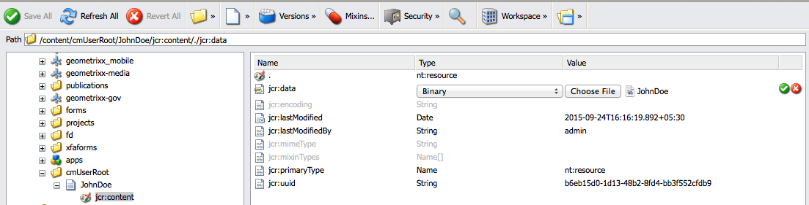

# 管理代理簽名映像{#manage-agent-signature-images}

## 概覽 {#overview}

在「對應管理」中，您可以使用影像以字母形式呈現代理簽名。 設定代理簽名映像後，在建立信件時，可以將信件中的代理簽名映像作為發送者代理的簽名呈現。

agentSignatureImage DDE是表示代理簽名映像的計算DDE。 此計算DDE的表達式使用「表達式管理器」構建塊公開的新自定義函式。 此自訂函式將agentID和agentFolder作為輸入參數，並根據這些參數讀取影像內容。 SystemContext系統資料字典為「通信管理」中的字母提供了對當前系統上下文中資訊的訪問。 系統上下文包括有關當前登錄用戶和活動配置參數的資訊。

您可以在cmuserroot資料夾下新增影像。 在[Corresponce Management Configuration Properties](/help/forms/using/cm-configuration-properties.md)中，使用CM User Root屬性可以更改從中獲取代理簽名映像的資料夾。

agentFolder DDE的值取自「對應管理」配置屬性的CMUserRoot配置參數。 預設情況下，此配置參數指向CRX儲存庫中的/content/cmUserRoot。 您可以在配置屬性中更改CMUserRoot配置的值。
您也可以覆寫預設自訂函式，以定義您自己用來擷取使用者簽名影像的邏輯。

## 添加代理簽名映像{#adding-agent-signature-image}

1. 請確定代理簽名影像與使用者的AEM使用者名稱相同。 （影像檔案名稱不需要副檔名。）
1. 在CRX中，在內容資料夾中建立名為`cmUserRoot`的資料夾。

   1. 前往 `https://'[server]:[port]'/crx/de`. 如有必要，請以管理員身份登錄。

   1. 按一下右鍵&#x200B;**content**&#x200B;資料夾，然後選擇&#x200B;**建立** > **建立資料夾**。

      

   1. 在「建立資料夾」對話框中，輸入資料夾的名稱為`cmUserRoot`。 按一下&#x200B;**保存全部**。

      >[!NOTE]
      >
      >cmUserRoot是AEM尋找代理簽名影像的預設位置。 但是，您可以通過編輯[Corresponce Management配置屬性](/help/forms/using/cm-configuration-properties.md)中的CM User Root屬性來更改它。

1. 在「內容檔案總管」中，導覽至cmUserRoot資料夾，並在其中新增代理簽名影像。

   1. 前往 `https://'[server]:[port]'/crx/explorer/index.jsp`. 視需要以管理員身分登入。
   1. 按一下「**內容瀏覽器**」。 「內容總管」會在新視窗中開啟。
   1. 在「內容檔案總管」中，導覽至cmUserRoot資料夾並選取它。 按一下右鍵&#x200B;**cmUserRoot**&#x200B;資料夾，然後選擇&#x200B;**New Node**。

      

      在新節點的行中輸入以下條目，然後按一下綠色複選標籤。

      **名稱：** JohnDoe（或您的代理簽名檔案的名稱）

      **類型：** nt:file

      在`cmUserRoot`資料夾下，將建立一個名為`JohnDoe`的新資料夾（或您在上一步驟中指定的名稱）。

   1. 按一下您建立的新資料夾（此處`JohnDoe`）。 「內容檔案總管」會將資料夾的內容顯示為暗灰色。

   1. 連按兩下&#x200B;**jcr:content**&#x200B;屬性，將其類型設為&#x200B;**nt:resource**，然後按一下綠色核取標籤以儲存項目。

      如果屬性不存在，請先建立名為jcr:content的屬性。

      

      jcr:content的子屬性中包括jcr:data，此為暗灰色。 連按兩下jcr:data。 屬性變為可編輯狀態，「選擇檔案」按鈕將顯示在條目中。 按一下「**選擇檔案**」，然後選擇要用作徽標的影像檔案。 影像檔不需要副檔名。

      
   按一下&#x200B;**保存全部**。

1. 請確定您在字母中使用的XDP\layout在左下方有影像欄位（或您要呈現簽名的版面中其他適當位置），以呈現簽名影像。
1. 建立對應時，在「資料」索引標籤中，使用下列步驟為簽名影像選取影像欄位：

   1. 從右窗格的「連結類型」彈出菜單中選擇「系統」。

   1. 從SystemContext DD的「資料元素」面板的清單中選取agentSignatureImage DDE。

   1. 保存信。

1. 在轉譯字母時，您可以根據版面在影像欄位的字母預覽中看到您的簽名。

   

