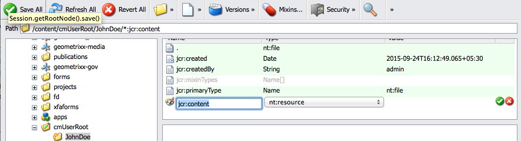

# 管理代理程式簽名影像{#manage-agent-signature-images}

## 概觀 {#overview}

在「通訊管理」中，您可以使用影像來呈現信函中的代理程式簽名。 設定代理程式簽名影像之後，在建立信函時，您可以在信函中轉譯代理程式簽名影像，作為寄件者代理程式的簽名。

agentSignatureImage DDE是代表代理程式簽名影像的計算DDE。 此計算DDE的運算式使用由Expression Manager建置區塊公開的新自訂函式。 此自訂函式會將agentID和agentFolder當作輸入引數，並根據這些引數擷取影像內容。 SystemContext系統資料字典可讓「通訊管理」中的信件存取目前系統內容中的資訊。 系統前後關聯包含目前登入使用者與作用中組態引數的相關資訊。

您可以在cmuserroot資料夾下新增影像。 在[通訊管理組態屬性](/help/forms/using/cm-configuration-properties.md)中，使用CM使用者根屬性，您可以變更代理程式簽章影像擷取的資料夾。

agentFolder DDE的值是從Correspondence Management組態屬性的CMUserRoot組態引數取得。 依預設，此設定引數指向CRX存放庫中的/content/cmUserRoot。 您可以在組態屬性中變更CMUserRoot組態的值。
您也可以覆寫預設自訂函式，以定義您自己的邏輯來擷取使用者簽名影像。

## 正在新增代理程式簽章影像 {#adding-agent-signature-image}

1. 確定代理程式簽章影像與使用者的AEM使用者名稱同名。 （影像檔案名稱不需要副檔名。）
1. 在CRX中，在內容資料夾中建立名為`cmUserRoot`的資料夾。

   1. 移至`https://'[server]:[port]'/crx/de`。 如有必要，請以管理員身分登入。

   1. 用滑鼠右鍵按一下&#x200B;**內容**&#x200B;資料夾，然後選取&#x200B;**建立** > **建立資料夾**。

      

   1. 在[建立資料夾]對話方塊中，輸入資料夾名稱作為`cmUserRoot`。 按一下&#x200B;**「儲存全部」**。

      >[!NOTE]
      >
      >cmUserRoot是AEM尋找代理程式簽章影像的預設位置。 不過，您可以編輯[通訊管理設定屬性](/help/forms/using/cm-configuration-properties.md)中的CM使用者根目錄屬性來變更它。

1. 在內容總管中，導覽至cmUserRoot資料夾，並在其中新增代理程式簽章影像。

   1. 移至`https://'[server]:[port]'/crx/explorer/index.jsp`。 如有需要，請以管理員身分登入。
   1. 按一下&#x200B;**內容總管**。 內容總管會在新視窗中開啟。
   1. 在內容總管中，瀏覽至cmUserRoot資料夾並加以選取。 用滑鼠右鍵按一下&#x200B;**cmUserRoot**&#x200B;資料夾，然後選取&#x200B;**新增節點**。

      在cmUserRoot中新增節點

      在新節點的資料列中建立下列專案，然後按一下綠色核取記號。

      **名稱：** JohnDoe （或您的代理程式簽章檔名稱）

      **型別：** nt：file

      在「`cmUserRoot`」資料夾下，會建立名為「`JohnDoe`」的新資料夾（或您在上一步中提供的名稱）。

   1. 按一下您已建立的新資料夾（此處`JohnDoe`）。 「內容總管」會以灰色顯示資料夾的內容。

   1. 連按兩下&#x200B;**jcr：content**&#x200B;屬性，將其型別設定為&#x200B;**nt：resource**，然後按一下綠色核取記號以儲存專案。

      如果屬性不存在，請先建立名為jcr：content的屬性。

      

      jcr：content的子屬性中包括jcr：data，其為暗灰色。 按兩下jcr：data。 屬性會變成可編輯的，而「選擇檔案」按鈕會出現在專案中。 按一下&#x200B;**選擇檔案**，然後選取您要做為標誌的影像檔。 影像檔案不需要副檔名。

      

   按一下&#x200B;**「儲存全部」**。

1. 請確定您在信函中使用的XDP\layout在左下方（或配置中您要呈現簽名的其他適當位置）有一個影像欄位，以呈現簽名影像。
1. 建立通訊時，在「資料」標籤中，使用以下步驟為簽名影像選取影像欄位：

   1. 從右窗格的「連結型別」彈出式選單中選取「系統」。

   1. 從SystemContext DD的「資料元素」面板的清單中選取agentSignatureImage DDE。

   1. 儲存字母。

1. 轉譯信函時，您可以在信函預覽中看到您根據版面配置在影像欄位中簽名。

   信函中的
