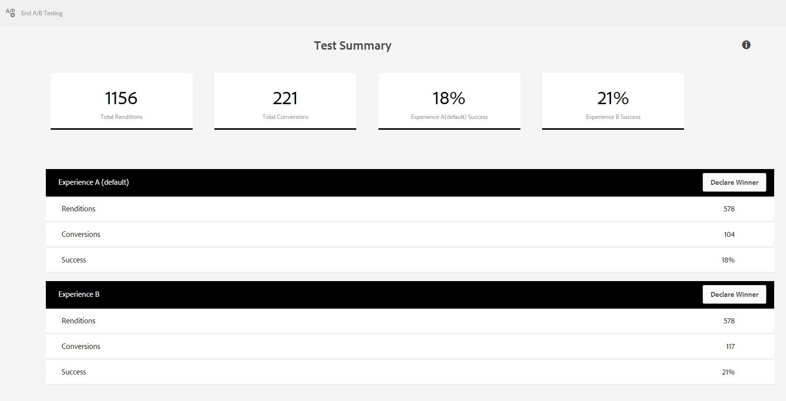

# 評估並改善表單的效能與轉換{#measure-and-improve-effectiveness-and-conversion-of-forms}

## 挑戰 {#the-challenge-br}

企業組織正日益增強其能力，並鼓勵客戶使用跨多個通道的數位自助服務進行交易。 然而，如果沒有一對一的回饋機制，評估成功程度並嘗試數位表單以增強客戶體驗並提升轉化率就變得十分困難。

為獲得最大的投資報酬率，企業組織必須監控客戶與服務的互動方式，並嘗試數位工件（表格）以增強客戶體驗。 若要衡量成功並定義改進策略，組織需要回答以下問題：

* 有多少客戶嘗試存取或處理我的表格？
* 有多少人成功完成交易？
* 有多少人放棄了表格？
* 客戶面臨問題的問題領域有哪些？
* 我要引入哪些變更，以及如何測試什麼會導致更好的轉換？

## 解決方案 {#the-solution}

AEM Forms已與 [Adobe Marketing Cloud](https://www.adobe.com/marketing-cloud.html) ( [Adobe Analytics](https://www.adobe.com/marketing-cloud/web-analytics.html) 和 [Adobe Target](https://www.adobe.com/marketing-cloud/testing-targeting.html) )解決方案整合，可協助您監控和分析表單的執行狀況，並讓您實驗和識別可提升轉換率的體驗。

## 工作流程 {#the-workflow}

讓我們詳細瞭解如何評估表單的效能並改善轉換率。

### Target audience {#target-audience}

* 負責行銷策略與成功的商業使用者和分析師
* 負責基礎架構和解決方案設定和維護的IT人員

### AEM Forms元件和相關功能 {#aem-forms-components-and-features-involved}

* 最適化表單
* 與Adobe Analytics整合，以收集、組織和報告客戶與您最適化表單的互動
* 與Adobe Target整合，以執行最適化表單的A/B測試

### 假設 {#assumptions}

* 您已擁有Adobe Marketing cloud帳戶，並已註冊Analytics和Target解決方案。
* 您有已發佈的調適性表單，客戶可以存取。

### 工作流程步驟 {#workflow-steps}

#### 步驟1:在AEM Forms中設定Analytics和Target {#step-configure-analytics-and-target-in-aem-forms-br}

**設定 Analytics**

若要深入洞察客戶與表單的互動，您必須先在AEM Forms中設定Analytics。 執行以下步驟：

1. 在Adobe Analytics中建立報表套裝
1. 在AEM中建立雲端服務設定
1. 在AEM中建立雲端服務架構
1. 在AEM中設定AEM Forms Analytics設定服務
1. 在AEM中啟用表單分析

如需詳細步驟，請參 [閱設定最適化表單的分析和報表](../../forms/using/configure-analytics-forms-documents.md)。

**設定目標**

若要針對您的最適化表單建立和執行A/B測試，請依「在AEM表單中設定和整合Target」中的說 [明，在AEM表單中設定Target](../../forms/using/ab-testing-adaptive-forms.md#p-set-up-and-integrate-target-in-aem-forms-p)。

#### 步驟2:檢視分析報表 {#step-view-analytics-report-br}

當您的客戶存取並與啟用Analytics的表單互動時，其互動會擷取到高度安全的Analytics資料庫。 資料庫由客戶機分段，並可通過安全連接訪問。

您可以從AEM中檢視啟用分析的表單並分析資料的報表。 要查看報表，請執行以下操作：

1. 在AEM伺服器上，導覽至「表 **單>表單與檔案」**。
1. 選取您要分析報表的表單。
1. 按一下「分析報表」圖示。 報表隨即顯示。

讓我們來看看Analytics收集的資料點，並報告表單。

**表單分析報表**

最適化表單的分析報表會在表單層級擷取下列關鍵績效指標(KPI):

* **平均填寫時間**:填寫表單的平均時間
* **印象**:表單出現在搜尋結果中的次數

* **轉譯**:表單已轉譯或開啟的次數
* **草稿**:表單已儲存為草稿的次數

* **提交**:提交表單的次數
* **中止**:使用者未填妥表單而離開的次數
* **瀏覽／提交**:每次提交的瀏覽次數比例

此外，您也可以取得表單中每個面板的下列詳細資訊：

* **時間**:面板及其欄位的平均逗留時間（秒）

* **錯誤**:每1000個表單轉譯在面板及其欄位上遇到的錯誤數

* **說明**:使用者依1000個表單轉譯存取面板及其欄位的上下文說明次數

如需表單分析報表的詳細資訊，請參閱「 [檢視和瞭解AEM表單分析報表」](../../forms/using/view-understand-aem-forms-analytics-reports.md)。

>[!NOTE]
>
>您可以從Adobe Marketing cloud的Analytics帳戶檢視詳細報表，並深入瞭解客戶及其與表單的互動。

#### 步驟3:分析資料點 {#step-analyze-data-points}

在此步驟中，您將分析分析報表中的資料點，並推斷表單的執行方式。 如果它不符合您的成功KPI，您將根據資料建構假設，並尋找可能的解決方案來修正問題。 例如：

* 如果表單的平均填寫時間高於預期，則您的表單可能會複雜，讓客戶瞭解、表單不使用標準術語、表單太長等。 在這種情況下，您可能想要簡化表單結構和欄位、重新製作表單設計、縮短表單長度，或新增非標準表單欄位的說明說明和範例。
* 如果資料指出大部分客戶都在存取表單面板的說明，顯然客戶對填入哪些資訊感到困惑。 您可能想要使用替代術語，或為該面板添加一些輸入和幫助說明示例。
* 如果表單的中止或放棄率高於預期，可能是因為表單的轉譯時間過長、客戶不慎登入表單，或是過於複雜。 在這種情況下，您可能想要最佳化出現在搜尋結果中的表單說明、簡化表單、最佳化表單以加快載入速度等。

分析這些資料點並達成假設後，請在表單中進行必要的變更。

#### 步驟4:驗證您的分析和修正 {#step-validate-your-analysis-and-fixes}

在此步驟中，您將驗證您在表單中所做的變更，並驗證其是否影響轉換率。

**執行A/B測試**

AEM Forms與Target的整合可讓您建立最適化表單的A/B測試。 在A/B測試中，您會即時隨機向客戶呈現不同的表單體驗，以瞭解哪些體驗更有效或促成更多轉換。 一旦您擁有大量資料，指出其中一種體驗比另一種體驗提供更佳的轉換，您就可以宣告該體驗為成功者，而且未來，它會成為所有客戶都能看到的預設體驗。

如需建立最適化表單A/B測試的詳細資訊，請參 [閱最適化表單的A/B測試](../../forms/using/ab-testing-adaptive-forms.md)。

## Best practices {#best-practices}

真正的最佳實務是您在執行此工作流程時識別自己的最佳實務。 它們是您的環境和需求所獨有的。 透過工作流程擷取您的學習內容，並將之記錄為最佳實務。

有關設計表單和執行A/B測試的一些建議如下：

**表單設計**

* 保持表單簡單、簡短且易於導覽。 使用導覽方向提示。
* 使用表格欄位的標準或常用術語。
* 使用範例或說明來說明欄位和必要的輸入，讓使用者混淆。
* 盡可能在使用者輸入時驗證輸入，以避免在提交表單時出錯。
* 針對桌上型電腦和行動裝置最佳化版面。
* 自動填入已知使用者的資訊。

**A/B測試**

* 在執行A/B測試前，先建構假設並識別成功度量。
* 在替代體驗中做出最小的變化（最好是一次變化一次），以瞭解影響轉換率的因素。
* 經常測試以消除低效率。

