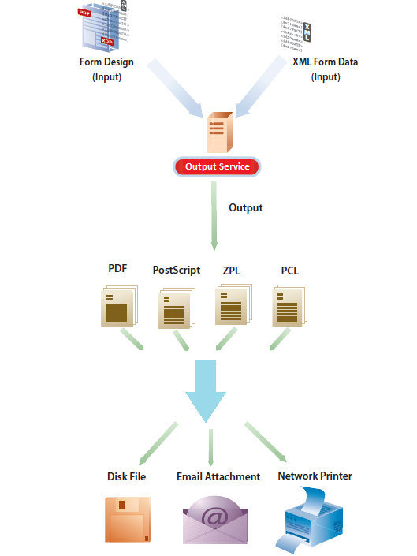

# 輸出服務{#output-service}

## 概覽 {#overview}

輸出服務是AEM檔案服務的一部分的OSGi服務。 輸出服務支援AEM Forms Designer的各種輸出格式和輸出設計功能。 輸出服務可轉換XFA範本和XML資料，以產生各種格式的列印檔案。

輸出服務可讓您建立應用程式，讓您：

* 使用XML資料填入範本檔案，以產生最終表單檔案。
* 以多種格式產生輸出表單，包括非互動式PDF、PostScript、PCL和ZPL列印串流。
* 從XFA表單PDF產生列印PDF。
* 將多組資料與隨附的範本合併，以大量產生PDF、PostScript、PCL和ZPL檔案。

>[!NOTE]
>
>輸出服務是32位元應用程式。 在Microsoft windows上，32位元應用程式最多可使用2 GB的記憶體。 此限制也適用於輸出服務。

## 建立非互動式表單檔案 {#creating-non-interactive-form-documents}

通常，您會使用AEM Forms Designer建立範本。 Output服 `generatePDFOutput` 務的 `generatePrintedOutput` 和API可讓您將這些範本直接轉換為各種格式，包括PDF、PostScript、ZPL和PCL。

操 `generatePDFOutput` 作生成PDF，而操 `generatePrintedOutput` 作生成PostScript、ZPL和PCL格式。 這兩個操作的第一個參數接受模板檔案的名稱(例如 `ExpenseClaim.xdp`)或包含模板的Document對象。 當您指定範本檔案的名稱時，也請指定內容根目錄作為包含範本之資料夾的路徑。 您可以使用或參數指定 `PDFOutputOptions` 內容根 `PrintedOutputOptions` 目錄。 有關可以使用這些參數指定的其他選項的詳細資訊，請參見Javadoc。

第二個參數接受與模板合併的XML文檔，同時生成輸出文檔。

操 `generatePDFOutput` 作也可以接受以XFA為基礎的PDF表單作為輸入，並傳回非互動式版本的PDF表單作為輸出。

## 產生非互動式表單檔案 {#generating-non-interactive-form-documents}

請考慮一種情況：您擁有一或多個範本，以及每個範本的多個XML資料記錄。

使用輸 `generatePDFOutputBatch` 出服 `generatePrintedOutputBatch` 務的和操作為每個記錄生成打印文檔。

您也可以將記錄合併為單一檔案。 這兩個操作都採用四個參數。

第一個參數是Map，其中包含任意字串作為鍵，模板檔案的名稱作為值。

第二個參數是不同的Map，其值是包含XML資料的Document物件。 鍵與您為第一個參數指定的鍵相同。

或的第三個參 `generatePDFOutputBatch` 數 `generatePrintedOutputBatch` 分別為 `PDFOutputOptions` 或類型 `PrintedOutputOptions` 。

參數類型與和操作的參數類型相 `generatePDFOutput` 同， `generatePrintedOutput` 且具有相同的效果。

第四個參數為類型， `BatchOptions`您可用來指定是否為每個記錄產生個別檔案。 此參數的預設值為false。

同時 `generatePrintedOutputBatch` 返 `generatePDFOutputBatch` 回類型值 `BatchResult`。 值包含生成的文檔清單。 它還包含XML格式的元資料文檔，其中包含與生成的每個文檔相關的資訊。
