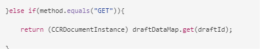

# 使用代理UI準備和發送交互通信 {#prepare-and-send-interactive-communication-using-the-agent-ui}

代理UI允許代理準備交互通信並將其發送到後處理。 代理根據允許的情況進行所需的修改，並將互動式通信提交到後續進程，如電子郵件或打印。

## 概觀 {#overview}

建立互動式通信後，代理可以在代理UI中開啟互動式通信，並通過輸入資料和管理內容和附件來準備特定於收件人的副本。 最後，代理可以將互動式通信提交到後處理。

在使用代理UI準備交互通信時，代理在將交互通信提交到後續進程之前，在代理UI中管理交互通信的以下方面：

* **資料**:代理UI的「資料」頁籤顯示交互通信中任何代理可編輯的變數和未鎖定表單資料模型屬性。 這些變數/屬性是在編輯或建立包含在交互通信中的文檔片段時建立的。 「資料」頁籤還包括XDP/打印通道模板中生成的任何欄位。 只有在交互通信中存在代理可編輯的任何變數、表單資料模型屬性或欄位時，才會顯示「資料」頁籤。
* **內容**:在「內容」頁籤中，代理管理交互通信中的內容，如文檔片段和內容變數。 在這些文檔片段的屬性中建立互動式通信時，代理可以根據允許的方式對文檔片段進行更改。 如果允許，代理還可以重新排序、添加/刪除文檔片段和添加分頁符。
* **附件**:僅當交互通信具有任何附件或代理具有庫訪問權限時，「附件」頁籤才會出現在代理用戶介面中。 座席可以更改或編輯附件，也可以不允許。

## 使用代理UI準備互動式通信 {#prepare-interactive-communication-using-the-agent-ui}

1. 選擇 **[!UICONTROL Forms]** > **[!UICONTROL Forms和文檔]**。
1. 選擇適當的互動式通信並點擊 **[!UICONTROL 開啟代理UI]**。

   >[!NOTE]
   >
   >代理UI僅在選定的交互通信具有打印通道時才工作。

   

   根據交互通信的內容和屬性，將顯示代理UI，其中包含以下三個頁籤：資料、內容和附件。

   

   繼續輸入資料、管理內容和管理附件。

### 輸入資料 {#enter-data}

1. 在「資料」頁籤中，根據需要輸入變數的資料、表單資料模型屬性和打印模板(XDP)欄位。 填寫所有標有星號(&amp;ast;)的強制欄位，以啟用 **提交** 按鈕

   在「互動式通信」預覽中按一下資料欄位值，在「資料」頁籤中突出顯示相應的資料欄位，反之亦然。

### 管理內容 {#manage-content}

在「內容」頁籤中，管理交互通信中的內容，如文檔片段和內容變數。

1. 選擇 **[!UICONTROL 內容]**。 此時將顯示「交互通信」的內容頁籤。

   

1. 根據需要在「內容」頁籤中編輯文檔片段。 要將焦點集中到內容層次結構中的相關片段，您可以點擊交互通信預覽中的相關行或段落，或直接點擊內容層次結構中的片段。

   例如，單據片段，其行為是「立即線上付款……「 」是在下面圖形的預覽中選擇的，而「內容」頁籤中選擇了同一文檔片段。

   

   在「內容」或「資料」頁籤中，按一下「在內容中突出顯示選定模組」( )，當在預覽中點擊/選擇相關文本、段落或資料欄位時，可以禁用或啟用功能以轉到文檔片段。

   建立交互通信時允許代理編輯的片段具有編輯選定內容( )。 按一下「編輯選定內容」表徵圖以在編輯模式下啟動片段，並在其中進行更改。 使用以下選項設定文本格式和管理文本：

   * [格式設定選項](#formattingtext)

      * [從其他應用程式複製貼上格式化文本](#pasteformattedtext)
      * [突出顯示文本的部分](#highlightemphasize)
   * [特殊字元](#specialcharacters)
   * [鍵盤快速鍵](/help/forms/using/keyboard-shortcuts.md)

   有關代理用戶介面中各種文檔片段可用的操作的詳細資訊，請參見 [代理用戶介面中可用的操作和資訊](#actionsagentui)。

1. 要將分頁符添加到互動式通信的打印輸出，請將游標置於要插入分頁符的位置，然後選擇「分頁前」或「分頁後」( )。

   在交互通信中插入顯式分頁符佔位符。 要查看顯式分頁符對交互通信的影響，請參閱打印預覽。

   

   繼續管理互動式通信的附件。

### 管理附件 {#manage-attachments}

1. 選擇 **[!UICONTROL 附件]**。 代理UI在建立交互通信時按設定顯示可用附件。

   通過點擊視圖表徵圖，您可以選擇不提交附件以及互動式通信，也可以點擊附件中的交叉點從互動式通信中刪除附件（如果允許代理刪除或隱藏附件）。 對於在建立交互通信時指定為必需的附件，「查看」和「刪除」表徵圖將被禁用。

   

1. 點擊庫訪問( )表徵圖以訪問內容庫，將DAM資產作為附件插入。

   >[!NOTE]
   >
   >僅當在建立交互通信時啟用了庫訪問時（在打印通道的「文檔容器」屬性中），「庫訪問」表徵圖才可用。

1. 如果在建立交互通信時未鎖定附件的順序，則可以通過選擇附件並點擊向下和向上箭頭來重新排序附件。
1. 使用「Web預覽」和「打印預覽」查看這兩個輸出是否符合您的要求。

   如果您發現預覽令人滿意，請點擊 **[!UICONTROL 提交]** 提交/發送互動式通信到後續進程。 或者要進行更改，請退出預覽以返回到進行更改。

## 設定文本格式 {#formattingtext}

在代理UI中編輯文本片段時，工具欄會根據您選擇進行的編輯類型而更改：字型、段落或清單：

 

字型工具欄


段落工具欄


清單工具欄

### 加亮/強調文本的部分 {#highlightemphasize}

要突出顯示可編輯片段中的部分文本，請選擇文本並點擊「突出顯示顏色」。


### 貼上格式化文本 {#pasteformattedtext}


### 在文本中插入特殊字元 {#specialcharacters}

代理UI內置了對210個特殊字元的支援。 管理員可以 [通過自定義添加對更多/自定義特殊字元的支援](/help/forms/using/custom-special-characters.md)。

#### 附件遞送 {#attachmentdelivery}

* 當使用伺服器端API作為互動式或非互動式PDF來呈現互動式通信時，呈現的PDF將附件作為PDF附件包含。
* 當將與互動式通信關聯的後期進程作為使用代理用戶介面提交的一部分載入時，附件將作為清單傳遞&lt;com.adobe.idp.document> inAttachmentDocs參數。
* 傳遞機制工作流（如電子郵件和打印）還傳遞附件以及交互通信的PDF版本。

## 代理用戶介面中可用的操作和資訊 {#actionsagentui}

### 文檔片段 {#document-fragments}


* **上/下箭頭**:在交互通信中向上或向下移動文檔片段的箭頭。
* **刪除**:如果允許，請從交互通信中刪除文檔片段。
* **分頁符之前** （適用於目標區域的子片段）:在文檔片段前插入分頁符。
* **縮進**:增加或減少文檔片段的縮進。
* **後分頁** （適用於目標區域的子片段）:在文檔片段後插入分頁符。


* 編輯（僅文本片段）:開啟富格文本編輯器以編輯文本文檔片段。 有關詳細資訊，請參見 [設定文本格式](#formattingtext)。

* 選擇（眼睛表徵圖）:包括\排除交互通信中的文檔片段。
* 未填充值（資訊）:指示文檔片段中未填充的變數的數量。

### 列出文檔片段 {#list-document-fragments}


* 插入空行：插入新的空行。
* 選擇（眼睛表徵圖）:包括\排除交互通信中的文檔片段。
* 跳過項目符號/編號：啟用以跳過清單文檔片段中的項目符號/編號。
* 未填充值（資訊）:指示文檔片段中未填充的變數的數量。

## 將互動式通信另存為草稿 {#save-as-draft}

您可以使用代理UI為每個互動式通信保存一個或多個草稿，稍後檢索草稿以繼續處理。 可以為每個繪製指定不同的名稱以標識它。

Adobe建議按順序執行這些指令，以成功將交互通信另存為草稿。

### 啟用「另存為拔模」特徵 {#before-save-as-draft}

預設情況下，「另存為拔模」(Save as a Draft)特徵未啟用。 執行以下步驟以啟用該功能：

1. 實施 [ccrDocumentInstance](https://helpx.adobe.com/experience-manager/6-5/forms/javadocs/com/adobe/fd/ccm/ccr/ccrDocumentInstance/api/services/CCRDocumentInstanceService.html) 服務提供商介面(SPI)。

   SPI允許您將互動式通信的草稿版本以草稿ID作為唯一標識符保存到資料庫。 這些說明假定您事先知道如何使用Maven項目構建OSGi捆綁包。

   有關SPI實現示例，請參見 [示例ccrDocumentInstance SPI實現](#sample-ccrDocumentInstance-spi)。
1. 開啟 `http://<hostname>:<port>/ system/console/bundles` 點擊 **[!UICONTROL 安裝/更新]** 上傳OSGi捆綁包。 驗證上載的包的狀態是否顯示為 **活動**。 如果包的狀態未顯示為，請重新啟動伺服器 **活動**。
1. 前往 `https://'[server]:[port]'/system/console/configMgr`.
1. 點擊 **[!UICONTROL 建立對應配置]**。
1. 選擇 **[!UICONTROL 使用CCRDocumentInstanceService啟用保存]** 點擊 **[!UICONTROL 保存]**。

### 將互動式通信另存為草稿 {#save-as-draft-agent-ui}

執行以下步驟將互動式通信另存為草稿：

1. 在「Forms管理器」中選擇互動式通信，然後點擊 **[!UICONTROL 開啟代理UI]**。

1. 在代理UI中進行適當更改，然後點擊 **[!UICONTROL 另存為草稿]**。

1. 在 **[!UICONTROL 名稱]** 欄位和攻擊 **[!UICONTROL 完成]**。

將互動式通信另存為草稿後，點擊 **[!UICONTROL 保存更改]** 以保存對草稿的任何更改。

### 檢索互動式通信的草稿 {#retrieve-draft}

將互動式通信保存為草稿後，可以檢索它以繼續處理它。 使用以下方式檢索交互通信：

`https://server:port/aem/forms/createcorrespondence.hmtl?draftid=[draftid]`

[臭氣] 引用在將互動式通信另存為草稿後生成的草稿版本的唯一標識符。

### 示例ccrDocumentInstance SPI實現 {#sample-ccrDocumentInstance-spi}

實施 `ccrDocumentInstance` SPI將交互通信另存為草稿。 以下是 `ccrDocumentInstance` SPI。

```javascript
package Implementation;

import com.adobe.fd.ccm.ccr.ccrDocumentInstance.api.exception.CCRDocumentException;
import com.adobe.fd.ccm.ccr.ccrDocumentInstance.api.model.CCRDocumentInstance;
import com.adobe.fd.ccm.ccr.ccrDocumentInstance.api.services.CCRDocumentInstanceService;
import org.apache.commons.lang3.StringUtils;
import org.osgi.service.component.annotations.Component;
import org.slf4j.Logger;
import org.slf4j.LoggerFactory;

import java.util.*;


@Component(service = CCRDocumentInstanceService.class, immediate = true)
public class CCRDraftService implements CCRDocumentInstanceService {

    private static final Logger logger = LoggerFactory.getLogger(CCRDraftService.class);

    private HashMap<String, Object> draftDataMap = new HashMap<>();

    @Override
    public String save(CCRDocumentInstance ccrDocumentInstance) throws CCRDocumentException {
        String documentInstanceName = ccrDocumentInstance.getName();
        if (StringUtils.isNotEmpty(documentInstanceName)) {
            logger.info("Saving ccrData with name : {}", ccrDocumentInstance.getName());
            if (!CCRDocumentInstance.Status.SUBMIT.equals(ccrDocumentInstance.getStatus())) {
                ccrDocumentInstance = mySQLDataBaseServiceCRUD(ccrDocumentInstance,null, "SAVE");
            }
        } else {
            logger.error("Could not save data as draft name is empty");
        }
        return ccrDocumentInstance.getId();
    }

    @Override
    public void update(CCRDocumentInstance ccrDocumentInstance) throws CCRDocumentException {
        String documentInstanceName = ccrDocumentInstance.getName();
        if (StringUtils.isNotEmpty(documentInstanceName)) {
            logger.info("Saving ccrData with name : {}", documentInstanceName);
            mySQLDataBaseServiceCRUD(ccrDocumentInstance, ccrDocumentInstance.getId(), "UPDATE");
        } else {
            logger.error("Could not save data as draft Name is empty");
        }
    }

    @Override
    public CCRDocumentInstance get(String id) throws CCRDocumentException {
        CCRDocumentInstance cCRDocumentInstance;
        if (StringUtils.isEmpty(id)) {
            logger.error("Could not retrieve data as draftId is empty");
            cCRDocumentInstance = null;
        } else {
            cCRDocumentInstance = mySQLDataBaseServiceCRUD(null, id,"GET");
        }
        return cCRDocumentInstance;
    }

    @Override
    public List<CCRDocumentInstance> getAll(String userId, Date creationTime, Date updateTime,
                                            Map<String, Object> optionsParams) throws CCRDocumentException {
        List<CCRDocumentInstance> ccrDocumentInstancesList = new ArrayList<>();

        HashMap<String, Object> allSavedDraft = mySQLGetALLData();
        for (String key : allSavedDraft.keySet()) {
            ccrDocumentInstancesList.add((CCRDocumentInstance) allSavedDraft.get(key));
        }
        return ccrDocumentInstancesList;
    }

    //The APIs call the service in the database using the following section.
    private CCRDocumentInstance mySQLDataBaseServiceCRUD(CCRDocumentInstance ccrDocumentInstance,String draftId, String method){
        if(method.equals("SAVE")){

            String autoGenerateId = draftDataMap.size() + 1 +"";
            ccrDocumentInstance.setId(autoGenerateId);
            draftDataMap.put(autoGenerateId, ccrDocumentInstance);
            return ccrDocumentInstance;

        }else if (method.equals("UPDATE")){

            draftDataMap.put(ccrDocumentInstance.getId(), ccrDocumentInstance);
            return ccrDocumentInstance;

        }else if(method.equals("GET")){

            return (CCRDocumentInstance) draftDataMap.get(draftId);

        }
        return null;
    }

    private HashMap<String, Object> mySQLGetALLData(){
        return draftDataMap;
    }
}
```

的 `save`。 `update`。 `get`, `getAll` 操作調用資料庫服務以將互動式通信另存為草稿、更新互動式通信、從資料庫中檢索資料以及檢索資料庫中所有可用互動式通信的資料。 此示例使用 `mySQLDataBaseServiceCRUD` 資料庫服務的名稱。

下表說明了示例 `ccrDocumentInstance` SPI實現。 它展示了 `save`。 `update`。 `get`, `getAll` 操作調用示例實現中的資料庫服務。

<table> 
 <tbody>
 <tr>
  <td><p><strong>操作</strong></p></td>
  <td><p><strong>資料庫服務示例</strong></p></td> 
   </tr>
  <tr>
   <td><p>您可以為互動式通信建立草稿或直接提交。 保存操作的API將檢查交互通信是否作為草稿提交，並且它包含草稿名稱。 然後，API使用Save作為輸入方法調用mySQLDataBaseServiceCRUD服務。</p></br></br>[#$sd1_sf1_dp9]</td>
   <td><p>mySQLDataBaseServiceCRUD服務驗證Save為輸入方法，並生成自動生成的草稿ID並將其返AEM回。 生成草稿ID的邏輯可能因資料庫而異。</p></br></br>[#$sd1_sf1_dp13]</td>
   </tr>
  <tr>
   <td><p>更新操作的API將檢索互動式通信草稿的狀態，並檢查互動式通信是否包含草稿名稱。 API調用mySQLDataBaseServiceCRUD服務以更新資料庫中的該狀態。</p></br></br>[#$sd1_sf1_dp17]</td>
   <td><p>mySQLDataBaseServiceCRUD服務將Update驗證為輸入方法，並將Interactive Communication草案的狀態保存在資料庫中。</br></p></td>
   </tr>
   <tr>
   <td><p>獲取操作的API將檢查交互通信是否包含草稿ID。 然後，API調用mySQLDataBaseServiceCRUD服務，將Get作為輸入方法來檢索交互通信的資料。</br></p></td>
   <td><p>mySQLDataBaseServiceCRUD服務驗證Get為輸入方法，並基於草稿ID檢索交互通信的資料。</p></br></br>[#$sd1_sf1_dp29]</td>
   </tr>
   <tr>
   <td><p>getAll操作的API調用mySQLGetALLData服務，以檢索資料庫中保存的所有Interactive Communications的資料。</br></p></td>
   <td><p>mySQLGetALLData服務檢索資料庫中保存的所有Interactive Communications的資料。</p></br></br>[#$sd1_sf1_dp37]</td>
   </tr>
  </tbody>
</table>

以下是 `pom.xml` 作為實現一部分的檔案：

```xml
<?xml version="1.0" encoding="UTF-8"?>
<project xmlns="https://maven.apache.org/POM/4.0.0"
         xmlns:xsi="https://www.w3.org/2001/XMLSchema-instance"
         xsi:schemaLocation="https://maven.apache.org/POM/4.0.0 https://maven.apache.org/xsd/maven-4.0.0.xsd">
    <modelVersion>4.0.0</modelVersion>

    <groupId>com.adobe.livecycle</groupId>
    <artifactId>draft-sample</artifactId>
    <version>2.0.0-SNAPSHOT</version>

    <name>Interact</name>
    <packaging>bundle</packaging>

    <dependencies>
        <dependency>
            <groupId>com.adobe.aemfd</groupId>
            <artifactId>aemfd-client-sdk</artifactId>
            <version>6.0.160</version>
        </dependency>
    </dependencies>


    <!-- ====================================================================== -->
    <!-- B U I L D D E F I N I T I O N -->
    <!-- ====================================================================== -->
    <build>
        <plugins>
            <plugin>
                <groupId>org.apache.felix</groupId>
                <artifactId>maven-bundle-plugin</artifactId>
                <version>3.3.0</version>
                <extensions>true</extensions>
                <executions>
                    <!--Configure extra execution of 'manifest' in process-classes phase to make sure SCR metadata is generated before unit test runs-->
                    <execution>
                        <id>scr-metadata</id>
                        <goals>
                            <goal>manifest</goal>
                        </goals>
                    </execution>
                </executions>
                <configuration>
                    <exportScr>true</exportScr>
                    <instructions>
                        <!-- Enable processing of OSGI DS component annotations -->
                        <_dsannotations>*</_dsannotations>
                        <!-- Enable processing of OSGI metatype annotations -->
                        <_metatypeannotations>*</_metatypeannotations>
                        <Bundle-SymbolicName>${project.groupId}-${project.artifactId}</Bundle-SymbolicName>
                    </instructions>
                </configuration>
            </plugin>
            <plugin>
                <groupId>org.apache.maven.plugins</groupId>
                <artifactId>maven-surefire-plugin</artifactId>
            </plugin>
            <plugin>
                <groupId>org.apache.maven.plugins</groupId>
                <artifactId>maven-compiler-plugin</artifactId>
                <configuration>
                    <source>8</source>
                    <target>8</target>
                </configuration>
            </plugin>
        </plugins>
    </build>
    <profiles>
        <profile>
            <id>autoInstall</id>
            <build>
                <plugins>
                    <plugin>
                        <groupId>org.apache.sling</groupId>
                        <artifactId>maven-sling-plugin</artifactId>
                        <executions>
                            <execution>
                                <id>install-bundle</id>
                                <phase>install</phase>
                                <goals>
                                    <goal>install</goal>
                                </goals>
                            </execution>
                        </executions>
                    </plugin>
                </plugins>
            </build>
        </profile>
    </profiles>

</project>
```

>[!NOTE]
>
>確保更新 `aemfd-client-sdk` 對6.0.160的依賴 `pom.xml` 的子菜單。
