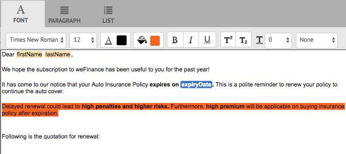

# 使用代理UI準備和傳送互動式通訊 {#prepare-and-send-interactive-communication-using-the-agent-ui}

代理UI允許代理準備併發送互動式通信到後置進程。 工程師會視需要進行修改，並將互動式通訊提交至後置程式，例如電子郵件或列印。

## 概覽 {#overview}

建立互動式通信後，代理可以在代理UI中開啟互動式通信，並通過輸入資料和管理內容和附件來準備特定於收件人的副本。 最後，代理可將互動式通訊提交至後置程式。

使用代理UI準備互動式通訊時，代理會先在代理UI中管理互動式通訊的下列方面，再將它送出至後置程式：

* **資料**:Agent UI的「資料」頁籤顯示「交互通信」中任何可代理編輯的變數和解鎖表單資料模型屬性。 這些變數／屬性是在編輯或建立包含在互動式通訊中的檔案片段時建立。 「資料」標籤也包含XDP/列印頻道範本中建立的任何欄位。 僅當代理可編輯「互動式通信」中的任何變數、表單資料模型屬性或欄位時，才會顯示「資料」頁籤。
* **內容**:在「內容」索引標籤中，代理管理「互動式通訊」中的檔案片段和內容變數等內容。 在這些文檔片段的屬性中建立交互通信時，代理可以按照允許的方式在文檔片段中進行更改。 如果允許，代理還可以重新排序、添加／刪除文檔片段和添加分頁符。
* **附件**:只有當Interactive Communication具有任何附件或Agent具有庫訪問權限時，「附件」頁籤才會出現在Agent UI。 工程師可以或不允許更改或編輯附件。

## 使用代理UI準備互動式通訊 {#prepare-interactive-communication-using-the-agent-ui}

1. 選擇「 **[!UICONTROL 表單]** 」>「 **[!UICONTROL 表單與檔案」]**。
1. 選擇適當的互動式通訊，並點選「 **[!UICONTROL Open Agent UI]**」。

   >[!NOTE]
   >
   >代理UI僅在選定的互動式通信具有打印通道時才起作用。

   

   根據Interactive Communication的內容和屬性，代理UI將顯示為以下三個頁籤：資料、內容和附件。

   

   繼續輸入資料、管理內容以及管理附件。

### 輸入資料 {#enter-data}

1. 在「資料」索引標籤中，視需要輸入變數、表單資料模型屬性和列印範本(XDP)欄位的資料。 填寫所有標有星號(&amp;ast;)的必填欄位，以啟用「提 **交** 」按鈕。

   在「互動式通訊」預覽中點選資料欄位值，以在「資料」索引標籤中反白顯示對應的資料欄位，反之亦然。

### 管理內容 {#manage-content}

在「內容」索引標籤中，管理「互動式通訊」中的檔案片段和內容變數等內容。

1. Select **[!UICONTROL Content]**. 此時將顯示「互動式通信」的內容頁籤。

   

1. 視需要在「內容」索引標籤中編輯檔案片段。 若要將焦點放在內容階層中的相關片段上，您可以在「互動式通訊」預覽中點選相關行或段落，或直接在「內容」階層中點選片段。

   例如，檔案片段的行為是「立即線上付款……」」在下圖的預覽中選取，而「內容」索引標籤中也選取了相同的檔案片段。

   

   在「內容」或「資料」索引標籤中，點選預覽左上角的「在內容中反白顯示選取的模組(反白顯示選取的模組incontentccr )」，可停用或啟用功能，以在預覽中點選／選取相關文字、段落或資料欄位時移至檔案片段。

   建立交互通信時允許代理編輯的片段具有「編輯選定內容」(iconedited selected content )表徵圖。 點選「編輯選取的內容」圖示，以編輯模式啟動片段並在其中進行變更。 使用下列選項來格式化和管理文字：

   * [格式選項](#formattingtext)

      * [從其他應用程式複製貼上格式的文字](#pasteformattedtext)
      * [反白顯示部分文字](#highlightemphasize)
   * [特殊字元](#specialcharacters)
   * [鍵盤快速鍵](/help/forms/using/keyboard-shortcuts.md)
   有關Agent用戶介面中各種文檔片段可用操作的詳細資訊，請參閱 [Agent用戶介面中的「操作」和「資訊」](#actionsagentui)。

1. 若要將分頁符新增至互動式通訊的列印輸出，請將游標置於您要插入分頁符的位置，然後選取「分頁符前面」或「分頁符後面」( )。

   在「互動式通訊」中插入明確的分頁符預留位置。 若要檢視明確的分頁符號如何影響互動式通訊，請參閱列印預覽。

   

   繼續管理互動式通訊的附件。

### 管理附件 {#manage-attachments}

1. 選擇 **[!UICONTROL 附件]**。 Agent UI顯示建立交互通信時設定的可用附件。

   您可以點選檢視圖示，選擇不隨附件一起提交「互動式通訊」，也可以點選附件中的交叉點以從「互動式通訊」中刪除附件（如果允許代理刪除或隱藏附件）。 對於在建立互動式通信時指定為必備附件的附件，將禁用「查看」和「刪除」表徵圖。

   

1. 點選「資料庫存取」( )圖示以存取「內容庫」，將DAM資產插入為附件。

   >[!NOTE]
   >
   >只有在建立互動式通訊時（在列印頻道的「檔案容器」屬性中）啟用資料庫存取時，才能使用「資料庫存取」圖示。

1. 如果在建立「交互通信」時未鎖定附件順序，則可以通過選擇附件並點選向下和向上箭頭來重新排序附件。
1. 使用「網頁預覽和列印預覽」，查看這兩個輸出是否符合您的需求。

   如果您發現預覽結果令人滿意，請點選「 **[!UICONTROL Submit]** 」（提交）以提交／傳送互動式通訊至貼文程式。 或者，若要進行變更，請退出預覽，返回進行變更。

## 格式化文字 {#formattingtext}

在代理UI中編輯文字片段時，工具列會依您選擇進行的編輯類型而變更：字型、段落或清單：

 

字型工具列

段落工具列

清單工具列

### 反白顯示／強調部分文字 {#highlightemphasize}

若要反白\強調可編輯片段中的部分文字，請選取文字並點選「反白顯示顏色」。

### 貼上格式化文字 {#pasteformattedtext}

### 在文字中插入特殊字元 {#specialcharacters}

Agent UI已內建支援210個特殊字元。 管理員可 [以透過自訂新增更多／自訂特殊字元的支援](/help/forms/using/custom-special-characters.md)。

#### 附件遞送 {#attachmentdelivery}

* 當使用伺服器端API將互動式通訊轉譯為互動式或非互動式PDF時，轉譯的PDF會將附件包含為PDF附件。
* 當與互動式通訊相關聯的貼文程式載入為使用代理程式UI提交的一部分時，附件會以List&lt;com.adobe.idp.Document> inAttachmentDocs參數的形式傳遞。
* 傳送機制工作流程（例如電子郵件和列印）也會傳送附件以及互動式通訊的PDF版本。

## 代理用戶介面中可用的操作和資訊 {#actionsagentui}

### Document fragments {#document-fragments}

* **向上／向下箭頭**:在互動式通訊中向上或向下移動檔案片段的箭頭。
* **刪除**:如果允許，請從「互動式通訊」中刪除檔案片段。
* **分頁前** （適用於目標區域的子片段）:在文檔片段前插入分頁符。
* **縮進**:增加或減少文檔片段的縮進。
* **Page Break After** （適用於目標區域的子片段）:在文檔片段後面插入分頁符。

* 編輯（僅限文字片段）:開啟豐富式文字編輯器，以編輯文字檔案片段。 如需詳細資訊，請參閱格 [式化文字](#formattingtext)。

* 選取範圍（眼睛圖示）:包含\排除「互動式通訊」中的檔案片段。
* 未填充的值（資訊）:指出檔案片段中未填入的變數數。

### 列出檔案片段 {#list-document-fragments}

* 插入空白行：插入新的空行。
* 選取範圍（眼睛圖示）:包含\排除「互動式通訊」中的檔案片段。
* 跳過項目符號／編號：啟用以跳過清單文檔片段中的項目符號／編號。
* 未填充的值（資訊）:指出檔案片段中未填入的變數數。

