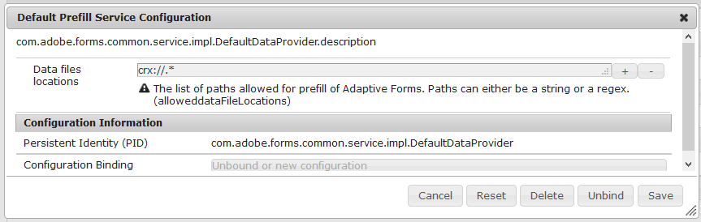

# 預先填寫最適化表格欄位{#prefill-adaptive-form-fields}

## 簡介 {#introduction}

您可以使用現有資料預先填寫最適化表單的欄位。 當使用者開啟表格時，這些欄位的值會預先填入。 若要在最適化表單中預先填寫資料，請以符合最適化表單之預先填寫資料結構的格式，將使用者資料以預先填寫XML / JSON的形式提供。

## 預填充資料的結構 {#the-prefill-structure}

自適應形式可以具有綁定和未綁定欄位的混合。 系結欄位是從「內容搜尋器」索引標籤拖曳的欄位，並在欄位編輯對話 `bindRef` 方塊中包含非空白的屬性值。 未系結的欄位會直接從Sidekick的元件瀏覽器拖曳，並具有空 `bindRef` 值。

您可以預先填寫最適化表單的系結和未系結欄位。 預填充資料包含afBoundData和afUnBoundData部分，用於預填充自適應表單的綁定和未綁定欄位。 此區 `afBoundData` 段包含系結欄位和面板的預先填寫資料。 此資料必須與關聯的表單模型模式相容：

* 對於使用 [XFA表單範本的自適應表單](../../forms/using/prepopulate-adaptive-form-fields.md)，請使用與XFA範本資料架構相容的預填XML。
* 對於使用 [XML架構的自適應表單](../../forms/using/prepopulate-adaptive-form-fields.md#main-pars-header-3)，請使用與XML架構結構相容的預填XML。
* 對於使用 [JSON結構描述的最適化表單](../../forms/using/prepopulate-adaptive-form-fields.md#json-schema-based-adaptive-forms)，請使用與JSON結構描述相容的預填JSON。
* 對於使用FDM架構的最適化表單，請使用與FDM架構相容的預填JSON。
* 對於沒有表單模型 [的自適應表單](../../forms/using/prepopulate-adaptive-form-fields.md#p-adaptive-form-with-no-form-model-p)，沒有綁定資料。 每個欄位都是未綁定欄位，並且使用未綁定的XML預填充。

### 範例預填XML結構 {#sample-prefill-xml-structure}

```xml
<?xml version="1.0" encoding="UTF-8"?>
<afData>
  <afBoundData>
     <employeeData>
        .
     </employeeData>
  </afBoundData>

  <afUnboundData>
    <data>
      <textbox>Hello World</textbox>
         .
         .
      <numericbox>12</numericbox>
         . 
         .              
    </data>
  </afUnboundData>
</afData>
```

### 範例預填JSON結構 {#sample-prefill-json-structure}

```
{
   "afBoundData": {
      "employeeData": { }
   },
   "afUnboundData": {
      "data": {
         "textbox": "Hello World",
         "numericbox": "12"
      }
   }
}
```

對於具有相同bindref或未系結欄位且名稱相同的系結欄位，在XML標籤或JSON物件中指定的資料會填入所有欄位。 例如，表單中的兩個欄位會對應至預填資料 `textbox` 中的名稱。 在執行時期中，如果第一個文字方塊欄位包含&quot;A&quot;，則會自動在第二個文字方塊中填入&quot;A&quot;。 此連結稱為最適化表單欄位的即時連結。

### 使用XFA表單範本的最適化表單 {#xfa-based-af}

XFA自適應表單的預填充XML和提交的XML結構如下：

* **預填充XML結構**:預先填入XFA自適應表單的XML必須與XFA表單範本的資料架構相容。 若要預先填入未系結的欄位，請將預先填入的XML結構包住 `/afData/afBoundData` 標籤。

* **已提交的XML結構**:當未使用預填充XML時，提交的XML會包含包裝函式標籤中綁定和未綁定欄位 `afData` 的資料。 如果使用預填充XML，則提交的XML與預填充XML的結構相同。 如果預填充XML以根標 `afData` 記開頭，則輸出XML的格式也相同。 如果預填充XML沒有包裝函 `afData/afBoundData`式，而是直接從結構根標籤（如）開始 `employeeData`，則提交的XML也會以標籤 `employeeData` 開始。

Prefill-Submit-Data-ContentPackage.zip

[取得包含](assets/prefill-submit-data-contentpackage.zip)預填資料和已提交資料的檔案範例

### 基於XML架構的自適應表單 {#xml-schema-af}

基於XML架構的自適應表單預填充XML和提交XML的結構如下：

* **預填充XML結構**:預填充XML必須與關聯的XML架構相容。 若要預先填入未系結的欄位，請將預先填入的XML結構包住/afData/afBoundData標籤。
* **已提交的XML結構**:如果未使用預填充XML，則提交的XML會包含包裝函式標籤中綁定和未綁定欄位 `afData` 的資料。 如果使用預填充XML，則提交的XML與預填充XML的結構相同。 如果預填充XML以根標 `afData` 記開頭，則輸出XML的格式相同。 如果預填充XML沒有包裝函 `afData/afBoundData` 式，而是直接從模式根標籤（如）開始 `employeeData`，則提交的XML也會以標籤 `employeeData` 開始。

```xml
<?xml version="1.0" encoding="utf-8" ?> 
<xs:schema targetNamespace="https://adobe.com/sample.xsd"
            xmlns="https://adobe.com/sample.xsd"
            xmlns:xs="https://www.w3.org/2001/XMLSchema">
 
    <xs:element name="sample" type="SampleType"/>
         
    <xs:complexType name="SampleType">
        <xs:sequence>
            <xs:element name="noOfProjectsAssigned" type="xs:string"/>
        </xs:sequence>
    </xs:complexType>
</xs:schema>
```

對於模型為XML架構的欄位，資料會預先填入標 `afBoundData` 記中，如下面範例XML所示。 它可用於用一個或多個未綁定文本欄位預填充自適應表單。

```xml
<?xml version="1.0" encoding="UTF-8"?><afData>
  <afUnboundData>
    <data>
      <textbox>Ignorance is bliss :) </textbox>
    </data>
  </afUnboundData>
  <afBoundData>
    <data>
      <noOfProjectsAssigned>twelve</noOfProjectsAssigned>
    </data>
  </afBoundData>
</afData>
```

>[!NOTE]
>
>建議您不要在系結面板中使用未系結的欄位(具有非空白的面板， `bindRef` 此面板是透過從Sidekick或「資料來源」索引標籤拖曳元件而建立的)。 這可能會造成這些未系結欄位的資料遺失。 此外，建議各欄位名稱在表單中是唯一的，尤其是未系結欄位。

#### 沒有afData和afBoundData包裝函式的範例 {#an-example-without-afdata-and-afbounddata-wrapper}

```xml
<?xml version="1.0" encoding="UTF-8"?><config>
 <assignmentDetails descriptionOfAssignment="Some Science Project" durationOfAssignment="34" financeRelatedProject="1" name="Lisa" numberOfMentees="1"/>
 <assignmentDetails descriptionOfAssignment="Kidding, right?" durationOfAssignment="4" financeRelatedProject="1" name="House" numberOfMentees="3"/>
</config>
```

### JSON架構的最適化表單 {#json-schema-based-adaptive-forms}

對於以JSON結構描述為基礎的最適化表單，以下說明預先填寫JSON和已提交JSON的結構。 如需詳細資訊，請參 [閱「使用JSON結構描述建立最適化表單](../../forms/using/adaptive-form-json-schema-form-model.md)」。

* **預填JSON結構**:預先填入JSON必須與關聯的JSON結構描述相容。 或者，如果您也想要預先填寫未系結的欄位，可將它包裝在/afData/afBoundData物件中。
* **已提交的JSON結構**:如果未使用預先填寫JSON，則提交的JSON會包含afData包裝函式標籤中已系結和未系結欄位的資料。 如果使用預先填入JSON，則提交的JSON與預先填入JSON的結構相同。 如果預先填寫JSON以afData根物件開頭，則輸出JSON的格式會相同。 如果預先填入JSON沒有afData/afBoundData包裝函式，而是直接從結構根物件（例如使用者）啟動，則提交的JSON也會從使用者物件開始。

```
{
    "id": "https://some.site.somewhere/entry-schema#",
    "$schema": "https://json-schema.org/draft-04/schema#",
    "type": "object",
    "properties": {
        "address": {
            "type": "object",
            "properties": { 
    "name": {
     "type": "string"
    },
    "age": {
     "type": "integer"
}}}}}
```

對於使用JSON結構描述模型的欄位，資料會預先填入afBoundData物件中，如以下範例JSON所示。 它可用於用一個或多個未綁定文本欄位預填充自適應表單。 以下是包裝函式資料的范 `afData/afBoundData` 例：

```
{
  "afData": {
    "afUnboundData": {
      "data": { "textbox": "Ignorance is bliss :) " }
    },
    "afBoundData": {
      "data": { {
   "user": {
    "address": {
     "city": "Noida",
     "country": "India"
}}}}}}}
```

以下是不含包裝函式的 `afData/afBoundData` 範例：

```
{
 "user": {
  "address": {
   "city": "Noida",
   "country": "India"
}}}
```

>[!NOTE]
>
>不建議在系結面板中使用未系結的欄位（具有非空的bindRef的面板，這些面板是從「Sidekick」或「Data Sources」索引標籤拖曳元件而建立的） **** ，因為這可能會導致未系結欄位的資料遺失。 建議在表單中使用唯一的欄位名稱，尤其是未系結欄位。

### 沒有表單模型的最適化表單 {#adaptive-form-with-no-form-model}

對於沒有表單模型的最適化表單，所有欄位的資料都在標 `<data>` 記下 `<afUnboundData> tag`。

此外，請注意以下事項：

為各種欄位提交的使用者資料，會使用欄位名稱產生XML標籤。 因此，欄位名稱必須是唯一的。

```xml
<?xml version="1.0" encoding="UTF-8"?><afData>
  <afUnboundData>
    <data>
      <radiobutton>2</radiobutton>
      <repeatable_panel_no_form_model>
        <numericbox>12</numericbox>
      </repeatable_panel_no_form_model>
      <repeatable_panel_no_form_model>
        <numericbox>21</numericbox>
      </repeatable_panel_no_form_model>
      <checkbox>2</checkbox>
      <textbox>Nopes</textbox>
    </data>
  </afUnboundData>
  <afBoundData/>
</afData>
```

## 使用Configuration manager配置預填充服務 {#configuring-prefill-service-using-configuration-manager}

若要啟用預填服務，請在「AEM Web Console設定」中指定「預設預填服務設定」。 使用下列步驟來設定Prefill服務：

>[!NOTE]
>
>「預先填寫服務設定」適用於最適化表單、HTML5表單和HTML5表單集。

1. 使用 **[!UICONTROL URL開啟Adobe Experience Manager Web Console設定]** :\
   https://&lt;server>:&lt;port>/system/console/configMgr
1. 搜尋並開啟 **[!UICONTROL 預設預填服務設定]**。

   

1. 為「資料」檔案位置輸入資料位置或規則表 **達式**。 有效資料檔案位置的範例包括：

   * file:///C:/Users/public/Document/Prefill/。*
   * https://localhost:8000/somesamplexmlfile.xml
   >[!NOTE]
   >
   >依預設，所有類型的最適化表單（XSD、XDP、JSON、FDM和不以表單模型為基礎）都允許透過crx檔案進行預填。 只有JSON和XML檔案才允許預先填寫。

1. 現在已為您的表單設定預填服務。

   >[!NOTE]
   >
   >crx通訊協定負責預先填入的資料安全性，因此預設允許。 使用一般規則運算式透過其他通訊協定預先填入可能會造成弱點。 在設定中，指定保護資料的安全URL設定。

## 重複面板的奇特案例 {#the-curious-case-of-repeatable-panels}

通常，綁定（表單模式）和未綁定欄位是以相同的自適應格式編寫的，但以下是一些例外，以防綁定可重複：

* 使用XFA表單範本、XSD、JSON結構描述或FDM結構描述的最適化表單不支援未系結的可重複面板。
* 請勿在已系結的可重複面板中使用未系結欄位。

>[!NOTE]
>
>根據經驗，如果綁定和未綁定欄位與最終用戶在未綁定欄位中填充的資料相交，則不要混用這些欄位。 如果可能，您應修改架構或XFA表單模板，並為未綁定欄位添加一個條目，以便它也被綁定，其資料與提交資料中的其他欄位一樣可用。

## 支援的預先填入使用者資料通訊協定 {#supported-protocols-for-prefilling-user-data}

使用有效的regex設定最適化表單時，可透過下列通訊協定，以預先填入的資料格式預先填入使用者資料：

### crx://通訊協定 {#the-crx-protocol}

```xml
https://localhost:4502/content/forms/af/xml.html?wcmmode=disabled&dataRef=crx:///tmp/fd/af/myassets/sample.xml
```

指定的節點必須具有名為的屬 `jcr:data` 性並保存資料。

### file://通訊協定 {#the-file-protocol-nbsp}

```xml
https://localhost:4502/content/forms/af/someAF.html?wcmmode=disabled&dataRef=file:///C:/Users/form-user/Downloads/somesamplexml.xml
```

引用的檔案必須位於同一伺服器上。

### https://通訊協定 {#the-http-protocol}

```xml
https://localhost:4502/content/forms/af/xml.html?wcmmode=disabled&dataRef=https://localhost:8000/somesamplexmlfile.xml
```

### service://通訊協定 {#the-service-protocol}

```xml
https://localhost:4502/content/forms/af/abc.html?wcmmode=disabled&dataRef=service://[SERVICE_NAME]/[IDENTIFIER]
```

* SERVICE_NAME是指OSGI預填充服務的名稱。 請參 [閱建立並執行預填服務](../../forms/using/prepopulate-adaptive-form-fields.md#create-and-run-a-prefill-service)。
* 識別碼是指OSGI預填服務擷取預填資料所需的任何中繼資料。 登入使用者的識別碼是可使用的中繼資料範例。

>[!NOTE]
>
>不支援傳遞驗證參數。

### 在slingRequest中設定資料屬性 {#setting-data-attribute-in-slingrequest}

您也可以在中 `data` 設定屬 `slingRequest`性，其中屬 `data` 性是包含XML或JSON的字串，如下列范常式式碼所示（範例為XML）:

```java
<%
           String dataXML="<afData>" +
                            "<afUnboundData>" +
                                "<data>" +
                                    "<first_name>"+ "Tyler" + "</first_name>" +
                                    "<last_name>"+ "Durden " + "</last_name>" +
                                    "<gender>"+ "Male" + "</gender>" +
                                    "<location>"+ "Texas" + "</location>" +
                                    "</data>" +
                            "</afUnboundData>" +
                        "</afData>";
        slingRequest.setAttribute("data", dataXML);
%>
```

您可以編寫包含所有資料的簡單XML或JSON字串，並在slingRequest中加以設定。 您可以在任何元件的轉譯器JSP中輕鬆完成這項作業，您想要在其中設定slingRequest資料屬性的頁面中加入此元件。

例如，您想要針對具有特定標題類型之頁面進行特定設計的位置。 若要這麼做，您可以編寫自己的 `header.jsp`程式碼，並將它加入頁面元件中並設定屬 `data` 性。

另一個好的例子是，您想要透過Facebook、Twitter或LinkedIn等社交帳戶預先填入登入資料的使用案例。 在這種情況下，可以在中包含一個簡單的JSP `header.jsp`，它從用戶帳戶中提取資料並設定資料參數。

prefill-page component.zip

[在頁面元](assets/prefill-page-component.zip)件中取得FileSample prefill.jsp

## AEM Forms自訂預填服務 {#aem-forms-custom-prefill-service}

您可針對情境使用自訂的預填服務，在此期間，您會持續讀取預先定義來源的資料。 預填充服務從定義的資料源讀取資料，並用預填充資料檔案的內容預填充自適應表單的欄位。 它也協助您將預先填入的資料與最適化表單永久關聯。

### 建立並執行預填服務 {#create-and-run-a-prefill-service}

預填充服務是OSGi服務，並通過OSGi捆綁包進行打包。 您可以建立OSGi搭售、上傳並安裝至AEM Forms搭售。 開始建立搭售之前：

* [下載AEM Forms Client SDK](https://helpx.adobe.com/aem-forms/kb/aem-forms-releases.html)
* [下載簡短字母組合套件](../../forms/using/prepopulate-adaptive-form-fields.md#main-pars-download-section-711716493)

* 將資料（預填資料）檔案放入crx-repository。 您可以將檔案放在crx-repository的\contents資料夾中的任意位置。

[取得檔案](assets/prefill-sumbit-xmlsandcontentpackage.zip)

#### 建立預填服務 {#create-a-prefill-service}

範本套件（範例預填服務套件）包含AEM Forms預填服務的範例實作。 在程式碼編輯器中開啟簡短字母組合套件。 例如，在Eclipse中開啟簡短的專案以進行編輯。 在程式碼編輯器中開啟簡短字母組合套件後，請執行下列步驟以建立服務。

1. 開啟src\main\java\com\adobe\test\Prefill.java檔案以進行編輯。
1. 在程式碼中，設定值：

   * `nodePath:` 指向crx-repository位置的節點路徑變數包含資料（預填充）檔案的路徑。 例如，/content/prefilldata.xml
   * `label:` 標籤參數指定服務的顯示名稱。 例如，預設預填服務

1. 儲存並關閉 `Prefill.java` 檔案。
1. 將套件 `AEM Forms Client SDK` 新增至簡短字母組合專案的建立路徑。
1. 編譯項目並為包建立。jar。

#### 啟動並使用預填服務 {#start-and-use-the-prefill-service}

若要啟動預填服務，請將JAR檔案上傳至AEM Forms Web Console，然後啟動服務。 現在，服務開始出現在最適化表單編輯器中。 要將預填充服務與自適應表單關聯：

1. 在表單編輯器中開啟最適化表單，並開啟表單容器的「屬性」面板。
1. 在「屬性」主控台中，導覽至「AEM Forms容器>基本>預填服務」。
1. 選擇「預設預填服務」，然後按一下「 **[!UICONTROL 儲存]**」。 服務與表單相關聯。

