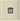

# 流程報告中的臨機查詢{#ad-hoc-queries-in-process-reporting}

## 流程報告中的臨機查詢 {#ad-hoc-queries-in-process-reporting-1}

「流程報表」中的臨機查詢可讓您建立自訂查詢，您可用來搜尋AEM Forms環境中定義的AEM Forms流程例項的流程和任務詳細資訊。

此外，可以使用進程和任務屬性篩選器定義臨機查詢。 然後可儲存這些篩選器，以便稍後執行報表。

[**流程搜索&#x200B;**](/help/forms/using/process-reporting/adhoc-queries-in-process-reporting.md#p-process-task-search-p):使用基於流程屬性的用戶定義的搜索過濾器搜索流程實例。

[**流程詳細資訊&#x200B;**](/help/forms/using/process-reporting/adhoc-queries-in-process-reporting.md#p-process-task-details-p):通過指定流程ID查看流程實例的詳細資訊。

**任務搜索**:根據任務屬性，使用用戶定義的搜索篩選器搜索任務實例。

**任務詳細資訊**:通過指定任務ID查看任務實例的詳細資訊。

### 流程和任務 {#processes-and-tasks}

建立過濾器和運行進程詳細資訊查詢時遵循的步驟與任務的步驟相同。

這表示「流程搜索」和「任務搜索」的用戶介面僅在可搜索的欄位和搜索結果中返回的欄位中有所不同。 這僅僅是因為，雖然許多欄位是相同的，但某些欄位是特定於進程的，某些欄位是特定於任務的。

本文詳細說明「流程／任務搜索」和「流程／任務詳細資訊」部分的說明。 在適當的位置，將會特別呼出任何特定差異。

## 流程／任務搜索 {#process-task-search}

您使用「流程／任務搜索」來定義用於查詢流程／任務實例的篩選器。

### 要建立流程／任務搜索查詢，請執行以下操作： {#to-create-a-process-task-search-query}

1. 要查看保存的進程／任務搜索查詢或建立查詢，請按一下「臨 **機查詢」** ，然後按一下 **進程／任務搜索**。

   

   「我 **的濾鏡** 」面板會顯示在樹狀檢視的右側。

   在「我 **的篩選器** 」面板中，您可以建立新的臨機查詢，然後按一下以執行先前儲存的查詢。

   

1. 要執行現有查詢，只需按一下「我的篩選器」面板中 **的查詢** 。
1. 若要建立查詢，請按一 **下「新增** (+)」。

   隨即 **顯示「建立篩選** 」面板。

   

   查詢由一個或多個查詢篩選器組成。 若要建立篩選，請新增篩選列至查詢。 依預設，會將一個篩選列新增至查詢。

   **要定義篩選器**

   1. 選取欄位。

      

      >[!NOTE]
      >
      >欄位清單包含AEM Forms流程／工作專屬的欄位。

   1. 選擇條件。

      

      >[!NOTE]
      >
      >列出的條件取決於選取的篩選屬性。

   1. 輸入值。

      

   1. 若要新增另一個篩選器至查詢，請按 **一下篩選列右側的新增(+)** 。

      若要從查詢中移除篩選器，請按一 **下篩選器列右側的刪除(-)** 。

      

建立查詢後，使用「建立篩選」面板右上角的選 **項** :

* **取消**:取消變更，返回「我的篩 **選器** 」面板。
* **執行**:執行當前查詢以查看和／或驗證結果。 在這種情況下，您無需在執行查詢之前保存查詢。 您可以驗證結果、根據需要進行更改，然後在對輸出滿意時保存查詢。
* **儲存**:儲存篩選。 然後，您就可以從「我的篩選器」面板檢視 **並執行篩選** 。

### 「我的濾鏡」面板中的選項 {#options-in-my-filters-panel}

使用 **My** My Filters to **Add** _ Filter, **Lc Filter_******Pr_DeleteLc DeleteComplating ComplayEdit_pr_filterteran ad-hoc面板中的選項。

### 要執行搜索查詢 {#to-execute-a-search-query}

1. 要執行查詢，請按一下「我的篩選器 **」面板中的篩選器，或者按一下「** 運行 **** 」按鈕（如果您正在建立或編輯篩選器）。
1. 查詢結果顯示在「流程報 **告」窗口** 的「報 **告」面板中** 。

   

   您可以透過報表底部顯示的分頁面板，將搜尋結果分頁。

   

   在「顯 **示** 」下拉式清單中，選擇每頁要顯示的結果數。

   在「頁 **面** 」文字方塊中，輸入要直接前往該頁面的頁碼。

1. 「流程搜索」結果中將顯示以下欄位：

   * **進程ID**:進程的ID。 欄位是超連結的。 如果按一下此欄位中的進程ID，則會將您重定向到該進 **[!UICONTROL 程的「進程詳細資訊]** 」面板。
   * **啟動器**:啟動程式例項的AEM Forms使用者
   * **建立時間**:流程實例啟動的日期和時間
   * **完成時間**:流程實例完成的日期和時間
   * **持續時間**:流程實例從開始到完成的持續時間
   * **狀態**:流程實例的當前狀態。
   預設情況下，結果按「進程ID」排序。 但是，要按任何欄位對結果進行排序，請按一下欄位標題。

   由於排序是切換操作，因此按一下列標題可以對結果進行升序排序，再按一下該列標題可以進行降序排序。

   同樣地，「任務搜索」結果中顯示以下欄位：

   * **任務ID**:任務的ID。 欄位是超連結的。 如果按一下此欄位中的任務ID，則會將您重定向到該任 **[!UICONTROL 務的「任務詳細資訊]** 」面板。
   * **啟動器**:啟動程式例項的AEM Forms使用者
   * **建立時間**:流程實例啟動的日期和時間
   * **完成時間**:流程實例完成的日期和時間
   * **持續時間**:流程實例從開始到完成的持續時間
   * **狀態**:流程實例的當前狀態。
   預設情況下，結果按任務ID排序。 但是，要按任何欄位對結果進行排序，請按一下欄位標題。 結果按列排序，列標題旁邊的暗箭頭指示。

   由於排序是切換操作，因此按一下欄位標題可以對結果進行升序排序，再次按一下該標題可以進行降序排序。 當前排序順序（升序／降序）由列標題旁的深箭頭方向指示。

   

1. 按一下左上角  ，收合「我的篩選器 **」窗格並展開「報表」面板的可用** 空間 **** 。
1. 使用**報表**面板右上角的選項，對查詢結果執行操作。

   * **刷新**:在儲存區中重新整理含有最新資料的報表

   * **匯出至CSV**:將報表資料匯出至逗號分隔的檔案。
   >[!NOTE]
   >
   >當您匯出報表時，搜尋的整個結果會匯出為CSV檔案，而不只是目前頁面

## 流程／任務詳細資訊 {#process-task-details}

使用「流 **程詳細資訊** 」面板可以查看特定流程的詳細資訊。

同樣地，您也可以使 **用「任務詳細資訊** 」面板來查看特定任務的詳細資訊。

### 要查看流程／任務詳細資訊，請執行以下操作： {#to-view-process-task-details}

您可以檢視特定AEM Forms流程／工作的詳細資訊：

* **從流程／任務搜索結果**
* **通過在「流程／任務詳細資訊」面板中輸入流程／任務ID**

#### 從流程／任務搜索結果 {#from-a-process-task-search-result}

1. 執行進程／任務搜索。 有關詳細資訊，請 [參閱執行流程搜索查詢](#to-execute-a-search-query)。

   請注意，結果中返回的進程ID是超連結的。

   

1. 按一下清單中的進程ID，在「進程詳細資訊」面板中查看此進程的 **詳細資訊** 。

   「流 **程／任務詳細資訊** 」查詢結果顯示流程／任務中包含的任務／表單的詳細資訊。

   依預設，結果會依任務／表單ID排序。 但是，要按任何欄位對結果進行排序，請按一下欄位標題。 結果排序依據的列在列標題旁邊以暗箭頭表示。

   由於排序是切換操作，因此按一下欄位標題可以對結果進行升序排序，再次按一下該標題可以進行降序排序。 當前排序順序（升序／降序）由列標題旁的深箭頭方向指示。

   **流程詳細資訊結果**

   

   **** 左面板：顯示所選進程的以下詳細資訊：

   * 進程名稱
   * 流程建立日期時間
   * 流程完成日期時間
   * 處理持續時間
   * 進程狀態
   * 進程啟動器
   **** 右上方面板：顯示組成選定進程的任務的以下詳細資訊：

   * 任務ID
   * 任務名稱
   * 任務所有者
   * 任務建立日期時間
   * 任務更新日期時間
   * 任務完成日期時間
   * 任務持續時間
   * 任務狀態
   **** 右下面板：顯示所選進程的進程歷史記錄的以下詳細資訊：

   * 進程名稱
   * 進程啟動器
   * 流程更新日期時間
   * 流程完成日期時間
   * 進程狀態
   **任務詳細資訊結果**

   

   **** 左面板：顯示所選任務的以下詳細資訊：

   * 任務名稱
   * 此任務所屬的進程ID
   * 任務說明
   * 任務建立日期時間
   * 任務完成日期時間
   * 任務持續時間
   * 任務狀態
   * 選定的任務路由
   **** 右上方面板：顯示組成選定任務的表單的以下詳細資訊：

   * Foprm ID
   * 表單建立日期時間
   * 表單更新日期時間
   * 表單範本Url
   **** 右下面板：顯示所選任務的流程歷史記錄的以下詳細資訊：

   * 任務分配類型
   * 任務所有者
   * 任務分配建立日期時間
   * 任務更新日期時間

1. 單 **擊返回流程／任務搜索** ，返回從中向下鑽取流程／任務詳細資訊的搜索結果。

   

   但是，如果通過輸入特定流程／任務ID找到流程／任務詳細資訊，則按一下返回流程／任務搜索將帶您返回流程／任務搜索 ****，而不顯示任何搜索結果。

#### 通過在「流程／任務詳細資訊」面板中輸入流程／任務ID {#by-entering-the-process-task-id-in-the-process-task-details-panel-br}

1. 轉至「流程/ **任務詳細資訊** 」面板。

   

1. 在「流程／任務ID」文本框中，輸入流程／任務ID。

   

   「流程／任務詳 **** 細資訊」查詢結果中的欄位是AEM Forms流程／任務的特定欄位。

   對於流程，查詢結果顯示流程中包含的任務的詳細資訊。

   對於任務，查詢結果將顯示任務中包含的表單的詳細資訊。

[聯絡支援](https://www.adobe.com/account/sign-in.supportportal.html)
