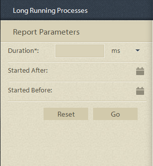

# 在進程報告中預先定義的報告 {#pre-defined-reports-in-process-reporting}

## 預先定義的在制報告 {#pre-defined-reports-in-process-reporting-1}

AEM Forms Process Reporting隨附於以下項目 *現成可用* 報表：

* **[長時間運行的進程](#long-running-processes)**:所有AEM Forms程式的報表，這些程式需要超過指定的時間才能完成
* **[流程持續時間圖](#process-duration-report)**:指定AEM Forms程式的報表（依期間）
* **[工作流量](#workflow-volume-report)**:按日期列出的指定進程的運行實例和已完成實例的報告

## 長時間運行的進程 {#long-running-processes}

「長時間執行的程式」報表會顯示已花費超過指定時間完成的AEM Forms程式。

### 要執行長時間運行的進程報告 {#to-execute-a-long-running-process-report}

1. 要查看「流程報告」中的預定義報告清單，請在 **流程報告** 樹視圖，按一下 **報表** 節點。
1. 按一下 **長時間運行的進程** 報表節點。

   

   選取報表時， **報表參數** 面板會顯示在樹視圖的右側。

   

   參數:

   * **持續時間** (*強制*):指定持續時間和時間單位。 顯示已執行超過指定持續時間的所有AEM Forms程式。
   * **開始時間** (*可選*):選擇日期。 篩選報表以顯示指定日期之後開始的處理例項。
   * **開始於之前** (*可選*):選擇日期。 篩選報表以顯示指定日期之前開始的處理例項。

1. 按一下 **開始** 來執行報表。

   報表會顯示在 **報表** 小組 **流程報告** 窗口。

   

   使用 **報表** 面板，對報表執行下列操作。

   * **重新整理**:重新整理報表，將最新資料放在儲存中
   * **更改圖例顏色**:選擇並更改報表圖例的顏色
   * **匯出至CSV**:將報表中的資料匯出及下載為逗號分隔的檔案

## 「Process Duration」報告  {#process-duration-report}

「處理期間」報表會依每個執行個體已執行的天數，顯示Forms處理的例項數。

### 要執行「進程持續時間」報告 {#to-execute-a-process-duration-report}

1. 若要在「處理報告」中檢視預先定義的報表，請在 **流程報告** 樹視圖，按一下 **報表** 節點。
1. 按一下 **進程持續時間** 報表節點。

   

   選取報表時， **報表參數** 面板會顯示在樹視圖的右側。

   

   參數:

   * **選擇進程** (*強制*):選取AEM Forms程式。

1. 按一下 **開始** 來執行報表。

   報表會顯示在 **報表** 面板。

   

   使用 **報表** 面板，對報表執行下列操作。

   * **重新整理**:重新整理報表，將最新資料放在儲存中
   * **更改圖例顏色**:選擇並更改報表圖例的顏色
   * **匯出至CSV**:將報表中的資料匯出及下載為逗號分隔的檔案

## 工作流量報告 {#workflow-volume-report}

「工作流量」報表會依日曆日顯示目前執行中和已完成的AEM Forms程式例項數。

### 要執行工作流卷報告 {#to-execute-a-workflow-volume-report}

1. 若要在「處理報告」中檢視預先定義的報表，請在 **流程報告** 樹視圖，按一下 **報表** 節點。
1. 按一下 **工作流量** 報表節點。

   

   選取報表時， **報表參數** 面板會顯示在樹視圖的右側。

   

   參數:

   * **選擇進程** (*強制*):選取AEM Forms程式。

   * **開始時間** (*可選*):選擇日期。 篩選報表以顯示指定日期之後開始的處理例項。

   * **開始於之前** (*可選*):選擇日期。 篩選報表以顯示指定日期之前開始的處理例項。

1. 按一下 **開始** 來執行報表。

   報表會顯示在 **報表** 小組 **流程報告** 窗口。

   

   使用 **報表** 面板，對報表執行下列操作。

   * **重新整理**:重新整理報表，將最新資料放在儲存中
   * **更改圖例顏色**:選擇並更改報表圖例的顏色
   * **匯出至CSV**:將報表中的資料匯出及下載為逗號分隔的檔案
