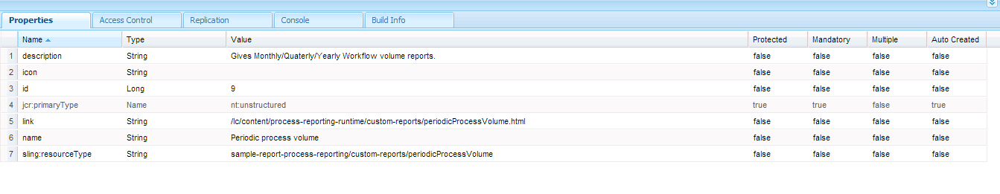

# 流程中的自訂報表{#custom-reports-in-process-reporting}

您可以使用QueryBuilder的REST介面，或使用QueryBuilder API建立OSGi服務以建立自訂報表。

## 建立自訂報表的一般步驟 {#generic-steps-to-build-a-custom-report}

新增任何自訂報表之前，請執行下列範本程式：

1. 自訂報表中使用的資料必須可用於「流程報表」。 為確保資料的可用性，請排程cron工作，或在「流程報表」 **[UI中使用](https://helpx.adobe.com/livecycle/help/process-reporting/install-start-process-reporting.html#Process%20Reporting%20Home%20screen)**「同步」選項。
1. URL請求（封裝所需查詢）必須傳回適當的查詢結果物件。 若要建立查詢，您可以使用 [QueryBuilder的REST介面](https://docs.adobe.com/docs/en/cq/current/dam/customizing_and_extendingcq5dam/query_builder.html) ，使用QueryBuilder API建立OSGi服務。 您可以建立動態或靜態查詢。

1. 建立自訂使用者介面以顯示結果。 您可以建立獨立的使用者介面，或將結果與現有的「流程報表」使用者介面整合。

## 使用QueryBuilder的REST介面 {#using-the-rest-interface-of-the-querybuilder}

CRX queryBuilder REST介面透過Java API和REST API公開「資產共用查詢產生器」的功能。 在執行下列步驟之 [前，瞭解如何使用CRX QueryBuilder REST介面](https://docs.adobe.com/docs/en/cq/current/dam/customizing_and_extendingcq5dam/query_builder.html):

1. 瀏覽至URL https://[server]:[port]/lc/bin/querybuilder.json
1. 根據Process Reporting儲存節點結構和節點屬性建立查詢。

   您可以指定可選參數來指定偏移、限制、點擊和屬性。 您可以硬式編碼靜態報表的引數，並從動態報表的UI擷取參數。

   要獲取所有進程名，查詢為：

   `https://[Server]:[Port]/lc/bin/querybuilder.json?exact=false&p.hits=selective&p.properties=pmProcessTitle&path=%2fcontent%2freporting%2fpm&property=pmNodeType&property.operation=equals&property.value=ProcessType&type=sling%3aFolder`

   >[!NOTE]
   >
   >在每個查詢中，路徑參數都指向crx儲存位置，字元會根據URL標準逸出。

## 使用Query Builder API建立服務 {#creating-a-service-using-query-builder-api-nbsp}

使用Query Builder API建立服務的先決條件是 [建立和部署CQ OSGI搭售](https://docs.adobe.com/docs/v5_2/html-resources/cq5_guide_developer/cq5_guide_developer.html) , [以及使用Query Builder API](https://docs.adobe.com/docs/en/cq/current/dam/customizing_and_extendingcq5dam/query_builder.html)。

1. 使用適當的註解建立OSGi服務。 若要存取QueryBuilder，請使用：

   ```
   @Reference(referenceInterface = QueryBuilder.class)
    private QueryBuilder queryBuilder;
   ```

1. 建立謂片語。 建立謂片語的代碼為：

   ```
   PredicateGroup predicateGroup = new PredicateGroup();
    predicateGroup.setAllRequired(true);
   ```

1. 將謂語新增至新建立的predicateGroup。 JcrBoolPropertyPredicateEvaluator [、](https://docs.adobe.com/docs/en/cq/5-3/javadoc/com/day/cq/search/eval/JcrBoolPropertyPredicateEvaluator.html)JcrPropertyPredicateEvaluator [、](https://docs.adobe.com/docs/en/cq/5-3/javadoc/com/day/cq/search/eval/JcrPropertyPredicateEvaluator.html)RangePropertyEvaluator、 [JcrBoolPredicatePredicateEvaluator、](https://docs.adobe.com/docs/en/cq/5-3/javadoc/com/day/cq/search/eval/RangePropertyPredicateEvaluator.html)[](https://docs.adobe.com/docs/en/cq/5-3/javadoc/com/day/cq/search/eval/RelativeDateRangePredicateEvaluator.html)[](https://docs.adobe.com/docs/en/cq/5-3/javadoc/com/day/cq/search/eval/TypePredicateEvaluator.html)JcrPropertyPredicatePredicatePredicateEvicateEvateEtageEvaticateEEEvaticateEvaluaticateEEEEEvatorEEvaluatorEEEEEEvaluaticaticaticatigator。

   對於靜態報表，硬式編碼謂語，而對於動態報表，則從請求擷取謂語。

   獲取流程所有實例的示例代碼為：

   ```java
   Predicate predicate;
   
     //Add the path Constraint
     predicate = new Predicate(PathPredicateEvaluator.PATH);
     predicate.set(PathPredicateEvaluator.PATH, "/content/reporting/pm"); // should point to the crx path being used to store data
     predicate.set(PathPredicateEvaluator.EXACT, "false");
     predicateGroup.add(predicate);
   
     //type nt:unstructured
     predicate = new Predicate(TypePredicateEvaluator.TYPE);
     predicate.set(TypePredicateEvaluator.TYPE, "nt:unstructured");
     predicateGroup.add(predicate);
   
     //NodeType: Process Instance
     predicate = new Predicate(JcrPropertyPredicateEvaluator.PROPERTY);
     predicate.set(JcrPropertyPredicateEvaluator.PROPERTY, "pmNodeType");
     predicate.set(JcrPropertyPredicateEvaluator.OPERATION, JcrPropertyPredicateEvaluator.OP_EQUALS);
     predicate.set(JcrPropertyPredicateEvaluator.VALUE, "ProcessInstance");
     predicateGroup.add(predicate);
   
     //processName
     predicate = new Predicate(JcrPropertyPredicateEvaluator.PROPERTY);
     predicate.set(JcrPropertyPredicateEvaluator.PROPERTY, "pmProcessName");
     predicate.set(JcrPropertyPredicateEvaluator.OPERATION, JcrPropertyPredicateEvaluator.OP_EQUALS);
     predicate.set(JcrPropertyPredicateEvaluator.VALUE, processName); //processName variable stores the name of the process whose instances need to be searched
     predicateGroup.add(predicate);
   ```

1. 使用predicateGroup定義查詢。

   `Query query = queryBuilder.createQuery(predicateGroup, session);`

1. 獲取查詢的結果。

   ```java
   query.setStart(offset); // hardcode or fetch from request
           if(hits == -1)         // hardcode or fetch from request
               hits = 0;
           query.setHitsPerPage(hits);
           SearchResult searchResult = query.getResult();
   ```

1. 重複結果，並將結果轉換為所需格式。 以CSV格式傳送結果的程式碼為：

   ```java
   Iterator<Node> iter = searchResult.getNodes();
                   while(iter.hasNext()) {
                       Node node = iter.next();
                       row = new StringBuilder();
                       for (String property : includeProperties) { // the properties of the node which needs to be returned, or one can return all the properties too.
                           try {
                               row.append(node.getProperties(property).nextProperty().getString() + COMMA_SEPARATOR);
                           } catch (NoSuchElementException e) {
                               //Adding separator for no value
                               row.append(COMMA_SEPARATOR);
                           } catch (RepositoryException e) {
                               e.printStackTrace();
                           }
                       }
                       row.deleteCharAt(row.lastIndexOf(COMMA_SEPARATOR));
                       row.append(NEW_LINE);
                       out.write(row.toString().getBytes());
   ```

1. 使用 `org.apache.felix maven-bundle-plugin` 為servlet建立OSGi包。

1. 在CRX伺服器上部署套件。

### 服務示例 {#service-example}

以下服務示例計算每個月、季度和年末處於 **RUNNING** 和 **COMPLETE** 狀態的進程的實例。

```java
package custom.reporting.service;

import java.text.DateFormatSymbols;
import java.util.Calendar;
import java.util.HashMap;
import java.util.Iterator;
import java.util.LinkedHashMap;
import java.util.Map;
import java.util.SortedSet;
import java.util.TreeSet;

import javax.jcr.Node;
import javax.jcr.Session;

import org.apache.felix.scr.annotations.Component;
import org.apache.felix.scr.annotations.Reference;
import org.apache.felix.scr.annotations.Service;

import com.day.cq.search.Predicate;
import com.day.cq.search.PredicateGroup;
import com.day.cq.search.Query;
import com.day.cq.search.QueryBuilder;
import com.day.cq.search.eval.JcrPropertyPredicateEvaluator;
import com.day.cq.search.eval.PathPredicateEvaluator;
import com.day.cq.search.eval.TypePredicateEvaluator;
import com.day.cq.search.result.SearchResult;

@Component(metatype = true, immediate = true, label = "PeriodicProcessVolume", description = "Service for supporting cutom reports pluggable to Process Reporting.")
@Service(value = PeriodicProcessVolume.class)
public class PeriodicProcessVolume {

    private static String[] monthNameList = new DateFormatSymbols().getMonths();
    private static String[] quaterNameList = { "I", "II", "III", "IV" };

    private final Map<Integer, Map<Integer, Long[]>> monthly = new HashMap<Integer, Map<Integer, Long[]>>();
    private final Map<Integer, Map<Integer, Long[]>> quaterly = new HashMap<Integer, Map<Integer, Long[]>>();
    private final Map<Integer, Long[]> yearly = new HashMap<Integer, Long[]>();

    @Reference(referenceInterface = QueryBuilder.class)
    private QueryBuilder queryBuilder;

    private void addConstraints(PredicateGroup predicateGroup, String processName) {
        Predicate predicate;

        //Add the path Constraint
        predicate = new Predicate(PathPredicateEvaluator.PATH);
        predicate.set(PathPredicateEvaluator.PATH, "/content/reporting/pm");
        predicate.set(PathPredicateEvaluator.EXACT, "false");
        predicateGroup.add(predicate);

        //type nt:unstructured
        predicate = new Predicate(TypePredicateEvaluator.TYPE);
        predicate.set(TypePredicateEvaluator.TYPE, "nt:unstructured");
        predicateGroup.add(predicate);

        //NodeType: Process Instance
        predicate = new Predicate(JcrPropertyPredicateEvaluator.PROPERTY);
        predicate.set(JcrPropertyPredicateEvaluator.PROPERTY, "pmNodeType");
        predicate.set(JcrPropertyPredicateEvaluator.OPERATION, JcrPropertyPredicateEvaluator.OP_EQUALS);
        predicate.set(JcrPropertyPredicateEvaluator.VALUE, "ProcessInstance");
        predicateGroup.add(predicate);

        //processName
        if (processName != null) {
            predicate = new Predicate(JcrPropertyPredicateEvaluator.PROPERTY);
            predicate.set(JcrPropertyPredicateEvaluator.PROPERTY, "pmProcessName");
            predicate.set(JcrPropertyPredicateEvaluator.OPERATION, JcrPropertyPredicateEvaluator.OP_EQUALS);
            predicate.set(JcrPropertyPredicateEvaluator.VALUE, processName);
            predicateGroup.add(predicate);
        }
    }

    private Long[] setFrequency(Long[] frequency, int index) {
        if (frequency == null) {
            frequency = new Long[2];
            frequency[0] = 0L;
            frequency[1] = 0L;
        }
        frequency[index] = frequency[index] + 1L;
        return frequency;
    }

    public void populateValues(Session session, String processName) {
        PredicateGroup predicateGroup = new PredicateGroup();
        predicateGroup.setAllRequired(true);
        try {
            addConstraints(predicateGroup, processName);

            long batchSize = 10000L;
            long start = 0l;

            while (true) {
                Query query = queryBuilder.createQuery(predicateGroup, session);
                query.setStart(start);
                query.setHitsPerPage(batchSize);
                SearchResult searchResult = query.getResult();
                Iterator<Node> itr = searchResult.getNodes();
                long length = 0;
                while (itr.hasNext()) {
                    length++;
                    Node n = itr.next();
                    Calendar calender = n.getProperty("pmCreateTime").getDate();
                    String status = n.getProperty("pmStatus").getString();
                    int index = 0;
                    if ("COMPLETE".equals(status)) {
                        index = 1;
                    } else if ("RUNNING".equals(status)) {
                        index = 0;
                    } else {
                        continue;
                    }
                    int month = calender.get(Calendar.MONTH);
                    int year = calender.get(Calendar.YEAR);
                    int quater;
                    if (month < 3) {
                        quater = 1;
                    } else if (month < 6) {
                        quater = 2;
                    } else if (month < 9) {
                        quater = 3;
                    } else {
                        quater = 4;
                    }

                    Long frequency[];
                    Map<Integer, Long[]> yearMonthMap = this.monthly.get(year);
                    if (yearMonthMap == null) {
                        yearMonthMap = new HashMap<Integer, Long[]>();
                    }
                    frequency = yearMonthMap.get(month);
                    frequency = setFrequency(frequency, index);
                    yearMonthMap.put(month, frequency);
                    this.monthly.put(year, yearMonthMap);

                    Map<Integer, Long[]> yearQuaterMap = this.quaterly.get(year);
                    if (yearQuaterMap == null) {
                        yearQuaterMap = new HashMap<Integer, Long[]>();
                    }
                    frequency = yearQuaterMap.get(quater);
                    frequency = setFrequency(frequency, index);
                    yearQuaterMap.put(quater, frequency);
                    this.quaterly.put(year, yearQuaterMap);

                    frequency = this.yearly.get(year);
                    frequency = setFrequency(frequency, index);
                    this.yearly.put(year, frequency);
                }

                if (length < batchSize) {
                    break;
                } else {
                    start = start + batchSize;
                }
            }
        } catch (Exception e) {
            e.printStackTrace();
        }

    }

    public Map<String, Long[]> getMonthly() {
        Map<String, Long[]> result = new LinkedHashMap<String, Long[]>();
        SortedSet<Integer> years = new TreeSet<Integer>(monthly.keySet());
        for (Integer year : years) {
            Map<Integer, Long[]> yearMonthMap = monthly.get(year);
            SortedSet<Integer> months = new TreeSet<Integer>(yearMonthMap.keySet());
            for (Integer month : months) {
                String str = monthNameList[month] + " " + year;
                result.put(str, yearMonthMap.get(month));
            }
        }
        return result;
    }

    public Map<String, Long[]> getQuaterly() {
        Map<String, Long[]> result = new LinkedHashMap<String, Long[]>();
        SortedSet<Integer> years = new TreeSet<Integer>(quaterly.keySet());
        for (Integer year : years) {
            Map<Integer, Long[]> quaterMonthMap = quaterly.get(year);
            SortedSet<Integer> quaters = new TreeSet<Integer>(quaterMonthMap.keySet());
            for (Integer quater : quaters) {
                String str = quaterNameList[quater - 1] + " " + year;
                result.put(str, quaterMonthMap.get(quater));
            }
        }
        return result;
    }

    public Map<Integer, Long[]> getYearly() {
        return yearly;
    }

}
```

在服務 `pom.xml`之上構建的示例檔案為：

```java
<project xmlns="https://maven.apache.org/POM/4.0.0" xmlns:xsi="https://www.w3.org/2001/XMLSchema-instance" xsi:schemaLocation="https://maven.apache.org/POM/4.0.0 https://maven.apache.org/maven-v4_0_0.xsd">
    <modelVersion>4.0.0</modelVersion>

    <!-- ====================================================================== -->
    <!-- P R O J E C T  D E S C R I P T I O N                                   -->
    <!-- ====================================================================== -->
    <groupId>com.custom</groupId>
    <artifactId>sample-report-core</artifactId>
    <packaging>bundle</packaging>
    <name>PR Sample Report</name>
    <description>Bundle providing support for a custom report pluggable to process reporting.</description>
    <version>1</version>

    <!-- ====================================================================== -->
    <!-- B U I L D   D E F I N I T I O N                                        -->
    <!-- ====================================================================== -->
    <build>
        <plugins>
          <plugin>
              <groupId>org.apache.felix</groupId>
              <artifactId>maven-bundle-plugin</artifactId>
              <version>2.3.7</version>
              <extensions>true</extensions>
              <configuration>
                    <instructions>
                        <Bundle-Category>sample-report</Bundle-Category>
                        <Export-Package>
                            custom.reporting.service.*;
                        </Export-Package>
                     </instructions>
              </configuration>
          </plugin>
          <plugin>
                <groupId>org.apache.felix</groupId>
                <artifactId>maven-scr-plugin</artifactId>
                <version>1.11.0</version>
                <executions>
                    <execution>
                        <id>generate-scr-scrdescriptor</id>
                        <goals>
                            <goal>scr</goal>
                        </goals>
                        <configuration>
                            <!-- Private service properties for all services. -->
                            <properties>
                                <service.vendor>Sample Report</service.vendor>
                            </properties>
                        </configuration>
                    </execution>
                </executions>
            </plugin>
        </plugins>
    </build>

    <!-- ====================================================================== -->
    <!-- D E P E N D E N C I E S                                                -->
    <!-- ====================================================================== -->
    <dependencies>
        <dependency>
          <groupId>com.day.cq</groupId>
          <artifactId>cq-search</artifactId>
          <version>5.6.4</version>
        </dependency>

        <dependency>
          <groupId>javax.jcr</groupId>
          <artifactId>jcr</artifactId>
          <version>2.0</version>
        </dependency>

        <dependency>
          <groupId>org.apache.felix</groupId>
          <artifactId>org.apache.felix.scr.annotations</artifactId>
          <version>1.9.0</version>
        </dependency>
    </dependencies>
</project>
```

## 建立個別的UI {#creating-a-separate-ui-nbsp}

建立個別UI以顯示結果的先決條件是 [Sling Basics](https://docs.adobe.com/docs/en/cq/5-6-1/developing/the_basics.html)、 [Creating a CRX Node](https://docs.adobe.com/docs/en/crx/current/developing/development_tools/developing_with_crxde_lite.html#Creating%20a%20Node) ，以及提供適當的存 [取權限](https://docs.adobe.com/docs/en/crx/current/developing/development_tools/developing_with_crxde_lite.html#Access%20Control)。

1. 在節點上建立CRX節 `/apps` 點並授予適當的訪問權限。 (PERM_PROCESS_REPORTING_USER)
1. 在節點上定義渲染 `/content` 器。
1. 將JSP或HTML檔案添加到步驟1中建立的節點。 您也可以新增CSS檔案。

   

   包含JSP和CSS檔案的範例節點

1. 新增javascript程式碼，以啟動Ajax呼叫至Querybuilder REST API或您的服務。 此外，還可添加適當的引數。

1. 將適當的成功處理常式新增至Ajax呼叫，以剖析並顯示結果。 您可以將結果解析為多種格式（json/csv/使用者定義），並以表格或其他形式顯示。

1. （可選）將適當的錯誤處理常式新增至Ajax呼叫。

同時使用OSGi service和QueryBuilder API的範例JSP程式碼為：

```
<%@taglib prefix="sling" uri="https://sling.apache.org/taglibs/sling/1.0"%>
<%request.setAttribute("silentAuthor", new Boolean(true));%>
<%@include file="/libs/foundation/global.jsp"%>
<%@ page import="java.util.Map,
java.util.Set,
com.adobe.idp.dsc.registry.service.ServiceRegistry,
javax.jcr.Session,
org.apache.sling.api.resource.ResourceResolver,
custom.reporting.service.PeriodicProcessVolume"%>
<%
response.setContentType("text/html");
response.setCharacterEncoding("utf-8");
%><!DOCTYPE HTML>
<html>
    <head>
        <meta charset="UTF-8">

        <link rel="stylesheet" href="/lc/apps/sample-report-process-reporting/custom-reports/periodicProcessVolume/style.css">
        <title>REPORT Monthly / Qaterly / Yearly</title>
        <script type="text/javascript">

            <%
                slingResponse.setCharacterEncoding("utf-8");
                ResourceResolver resolver = slingRequest.getResourceResolver();
                String processName = slingRequest.getParameter("processName");
                Session session = resolver.adaptTo(Session.class);
                custom.reporting.service.PeriodicProcessVolume periodicProcessVolume = sling.getService(custom.reporting.service.PeriodicProcessVolume.class);
                periodicProcessVolume.populateValues(session, processName);
                if (processName == null) {
                    processName = "All";
                }
            %>
            var lineSeprator = "<td class='seprator'>----------------</td>";
            var tableEnder = "<tr>" + lineSeprator + lineSeprator + lineSeprator + "</tr>";

            var tableColHeader = "<td class='colHead colNum'>Running</td>";
            tableColHeader += "<td class='colHead  colNum'>Complete</td></tr>";
            tableColHeader += tableEnder;

            var monthly = "<table><tr><td class='colHead colStr'>Month</td>";
            monthly += tableColHeader;

            <%
                Map<String, Long[]> monthlyMap = periodicProcessVolume.getMonthly();
                Set<String> monthKeys = monthlyMap.keySet();
                for (String key: monthKeys) {
                    Long[] frequencies = monthlyMap.get(key);
            %>

            monthly += "<tr><td class='colStr'> <%= key %> </td>";
            monthly += "<td class='colNum'> <%= frequencies[0] %> </td>";
            monthly += "<td class='colNum'> <%= frequencies[1] %> </td></tr>";
            <%
                }
            %>

            monthly += tableEnder;

            var quaterly = "<table><tr><td class='colHead colStr'>Quater</td>";
            quaterly += tableColHeader;

            <%
                Map<String, Long[]> quaterMap = periodicProcessVolume.getQuaterly();
                Set<String> quaterKeys = quaterMap.keySet();
                for (String key: quaterKeys) {
                    Long[] frequencies = quaterMap.get(key);
            %>

            quaterly += "<tr><td class='colStr'> <%= key %> </td>";
            quaterly += "<td class='colNum'> <%= frequencies[0] %> </td>";
            quaterly += "<td class='colNum'> <%= frequencies[1] %> </td></tr>";
            <%
                }
            %>

            quaterly += tableEnder;

            var yearly = "<table><tr><td class='colHead colStr'>Year</td>";
            yearly += tableColHeader;

            <%
                Map<Integer, Long[]> yearMap = periodicProcessVolume.getYearly();
                Set<Integer> yearKeys = yearMap.keySet();
                for (Integer key: yearKeys) {
                    Long[] frequencies = yearMap.get(key);
            %>

            yearly += "<tr><td class='colStr'> <%= key %> </td>";
            yearly += "<td class='colNum'> <%= frequencies[0] %> </td>";
            yearly += "<td class='colNum'> <%= frequencies[1] %> </td></tr>";
            <%
                }
            %>

            yearly += tableEnder;

            function reloadFrame(value) {
                if (value === '-1') {
                    window.location = "/lc/content/process-reporting-runtime/custom-reports/periodicProcessVolume.html";
                } else {
                    window.location = "/lc/content/process-reporting-runtime/custom-reports/periodicProcessVolume.html?processName=" + value;
                }
            }

            function populateTable(selection) {
                if (selection === 0) {
                    document.getElementById('tableHeading').innerHTML = 'Monthly';
                    document.getElementById('volumeTable').innerHTML = monthly;
                } else if (selection === 1) {
                    document.getElementById('tableHeading').innerHTML = 'Quaterly';
                    document.getElementById('volumeTable').innerHTML = quaterly;
                } else {
                    document.getElementById('tableHeading').innerHTML = 'Yearly';
                    document.getElementById('volumeTable').innerHTML = yearly;
                }
            }

            function fetchProcesses() {
                var xmlhttp = new XMLHttpRequest(),
                    request = '';
                xmlhttp.onreadystatechange = function() {
                   if (xmlhttp.readyState === 4 && xmlhttp.status === 200) {
                       var responseText,
                           response,
                           items,
                           hits = [],
                           responseSize = 0,
                           processName,
                           selectedIndex = 0,
                           comboBox;
                       responseText = xmlhttp.responseText;
                       if (responseText !== undefined && responseText !== null) {
                           response = JSON.parse(responseText);
                           responseSize = response.results;
                           hits = response.hits;
                       }

                       items = "<option value='-1'>All</option>";

                       for(var i = 0; i < responseSize; i++) {
                           processName = hits[i].pmProcessTitle;
                           if (processName === '<%= processName %>') {
                               selectedIndex = i + 1;
                           }
                           items += "<option value='" + processName + "'>" + processName + "</option>"
                       }

                       comboBox = document.getElementById('processSelection');
                       comboBox.innerHTML = items;
                       comboBox.selectedIndex = selectedIndex;
                   }
               };
               request = "/lc/bin/querybuilder.json?";
               request += "exact=false&";
               request += "p.hits=selective&";
               request += "p.properties=pmProcessTitle&";
               request += "path=%2fcontent%2freporting%2fpm&";
               request += "property=pmNodeType&";
               request += "property.operation=equals&";
               request += "property.value=ProcessType&";
               request += "type=sling%3aFolder";

               xmlhttp.open("POST", request, true);
               xmlhttp.setRequestHeader("Content-type","application/json");
               xmlhttp.send();
            }

        </script>
    </head>
    <body onLoad="fetchProcesses();populateTable(0);">
        Process:
        <select id="processSelection" onchange="reloadFrame(this.value);"></select>
        &nbsp &nbsp Period Interval:
        <select name="periodSelection" onchange="populateTable(this.selectedIndex);">
            <option value="1">Monthly</option>
            <option value="2">Quaterly</option>
            <option value="3">Yearly</option>
        </select>
        <br> <br> <br> <br>
        <div class="inline"> Process: &nbsp <b><%= processName %></b> &nbsp &nbsp Period: &nbsp </div> <b> <div id="tableHeading" class="inline"> </div> </b>
        <br><br>
        <div id="volumeTable"> </div>

    </body>
</html>
```

## 將報表UI整合在現有的流程報表UI中 {#integrating-report-ui-in-existing-process-reporting-ui-nbsp}

建立個別UI以顯示結果的先決條件是 [Sling Basics](https://wem.help.adobe.com/enterprise/en_US/10-0/wem/developing/the_basics.html)、 [Creating a CRX Node](https://docs.adobe.com/docs/en/crx/current/developing/development_tools/developing_with_crxde_lite.html#Creating%20a%20Node) ，以及提供適當的存 [取權限](https://docs.adobe.com/docs/en/crx/current/developing/development_tools/developing_with_crxde_lite.html#Access%20Control)。

1. 建立個別的UI。
1. 在節點上為每 `nt:unstructured` 個可插拔報告 `/content/process-reporting-runtime/custom-reports` 建立子節點。

   * **id**—— 指定報表的唯一標識號。
   * **name**—— 指定報表的名稱。 名稱會顯示在UI中。
   * **link**—— 指定個別UI轉譯器的相對連結。 該連結建立步驟1。
   * **description**—— 指定報表的一行說明。 您可將說明欄位保留為空白。
   * **圖示**-指定要以圖形方式呈現報表的影像。 您可以將圖示欄位保留為空白。
   

   節點的屬性

1. 報表UI已整合至「流程報表」UI。 整合UI後，更新的UI外觀類似下列影像：

   

   新增自訂報表的使用者介面

   

   自訂報表的結果畫面

## 範例套件 {#sample-package}

匯入套 `sample-report-pkg-1.zip` 件，將文章中討論的自訂報表和UI整合至「流程管理UI」。

[取得檔案連](assets/sample-report-pkg-1.zip)[絡支援](https://www.adobe.com/account/sign-in.supportportal.html)
