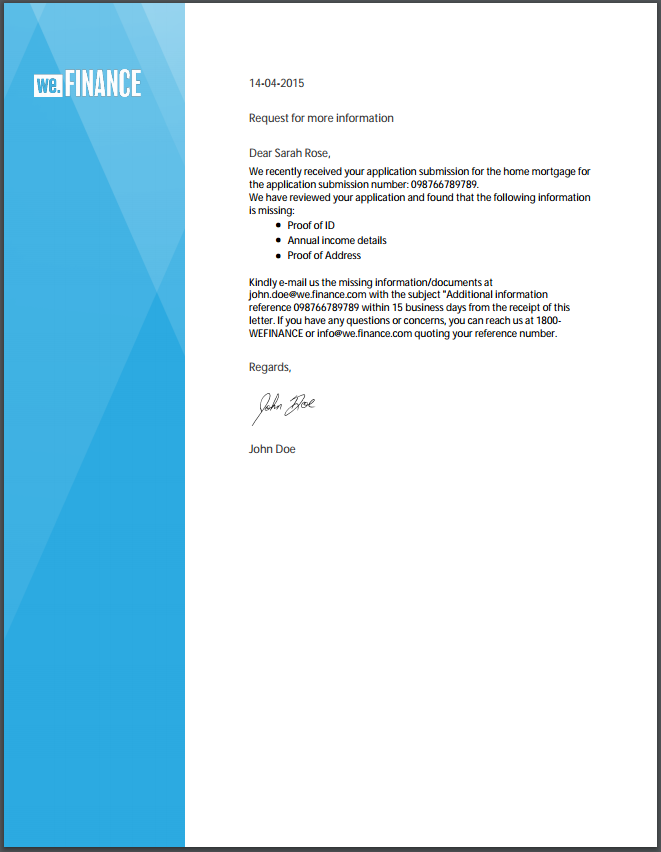

# 參考信函範本 {#reference-letter-templates}

在「對應管理」中，字母範本包含一般表單欄位、頁首和頁尾等版面功能，以及內容放置的空白「目標區域」。

Correponse Management在AEM Forms套件 [AEM-FORMS-REFERENCE-LAYOUT-TEMPLATES中提供信函範本](https://www.adobeaemcloud.com/content/marketplace/marketplaceProxy.html?packagePath=/content/companies/public/adobe/packages/cq630/fd/AEM-FORMS-6.3-REFERENCE-LAYOUT-TEMPLATES)。 有關安裝軟體包的資訊，請 [參見How to Work With Packages](/help/sites-administering/package-manager.md)。 您可以根據您的品牌和業務需求，在Designer中自訂範本。 套件包含下列範本：

* 傳統
* Classic Simple
* 平衡左
* 平衡的權利
* 視覺左側
* 視覺頂端
* Visual Top - Classic

安裝此套件後，版面範本(XDP)會列在範本資料夾中，位於下列位置：

`https://[server]:[port]/[context-root]/aem/forms.html/content/dam/formsanddocuments/templates-folder`

以下是此包中所有模板的常用欄位：

* 日期
* 致敬
* 關閉文字
* 簽名文字

安裝AEM-FORMS-6.3-REFERENCE-LAYOUT-TEMPLATES套件後，範本會列在templates-folder中

## 傳統 {#classic}

Classic範本上方有標誌，適合用於簡單的專業信件。

使用Classic範本建立之信件的PDF預覽

## Classic Simple {#classic-simple}

包含擷取電話號碼和電子郵件地址的欄位。 「傳統型簡單」模板與「傳統型」模板類似，只不過它沒有可以輸入收件人地址的欄位。

使用Classic Simple範本建立之信件的PDF預覽

## 平衡左 {#balanced-left}

「平衡左側」範本在字母左側包含標誌。

使用「平衡左側」範本建立之字母的PDF預覽

## 平衡的權利 {#balanced-right}

「平衡右側」範本的左側有公司標誌，並為在信件本身輸入收件人地址提供空間。 「平衡右側」範本也包含頁尾，當您的信件有多頁時，頁尾會重新排列。

使用「平衡右側」範本建立之信函的PDF預覽

## 視覺左側 {#visual-left}

「視覺化左側」範本的頁面左側有一個側標題，而公司標誌置於側標題上。 「視覺化左側」範本有主旨欄位，但沒有頁尾。

使用「視覺化左側」範本建立之字母的PDF預覽

## 視覺頂端 {#visual-top}

「視覺化頂端」範本的頂端有視覺化邊界。 「視覺化頂端」範本有一個欄位，可在頁面本身輸入收件者的位址。 「視覺化頁首」範本具有主題欄位和頁尾，可重排延伸至多頁的字母。

使用「視覺化頂端」範本建立之字母的PDF預覽

## Visual Top - Classic {#visual-top-classic}

Visual Top - Classic範本的頁面頂端有標題，並有公司標誌。 Visual Top - Classic模板有一個欄位可輸入主題，但沒有腳注。

使用視覺化頂端——傳統範本建立之字母的PDF預覽

