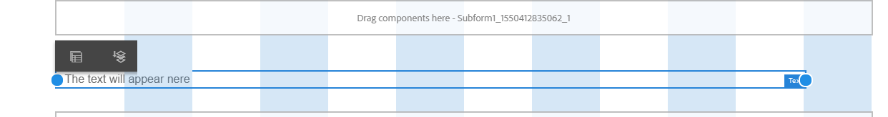

# 使用版面模式調整元件大小 {#use-layout-mode-to-resize-components}

互動式通訊Web Channel編寫介面可讓您使用「版面」模式調整元件大小。 在欄中拖放藍點以定義起始點和終止點來定位元件。 點選回應式格線中的元件後，系統會顯示藍點。 回應式格線由12個相等的欄組成。 替代欄中的白色和藍色陰影可區分一欄與另一欄。

您可以使用「配置」模式來調整所有裝置型別（例如桌上型電腦、平板電腦、手機和其他小型裝置）的元件大小。 平板電腦會自動從桌上型電腦版本衍生配置組態，而較小的裝置則會從手機衍生配置組態。 不過，您可以覆寫自動衍生的配置，以針對每種裝置型別定義不同的配置。

>[!NOTE]
>
>如果您使用[Print channel作為互動式通訊的主版](../../forms/using/create-interactive-communication.md)來建立Web channel，可用於調整大小的元件還包括使用Print channel在Web channel中自動產生的子表單和欄位。 Web Channel會保留「版面」模式中「列印」管道元素的版面。

## 存取配置模式 {#access-layout-mode}

從&#x200B;**預覽**&#x200B;選項旁的互動式通訊編寫介面頂端出現的下拉式清單中選取&#x200B;**配置**。 表單會以「版面」模式顯示。

1. 登入AEM作者執行個體並導覽至&#x200B;**Adobe Experience Manager** > **Forms** > **Forms和檔案**。
1. 建立[互動式通訊](../../forms/using/create-interactive-communication.md)或開啟現有的通訊。
1. 從位於&#x200B;**預覽**&#x200B;選項旁上方的下拉式清單中選取&#x200B;**配置**。 表單會以「版面」模式顯示。

   

## 調整元件大小 {#resize-components}

1. 在「版面」模式中，選取要調整大小的元件。 藍點會顯示在回應式格線的開始和結尾。
1. 拖放藍點以定義元件在回應式格線中的位置。

   

   點選元件後顯示的工具列包含下列選項：

   * **父系：**&#x200B;選取元件的父系。
   * **浮動到新行：**&#x200B;如果同一行中有多個元件，請將元件移至下一行。

   您可以使用&#x200B;**[!UICONTROL 回覆中斷點配置]** （）選項，復原所有調整大小變更，並將預設配置套用至包含調整大小元件的面板。 選取已調整大小元件的父元件以檢視選項。

   >[!NOTE]
   >
   >您無法使用「版面」模式調整表格欄、工具列、工具列按鈕和目標區域元件的大小。 使用「樣式」模式調整這些元件的大小。

### 範例 {#example}

**目標：**&#x200B;您想要插入表格元件和影像元件，並在互動式通訊中彼此平行放置。

1. 在互動式通訊的Web channel中使用「編輯」模式插入表格和影像元件。 影像元件會顯示在表格元件之後。
1. 切換到佈局模式並選取表格元件。 要調整元件大小的藍點會顯示在欄1和12。
1. 將第12欄的藍色圓點拖放至回應式格線的第6欄。

   

1. 同樣地，選取影像元件，並將回應式格線第1欄的藍色圓點拖放至第7欄。 表格和影像元件彼此平行顯示。

   

   您可以選取影像元件，並選取工具列中可用的&#x200B;**浮動至新行**&#x200B;選項，以將影像元件移至下一行。

## 調整面板大小 {#resize-panels-layout-mode}

如果您想要調整整個面板而非個別元件的大小，請執行下列步驟：

1. 選取面板中您要調整大小的任何元件，選取，然後選取下拉式清單中的第一個選項（如果面板是元件的直接父項）。

   藍點會顯示在回應式格線的開始和結尾。

1. 拖放藍點以定義面板在回應式格線中的位置。
您可以重複步驟1和2，並選取，將調整大小的面板移至下一行。

## 定義面板的多欄配置

執行以下步驟來定義面板的欄數：

1. 在&#x200B;**[!UICONTROL 編輯]**&#x200B;模式中，選取面板，選取，然後從&#x200B;**[!UICONTROL 面板配置]**&#x200B;下拉式清單中選取&#x200B;**[!UICONTROL 回應式 — 頁面上所有不含導覽的]**&#x200B;選項。

1. 選取以儲存屬性。

1. 在&#x200B;**[!UICONTROL 配置]**&#x200B;模式中，選取面板中的任何元件，選取，然後選取面板。

1. 選取，並從下拉式清單中選取欄數。 欄數可以介於1到12之間。 面板會分成多欄配置。

## 停用具有舊回應式佈局的表單的佈局模式 {#disable-layout-mode-for-forms-with-old-responsive-layout}

您可以編輯表單中所用範本的屬性，以停用具有舊回應式版面的表單版面模式。

執行以下步驟以停用「配置」模式：

1. 選取&#x200B;**[!UICONTROL 工具]** > **[!UICONTROL 一般]** > **[!UICONTROL 範本]**，並以&#x200B;**[!UICONTROL 編輯]**&#x200B;模式開啟表單中使用的範本。
1. 在左窗格中選取[檔案容器]，然後選取[**[!UICONTROL 原則]。]**

   

1. 選取&#x200B;**[!UICONTROL 配置設定]**&#x200B;索引標籤，並選取&#x200B;**[!UICONTROL 停用配置模式]**。
1. 選取以儲存範本屬性。
