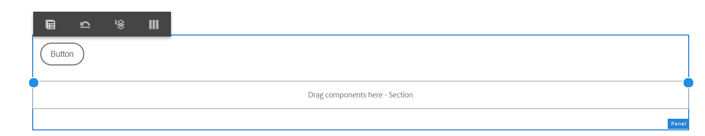

# 使用「版面」模式來調整元件大小{#use-layout-mode-to-resize-components}

最適化表單和互動式通訊網頁頻道製作介面可讓您使用版面模式調整元件大小。 在欄內拖放藍點，以定義放置元件的起點和終點。 點選回應式格線內的元件後，會顯示藍點。 回應式格線由12個相等的欄組成。 替代欄中的白色和藍色陰影區分了一欄與另一欄。

您可以使用「版面」模式來調整所有裝置類型的元件大小，例如桌上型電腦、平板電腦、手機和其他較小的裝置。 平板電腦會自動從案頭版本衍生版面配置，而較小的裝置則從手機衍生版面配置。 不過，您可以覆寫自動衍生的組態，為每種裝置類型定義不同的組態。

如果您使用列印頻道作為互動式通訊的主版  ，則可用來調整大小的元件也包含使用列印頻道在網頁頻道中自動產生的子表單和欄位。 網頁色版會在「版面」模式中保留列印色版元素的版面。

## 存取配置模式 {#access-layout-mode}

從下 **拉式清單中選取** 「版面」，此下拉式清單會顯示在最適化表單的頂端，而「預覽」選項旁的「互動式通訊製作」介 **面中** 。 表單會以「版面」模式顯示。

1. 登入AEM作者例項並導覽至 **Adobe Experience Manager** > **Forms** > **Forms &amp; Documents**。
1. [建立新表格](../../forms/using/create-interactive-communication.md) ，或開啟現有的最適化表格或互動式通訊。
1. 從「 **預覽** 」選項旁顯示於頂端的下拉式清單中選取「 **版面** 」。 表單會以「版面」模式顯示。

   

## 調整元件大小 {#resize-components}

1. 在「版面」模式中，點選元件以調整大小。 藍點顯示在自適應網格的開始和結束處。
1. 拖放藍點以定義元件在回應式格線中的位置。

   

   點選元件後顯示的工具列包含下列選項：

   * **父級：** 選擇元件的父代。
   * **浮動至新行：** 如果同一行中有多個元件，請將元件移到下一行。
   您可以使用「還原斷點配置」（「還原斷點」）選項，還原所有調整大小的變更，並將預設配置套用至包含已重 **[!UICONTROL 新調整大小之元件的面板]**上。 點選已調整大小的元件的父項以檢視選項。

   >[!NOTE]
   >
   >您無法使用「版面」模式來調整表格欄、工具列、工具列按鈕和目標區域元件的大小。 使用「樣式」模式來調整這些元件的大小。

### 例如 {#example}

**目標：** 要插入表元件和影像元件，並在互動式通信中將它們平行放置。

1. 在Web頻道中使用編輯模式插入表格和影像元件。 影像元件在表元件後面顯示。
1. 切換至「版面」模式，然後點選「表格」元件。 藍點可調整元件在第1欄和第12欄的顯示大小。
1. 將第12欄的藍點拖放至回應式格線的第6欄。

   

1. 同樣地，選取「影像」元件，並將回應式格線的第1欄處的藍點拖放至第7欄。 表和影像元件彼此平行顯示。

   

   您可以選取「影像」元件，並點選工具列中的「浮點到新行 **** 」選項，將「影像」元件移至下一行。

## 調整面板大小 {#resize-panels-layout-mode}

如果您想要調整整個面板的大小，而非個別元件，請執行下列步驟：

1. 點選面板中任何您要調整大小的元件，選取「選取父項 」，然後在下拉式清單中選取第一個選項（如果面板是元件的直接父項）。

   藍點顯示在自適應網格的開始和結束處。

1. 拖放藍點，以定義面板在回應式格線中的位置。
您可以重複步驟1和2，然後選  」，將重新調整大小的面板移至下一行。

## 定義面板的多欄版面

執行以下步驟以定義面板的列數：

1. 在編 **[!UICONTROL 輯模式中]** ，點選面板，選取「設定」，然後從「面板排版下拉式清單」中選取「回應式——頁面上的所有項目」，而無導 ******** 覽選項。

1. 點選「  」以儲存屬性。

1. 在「版 **[!UICONTROL 面]** 」模式中，點選面板中的任何元件，選取「 」，然後選取面板。

1. 點  ，然後從下拉式清單中選取欄數。 欄數範圍從1到12。 面板會分為多欄版面。

## 為舊版互動式版面啟用全新的互動式格線 {#enableresponsivegrid}

為您使用AEM Forms 6.4或更低版本建立的表單啟用新的互動式格線，以調整元件大小。

>[!NOTE]
>
>切換至新的回應式格線時，會捨棄已針對表單中使用的元件定義的版面屬性。

執行下列步驟以啟用新的互動式格線：

1. 從「 **預覽** 」選項旁顯示於頂端的下拉式清單中選取「 **版面** 」。 會顯示啟用「版面」模式的確認。
1. 點選 **「是** 」以啟用表 **單的「版面** 」模式。

### 使用新的互動式版面，將舊片段內嵌在最適化表單中 {#embed-an-old-fragment-in-an-adaptive-form-with-new-responsive-layout}

最適化表單的全新回應式版面，可讓您在表單中加入具有舊回應式版面的自適應表單片段。 但是，新佈局會丟棄已為片段中使用的元件定義的佈局屬性。 您可以切換至「版面」模式，以定義片段中使用的元件的版面屬性。

### 以舊版自適應表單內嵌具有新回應式版面的片段 {#embed-a-fragment-with-new-responsive-layout-in-an-old-adaptive-form}

如果您將具有新回應式版面的片段內嵌在具有舊回應式版面的自適應表單中，系統會提示您啟用表單的「版面」模式並重新內嵌片段。

若要啟用「版面」模式，請從「預覽」選項旁上方顯示的下拉式清單中選取「版面」，然後點選「是 **」以********** 確認。 選擇 **編輯** 模式以重新嵌入片段。

## 停用舊版互動式版面表單的版面配置模式 {#disable-layout-mode-for-forms-with-old-responsive-layout}

您可以編輯表單中所用範本的屬性，以停用具有舊版互動式版面的表單的「版面」模式。

執行下列步驟以停用「版面」模式：

1. 選擇「 **[!UICONTROL Edit]** Tools（編輯工具） **[!UICONTROL 」>「General]** 」（常規） **[!UICONTROL >「]** Templates **[!UICONTROL 」（模板），然後在「]** Edit Tools」（編輯工具）模式中開啟用於表單的模板。
1. 在左窗格中選取「檔案容器」，然後點選「原 **[!UICONTROL 則」。]**

   

1. 點選「版面 **[!UICONTROL 設定」標籤]** ，然後選 **[!UICONTROL 取「停用版面模式」]**。
1. 點選「  」以儲存範本屬性。

