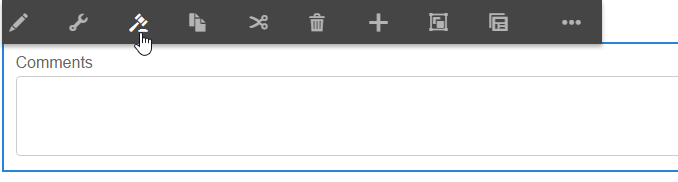

# 授予規則編輯器對選定用戶組的訪問權限{#grant-rule-editor-access-to-select-user-groups}

## 概覽 {#overview}

您可能有不同類型的使用者，具備不同的技巧，可搭配使用Adaptive Forms。 雖然專家使用者可能擁有使用指令碼和複雜規則的適當知識，但是可能有基本層級使用者需要只使用最適化表單的版面配置和基本屬性。

AEM Forms可讓您根據使用者的角色或函式，限制規則編輯器的存取權。 在Adaptive Forms Configuration Service設定中，您可以指定[用戶組](/help/sites-administering/security.md)，以便查看和訪問規則編輯器。

## 指定可存取規則編輯器{#specify-user-groups-that-can-access-rule-editor}的使用者群組

1. 以管理員身分登入AEM Forms。
1. 在作者例項中，按一下「Adobe Experience Manager >工具 >操作> Web Console」。 「Web控制台」在新視窗中開啟。

   

1. 在Web控制台窗口中，找到並按一下&#x200B;**自適應表單配置服務**。 **此時將顯示「自適應** 表單配置服務」對話框。請勿變更任何值，然後按一下「儲存」。****

   它在CRX-repository中建立一個檔案/apps/system/config/com.adobe.aemds.guide.service.impl.AdaptiveFormConfigurationServiceImpl.config。

1. 以管理員身份登錄CRXDE。 開啟檔案/apps/system/config/com.adobe.aemds.guide.service.impl.AdaptiveFormConfigurationServiceImpl.config以進行編輯。
1. 使用下列屬性指定可存取規則編輯器的群組名稱（例如，RuleEditorsUserGroup），然後按一下「全部儲存」。****

   `af.ruleeditor.custom.groups=["RuleEditorsUserGroup"]`

   若要啟用多個群組的存取權，請指定逗號分隔值的清單：

   `af.ruleeditor.custom.groups=["RuleEditorsUserGroup", "PermittedUserGroup"]`

   

   現在，當非指定使用者群組的使用者（此處為RuleEditorsUserGroup）點選欄位時，在元件工具列中，「編輯規則」圖示()不適用於她：

   

   具有規則編輯器訪問權限的用戶可見的元件工具欄

   

   對沒有規則編輯器訪問權限的用戶可見的元件工具欄

   有關向組添加用戶的說明，請參閱[用戶管理和安全](/help/sites-administering/security.md)。

