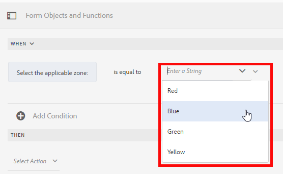
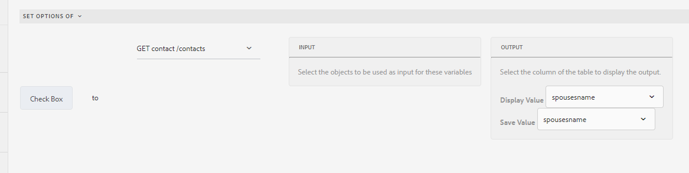
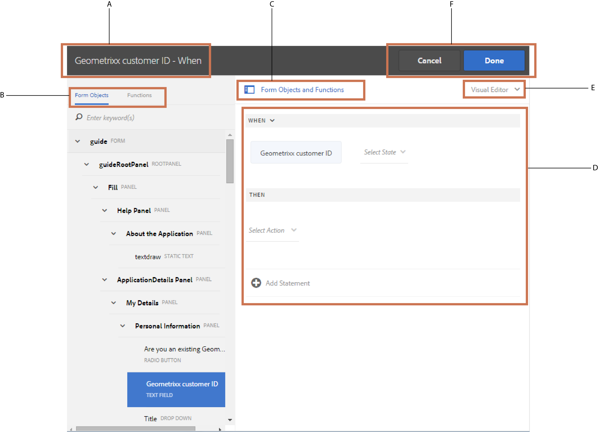
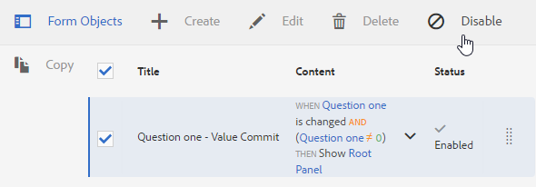
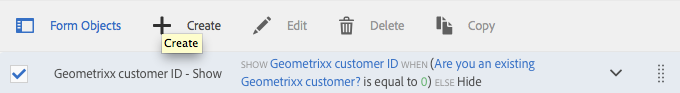

# 最適化表單規則編輯器{#adaptive-forms-rule-editor}

## 概覽 {#overview}

Adobe Experience Manager Forms中的規則編輯器功能可讓商業使用者和開發人員針對最適化表單物件編寫規則。 這些規則會根據預設條件、使用者輸入和使用者在表單上的動作來定義要觸發表單物件的動作。 它有助於進一步簡化表單填寫體驗，確保準確性和速度。

規則編輯器提供直覺式且簡化的使用者介面來編寫規則。 規則編輯器為所有使用者提供視覺編輯器。 此外，規則編輯器僅針對表單高級用戶提供代碼編輯器來編寫規則和指令碼。 您可以使用規則對最適化表單物件執行的一些主要動作包括：

* 顯示或隱藏對象
* 啟用或禁用對象
* 為對象設定值
* 驗證對象的值
* 執行函式以計算對象的值
* 調用表單資料模型服務並執行操作
* 對象的設定屬性

規則編輯器會取代AEM 6.1 Forms和舊版中的指令碼功能。 不過，您現有的指令碼會保留在新規則編輯器中。 有關在規則編輯器中使用現有指令碼的詳細資訊，請參 [閱規則編輯器對現有指令碼的影響](../../forms/using/rule-editor.md#p-impact-of-rule-editor-on-existing-scripts-p)。

新增至表單——超級使用者群組的使用者可以建立新的指令碼並編輯現有的指令碼。 表單使用者群組中的使用者可以使用指令碼，但不能建立或編輯指令碼。

## 瞭解規則 {#understanding-a-rule}

規則是動作與條件的組合。 在規則編輯器中，動作包括隱藏、顯示、啟用、停用或計算表單中物件的值等活動。 條件是布爾表達式，通過對表單對象的狀態、值或屬性執行檢查和操作來評估。 根據評估條件所傳回的值( `True` 或 `False`)執行動作。

規則編輯器提供一組預先定義的規則類型，例如「何時」、「顯示」、「隱藏」、「啟用」、「停用」、「設定值」和「驗證」，以協助您編寫規則。 每個規則類型都可讓您定義規則中的條件和動作。 檔案會進一步詳細說明每個規則類型。

規則通常遵循下列其中一個結構：

**條件——動作** ：在此結構中，規則會先定義條件，接著是要觸發的動作。 該構造與寫程式語言中的if-then陳述式相當。

在規則編輯器中， **When** 規則類型會強制實施條件——操作結構。

**Action-Condition** 在此建構中，規則會先定義要觸發的動作，接著是要評估的條件。 此結構的另一個變化是action-condition-alternate操作，該操作還定義了條件返回False時觸發的替代操作。

規則編輯器中的「顯示」、「隱藏」、「啟用」、「禁用」、「設定值為」和「驗證」規則類型可強制執行操作條件規則結構。 依預設，「顯示」的替代動作為「隱藏」,「啟用」為「停用」，反之亦然。 您不能更改預設替代操作。

>[!NOTE]
>
>可用的規則類型，包括您在規則編輯器中定義的條件和動作，也取決於您要建立規則的表單物件類型。 規則編輯器僅顯示用於編寫特定表單對象類型的條件和操作語句的有效規則類型和選項。 例如，您看不到面板對象的「驗證」、「設定值」、「啟用」和「禁用」規則類型。

如需規則編輯器中可用規則類型的詳細資訊，請參閱規 [則編輯器中的可用規則類型](../../forms/using/rule-editor.md#p-available-rule-types-in-rule-editor-p)。

### 選擇規則結構的准則 {#guidelines-for-choosing-a-rule-construct}

雖然您可以使用任何規則結構來達成大部分的使用案例，但以下是選擇一個結構而非另一個結構的一些准則。 如需規則編輯器中可用規則的詳細資訊，請參閱規 [則編輯器中的可用規則類型](../../forms/using/rule-editor.md#p-available-rule-types-in-rule-editor-p)。

* 建立規則時的一個典型經驗法則是，在您要編寫規則的物件上，考慮它。 請考慮您要根據使用者在欄位A中指定的值來隱藏或顯示欄位B。在這種情況下，您正在評估欄位A上的條件，並且根據它返回的值，您將觸發欄位B上的操作。

   因此，如果您要在欄位B（要評估條件的對象）上編寫規則，請使用條件——操作結構或時間規則類型。 同樣地，在欄位A上使用action-condition建構或「顯示」或「隱藏」規則類型。

* 有時，您需要根據一個條件執行多個動作。 在這種情況下，建議使用條件——動作結構。 在此構造中，您只需評估一次條件，即可指定多個動作陳述式。

   例如，若要根據條件來隱藏欄位B、C和D，以檢查使用者在欄位A中指定的值，請使用條件——動作結構或在欄位A上的規則類型編寫一個規則，並指定動作以控制欄位B、C和D的可見性。否則，您需要在欄位B、C和D上使用三個不同的規則，其中每個規則會檢查條件並顯示或隱藏個別欄位。 在此示例中，在一個對象上編寫「當」規則類型比在三個對象上顯示或隱藏規則類型更有效。

* 若要根據多個條件觸發動作，建議使用action-condition結構。 例如，若要透過評估欄位B、C和D的條件來顯示和隱藏欄位A，請在欄位A上使用「顯示」或「隱藏」規則類型。
* 如果規則包含一個條件的一個動作，請使用條件——動作或動作條件構造。
* 如果規則檢查條件並立即在提供欄位值或退出欄位時執行動作，建議在評估條件的欄位上使用條件——動作建構或When規則類型來編寫規則。
* 當用戶更改應用「時間」規則的對象值時，將評估「時間」規則中的條件。 不過，如果您想要在伺服器端變更值時觸發動作，例如預先填入值時，建議您撰寫在欄位初始化時觸發動作的「時機」規則。
* 在編寫下拉式清單、選項按鈕或核取方塊物件的規則時，這些表單物件在表單中的選項或值會預先填入規則編輯器中。

## 規則編輯器中可用的運算元類型和事件 {#available-operator-types-and-events-in-rule-editor}

規則編輯器提供下列邏輯運算子和事件，您可使用它們來建立規則。

* **等於**
* **不等於**
* **開頭為**
* **結束於**
* **包含**
* **為空**
* **不為空**
* **** 已選取：當使用者為核取方塊、下拉式清單、選項按鈕選取特定選項時，傳回true。
* **** 已初始化（事件）:當表單物件在瀏覽器中轉譯時傳回true。
* **** 已變更（事件）:當用戶更改表單對象的輸入值或選定選項時返回true。

## 規則編輯器中的可用規則類型 {#available-rule-types-in-rule-editor}

規則編輯器提供一組可用來編寫規則的預先定義規則類型。 讓我們詳細檢視每種規則類型。 有關在規則編輯器中寫入規則的詳細資訊，請參 [閱寫入規則](../../forms/using/rule-editor.md#p-write-rules-p)。

### 時間 {#whenruletype}

When **** 規則類型會遵循條件- **action-alternate動作規則構造** ，或有時只遵循條件- **action構造** 。 在此規則類型中，您首先指定評估條件，然後在符合條件時觸發動作( `True`)。 使用When規則類型時，可使用多個AND和OR運算子來建立巢 [狀運算式](#nestedexpressions)。

使用「時間」(When)規則類型，可以評估表單對象上的條件，並對一個或多個對象執行操作。

簡單來說，典型的「當時」規則結構如下：

`When on Object A:`

`(Condition 1 AND Condition 2 OR Condition 3) is TRUE;`

`Then, do the following:`

對對象B採取行動2;ANDAction 3對象C;

_

當您建立多值元件（例如選項按鈕或清單）時，系統會自動擷取選項並讓規則建立者使用。 您不需要再次輸入選項值。

例如，清單有四個選項：紅、藍、綠、黃。 建立規則時，會自動擷取選項（選項按鈕），並讓規則建立者使用，如下所示：



在編寫「時間」規則時，可以觸發「清除值」(Clear Value Of)操作。 「清除值」(Clear Value Of)操作會清除指定對象的值。 在When語句中將Clear value作為選項，允許您使用多個欄位建立複雜條件。


**隱藏** ：隱藏指定的對象。

**顯示** ：顯示指定的對象。

**啟用** ：啟用指定的對象。

**禁用** 禁用指定的對象。

**叫用服務** ：叫用在表單資料模型中配置的服務。 選擇「調用服務」操作時，將顯示一個欄位。 點選欄位時，會顯示在AEM例項上所有表單資料模型中設定的所有服務。 在選擇表單資料模型服務時，會出現其他欄位，您可以在其中使用指定服務的輸入和輸出參數映射表單對象。 請參閱用於調用表單資料模型服務的示例規則。

除了表單資料模型服務外，您還可以指定直接WSDL URL來叫用Web服務。 不過，表單資料模型服務有許多優點，並建議使用建議的方式來叫用服務。

如需在表單資料模型中設定服務的詳細資訊，請參 [閱AEM Forms資料整合](/help/forms/using/data-integration.md)。

**設定值** Computes並設定指定對象的值。 可以將對象值設定為字串、另一個對象的值、使用數學表達式或函式的計算值、對象的屬性值或配置表單資料模型服務的輸出值。 當您選擇web services選項時，它會顯示在AEM例項上所有表單資料模型中設定的所有服務。 在選擇表單資料模型服務時，會出現其他欄位，您可以在其中使用指定服務的輸入和輸出參數映射表單對象。

如需在表單資料模型中設定服務的詳細資訊，請參 [閱AEM Forms資料整合](/help/forms/using/data-integration.md)。

「設 **置屬性** 」(Set Property)規則類型允許您根據條件操作設定指定對象的屬性值。

它可讓您定義規則，以動態新增核取方塊至最適化表單。 您可以使用自訂函式、表單物件或物件屬性來定義規則。


若要根據自訂函式定義規則，請從下拉式清單中選取「函式輸出 **」，並從「函式」索引標籤中拖放自訂** 函式 **** 。 如果滿足條件操作，則自定義函式中定義的複選框數將添加到自適應表單中。

要根據表單對象定義規則，請從下拉清單中選擇「表單對象 **」，並從「表單對象」頁籤中拖** 放表單對象 **** 。 如果滿足條件操作，則在表單對象中定義的複選框數將添加到自適應表單中。

基於對象屬性的「設定屬性」規則允許您根據自適應表單中包含的另一個對象屬性在自適應表單中添加複選框數。

下圖描述了動態添加複選框的示例，該複選框基於自適應表單中的下拉清單數：


**清除值** ：清除指定對象的值。

**「設定焦點** 」(Set Focus)「設定焦點」(Set focus)對指定的對象。

**保存表單** 保存表單。

**提交表單** 提交表單。

**重設表單** 重設表單。

**驗證表單** ：驗證表單。

**添加實例** ：添加指定的可重複面板或表行的實例。

**刪除實例** ：刪除指定的可重複面板或表行的實例。

**導覽至** 「導覽至其他互動式通訊、最適化表單、其他資產（例如影像或檔案片段）或外部URL」。 如需詳細資訊，請參 [閱「新增」按鈕至互動式通訊](../../forms/using/create-interactive-communication.md#addbuttontothewebchannel)。

### 設定下列項目的值: {#set-value-of}

「設 **[!UICONTROL 置規則類型的值]** 」(Set Value of rule type)允許您根據是否滿足指定條件來設定表單對象的值。 該值可以設定為另一個對象的值、常值字串、從數學表達式或函式導出的值、另一個對象的屬性的值或表單資料模型服務的輸出。 同樣地，您可以檢查從函式或數學表達式派生的元件、字串、屬性或值上的條件。

請注意，「設定值」規則類型並非所有表單物件都適用，例如面板和工具列按鈕。 標準規則的「設定值」具有下列結構：


將對象A的值設定為：

(string ABC)OR(object property X of Object C)OR(value from a function)OR(value from a mathemical expression)OR(output value of a data model services or web service);

When(optional):

（條件1和條件2和條件3）為TRUE;


以下示例將欄位中的 `dependentid` 值作為輸入，並將欄位的值 `Relation` 設定為表單資料模型服務 `Relation` 的參數 `getDependent` 的輸出。


使用表單資料模型服務設定值規則的示例

>[!NOTE]
>
>此外，您也可以使用「設定規則值」，從表單資料模型服務或web服務的輸出，在下拉式清單元件中填入所有值。 不過，請確定您選擇的輸出引數為陣列類型。 在陣列中傳回的所有值都可在指定的下拉式清單中使用。

### 顯示 {#show}

使用「 **顯示** 」規則類型，您可以編寫規則以根據是否滿足條件顯示或隱藏表單對象。 當條件不滿足或返回時，「顯示」規則類型也會觸發「隱藏」操作 `False`。

典型的「顯示」規則的結構如下：


`Show Object A;`

`When:`

`(Condition 1 OR Condition 2 OR Condition 3) is TRUE;`

`Else:`

`Hide Object A;`


### 隱藏 {#hide}

與「顯示」規則類型類似，您可以使用「隱藏 **** 」規則類型，根據是否滿足條件來顯示或隱藏表單對象。 隱藏規則類型也會在條件不滿足或返回時觸發顯示操作 `False`。

典型的隱藏規則結構如下：


`Hide Object A;`

`When:`

`(Condition 1 AND Condition 2 AND Condition 3) is TRUE;`

`Else:`

`Show Object A;`


### 啟用 {#enable}

「啟 **用** 」規則類型可讓您根據條件是否滿足啟用或停用表單物件。 在條件不滿足或返回時，「啟用」規則類型也會觸發「禁用」操作 `False`。

典型的「啟用」規則的結構如下：


`Enable Object A;`

`When:`

`(Condition 1 AND Condition 2 AND Condition 3) is TRUE;`

`Else:`

`Disable Object A;`


### 停用 {#disable}

與「啟用」規則類型類似，「 **Disable** 」規則類型允許您根據是否滿足條件啟用或禁用表單對象。 如果條件不滿足或返回，「禁用」規則類型也會觸發「啟用」操作 `False`。

典型的「禁用」規則的結構如下：


`Disable Object A;`

`When:`

`(Condition 1 OR Condition 2 OR Condition 3) is TRUE;`

`Else:`

`Enable Object A;`

### 驗證 {#validate}

「驗 **證** 」規則類型使用表達式驗證欄位中的值。 例如，您可以編寫運算式來檢查指定名稱的文字方塊是否不包含特殊字元或數字。

典型的驗證規則結構如下：

`Validate Object A;`

`Using:`

`(Expression 1 AND Expression 2 AND Expression 3) is TRUE;`

>[!NOTE]
>
>如果指定的值不符合「驗證」規則，您可以向使用者顯示驗證訊息。 您可以在邊欄的元件屬性中 **[!UICONTROL 的「指令碼驗證訊息]** 」欄位中指定訊息。


### Set Options Of {#setoptionsof}

「設 **定規則選項** 」規則類型可讓您定義規則，以動態新增核取方塊至最適化表單。 您可以使用表單資料模型或自訂函式來定義規則。

若要根據自訂函式定義規則，請從下拉式清單中選取「函式輸出 **」，並從「函式」索引標籤中拖放自訂** 函式 **** 。 自定義函式中定義的複選框數將添加到自適應表單中。


若要建立自訂函式，請參閱規 [則編輯器中的自訂函式](../../forms/using/rule-editor.md#main-pars-header-296220653)。

要根據表單資料模型定義規則，請執行以下操作：

1. 從下 **拉式清單中選取** 「服務輸出」。
1. 選擇資料模型對象。
1. 從「顯示值」( **Display Value** )下拉清單中選擇資料模型對象屬性。 自適應表單中的複選框數是從資料庫中為該屬性定義的實例數派生而來。
1. 從「保存值」( **Save Value** )下拉清單中選擇資料模型對象屬性。



## 瞭解規則編輯器使用者介面 {#understanding-the-rule-editor-user-interface}

規則編輯器提供完整而簡單的使用者介面，以編寫和管理規則。 您可以在製作模式中，從最適化表單中啟動規則編輯器使用者介面。

要啟動規則編輯器用戶介面：

1. 在製作模式中開啟最適化表單。
1. 點選您要為其編寫規則的表單物件，然後在元件工具列中點選 。 出現規則編輯器用戶介面。

   

   此視圖中列出了所選表單對象上的任何現有規則。 如需管理現有規則的詳細資訊，請參 [閱管理規則](../../forms/using/rule-editor.md#p-manage-rules-p)。

1. 點選 **[!UICONTROL 「建立]** 」以編寫新規則。 規則編輯器用戶介面的可視編輯器在首次啟動規則編輯器時預設開啟。
[規 

   按一下以檢視放大的影像

   ](assets/rule-editor-ui-1.png)讓我們詳細檢視規則編輯器UI的每個元件。

### 答：元件規則顯示 {#a-component-rule-display}

顯示您啟動規則編輯器時所用的最適化表單物件標題，以及目前選取的規則類型。 在上例中，規則編輯器是從名為Salary的自適應表單對象啟動，而選擇的規則類型為When。

### B. Form objects and functions {#b-form-objects-and-functions-br}

規則編輯器使用者介面左側的窗格包含兩個標籤： 表 **[!UICONTROL 單物件]****[!UICONTROL 和函式]**。

「表單對象」頁籤顯示自適應表單中包含的所有對象的分層視圖。 它顯示對象的標題和類型。 在寫入規則時，可以將表單對象拖放到規則編輯器上。 當您將物件或函式拖放至預留位置時，建立或編輯規則時，預留位置會自動取用適當的值類型。

套用一或多個有效規則的表單物件會標示為「綠點」。 如果套用至表單物件的任何規則無效，表單物件會以黃點標籤。

「函式」標籤包含一組內建函式，例如總和、最小值、最大值、平均值、數量和驗證表單。 您可以使用這些函式在可重複面板和表格行中計算值，並在編寫規則時將它們用於操作和條件語句中。 不過，您也可以建立 [自訂函式](../../forms/using/rule-editor.md#custom-functions) 。


>[!NOTE]
>
>您可以在「表單對象和函式」頁籤中對對象和函式名稱和標題執行文本搜索。

在表單物件的左樹狀結構中，您可以點選表單物件以顯示套用至每個物件的規則。 您不僅可以瀏覽各種表單物件的規則，還可以在表單物件之間複製——貼上規則。 如需詳細資訊，請參 [閱複製貼上規則](../../forms/using/rule-editor.md#p-copy-paste-rules-p)。

### C.表單物件和函式切換 {#c-form-objects-and-functions-toggle-br}

切換按鈕在點選時，切換表單物件和函式窗格。

### D.視覺化規則編輯器 {#d-visual-rule-editor}

可視規則編輯器是規則編輯器用戶介面的可視編輯器模式中編寫規則的區域。 它可讓您選取規則類型，並據以定義條件和動作。 在規則中定義條件和操作時，可以從「表單對象和函式」窗格拖放表單對象和函式。

有關使用可視規則編輯器的詳細資訊，請參 [閱寫入規則](../../forms/using/rule-editor.md#p-write-rules-p)。

### E.視覺程式碼編輯器切換器 {#e-visual-code-editors-switcher}

表單——超級用戶組中的用戶可以訪問代碼編輯器。 對於其他使用者，程式碼編輯器不可用。 如果您有權限，可使用規則編輯器上方的切換器，從視覺編輯器模式切換為規則編輯器的代碼編輯器模式，反之亦然。 當您第一次啟動規則編輯器時，它會在視覺編輯器模式中開啟。 您可以在視覺編輯器模式下編寫規則，或切換至程式碼編輯器模式來編寫規則指令碼。 不過，請注意，如果您修改規則或在程式碼編輯器中寫入規則，除非清除程式碼編輯器，否則無法切換回該規則的視覺化編輯器。

AEM Forms會追蹤您上次用來編寫規則的規則編輯器模式。 下次啟動規則編輯器時，規則編輯器會在該模式中開啟。 不過，您也可以設定預設模式，以在指定模式中開啟規則編輯器。 若要這麼做：

1. 前往AEM網頁主控台(https://[host]:[port]/system/console/configMgr)。
1. 按一下可編輯 **[!UICONTROL 最適化表單配置服務]**。
1. 從「規 **[!UICONTROL 則編輯器的預設模式」下拉式清單中選擇「視覺編輯器」或「代碼編輯器」(Code Editor]********** )

1. 按一下&#x200B;**[!UICONTROL 「儲存」]**。

### F.完成和取消按鈕 {#f-done-and-cancel-buttons}

「完 **[!UICONTROL 成]** 」按鈕用於儲存規則。 您可以儲存不完整的規則。 但是，不完整無效且不執行。 下次從相同的表單物件啟動規則編輯器時，表格物件上的儲存規則會列出。 您可以管理該檢視中的現有規則。 如需詳細資訊，請參 [閱管理規則](../../forms/using/rule-editor.md#p-manage-rules-p)。

「取 **[!UICONTROL 消]** 」按鈕會放棄您對規則所做的任何變更並關閉規則編輯器。

## 寫入規則 {#write-rules}

您可以使用視覺化規則編輯器或程式碼編輯器來編寫規則。 當您第一次啟動規則編輯器時，它會在視覺編輯器模式中開啟。 您可以切換至程式碼編輯器模式和寫入規則。 不過，請注意，如果您在代碼編輯器中編寫或修改規則，則無法切換至該規則的可視編輯器，除非清除代碼編輯器。 下次啟動規則編輯器時，它會以您上次用來建立規則的模式開啟。

首先，讓我們來瞭解如何使用視覺編輯器來編寫規則。

### 使用視覺編輯器 {#using-visual-editor}

讓我們瞭解如何使用下列範例表單在視覺編輯器中建立規則。


貸款申請表示例中的「貸款要求」部分要求申請人指定其婚姻狀況、薪金，如果已婚，則指定配偶的薪金。 規則會根據使用者輸入計算貸款資格金額，並顯示在「貸款資格」欄位中。 套用下列規則以實施藍本：

* 配偶的「薪金」欄位只有在婚姻狀態為「已婚」時才會顯示。
* 貸款資格金額是總薪金的50%。

執行下列步驟來編寫規則：

1. 首先，根據用戶為「婚姻狀態」單選按鈕選擇的選項，編寫規則以控制「配偶薪金」欄位的可見性。

   以編寫模式開啟貸款申請表。 點選「 **Firney Status** 」元件並點 。 接著，點選「 **[!UICONTROL 建立]** 」以啟動規則編輯器。

   

   當您啟動規則編輯器時，預設會選取「何時」規則。 此外，在When語句中指定了從其中啟動規則編輯器的表單對象（在本例中為Frimery Status）。

   雖然您無法變更或修改選取的物件，但可使用規則下拉式清單（如下所示）來選取其他規則類型。 如果您想要在另一個物件上建立規則，請點選「取消」以退出規則編輯器，然後從所要的表單物件再次啟動規則。

1. 點選 **[!UICONTROL 「Select State]** (選擇狀態 **[!UICONTROL )」下拉式清單，然後]**&#x200B;選取等於。 此時 **[!UICONTROL 將顯示「輸入字串]** 」欄位。

   

   在「婚姻狀態」單選按鈕中，分 **別為「已婚** 」和「單 **一** 」選 **項分配** 了0和 **** 1個婚姻值。 您可以在「編輯」單選按鈕對話框的「標題」頁籤中驗證已分配的值，如下所示。

   

1. 在規則 **的「輸入字串** 」欄位中，指定 **0**。

   

   您已將條件定義為 `When Marital Status is equal to Married`。 接著，定義此條件為True時要執行的動作。

1. 在Then語句中，從「選 **[!UICONTROL 擇動作]** 」下 **[!UICONTROL 拉式清單中選擇「顯示]** 」。

   

1. 從「拖放」物件的「表 **單物件」標籤中拖放「配偶薪金」欄位，或** 選取此處欄位 **** 。 或者，點選「 **Drop」（拖放）物件或選取此處** （此處）欄位，然後從快顯功能表中選取「 **Poitbrite Salay** 」（配偶薪金）欄位，其中列出表單中的所有表單物件。

   

   規則在規則編輯器中顯示如下。

   

   點選 **「完成** 」以儲存規則。

1. 重複步驟1到5，以定義另一個規則，如果婚姻狀態為「單身」，則隱藏「配偶薪金」欄位。 規則在規則編輯器中顯示如下。

   

   >[!NOTE]
   >
   >或者，您可以在「配偶薪金」欄位上編寫一個「顯示」規則，而不是在「婚姻狀態」欄位上撰寫兩個「當時」規則，以實施相同的行為。

   

1. 接著，撰寫規則以計算貸款資格金額（即總薪金的50%），並將其顯示在「貸款資格」欄位中。 若要達成此目的，請在「貸 **款資格」欄位中** ，建立「規則的設定值」。

   在編寫模式中，點選「 **[!UICONTROL 貸款資格]** 」欄位並點 。 接著，點選「 **[!UICONTROL 建立]** 」以啟動規則編輯器。

1. 從 **[!UICONTROL 規則下拉式清單中]** ，選取「設定規則的值」。

   

1. 點選「 **[!UICONTROL 選取選項]** 」並選取「 **[!UICONTROL 數學運算式」]**。 將開啟一個用於編寫數學表達式的欄位。

   

1. 在運算式欄位中：

   * 從「表單物件」標籤中，選取或拖放第一個「拖放 **物件** 」中的「薪 **金」欄位，或選取此處欄位** 。

   * 從「選 **擇運算子** 」欄 **位中選擇「加號** 」。

   * 從「表單物件」標籤中，選取或拖放其他「拖放」物 **件中的「配偶薪金」欄位，或** 選取此處欄位 **** 。
   

1. 接著，點選運算式欄位周圍反白顯示的區域，並點選「延伸運算 **式」**。

   

   在擴展表達式欄位中，從「選 **擇操作符」欄位中選** 擇除以 **，從「選擇選項」欄位中選擇「** Number **」(****** 數字)。 然後，在 **數字欄** 位中指定2。

   

   >[!NOTE]
   >
   >您可以使用「選擇選項」欄位中的元件、函式、數學運算式和屬性值來建立複雜的運算式。

   接著，建立條件，當傳回True時，運算式就會執行。

1. 點選 **「新增條件** 」以新增When陳述式。

   

   在When語句中：

   * 從第一個「拖放」物件的「婚姻狀態」欄位中，選取或拖放「表 **單物件」標籤** ，或 **選取此處欄位** 。

   * 從「選&#x200B;**取運算子** 」欄位 **中選取等於** 。

   * 在其他「拖放」物件中 **選取「字串」** ，或在「輸入字串」欄位中選取 **「此處」欄位並指定「已結婚」****** 。
   規則最後會在規則編輯器中顯示如下。  

   點選 **「完成** 」以儲存規則。

1. 重複步驟7到12，以定義另一個規則，以計算婚姻狀態為「單一」時的貸款資格。 規則在規則編輯器中顯示如下。

   

>[!NOTE]
>
>或者，您可以使用「設定值」規則，在您為顯示——隱藏「配偶薪金」欄位而建立的「何時」規則中計算貸款資格。 「婚姻狀態」為「單一」時產生的組合規則，會如下顯示在規則編輯器中。
>
>同樣地，您可以編寫一個組合規則來控制「配偶薪金」欄位的可見度，並在「婚姻狀態」為「已婚」時計算貸款資格。


### 使用程式碼編輯器 {#using-code-editor}

新增至表單——超級使用者群組的使用者可以使用程式碼編輯器。 規則編輯器會針對您使用視覺編輯器建立的任何規則自動產生JavaScript程式碼。 您可以從視覺編輯器切換至程式碼編輯器，以檢視產生的程式碼。 不過，如果您在程式碼編輯器中修改規則程式碼，就無法切換回視覺編輯器。 如果您偏好在程式碼編輯器而非視覺化編輯器中編寫規則，則可在程式碼編輯器中重新編寫規則。 視覺化程式碼編輯器切換器可協助您在兩種模式之間切換。

程式碼編輯器JavaScript是最適化表單的運算式語言。 所有運算式都是有效的JavaScript運算式，並使用最適化表單指令碼模型API。 這些運算式會傳回特定類型的值。 如需最適化表單類別、事件、物件和公用API的完整清單，請參閱適 [化表單的JavaScript程式庫API參考](https://helpx.adobe.com/experience-manager/6-5/forms/javascript-api/index.html)。

如需在程式碼編輯器中編寫規則的指引的詳細資訊，請參 [閱最適化表單運算式](/help/forms/using/adaptive-form-expressions.md)。

在規則編輯器中編寫JavaScript程式碼時，下列視覺化提示可協助您進行結構與語法：

* 語法反白顯示
* 自動縮排
* 表單物件、函式及其屬性的提示與建議
* 自動完成表單元件名稱和常用的JavaScript函式


#### 規則編輯器中的自訂函式 {#custom-functions}

除了列在「函式輸出」下方的「 *Sum of* 」等現成可用函式外，您還可編寫您經常需要的自訂函式。 請確定您編寫的函式與上述函式 `jsdoc` 一起使用。

需要 `jsdoc` 隨附：

* 如果您想要自訂設定和說明。
* 因為在中聲明函式有多種方式， `JavaScript,` 而注釋可讓您追蹤函式。

如需詳細資訊，請參 [閱usejsdoc.org](https://usejsdoc.org/)。

支援的 `jsdoc` 標籤：

* **私用**&#x200B;語法：私 `@private`用函式不包含為自訂函式。

* **名稱**&#x200B;語法：或 `@name funcName <Function Name>`者， `,` 您可以使用： `@function funcName <Function Name>` 或 ****`@func``funcName <Function Name>`。
   `funcName` 是函式的名稱（不允許空格）。
   `<Function Name>` 是函式的顯示名稱。

* **成員**&#x200B;語法：將 `@memberof namespace`命名空間附加到函式。

* **參數**&#x200B;語法：或 `@param {type} name <Parameter Description>`者，您可以使用： `@argument``{type} name <Parameter Description>` 或 ****`@arg``{type}``name <Parameter Description>`.
顯示函式使用的參數。 函式可以有多個參數標籤，每個參數的標籤按出現順序排列。
   `{type}` 表示參數類型。 允許的參數類型包括：

   1. 字串
   1. 數字
   1. 布林值
   所有其他參數類型都分類在上述任一參數之下。 不支援無。 請確定您選取上述其中一種類型。 類型不區分大小寫。 參數中不允許空格 `name`。 `<Parameter Descrption>` `<parameter>  can have multiple words. </parameter>`

* **返回類型**&#x200B;語法：或 `@return {type}`者，您也可以使用 `@returns {type}`。
新增函式的相關資訊，例如其目標。
{type}表示函式的返回類型。 允許的返回類型包括：

   1. 字串
   1. 數字
   1. 布林值
   所有其他退貨類型則歸入上述任一類別。 不支援無。 請確定您選取上述其中一種類型。 返回類型不區分大小寫。

>[!NOTE]
>
>自訂函式前的註解會用於摘要。 摘要可延伸至多行，直到遇到標籤。 在規則產生器中，將大小限制為單一，以取得簡明說明。

**新增自訂函式**

例如，您想要新增自訂函式，以計算正方形的面積。 側長是使用者輸入至自訂函式的值，使用表單中的數值方塊即可接受。 計算輸出會顯示在表格的另一個數值方塊中。 若要新增自訂函式，您必須先建立用戶端程式庫，然後將它新增至CRX儲存庫。

執行以下步驟以建立客戶端庫並將其添加到CRX儲存庫。

1. 建立用戶端程式庫。 如需詳細資訊，請 [參閱使用用戶端程式庫](/help/sites-developing/clientlibs.md)。
1. 在CRXDE中，將字串類 `categories`型值的屬性新增 `customfunction` 至資 `clientlib` 料夾。

   >[!NOTE]
   >
   >`customfunction`是範例類別。 您可以為您在資料夾中建立的類別選擇任何 `clientlib`名稱。

在CRX資料庫中新增用戶端程式庫後，請在最適化表單中使用它。 它可讓您將自訂函式當做表單中的規則。 執行下列步驟，在最適化表單中新增用戶端程式庫。

1. 在編輯模式下開啟表格。
若要在編輯模式中開啟表格，請選取表格並點選「開 **啟」**。
1. 在編輯模式中，選取元件，然後點選欄  > **最適化表單容器**，然後點選 。
1. 在側欄的「用戶端程式庫名稱」下方，新增用戶端程式庫。 ( `customfunction` 在範例中)。

   

1. 選取輸入數值方塊，並點選  以開啟規則編輯器。
1. 點選「 **建立規則**」。 使用下列選項，建立規則以儲存表格「輸出」欄位中輸入的平方值。
   [ 使 ](assets/add-custom-rule.png)則點選 **完成**。 您的自訂函式會新增。

#### 支援的函式聲明類型 {#function-declaration-supported-types}

**函式語句**

```
function area(len) {
    return len*len;
}
```

此函式包含在內，不含 `jsdoc` 注釋。

**函式運算式**

```
var area;
//Some codes later
/** */
area = function(len) {
    return len*len;
};
```

**函式表達式和語句**

```
var b={};
/** */
b.area = function(len) {
    return len*len;
}
```

**函式聲明為變數**

```
/** */
var x1,
    area = function(len) {
        return len*len;
    },
    x2 =5, x3 =true;
```

限制：custom函式只從變數清單中選取第一個函式宣告（如果一起的話）。 您可以對每個宣告的函式使用函式運算式。

**函式聲明作為對象**

```
var c = {
    b : {
        /** */
        area : function(len) {
            return len*len;
        }
    }
};
```

>[!NOTE]
>
>請確定您使用每 `jsdoc` 個自訂函式。 雖然 `jsdoc`建議加上註解，但請加入空 `jsdoc`白註解，將您的函式標示為自訂函式。 它會啟用自訂函式的預設處理。

## 管理規則 {#manage-rules}

當您點選物件並點選 。 您可以檢視標題並預覽規則摘要。 此外，UI還可讓您展開和檢視完整的規則摘要、變更規則順序、編輯規則及刪除規則。


您可以對規則執行下列動作：

* **展開／收合**:規則清單中的「內容」欄會顯示規則內容。 如果預設檢視中未顯示整個規則內容，請點選  以展開它。

* **重新排序**:您建立的任何新規則都會堆疊在規則清單的底部。 規則會從上到下執行。 頂端的規則會先執行，接著執行相同類型的其他規則。 例如，如果規則分別位於從上到下的第一、第二、第三和第四個位置，則When規則會先被執行，而When規則則位於第四個位置。 然後，將執行「顯示」和「啟用」規則。
您可以針對規則點選排序規則  ，或將規則拖放至清單中所要的順序，以變更規則的順序。

* **編輯**:若要編輯規則，請選取規則標題旁的核取方塊。 此時會出現其他編輯和刪除規則的選項。 點選 **「編輯** 」，以視覺化或程式碼編輯器模式在規則編輯器中開啟選取的規則，視用來建立規則的模式而定。

* **刪除**:若要刪除規則，請選取規則並點選「刪 **除」**。

* **啟用／停用**:您可能需要暫時暫停規則的使用。 您可以選取一或多個規則，並點選「動作」工具列中的「停用」以停用這些規則。 如果規則已停用，則不會在執行時期執行。 若要啟用已停用的規則，您可以選取規則並點選動作工具列中的「啟用」。 規則的狀態欄會顯示規則是啟用還是停用。



## 複製貼上規則 {#copy-paste-rules}

您可以將規則從一個欄位複製並貼至其他類似欄位，以節省時間。

若要複製貼上規則，請執行下列動作：

1. 點選您要從中複製規則的表單物件，然後在元件工具列點選「編輯 。 規則編輯器用戶介面將出現，並選擇表單對象，並顯示現有規則。

   

   如需管理現有規則的詳細資訊，請參 [閱管理規則](../../forms/using/rule-editor.md#p-manage-rules-p)。

1. 選取規則標題旁的核取方塊。 此時會出現其他管理規則的選項。 點選「 **複製**」。

   

1. 選取您要貼上規則的另一個表單物件，然後點選「貼 **上」**。 此外，您可以編輯規則以進行變更。

   >[!NOTE]
   >
   >只有當該表單對象支援複製規則的事件時，您才能將規則貼上到另一個表單對象。 例如，按鈕支援點按事件。 您可以將含有點按事件的規則貼至按鈕，但不貼至核取方塊。

1. 點選 **「完成** 」以儲存規則。

## 巢狀運算式 {#nestedexpressions}

規則編輯器可讓您使用多個AND和OR運算子來建立巢狀規則。 您可以在規則中混合使用多個AND和OR運算子。

以下是巢狀規則的範例，當符合規定條件時，會向使用者顯示有關子女監護權的資格訊息。


您也可以在規則中拖放條件以進行編輯。 點選並將滑鼠暫留在條 ，控制點（控制點）上。 當指標變成如下所示的手形符號後，將條件拖放至規則內的任何位置。 規則結構會變更。


## 日期運算式條件 {#dateexpression}

規則編輯器可讓您使用日期比較來建立條件。

以下是範例條件，如果房屋已抵押，則會顯示靜態文字物件，使用者會填寫日期欄位來表示該物件。

當使用者填入之物業抵押日期為過去時，最適化表格會顯示收入計算的附註。 下列規則會比較使用者填入的日期與目前日期，如果使用者填入的日期早於目前日期，表單會顯示文字訊息（名為「收入」）。


當填入日期早於目前日期時，表單會以下列方式顯示文字訊息（收入）:


## 數字比較條件 {#number-comparison-conditions}

規則編輯器允許您建立比較兩個數字的條件。

以下是一個範例條件，當申請人目前位址停留的月數少於36時，會顯示靜態文字物件。


當使用者表示他在目前住宅地址居住不到36個月時，表格顯示可要求額外住宅證明的通知。


## 規則編輯器對現有指令碼的影響 {#impact-of-rule-editor-on-existing-scripts}

在AEM 6.1 Forms功能套件1之前的AEM Forms版本中，表單作者和開發人員可用來在「編輯」元件對話方塊的「指令碼」索引標籤中編寫運算式，以將動態行為新增至最適化表單。 「指令碼」標籤現在由規則編輯器取代。

您必須在「指令碼」索引標籤中編寫的任何指令碼或運算式都可在規則編輯器中使用。 雖然您無法在視覺編輯器中檢視或編輯指令碼，但如果您是表單——進階使用者群組的一部分，您可以在程式碼編輯器中編輯指令碼。

## 範例規則 {#example}

### Invoke form data model service {#invoke}

考慮使用貸 `GetInterestRates` 款金額、保有權和申請人信用評分作為輸入並返回貸款計畫（包括EMI金額和利率）的Web服務。 您可以使用web services作為資料源建立表單資料模型。 可向表單模型添加資料模 `get` 型對象和服務。 服務會出現在表單資料模型的「服務」標籤中。 然後，建立包含資料模型物件欄位的最適化表單，以擷取貸款金額、保有權和信用分數的使用者輸入。 新增觸發Web服務以擷取計畫詳細資訊的按鈕。 輸出會填入適當欄位。

以下規則顯示如何配置調用服務操作以完成示例方案。


使用自適應表單規則調用表單資料模型服務

### 使用When規則觸發多個動作 {#triggering-multiple-actions-using-the-when-rule}

在貸款申請表中，您希望瞭解貸款申請人是否是現有客戶。 根據使用者提供的資訊，應顯示或隱藏客戶ID欄位。 此外，如果使用者是現有客戶，您也要將焦點設定在客戶ID欄位上。 貸款申請表包含下列部分：

* 選項按鈕，您 **是Geometrixx的現有客戶嗎？**，它提供「是」和「否」選項。 「是」的值為 **0** ,「否」為 **1**。

* 文字欄位 **Geometrixx客戶ID**，以指定客戶ID。

當您在單選按鈕上寫入「何時」規則以實施此行為時，該規則在可視規則編輯器中顯示如下。  

視覺編輯器中的規則

在示例規則中，When節中的語句是條件，當返回True時，該條件將執行Then節中指定的操作。

規則會在程式碼編輯器中顯示如下。


程式碼編輯器中的規則

### 在規則中使用函式輸出 {#using-a-function-output-in-a-rule}

在採購訂單表單中，您有下表，使用者將在其中填寫訂單。 在下表中：

* 第一行是可重複的，因此使用者可以訂購多個產品並指定不同的數量。 其元素名稱為 `Row1`。
* 可重複行的「產品數量」列中單元格的標題為「數量」。 此儲存格的元素名稱為 `productquantity`。
* 表中的第二行是不可重複的，該行中「產品數量」列中單元格的標題是「總數量」。


******答：Row1** B.數 **量C.總數**

現在，您要在所有產品的「產品數量」欄中新增指定數量，並在「總數量」儲存格中顯示總數。 您可以在「總量」(Total Quantity)儲存格上撰寫「設定值」(Set Value Of)規則，如下所示。


視覺編輯器中的規則

規則會在程式碼編輯器中顯示如下。


程式碼編輯器中的規則

### 使用表達式驗證欄位值 {#validating-a-field-value-using-expression}

在上例中說明的採購訂單表單中，您希望限制使用者訂購超過10000個以上定價產品的數量。 若要這麼做，您可以編寫驗證規則，如下所示。


視覺編輯器中的規則

規則會在程式碼編輯器中顯示如下。


程式碼編輯器中的規則

