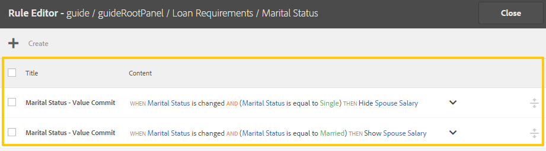

# 調適型表單規則編輯器{#adaptive-forms-rule-editor}

<span class="preview">Adobe 建議使用新式且可擴充的資料擷取[核心元件](https://experienceleague.adobe.com/docs/experience-manager-core-components/using/adaptive-forms/introduction.html)，用來[建立新的最適化表單](/help/forms/using/create-an-adaptive-form-core-components.md)或[將最適化表單新增到 AEM Sites 頁面](/help/forms/using/create-or-add-an-adaptive-form-to-aem-sites-page.md)。這些元件代表最適化表單建立方面的重大進步，可確保令人印象深刻的使用者體驗。本文會介紹使用基礎元件編寫最適化表單的舊方法。</span>

| 版本 | 文章連結 |
| -------- | ---------------------------- |
| AEM as a Cloud Service  | [按一下這裡](https://experienceleague.adobe.com/docs/experience-manager-cloud-service/content/forms/adaptive-forms-authoring/authoring-adaptive-forms-foundation-components/add-rules-and-use-expressions-in-an-adaptive-form/rule-editor.html) |
| AEM 6.5 | 本文章 |

## 概觀 {#overview}

Adobe Experience Manager Forms中的規則編輯器功能可讓表單業務使用者和開發人員在調適型表單物件上編寫規則。 這些規則會根據預設條件、使用者輸入及使用者對表單的動作，定義要在表單物件上觸發的動作。 它有助於進一步簡化表單填寫體驗，確保準確性和速度。

規則編輯器提供直覺式且簡化的使用者介面來撰寫規則。 規則 編輯者 為所有使用者提供可視化編輯者。 此外，僅針對表單高級使用者，規則 編輯者 提供了用于編寫規則和腳本的代碼編輯者。
<!-- Some of the key actions that you can perform on adaptive form objects using rules are:

* Show or hide an object
* Enable or disable an object
* Set a value for an object
* Validate the value of an object
* Execute functions to compute the value of an object
* Invoke a form data model service and perform an operation
* Set property of an object -->

規則 編輯者 取代 AEM 6.1 Forms 及更早版本中的 指令碼 功能。 但是，您現有的腳本會保留在新規則 編輯者中。 如需在規則編輯器中使用現有指令碼的詳細資訊，請參閱 [規則編輯器對現有指令碼的影響](#impact-of-rule-editor-on-existing-scripts).

新增至表單超級使用者群組的使用者可以建立新指令碼並編輯現有指令碼。 表單 — 使用者群組中的使用者可以使用指令碼，但不能建立或編輯指令碼。

## 瞭解規則 {#understanding-a-rule}

規則是動作和條件的組合。 在規則編輯器中，動作包括隱藏、顯示、啟用、停用或計算表單中物件值等活動。 條件是對表單物件的狀態、值或屬性執行檢查和作業來評估的Boolean運算式。 動作會根據值( `True` 或 `False`)傳回的結果。

規則編輯器提供一組預先定義的規則型別（例如「何時」、「顯示」、「隱藏」、「啟用」、「停用」、「設定值」和「驗證」）來協助您編寫規則。 每種規則型別都可讓您定義規則中的條件和動作。 本檔案將詳細說明每種規則型別。

規則通常會遵循下列其中一種建構：

**Condition-Action** 在此建構中，規則會先定義條件，接著定義要觸發的動作。 此建構與程式設計語言中的if-then陳述式類似。

在規則編輯器中， **時間** 規則型別會強制執行condition-action結構。

**Action-Condition** 在此建構中，規則會先定義要觸發的動作，接著定義評估條件。 此建構的另一個變數為action-condition-alternate action，這也會定義在條件傳回False時要觸發的替代動作。

規則編輯器中的「顯示」、「隱藏」、「啟用」、「停用」、「設定值」和「驗證」規則型別會強制實施動作條件規則結構。 依預設，「顯示」的替代動作是「隱藏」，而「啟用」的替代動作是「停用」，反之亦然。 您無法變更預設的替代動作。

>[!NOTE]
>
>可用的規則型別（包括您在規則編輯器中定義的條件和動作）也取決於您建立規則的表單物件型別。 規則編輯器僅顯示有效的規則型別和選項，用於寫入特定表單物件型別的條件和動作陳述式。 例如，您看不到面板物件的驗證、設定值、啟用和停用規則型別。

如需規則編輯器中可用規則型別的詳細資訊，請參閱 [規則編輯器中的可用規則型別](#available-rule-types-in-rule-editor).

### 選擇規則建構的准則 {#guidelines-for-choosing-a-rule-construct}

雖然您可以使用任何規則建構來實現大部分的使用案例，以下提供一些選擇建構勝過其他建構的准則。 如需規則編輯器中可用規則的詳細資訊，請參閱 [規則編輯器中的可用規則型別](#available-rule-types-in-rule-editor).

* 建立規則時，經驗法則的典型做法是思考您所撰寫規則的物件內容。 假設您要根據使用者在欄位A中指定的值隱藏或顯示欄位B。在此案例中，您評估欄位A的條件，並且根據它傳回的值，觸發欄位B的動作。

  因此，如果您在欄位B （您評估條件的物件）上撰寫規則，請使用condition-action建構或When規則型別。 同樣地，使用動作條件建構或在欄位A上顯示或隱藏規則型別。

* 有時候，您需要根據一個條件執行多個動作。 在這種情況下，建議使用條件 — 動作建構。 在此建構中，您可以評估條件一次，並指定多個動作陳述式。

  例如，若要根據條件隱藏欄位B、C和D，以檢查使用者在欄位A中指定的值，請撰寫一個具有條件 — 動作建構的規則或欄位A上的規則型別時並指定動作來控制欄位B、C和D的可見性。否則，您需要在欄位B、C和D上設定三個個別規則，每個規則會檢查條件並顯示或隱藏個別欄位。 在此範例中，在一個物件上撰寫When規則型別比在三個物件上撰寫Show或Hide規則型別更有效率。

* 若要根據多個條件來觸發動作，建議使用動作條件建構。 例如，若要藉由評估欄位B、C和D的條件來顯示和隱藏欄位A，請在欄位A上使用顯示或隱藏規則型別。
* 如果規則包含適用於一個條件的一個動作，請使用條件 — 動作或動作條件建構。
* 如果規則檢查條件，並在欄位中提供值或退出欄位時立即執行動作，則建議在評估條件的欄位上編寫具有條件 — 動作建構或When規則型別的規則。
* 當使用者變更套用When規則的物件值時，會評估When規則中的條件。 不過，如果您希望動作在伺服器端變更時觸發（例如預先填入值），建議寫入在欄位初始化時觸發動作的When規則。
* 在撰寫下拉清單、選項按鈕或核取方塊物件的規則時，這些表單物件在表單中的選項或值會預先填入規則編輯器中。

## 規則編輯器中可用的運運算元型別和事件 {#available-operator-types-and-events-in-rule-editor}

規則編輯器提供下列邏輯運運算元和事件，您可使用它們建立規則。

* **等於**
* **不等於**
* **開頭為**
* **結尾為**
* **包含**
* **為空**
* **不是空的**
* **已選取：** 當使用者為核取方塊、下拉式清單單選按鈕選取特定選項時，傳回true。
* **已初始化（事件）：** 當表單物件在瀏覽器中呈現時傳回true。
* **已變更（事件）：** 當使用者變更表單物件的輸入值或選取的選項時，傳回true。

## 規則編輯器中的可用規則型別 {#available-rule-types-in-rule-editor}

規則編輯器提供了一組預先定義的規則型別，您可以使用這些型別來撰寫規則。 讓我們來詳細瞭解一下每種規則型別。 如需有關在規則編輯器中寫入規則的詳細資訊，請參閱 [寫入規則](#write-rules).

### 時間 {#whenruletype}

此 **時間** 規則型別會遵循 **condition-action-alternate action** 規則建構，或有時僅 **condition-action** 建構。 在此規則類型中，首先指定評估條件，然後在滿足條件時觸發操作 （ `True`）。 使用 When 規則 類型時，可以使用多個 AND 和 OR 運算符來創建 [嵌套表達式](#nestedexpressions)。

使用 When 規則 類型，您可以評估表單對象的條件並對一個或多個物件執行操作。

簡而言之，典型的 When 規則 結構如下：

`When on Object A:`

`(Condition 1 AND Condition 2 OR Condition 3) is TRUE;`

`Then, do the following:`

物件B上的動作2；以及物件C上的動作3；

_

當您有多值元件（如單選按鈕或清單）時，為該元件建立規則時，會自動擷取選項，並讓規則建立者可以使用這些選項。 您不需要再次輸入選項值。

例如，清單有四個選項：紅色、藍色、綠色和黃色。 建立規則時，會自動擷取選項（選項按鈕），以供規則建立者使用，如下所示：


編寫 When 規則時，可以觸發清除值操作。 清除值操作將清除指定物件的值。 在 When 語句中使用「清除值」選項可以創建具有多個字段的複雜條件。


**隱藏** 隱藏指定的物件。

**顯示** 顯示指定的物件。

**啟用** 啟用指定的物件。

**停用** 停用指定的物件。

**啟動服務** 叫用表單資料模型中設定的服務。 選擇「啟動服務」作業時，會出現一個欄位。 點選欄位時，它會顯示在AEM執行個體上所有表單資料模型中設定的所有服務。 選擇表單資料模型服務時，會出現其他欄位，您可在其中對應具有指定服務的輸入和輸出引數的表單物件。 請參閱呼叫表單資料模型服務的規則範例。

除了表單資料模型服務之外，您還可以指定直接的WSDL URL來叫用Web服務。 不過，表單資料模型服務有許多優點，且建議叫用服務的方法。

如需在表單資料模型中設定服務的詳細資訊，請參閱 [AEM Forms資料整合](/help/forms/using/data-integration.md).

**設定值** 計算並設定指定物件的值。 您可以將物件值設為字串、其他物件的值、使用數學運算式或函式的計算值、物件屬性的值，或來自已設定表單資料模型服務的輸出值。 當您選擇Web服務選項時，它會顯示您的AEM執行個體上所有表單資料模型中設定的所有服務。 選擇表單資料模型服務時，會出現其他欄位，您可在其中對應具有指定服務的輸入和輸出引數的表單物件。

如需在表單資料模型中設定服務的詳細資訊，請參閱 [AEM Forms資料整合](/help/forms/using/data-integration.md).

此 **[!UICONTROL 設定屬性]** 規則型別可讓您根據條件動作來設定指定物件的屬性值。 您可以將屬性設定為下列其中一項：

* 可見（布林值）
* dorExclusion （布林值）
* chartType （字串）
* 標題（字串）
* 已啟用（布林值）
* 強制（布林值）
* validationsDisabled （布林值）
* validateExpMessage （字串）
* 值（數字、字串、日期）
* 專案（清單）
* 有效（布林值）
* errorMessage （字串）

它可讓您定義規則，以動態地將核取方塊新增至最適化表單。 您可以使用自訂函式、表單物件或物件屬性來定義規則。


若要根據自訂函式定義規則，請選取 **函式輸出** ，並從以下位置拖放自訂函式： **函式** 標籤。 如果符合條件動作，則自訂函式中定義的核取方塊數會新增至最適化表單。

若要根據表單物件定義規則，請選取 **表單物件** 從下拉式清單，將表單物件從 **表單物件** 標籤。 如果符合條件動作，在表單物件中定義的核取方塊數會新增至調適型表單。

根據物件屬性的「設定屬性」規則可讓您根據最適化表單中包含的其他物件屬性，新增最適化表單中的核取方塊數目。

下圖是根據最適化表單中的下拉式清單數量，以動態方式新增核取方塊的範例：


**清除值** 清除指定物件的值。

**設定焦點** 將焦點設定在指定的物件上。

**儲存表單** 儲存表單。

**提交Forms** 提交表單。

**重設表單** 重設表單。

**驗證表單** 驗證表單。

**新增例項** 新增指定之可重複面板或表格列的例項。

**移除例項** 移除指定之可重複面板或表格列的例項。

**瀏覽至** 導覽至其他互動式通訊、調適型表單、影像或檔案片段等其他資產，或外部URL。 如需詳細資訊，請參閱 [新增按鈕至互動式通訊](../../forms/using/create-interactive-communication.md#addbuttontothewebchannel).

### 設定值 {#set-value-of}

此 **[!UICONTROL 設定值]** 規則型別可讓您根據是否滿足指定的條件來設定表單物件的值。 值可以設定為另一個物件的值、常值字串、從數學運算式或函式衍生的值、另一個物件的屬性值，或表單資料模型服務的輸出。 同樣地，您可以檢查元件、字串、屬性或衍生自函式或數學運算式的值的條件。

規則型別的「設定值」不適用於所有表單物件，例如面板和工具列按鈕。 標準的「規則集值」具有下列結構：


將物件 A 的值設定為：

（字串 ABC）或
（物件 屬性 物件 C 的 X）或
（來自函數的值）或
（值來自數學運算式）或
（數據模型服務或Web服務的輸出值）;

時間（選擇）：

（條件 1 和條件 2 和條件 3） 為 TRUE;


以下範例接受值 `dependentid` 欄位作為輸入，並設定 `Relation` 欄位至的輸出 `Relation` 的引數 `getDependent` 表單資料模型服務。


使用表單資料模型服務的設定值規則範例

>[!NOTE]
>
>此外，您可以使用 Set 值 of 規則 從表單數據模型服務或 Web 服務的輸出填充下拉清單元件中的所有值。 但是，請確保選擇的輸出參數是數位類型。 数組中返回的所有值都可在指定的下拉清單中使用。

### 顯示 {#show}

使用 **顯示** 規則型別，您可以撰寫規則來根據是否滿足條件來顯示或隱藏表單物件。 若條件未滿足或傳回，Show rule型別也會觸發Hide動作 `False`.

典型的Show規則結構如下：


`Show Object A;`

`When:`

`(Condition 1 OR Condition 2 OR Condition 3) is TRUE;`

`Else:`

`Hide Object A;`


### 隱藏 {#hide}

與顯示規則型別類似，您可以使用 **隱藏** 規則型別，根據是否滿足條件來顯示或隱藏表單物件。 若條件未滿足或傳回，隱藏規則型別也會觸發「顯示」動作 `False`.

典型的「隱藏」規則結構如下：


`Hide Object A;`

`When:`

`(Condition 1 AND Condition 2 AND Condition 3) is TRUE;`

`Else:`

`Show Object A;`


### 啟用 {#enable}

此 **啟用** 規則型別可讓您根據是否滿足條件來啟用或停用表單物件。 Enable規則型別也會觸發Disable動作，以防條件未滿足或傳回 `False`.

典型的Enable規則結構如下：


`Enable Object A;`

`When:`

`(Condition 1 AND Condition 2 AND Condition 3) is TRUE;`

`Else:`

`Disable Object A;`


### 停用 {#disable}

與啟用規則型別類似， **停用** 規則型別可讓您根據是否滿足條件來啟用或停用表單物件。 若條件未滿足或傳回，Disable規則型別也會觸發Enable動作 `False`.

典型的「停用」規則結構如下：


`Disable Object A;`

`When:`

`(Condition 1 OR Condition 2 OR Condition 3) is TRUE;`

`Else:`

`Enable Object A;`

### 驗證 {#validate}

此 **驗證** 規則型別使用運算式驗證欄位中的值。 例如，您可以撰寫運算式來檢查指定名稱的文字方塊是否不包含特殊字元或數字。

典型的驗證規則結構如下：

`Validate Object A;`

`Using:`

`(Expression 1 AND Expression 2 AND Expression 3) is TRUE;`

>[!NOTE]
>
>如果指定的值不符合驗證規則，您可以向使用者顯示驗證訊息。 您可以在 **[!UICONTROL 指令碼驗證訊息]** 側邊欄中元件屬性的欄位。


### 設定選項 {#setoptionsof}

此 **設定選項** 規則型別可讓您定義規則，以動態地將核取方塊新增至最適化表單。 您可以使用表單資料模型或自訂函式來定義規則。

若要根據自訂函式定義規則，請選取 **函式輸出** ，並從以下位置拖放自訂函式： **函式** 標籤。 自訂函式中定義的核取方塊數會新增至最適化表單。


若要建立自訂函式，請參閱 [規則編輯器中的自訂函式](#custom-functions).

若要根據表單資料模型定義規則：

1. 選取 **服務輸出** 下拉式清單中的。
1. 選取資料模型物件。
1. 從中選擇資料模型物件屬性 **顯示值** 下拉式清單。 最適化表單中的核取方塊數目是從資料庫中為該屬性定義的例項數目衍生而來。
1. 從中選擇資料模型物件屬性 **儲存值** 下拉式清單。


## 瞭解規則編輯器使用者介面 {#understanding-the-rule-editor-user-interface}

規則編輯器提供完整但簡單的使用者介面，用於撰寫和管理規則。 您可以在撰寫模式下，從最適化表單中啟動規則編輯器使用者介面。

若要啟動規則編輯器使用者介面：

1. 以撰寫模式開啟最適化表單。
1. 選取您要為其編寫規則的表單物件，然後在元件工具列中選取 . 規則編輯器使用者介面隨即顯示。

   

   此檢視中會列出所選表單物件上的任何現有規則。 如需有關管理現有規則的資訊，請參閱 [管理規則](#manage-rules).

1. 選取 **[!UICONTROL 建立]** 撰寫新規則。 第一次啟動規則編輯器時，規則編輯器使用者介面的視覺化編輯器預設會開啟。

   

讓我們來詳細瞭解規則編輯器UI的每個元件。

### A.元件規則顯示 {#a-component-rule-display}

顯示啟動規則編輯器所使用的最適化表單物件的標題，以及目前選取的規則型別。 在上述範例中，規則編輯器是從名為Salary的最適化表單物件啟動，且選取的規則型別是When。

### B.表單物件與函式 {#b-form-objects-and-functions-br}

規則編輯器使用者介面左側的窗格包含兩個標籤 —  **[!UICONTROL Forms物件]** 和 **[!UICONTROL 函式]**.

「表單物件」標籤會顯示最適化表單中包含之所有物件的階層檢視。 它會顯示物件的標題和型別。 撰寫規則時，您可以將表單物件拖放至規則編輯器上。 創建或编辑規則時，將物件或函數拖放到佔位符中時，佔位符元會自動採用適當的值類型。

應用了一個或多個有效規則的表單物件用綠點標記。 如果無效應用於表單物件的任何規則，則表單對象將標有黃點。

函數標籤包括一組內置函數，如總和、最小值、最大值、平均值、數量和驗證窗體。 您可以使用這些函數來計算可重複面板和表行中的值，並在編寫規則時在操作和條件語句中使用它們。 不過，您可以建立 [自訂函式](#custom-functions) 也是。


>[!NOTE]
>
>您可以在Forms「物件」和「函式」標籤中搜尋物件和函式的名稱及標題。

在表單物件的左側樹狀結構中，您可以選取表單物件，以顯示套用到每個物件的規則。 您不僅可以瀏覽各種表單物件的規則，也可以在表單物件之間複製 — 貼上規則。 如需詳細資訊，請參閱 [複製貼上規則](#copy-paste-rules).

### C.表單物件與功能切換 {#c-form-objects-and-functions-toggle-br}

點選切換按鈕時，會切換表單物件和函式窗格。

### D.視覺規則編輯器 {#d-visual-rule-editor}

視覺化規則編輯器是規則編輯器使用者介面的視覺化編輯器模式中您編寫規則的區域。 它可讓您選取規則型別，並據此定義條件和動作。 在規則中定義條件和動作時，您可以從「表單物件與函式」窗格中拖放表單物件與函式。

如需使用視覺化規則編輯器的詳細資訊，請參閱 [寫入規則](#write-rules).

### E.視覺程式碼編輯器切換器 {#e-visual-code-editors-switcher}

表單超級使用者群組中的使用者可以存取程式碼編輯器。 其他使用者的程式碼編輯器無法使用。 如果您有許可權，您可以從視覺編輯器模式切換到規則編輯器的程式碼編輯器模式，反之，使用規則編輯器上方的切換器。 第一次啟動規則編輯器時，它會在視覺化編輯器模式下開啟。 您可以在視覺化編輯器模式中編寫規則，或切換到程式碼編輯器模式以編寫規則指令碼。 但請注意，如果您在程式碼編輯器中修改規則或寫入規則，則必須清除程式碼編輯器，才能切換回該規則的視覺化編輯器。

AEM Forms會追蹤您上次用來撰寫規則的規則編輯器模式。 當您下次啟動規則編輯器時，它將會在該模式下開啟。 不過，您也可以設定預設模式，以在指定模式中開啟規則編輯器。 若要這麼做：

1. 前往AEM網頁主控台，位於 `https://[host]:[port]/system/console/configMgr`.
1. 按一下以編輯 **[!UICONTROL 最適化表單和互動式通訊Web頻道設定]**.
1. 選擇 **[!UICONTROL 視覺化編輯器]** 或 **[!UICONTROL 代碼編輯器]** 從 **[!UICONTROL 規則編輯器的預設模式]** 下拉式清單

1. 按一下「**[!UICONTROL 儲存]**」。

### F.完成和取消按鈕 {#f-done-and-cancel-buttons}

此 **[!UICONTROL 完成]** 按鈕可用來儲存規則。 您可以儲存不完整的規則。 但是，不完整內容無效，因此不會執行。 當您下次從相同表單物件啟動規則編輯器時，會列出表單物件上已儲存的規則。 您可以在該檢視中管理現有規則。 如需詳細資訊，請參閱 [管理規則](#manage-rules).

此 **[!UICONTROL 取消]** 按鈕會放棄您對規則所做的任何變更並關閉規則編輯器。

## 寫入規則 {#write-rules}

您可以使用視覺規則編輯器或程式碼編輯器來撰寫規則。 當您第一次啟動規則編輯器時，它會在視覺化編輯器模式下開啟。 您可以切換到程式碼編輯器模式並編寫規則。 但請注意，如果您在程式碼編輯器中撰寫或修改規則，則必須清除程式碼編輯器，才能切換至該規則的視覺化編輯器。 當您下次啟動規則編輯器時，編輯器會以您上次使用來建立規則的模式開啟。

讓我們先來看看如何使用視覺化編輯器來撰寫規則。

### 使用視覺化編輯器 {#using-visual-editor}

讓我們瞭解如何使用下列範例表單在視覺化編輯器中建立規則。


範例貸款申請表單中的「貸款需求」區段要求申請人指定其婚姻狀況、薪資，如果已婚，則指定其配偶的薪資。 規則會根據使用者輸入來計算貸款資格金額，並顯示在「貸款資格」欄位中。 套用下列規則以實施情境：

* 配偶的「薪資」欄位僅在「婚姻狀況」為「已婚」時顯示。
* 貸款資格金額為薪資總額的50%。

執行以下步驟來撰寫規則：

1. 首先，根據使用者為「婚姻狀況」選項按鈕選取的選項，撰寫規則以控制「配偶薪資」欄位的可見度。

   以編寫模式開啟貸款申請表單。 選取 **婚姻狀況** 元件並選取 . 接下來，選取 **[!UICONTROL 建立]** 以啟動規則編輯器。

   

   啟動規則編輯器時，預設會選取When規則。 此外，您啟動規則編輯器的表單物件（在此例中為「婚姻狀況」）會在When陳述式中指定。

   雖然您無法變更或修改選取的物件，但可以使用規則下拉式清單（如下所示）來選取其他規則型別。 如果您想在其他物件上建立規則，請選取「取消」結束規則編輯器，然後從想要的表單物件再次啟動它。

1. 選取 **[!UICONTROL 選取狀態]** 下拉式清單並選取 **[!UICONTROL 等於]**. 此 **[!UICONTROL 輸入字串]** 欄位隨即顯示。

   

   在婚姻狀況選項按鈕中， **已婚** 和 **單一** 已指派選項 **0** 和 **1** 個值。 您可以在「編輯」選項按鈕對話方塊的「標題」標籤中驗證指派的值，如下所示。

   

1. 在 **輸入字串** 欄位，請指定 **0**.

   

   您已將條件定義為 `When Marital Status is equal to Married`. 接著，定義若此條件為True時要執行的動作。

1. 在Then陳述式中，選取 **[!UICONTROL 顯示]** 從 **[!UICONTROL 選取動作]** 下拉式清單。

   

1. 拖放 **配偶薪資** 欄位。 **將物件放下或選取這裡** 欄位。 或者，選取 **將物件放下或選取這裡** 欄位並選取 **配偶薪資** 欄位，其中列出表單中的所有表單物件。

   

   規則在規則編輯器中會顯示如下。

   

   選取 **完成** 以儲存規則。

1. 重複步驟1到5，定義另一個規則，以在「婚姻狀況」為「單身」時隱藏「配偶薪資」欄位。 規則在規則編輯器中會顯示如下。

   

   >[!NOTE]
   >
   >或者，您可以在「配偶薪資」欄位上撰寫一個「顯示」規則，而不是在「婚姻狀況」欄位上撰寫兩個「當規則」，以實施相同的行為。

   

1. 接著，撰寫規則以計算貸款資格金額（為薪資總額的50%），並在「貸款資格」欄位中顯示。 若要完成此操作，請建立 **設定值** 貸款資格欄位上的規則。

   在製作模式中，選取 **[!UICONTROL 貸款資格]** 欄位並選取 . 接下來，選取 **[!UICONTROL 建立]** 以啟動規則編輯器。

1. 選取 **[!UICONTROL 設定值]** 規則。

   

1. 選取 **[!UICONTROL 選取選項]** 並選取 **[!UICONTROL 數學運算式]**. 用於寫入數學運算式的欄位隨即開啟。

   

1. 在運算式欄位中：

   * 從「Forms物件」標籤中選取或拖放 **薪資** 第一個欄位 **將物件放下或選取這裡** 欄位。

   * 選取 **加號** 從 **選取運運算元** 欄位。

   * 從「Forms物件」標籤中選取或拖放 **配偶薪資** 另一個欄位 **將物件放下或選取這裡** 欄位。

   

1. 接著，在運算式欄位周圍反白的區域中選取，然後選取 **延伸運算式**.

   

   在延伸運算式欄位中，選取 **除以** 從 **選取運運算元** 欄位和 **數字** 從 **選取選項** 欄位。 然後，指定 **2** 在數字欄位中。

   

   >[!NOTE]
   >
   >您可以在「選取選項」欄位中使用元件、函式、數學運算式和屬性值來建立複雜運算式。

   接著，建立條件，當傳回True時，執行運算式。

1. 選取 **新增條件** 新增When陳述式。

   

   在When陳述式中：

   * 從「Forms物件」標籤中選取或拖放 **婚姻狀況** 第一個欄位 **將物件放下或選取這裡** 欄位。

   * 選取&#x200B;**s等於** 從 **選取運運算元** 欄位。

   * 選取其他中的字串 **將物件放下或選取這裡** 欄位並指定 **已婚** 在 **輸入字串** 欄位。

   規則最後會顯示在規則編輯器中，如下所示。  

   選取 **完成** 以儲存規則。

1. 重複步驟7到12，定義另一個規則，以計算婚姻狀況為「單身」時的貸款資格。 規則在規則編輯器中會顯示如下。

   

>[!NOTE]
>
>或者，您可以使用「設定值」規則，在您建立用來顯示 — 隱藏「配偶薪資」欄位的「時機」規則中，計算貸款資格。 當「婚姻狀況」為「單一」時，產生的合併規則會顯示在規則編輯器中，如下所示。
>
>同樣地，您可以撰寫合併規則來控制「配偶薪資」欄位的可見度，並在「婚姻狀況」為「已婚」時計算貸款資格。


### 使用程式碼編輯器 {#using-code-editor}

新增至表單超級使用者群組的使用者可使用程式碼編輯器。 規則編輯器會自動為您使用視覺化編輯器建立的任何規則產生JavaScript程式碼。 您可以從視覺化編輯器切換到程式碼編輯器以檢視產生的程式碼。 不過，如果您在程式碼編輯器中修改規則程式碼，則無法切換回視覺化編輯器。 如果您偏好在程式碼編輯器中而不是視覺化編輯器中撰寫規則，您可以在程式碼編輯器中重新撰寫規則。 視覺化程式碼編輯器切換器可協助您在兩種模式之間切換。

程式碼編輯器JavaScript是適用性表單的運算式語言。 所有運算式都是有效的JavaScript運算式，並使用適用性表單指令碼模型API。 這些運算式會傳回某些型別的值。 如需最適化表單類別、事件、物件和公用API的完整清單，請參閱 [適用性表單的JavaScript資料庫API參考](https://helpx.adobe.com/experience-manager/6-5/forms/javascript-api/index.html).

如需有關在程式碼編輯器中寫入規則之指引的詳細資訊，請參閱 [最適化表單運算式](/help/forms/using/adaptive-form-expressions.md).

在規則編輯器中撰寫JavaScript程式碼時，下列視覺提示可協助您瞭解結構和語法：

* 語法醒目提示
* 自動縮排
* 表單物件、函式及其屬性的提示與建議
* 自動完成表單元件名稱和常見JavaScript函式


#### 規則編輯器中的自訂函式 {#custom-functions}

除了開箱即用的功能，例如 *總和* 列在函式輸出下的自訂函式，您可以編寫經常需要的自訂函式。 請確認您撰寫的函式是否隨附 `jsdoc` 高於它。

隨附 `jsdoc` 為必填：

* 如果您需要自訂設定和說明。
* 因為有多種方式可以在中宣告函式 `JavaScript,` 和註解可讓您追蹤函式。

如需詳細資訊，請參閱 [usejsdoc.org](https://jsdoc.app/).

支援 `jsdoc` 標籤：

* **私人**
語法： `@private`
私人函式不會納入為自訂函式。

* **名稱**
語法： `@name funcName <Function Name>`
或者 `,` 您可以使用： `@function funcName <Function Name>` **或** `@func` `funcName <Function Name>`.
  `funcName` 是函式的名稱（不允許空格）。
  `<Function Name>` 是函式的顯示名稱。

* **會員**
語法： `@memberof namespace`
將名稱空間附加至函式。

* **引數**
語法： `@param {type} name <Parameter Description>`
或者，您可以使用： `@argument` `{type} name <Parameter Description>` **或** `@arg` `{type}` `name <Parameter Description>`.
顯示函式使用的引數。 一個函式可以有多個引數標籤，每個引數會依發生順序各一個標籤。
  `{type}` 代表引數型別。 允許的引數型別為：

   1. 字串
   1. 數字
   1. 布林值
   1. 範圍

  範圍是用來反向連結最適化表單的欄位。 表單使用緩慢載入時，您可以使用 `scope` 以存取其欄位。 您可以在載入欄位時存取欄位，或者如果欄位標示為全域。

  所有其他引數型別則歸類於上述其中一種。 不支援任何專案。 請確定您選取以上任一型別。 型別不區分大小寫。 引數中不允許空格 `name`. `<Parameter Descrption>` `<parameter>  can have multiple words. </parameter>`

* **傳回型別**
語法： `@return {type}`
或者，您可以使用 `@returns {type}`.
新增函式的相關資訊，例如其目標。
{type} 代表函式的傳回型別。 允許的傳回型別為：

   1. 字串
   1. 數字
   1. 布林值

  所有其他回訪型別則會歸類到上述任一型別下。 不支援任何專案。 請確定您選取以上任一型別。 傳回型別不區分大小寫。

* **這個**
語法： `@this currentComponent`

  使用@this可參照寫入規則的最適化表單元件。

  以下範例是根據欄位值。 在以下範例中，規則會隱藏表單中的欄位。 此 `this` 部分 `this.value` 是指寫入規則的基礎調適型表單元件。

  ```
     /**
     * @function myTestFunction
     * @this currentComponent
     * @param {scope} scope in which code inside function will be executed.
     */
     myTestFunction = function (scope) {
        if(this.value == "O"){
              scope.age.visible = true;
        } else {
           scope.age.visible = false;
        }
     }
  ```

>[!NOTE]
>
>使用自訂函式之前的註解作為摘要。 摘要可以延伸至多行，直到遇到標籤為止。 將大小限製為單一，以在規則產生器中提供簡要說明。

<!--
**Adding a custom function**

For example, you want to add a custom function which calculates area of a square. Side length is the user input to the custom function, which is accepted using a numeric box in your form. The calculated output is displayed in another numeric box in your form. To add a custom function, you have to first create a client library, and then add it to the CRX repository.

Perform the following steps to create a client library and add it in the CRX repository.

1. Create a client library. For more information, see [Using Client-Side Libraries](/help/sites-developing/clientlibs.md).
2. In CRXDE, add a property `categories`with string type value as `customfunction` to the `clientlib` folder.

   >[!NOTE]
   >
   >`customfunction`is an example category. You can choose any name for the category you create in the `clientlib`folder.

After you have added your client library in the CRX repository, use it in your adaptive form. It lets you use your custom function as a rule in your form. Perform the following steps to add the client library in your adaptive form.

1. Open your form in edit mode.
   To open a form in edit mode, select a form and select **Open**.
1. In the edit mode, select a component, then select  &gt; **Adaptive Form Container**, and then select .
1. In the sidebar, under Name of Client Library, add your client library. ( `customfunction` in the example.)

   

1. Select the input numeric box, and select  to open the rule editor.
1. Select **Create Rule**. Using options shown below, create a rule to save the squared value of the input in the Output field of your form.
   [ ](assets/add-custom-rule.png)Select **Done**. Your custom function is added.

#### Function declaration supported types {#function-declaration-supported-types}

**Function Statement**

```javascript
function area(len) {
    return len*len;
}
```

This function is included without `jsdoc` comments.

**Function Expression**

```javascript
var area;
//Some codes later
/** */
area = function(len) {
    return len*len;
};
```

**Function Expression and Statement**

```javascript
var b={};
/** */
b.area = function(len) {
    return len*len;
}
```

**Function Declaration as Variable**

```javascript
/** */
var x1,
    area = function(len) {
        return len*len;
    },
    x2 =5, x3 =true;
```

Limitation: custom function picks only the first function declaration from the variable list, if together. You can use function expression for every function declared.

**Function Declaration as Object**

```javascript
var c = {
    b : {
        /** */
        area : function(len) {
            return len*len;
        }
    }
};
```

>[!NOTE]
>
>Ensure that you use `jsdoc` for every custom function. Although `jsdoc`comments are encouraged, include an empty `jsdoc`comment to mark your function as custom function. It enables default handling of your custom function.
-->

您也可以在規則編輯器中使用自訂函式。 如需建立自訂函式的指示，請參閱文章 [最適化Forms中的自訂函式](/help/forms/using/create-and-use-custom-functions.md).

## 管理規則 {#manage-rules}

當您選取物件並選取時，會列出表單物件上的任何現有規則 . 您可以檢視標題並預覽規則摘要。 此外，UI可讓您展開並檢視完整的規則摘要、變更規則順序、編輯規則及刪除規則。



您可以對規則執行下列動作：

* **展開/摺疊**：規則清單中的「內容」欄會顯示規則內容。 如果預設檢視中看不到整個規則內容，請選取「 」  以展開它。

* **重新排序**：您建立的任何新規則都會棧疊在規則清單底部。 規則會從上到下執行。 頂端的規則會先執行，接著是相同型別的其他規則。 例如，如果您分別從上方的第一、第二、第三和第四個位置有When、Show、Enable和When規則，則頂端的規則會先執行，接著在第四個位置執行When規則。 接著會執行「顯示」和「啟用」規則。
您可以點選以變更規則的順序  或將其拖放到清單中的所需順序。

* **編輯**：若要編輯規則，請選取規則標題旁的核取方塊。 會出現編輯和刪除規則的其他選項。 選取 **編輯** 以視覺化或程式碼編輯器模式，在規則編輯器中開啟選取的規則（視用於建立規則的模式而定）。

* **刪除**：若要刪除規則，請選取該規則並選取 **刪除**.

* **啟用/停用**：您可能需要暫時暫停使用規則。 您可以選取一或多個規則，然後選取「動作」工具列中的「停用」來停用這些規則。 如果規則已停用，則不會在執行階段執行。 若要啟用已停用的規則，您可以選取該規則，然後選取動作工具列中的「啟用」 。 規則的狀態列顯示規則是啟用還是停用。


## 複製貼上規則 {#copy-paste-rules}

您可以將規則從一個欄位複製並貼上到其他類似欄位，以節省時間。

若要複製貼上規則，請執行下列動作：

1. 選取您要從中複製規則的表單物件，然後在元件工具列中選取 . 規則編輯器使用者介面會出現，並選取表單物件，而現有規則會出現。

   

   如需有關管理現有規則的資訊，請參閱 [管理規則](#manage-rules).

1. 選取規則標題旁的核取方塊。 管理規則的其他選項隨即顯示。 選取 **複製**.

   

1. 選取另一個要貼上規則的表單物件，然後選取 **貼上**. 此外，您可以編輯規則以對其進行變更。

   >[!NOTE]
   >
   >只有當表單物件支援所複製規則的事件，您才能將規則貼到另一個表單物件。 例如，按鈕支援點選事件。 您可以將具有點選事件的規則貼到按鈕上，但無法貼到核取方塊上。

1. 選取 **完成** 以儲存規則。

## 巢狀運算式 {#nestedexpressions}

規則編輯器可讓您使用多個AND和OR運運算元來建立巢狀規則。 您可以在規則中混合使用多個AND和OR運運算元。

以下是巢狀規則的範例，該規則會在符合所需條件時，向使用者顯示有關子女監護權的資格的訊息。


您也可以拖放規則中的條件以進行編輯。 選取並將滑鼠懸停在控點上( )。 指標變成如下所示的手形符號後，請將條件拖放至規則內的任何位置。 規則結構會變更。


## 日期運算式條件 {#dateexpression}

規則編輯器可讓您使用日期比較來建立條件。

以下是一個範例條件，會在房屋抵押貸款已辦理時顯示靜態文字物件，使用者填寫日期欄位即表示該條件。

當使用者填寫的屬性按揭日期為過去時，最適化表單會顯示收入計算的相關備註。 下列規則會比較使用者填寫的日期與目前日期，如果使用者填寫的日期早於目前日期，則表單會顯示文字訊息（名為「收入」）。


當填寫日期早於目前日期時，表單會顯示文字訊息（收入）如下：


## 數字比較條件 {#number-comparison-conditions}

規則編輯器可讓您建立比較兩個數字的條件。

下列範例條件會顯示靜態文字物件，前提是應徵者在其目前地址停留的月數小於36。


當使用者表示他在目前的居住地址生活了不到36個月時，表單會顯示通知以要求額外的居住證明。


## 規則編輯器對現有指令碼的影響 {#impact-of-rule-editor-on-existing-scripts}

在AEM 6.1 Forms Feature Pack 1之前的AEM Forms版本中，表單作者和開發人員習慣於在編輯元件對話方塊的「指令碼」索引標籤中撰寫運算式，以將動態行為新增至調適型表單。 「指令碼」標籤現在由規則編輯器取代。

您必須在「指令碼」標籤中編寫的任何指令碼或運算式都可在規則編輯器中使用。 雖然您無法在視覺化編輯器中檢視或編輯它們，但如果您是表單超級使用者群組的一部分，則可以在程式碼編輯器中編輯指令碼。

## 規則範例 {#example}

### 啟動表單資料模型服務 {#invoke}

考慮使用Web服務 `GetInterestRates` 以貸款金額、保有權及申請者的信用評分作為輸入，並傳回包含EMI金額和利率的貸款計畫。 您可以使用Web服務作為資料來源來建立表單資料模型。 您新增資料模型物件和 `get` 表單模型的服務。 此服務會出現在表單資料模型的「服務」標籤中。 然後，建立包含資料模型物件欄位的最適化表單，以擷取貸款金額、使用期限和信用評分的使用者輸入。 新增觸發Web服務擷取計畫詳細資料的按鈕。 輸出會填入適當的欄位中。

下列規則顯示如何設定叫用服務動作以完成範例情境。


使用最適化表單規則叫用表單資料模型服務

>[!NOTE]
>
>如果輸入為陣列型別，則支援陣列的欄位會顯示在「輸出」下拉式區段下。

### 使用When規則觸發多個動作 {#triggering-multiple-actions-using-the-when-rule}

在貸款申請表單中，您想要擷取貸款申請人是否為現有客戶。 根據使用者提供的資訊，客戶ID欄位應顯示或隱藏。 此外，如果使用者是現有客戶，您想要將焦點設定在客戶ID欄位。 貸款申請表單包含下列元件：

* 單選按鈕， **您是Geometrixx現有客戶嗎？**，會提供「是」和「否」選項。 「是」的值為 **0** 而否 **1**.

* 文字欄位， **Geometrixx客戶ID**，以指定客戶ID。

當您在選項按鈕上編寫實施此行為的When規則時，該規則在視覺規則編輯器中會顯示如下。  

視覺化編輯器中的規則

在範例規則中，When區段中的陳述式是條件，當傳回True時，會執行Then區段中指定的動作。

此規則在程式碼編輯器中會顯示如下。


程式碼編輯器中的規則

### 在規則中使用函式輸出 {#using-a-function-output-in-a-rule}

在採購單表單中，您有下表，使用者將在其中填寫訂單。 在此表格中：

* 第一列是可重複的，因此使用者可以訂購多個產品並指定不同的數量。 其元素名稱為 `Row1`.
* 重複資料列之「產品數量」欄中的儲存格標題為「數量」。 此儲存格的元素名稱為 `productquantity`.
* 表格中的第二列是不可重複的，且此列中「產品數量」欄中的儲存格標題為「總數量」。


**答：** Row1 **B.** 數量 **C.** 總數量

現在，您要在所有產品的「產品數量」欄中新增指定數量，並在「總數量」儲存格中顯示總和。 您可以在「總數量」儲存格上撰寫「設定值」規則，以達成此目的，如下所示。


視覺化編輯器中的規則

此規則在程式碼編輯器中會顯示如下。


程式碼編輯器中的規則

### 使用運算式驗證欄位值 {#validating-a-field-value-using-expression}

在上一個範例中說明的採購單表單中，您想要限制使用者訂購超過一10000數量的產品。 為此，您可以編寫驗證規則，如下所示。


視覺化編輯器中的規則

此規則在程式碼編輯器中會顯示如下。


程式碼編輯器中的規則
