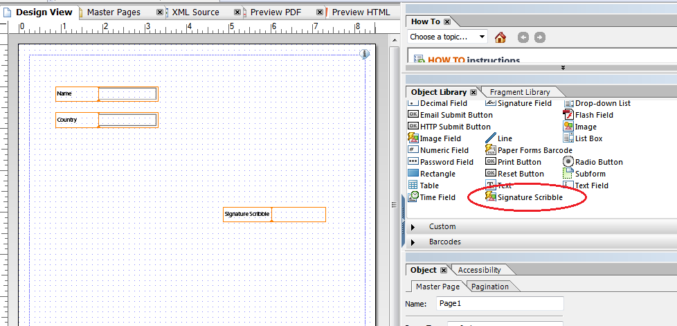

# 在HTML5表格中使用塗鴉簽名{#using-scribble-signature-in-html-forms}

HTML5表格在觸控裝置上的運用越來越多，而支援簽名是其中一項常見需求。 划線（用觸控筆或手指寫字）正成為在行動裝置上簽署表格的公認方式。 HTML5表單和表單設計工具現在可讓您選擇在表單上使用塗鴉簽名欄位。 當在瀏覽器中轉譯表單時，您可以使用觸控筆、滑鼠或觸控來登入這些欄位。

## 如何使用「塗鴉簽名」欄位設計表格 {#how-to-design-a-form-using-scribble-signature-field}

1. 在Forms Designer中開啟表格。
1. 將「簽名塗鴉」欄位拖放至頁面上。

   

   >[!NOTE]
   >
   >在顯示欄位時，會反映在Forms Designer中選擇的欄位的維。 但是，渲染的簽名框的尺寸是根據欄位的長寬比來計算的，而不是根據在Forms Designer中指定的尺寸計算的。

1. 設定「簽名塗鴉」欄位。

   依預設，「簽名塗鴉」欄位會在iPad上的簽署程式中將地理位置資訊標示為必填項目（其他裝置則為選擇性項目）。 變更屬性的值可覆寫此預設 `geoLocMandatoryOnIpad` 行為。 Signature Scribble Field中還提供額外設施。 修改步驟如下：

   1. 在表單上，選取「簽名塗鴉」欄位。
   1. 選擇「 **XML源」頁籤** 。

      >[!NOTE]
      >
      >要開啟「XML源」頁籤，請按一下「 **查看** 」> **「XML源」**。

   1. 在標籤 `<ui>` 中找到標 `<field>` 記，並修改原始碼，使其如下所示：

      ```xml
      <extras name="x-scribble-add-on">
      <boolean name="geoLocMandatoryOnIpad">0</boolean>
      </extras>
      ```

   1. 選擇「設 **計視圖** 」頁籤。 在確認框中，按一下「 **是」**。
   1. 儲存表格。

1. 在支援的裝置／案頭瀏覽器上轉譯表格。

## 與塗鴉簽名連接 {#interfacing-with-the-scribble-signatures}

### 簽署 {#signing}

將「簽名塗鴉」欄位新增至表單並轉譯後，按一下或點選欄位會開啟對話方塊。 使用者可使用滑鼠、手指或手寫筆，在由點狀矩形指定的繪圖區域中塗鴉簽名。


******** 答：筆刷 **B.橡皮**&#x200B;擦C.**Geolocation** D.地理位置資訊

### 地理標籤 {#geo-tagging}

在建立塗鴉時按一下地理位置圖示，會將地理位置和時間資訊嵌入欄位中。

>[!NOTE]
依預設，在iPad上，必須內嵌地理位置資訊。

在iPad上，預設不會顯示地理位置圖示，當您按一下「確定」時，地理位置資訊會自動 **內嵌**。

若是iPad，此設定可修改為欄位 `geoLocManadatoryOnIpad` 的init `0`參數中的參數值。

* 當地理位置資訊是強制性的時候，向用戶呈現縮小的繪製區域。 當使用者按一下其餘區域上的「確 **定** 」圖示時，會新增地理位置文字。
* 在其他情況下，使用者會呈現完整可拉式區域。 如果使用者選擇內嵌地理位置資訊，則會調整此區域的大小以容納地理位置文字。

### 清除簽名 {#clearing-a-signature}

使用此功能時，使用者可以按一下「橡皮擦 **」圖示** ，以清除欄位，然後重頭開始。 如果已新增地理位置資訊，也會清除。

### 儲存簽名 {#saving-a-signature}

按一下「 **確定** 」圖示，即可將塗鴉文字儲存為欄位中的影像。 影像和值可提交至伺服器以進行進一步處理。 用戶按一下「 **OK**（確定）」後，塗鴉欄就會鎖定。 無法使用塗鴉小工具集再次編輯簽名。

點選或按一下「塗鴉」欄位，會以唯讀模式開啟對話方塊。


### 選擇筆大小 {#selecting-pen-size}

按一下「 **筆刷** 」圖示以顯示可用筆大小的清單。 按一下或點選筆大小以使用相應的筆。

### 從表單刪除簽名 {#delete-signatures-from-the-form}

要從表單中刪除簽名：

* （行動裝置）長按簽名欄位，在確認對話方塊中點選「 **是」**。
* （案頭）將滑鼠指標暫留在簽名欄位上，按一下「 **取消** 」圖示，然後在確認對話方塊上，按一下「 **是」**。

[聯絡支援](https://www.adobe.com/account/sign-in.supportportal.html)
