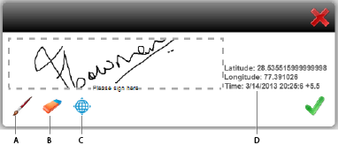

# 在HTML5表單中使用手寫簽名{#using-scribble-signature-in-html-forms}

HTML5表單在觸控式裝置上正日益使用，其中一項常見需求是支援簽名。 划線（用手寫筆或手指書寫）正成為在移動設備上簽署表格的一種接受方式。 HTML5表單和Forms Designer現在啟用表單上有手寫簽名欄位的選項。 在瀏覽器中呈現表單時，您可以使用手寫筆、滑鼠或觸控來登入這些欄位。

## 如何使用手寫簽名欄位{#how-to-design-a-form-using-scribble-signature-field}設計表單

1. 在Forms Designer中開啟表單。
1. 將「簽名手寫」欄位拖放到頁面上。

   

   >[!NOTE]
   >
   >呈現欄位時，會反映在Forms Designer中選取的欄位Dimension。 不過，已呈現的簽名框的尺寸是根據欄位的長寬比計算的，而不是根據Forms Designer中指定的尺寸。

1. 配置簽名手寫欄位。

   依預設，「簽名手寫」欄位會將地理位置資訊標示為iPad上簽署程式期間的必要項目（其他裝置均可選用）。 可通過更改`geoLocMandatoryOnIpad`屬性的值來覆蓋此預設行為。 此旅館在簽名手寫欄位中提供額外資訊。 修改步驟如下：

   1. 在表單上，選擇簽名手寫欄位。
   1. 選擇&#x200B;**XML源**&#x200B;頁簽。

      >[!NOTE]
      >
      >要開啟「XML源」頁簽，請按一下「**查看** > **XML源**」。

   1. 在`<field>`標籤中找出`<ui>`標籤，並修改原始碼，使其如下所示：

      ```xml
      <extras name="x-scribble-add-on">
      <boolean name="geoLocMandatoryOnIpad">0</boolean>
      </extras>
      ```

   1. 選擇&#x200B;**設計視圖**&#x200B;頁簽。 在確認框中，按一下「**是**」。
   1. 儲存表單。

1. 在支援的裝置/案頭瀏覽器上轉譯表單。

## 與手寫簽名{#interfacing-with-the-scribble-signatures}介面

### 正在簽署 {#signing}

將簽名手寫欄位添加到表單並呈現後，按一下或點選該欄位將開啟一個對話框。 用戶可以使用滑鼠、手指或手寫筆，在由點狀矩形指定的繪製區中手寫簽名。



**A.筆** 刷 **B.橡皮** 擦 **C.地理位** 置 **D.** 地理位置資訊

### 地理標籤{#geo-tagging}

在建立手寫文字時按一下地理位置圖示會將地理位置和時間資訊嵌入欄位中。

>[!NOTE]
依預設，在iPad上，必須內嵌地理位置資訊。

在iPad上，預設不會顯示地理位置圖示，當您按一下&#x200B;**OK**&#x200B;時，地理位置資訊會自動內嵌。

對於iPad，可在欄位的init參數中將`geoLocManadatoryOnIpad`參數的值修改為`0`，以更改此設定。

* 當地理位置資訊是強制性的時，向用戶呈現縮小的繪製區域。 當使用者按一下剩餘區域的&#x200B;**OK**&#x200B;圖示時，會新增地理位置文字。
* 在其他情況下，向用戶呈現完全可拉延區域。 如果用戶選擇嵌入地理位置資訊，則調整此區域的大小以容納地理位置文本。

### 清除簽名{#clearing-a-signature}

使用此功能時，用戶可以按一下&#x200B;**橡皮擦**&#x200B;表徵圖來清除欄位，然後重新開始。 如果新增地理位置資訊，也會清除。

### 保存簽名{#saving-a-signature}

按一下&#x200B;**OK**&#x200B;圖示，將手寫內容儲存為欄位中的影像。 影像和值可提交至伺服器以供進一步處理。 一旦用戶按一下&#x200B;**OK**，手寫欄位就會被鎖定。 無法使用手寫介面工具集再次編輯簽名。

點選或按一下「手寫」欄位會以唯讀模式開啟對話方塊。


### 選擇筆大小{#selecting-pen-size}

按一下&#x200B;**畫筆**&#x200B;表徵圖以顯示可用筆大小的清單。 按一下或點選筆大小以使用相應的筆。

### 從{#delete-signatures-from-the-form}表單中刪除簽名

要從表單中刪除簽名：

* （行動裝置）長按簽名欄位，然後在確認對話方塊上，點選&#x200B;**Yes**。
* （案頭）暫留在簽名欄位上，按一下&#x200B;**取消**&#x200B;圖示，然後在確認對話方塊上，按一下&#x200B;**是**。
