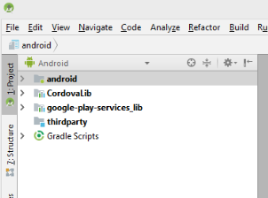

# 建立AEM Forms android應用程式 {#build-the-aem-forms-android-app}

在建議的序列中執行下列步驟，以建立AEM Forms的Android應用程式。

1. [下載AEM Forms App原始程式碼套件](/help/forms/using/setup-eclipse-project-build-installer.md#main-pars-header-277929160)
1. [設定環境變數](/help/forms/using/setup-eclipse-project-build-installer.md#main-pars-header-111803610)
1. [建立標準AEM Forms應用程式](/help/forms/using/setup-eclipse-project-build-installer.md#main-pars-heading-0)

## 下載AEM Forms App原始程式碼套件 {#download-android-zip}

AEM Forms App Source Code Package會參照封存 `adobe-lc-mobileworkspace-src-<version>.zip` 檔。 此封存包含建立自訂AEM Forms應用程式所需的原始碼。 封裝共用上可 `adobe-aemfd-forms-app-src-pkg-<version>.zip`用的套件包含封裝。

請執行下列步驟以下載檔 `adobe-aemfd-forms-app-src-pkg-<version>.zip` 案：

1. 以管理員身分登入 [AEM伺服器的作者例項](http://localhost:4502/) ，並開啟套 [件共用](http://localhost:4502/crx/packageshare)。 您需要Adobe ID才能登入套件共用。
1. 在 [AEM套件共用中](http://localhost:4502/crx/packageshare/login.html)，搜尋 `adobe-aemfd-forms-app-src-pkg-<version>.zip`、按一下適用於您作業系統的套件，然後按一下「 **下載」**。 閱讀並接受授權合約，然後按一下「 **確定**」。 下載開始。 下載後，「已下 **載** 」一詞會出現在套件旁。
1. 下載完成後，按一下「已 **下載**」。 您被重定向到包管理器。 在包管理器中，搜索下載的包，然後按一下安 **裝**。
1. 若要下載原始碼封存檔，請在您的瀏覽器中開啟 **https://&lt;server>:&lt;port>/crx/de/content/forms/mobileapps/src/adobe-lc-mobileworkspace-src-&lt;version>.zip** 。 Android應用程式。zip檔案會下載到您的裝置上。
1. 將。zip檔案的內容解壓縮至您本機檔案系統上的檔案夾。 例如， *C:\&amp;lt;Folder Structure>\adobe-lc-mobileworkspace-src-2.4.20*

下圖顯示資料夾的 `adobe-lc-mobileworkspace-src-<version>.zip\android`結構。

## 設定環境變數 {#set-environment-variable-android}

在開始AEM Forms應用程式的建立程式之前，請先設定下列環境變數：

* 將JAVA_HOME環境變數設定為本地檔案系統上JDK軟體的位置。 例如，C:\Program Files\Java\jdk1.8.0_181
* 將系統 `ANDROID_SDK_ROOT` 環境變數設為Android的SDK位置。 例如，C:\Users\&amp;lt;username>\AppData\Local\Android\Sdk
* 設定系 `Path` 統環境變數，以包含Android的平台工具和工具檔案夾位置。 例如，C:\Users\&amp;lt;username>\AppData\Local\Android\Sdk\platform-tools and C:\Users\&amp;lt;username>\AppData\Local\Android\Sdk\tools。

## 建立標準AEM Forms應用程式 {#set-up-the-xcode-project}

在本機檔案系統上儲存adobe-lc-mobileworkspace-src-&lt;version>.zip檔案並設定環境變數後，請使用下列任一選項建立標準AEM Forms android應用程式：

* [使用Android studio建立AEM Forms應用程式](/help/forms/using/setup-eclipse-project-build-installer.md#main-pars-header-1347434739)
* [使用Android studio產生。apk檔案](/help/forms/using/setup-eclipse-project-build-installer.md#main-pars-header-0)

### 使用Android studio建立AEM Forms應用程式 {#using-android-studio}

執行下列步驟，以使用Android studio建立AEM Forms應用程式：

1. 在您的電腦上啟動Android studio應用程式。
1. 按一 **下「開啟現有的Android studio專案」**。 如果開啟現有項目的對話框未自動顯示，請選擇「文 **件** 」>「 **開啟」**。
1. 導覽至 *本機檔案系統上的adobe-lc-mobileworkspace-src-&lt;version>.zip/android* ，然後按一下「 **確定」**。

   左 **窗格中** ，會顯示android選項。

   

1. 從左 **窗格選取** 「android」，然後按一 **下「執行** > **執行&#39;android&#39;」**。
1. 從「選擇部署目標」對話方塊的「已連線裝置」區段中選取Android裝置，然後按一下「確定」。

   成功建立開發環境後，您現在可以在應用程式上套用自訂設定。 使用下列文章自訂應用程式：

   * [品牌自訂](/help/forms/using/branding-customization.md)
   * [主題自訂](/help/forms/using/theme-customization.md)
   * [手勢自訂](/help/forms/using/gesture-customization.md)
   將適當的自訂項目套用至您的應用程式後，您就可以產生。apk檔案以進行散發。

### 使用Android studio產生。apk檔案 {#generate-apk-android-studio}

請執行下列步驟，以使用Android studio產生。apk檔案：

1. 在您的電腦上啟動Android studio應用程式。
1. 選取「 **開啟現有的Android studio專案」**。 如果開啟現有項目的對話框未自動顯示，請選擇「文 **件** 」>「 **開啟」**。
1. 導覽至 *本機檔案系統上的adobe-lc-mobileworkspace-src-&lt;version>.zip/android* ，然後按一下「 **確定」**。

   android選項會顯示在左窗格中。

1. 選 **取「建立** >建 **立APK** 」以產生。apk檔案。

   （可選）選 **擇「建置** 」>「 **產生已簽署的APK** 」, [以產生。apk檔案的已簽署版本](https://developer.android.com/studio/publish/app-signing) 。

## 使用Android Debug Bridge {#build-android-debug-bridge}

產生。apk檔案後，請執行下列命令，使用 [Android Debug Bridge在Android裝置上安裝應用程式](https://developer.android.com/tools/help/adb.html)。

**** Windows使用者： `adb install %HOMEPATH%\Projects\[your-project]\adobe-lc-mobileworkspace-src-[version]\android\build\outputs\apk\android-debug.apk`

**** MAC使用者： `adb install [User_Home]/Projects/[your-project]/adobe-lc-mobileworkspace-src-[version]/android/build/outputs/apk/android-debug.apk`

**[聯絡支援](https://www.adobe.com/account/sign-in.supportportal.html)**
