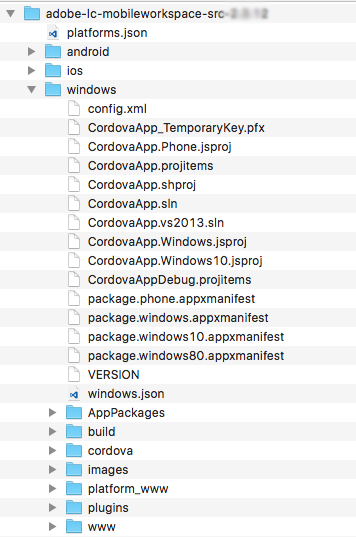

# 設定Visual Studio項目並生成Windows應用{#set-up-the-visual-studio-project-and-build-the-windows-app}

AEM Forms提供AEM Forms應用的完整原始碼。 源包含構建自定義工作區應用程式的所有元件。 原始碼存檔， `adobe-lc-mobileworkspace-src-<version>.zip`是 `adobe-aemfd-forms-app-src-pkg-<version>.zip` 軟體分發上的軟體包。

要獲取AEM Forms應用程式源，請執行以下步驟：

1. 開啟 [Software Distribution](https://experience.adobe.com/downloads)。您需要 Adobe ID 才能登入 Software Distribution。
1. 點一下頁首功能表中的 **[!UICONTROL Adobe Experience Manager]**。
1. 在 **[!UICONTROL 篩選器]** 部分：
   1. 選擇 **[!UICONTROL Forms]** 從 **[!UICONTROL 解決方案]** 的子菜單。
   2. 選擇包的版本和類型。 您還可以使用 **[!UICONTROL 搜索下載]** 選項。
1. 點擊適用於您的作業系統的包名稱，選擇 **[!UICONTROL 接受EULA條款]**，然後點擊 **[!UICONTROL 下載]**。
1. 開啟[套件管理器](https://experienceleague.adobe.com/docs/experience-manager-65/administering/contentmanagement/package-manager.html)，然後按一下&#x200B;**[!UICONTROL 「上傳套件」]**&#x200B;即可上傳套件。
1. 選擇包並按一下 **[!UICONTROL 安裝]**。

1. 要下載原始碼存檔，請開啟 `https://<server>:<port>/crx/de/content/forms/mobileapps/src/adobe-lc-mobileworkspace-src-<version>.zip` 的子菜單。\
   源包已下載到您的設備上。

下圖顯示 `adobe-lc-mobileworkspace-src-<version>.zip`。

下圖顯示 `windows` 資料夾 `src` 的子菜單。

## 設定環境 {#setting-up-the-environment}

對於Windows設備，您需要：

* MicrosoftWindows 8.1或Windows 10
* MicrosoftVisual Studio 2015
* MicrosoftApache Cordova的Visual Studio工具

## 為AEM Forms應用設定Visual Studio項目 {#setting-up-visual-studio-project-for-aem-forms-app}

執行以下步驟以在Visual Studio中設定AEM Forms應用程式項目。

1. 複製 `adobe-lc-mobileworkspace-src-<version>.zip` 存檔 `%HOMEPATH%\Projects` 安裝並配置了Visual Studio 2015的Windows 8.1或Windows 10設備中的資料夾。
1. 解壓縮中的存檔 `%HOMEPATH%\Projects\MobileWorkspace` 的子菜單。
1. 導航到 `%HOMEPATH%\Projects\MobileWorkspace\adobe-lc-mobileworkspace-src-[versionsrc]\windows` 的子菜單。
1. 開啟 `CordovaApp.sln` 使用Visual Studio 2015建立檔案，然後繼續構建AEM Forms應用。

## 生成AEM Forms應用 {#build-aem-forms-app}

執行以下步驟來構建和部署AEM Forms應用。

>[!NOTE]
>
>儲存在AEM Forms應用的Windows檔案系統上的資料未加密。 建議您使用Windows BitLocker驅動器加密等第三方工具來加密磁碟資料。

1. 在Visual Studio標準工具欄中，選擇 **發佈** 的子菜單。

1. 根據您的平台選擇Windows-AnyCPU、Windows-x64或Windows-x86。 建議使用Windows-AnyCPU。
1. 在Visual Studio解決方案資源管理器中，按一下右鍵項目 **科爾多瓦應用.Windows** 選擇 **「儲存」>「建立AppPackages」**。

   

   將出現「建立應用程式套件」嚮導。

   CordovaApp.Windows_3.0.2.0_anycpu.appx安裝程式檔案是在platforms\windows\AppPackages\CordovaApp.Windows_3.0.2.0_anycpu_Test目錄中建立的。

   如果遇到錯誤 `Retarget to windows 8.1 required`，按一下右鍵錯誤，然後在彈出菜單中選擇 **將目標重定為Windows 8.1**。

   

1. 在「建立應用程式套件」嚮導中，選擇天氣或您不想將應用程式上載到Windows應用商店，然後按一下 **下一個**。

   

1. 根據需要對參數（如應用程式生成的版本和輸出位置）進行更改。

   

1. 生成項目後，可以使用以下方式安裝應用：

   * Windows PowerShell
   * Visual Studio

   的 `.appx` 軟體包需要成功安裝以下項：

   1. WinJS庫
   1. 確保軟體包附帶自簽名證書或受信任機構簽署的公共證書（如VeriSign）。
   1. 開發人員許可證

   Platforms\windows\AppPackages\CordovaApp.Windows_3.0.2.0_anycpu_Test目錄包含其中的四個主要元件：

   1. `.appx` 檔案
   1. 證書（當前是Apache Cordova自簽名的證書）
   1. 依賴項資料夾
   1. PowerShell檔案（.ps1副檔名）

## 使用Windows PowerShell部署應用 {#deploying-an-app-using-windows-powershell}

在Windows設備上安裝應用程式有兩種方法。

### 通過獲取開發人員許可證 {#by-acquiring-the-developer-license}

1. 按一下右鍵PowerShell檔案( `Add-AppDevPackage.ps1)`，然後選擇 **使用PowerShell運行**。

1. 安裝程式會提示您獲取開發人員許可證。 使用Microsoft帳戶憑據獲取開發人員許可證。\
   此許可證有效期為30天，您可以免費續訂。
1. 獲取開發者許可證後，安裝程式將在系統上安裝自簽名證書，並成功安裝應用程式。

### 使用企業擁有的設備 {#by-using-enterprise-owned-devices}

對於加入企業域的企業所有設備，不需要獲取開發人員許可證。

企業擁有的設備使用Windows的專業版和企業版。

Microsoft建議您安裝一個受信任的頒發機構頒發的公共證書，如VeriSign。

部署應用：

* 確保設備已加入企業域。
* 啟用組策略設定。

**啟用組策略設定：**

1. 在設備中，運行 `gpedit.msc`。
1. 導航到 **電腦配置>管理模板> Windows元件>應用程式套件部署**。
1. 按一下右鍵 **允許安裝所有受信任的應用**。
1. 按一下 **編輯** 選擇 **已啟用**。

1. 按一下&#x200B;**「確定」**。

編輯Visual Studio生成的PowerShell指令碼，以阻止其獲取開發人員許可證。

在PowerShell指令碼中，設定變數： `$NeedDeveloperLicense = $false`。

對於未加入域的設備，需要邊載入產品激活密鑰。 您可以從Windows經銷商處購買。

對於Windows 8.1家庭版，沒有組策略，不允許企業側載入，您不能將其與企業域聯合。 使用開發人員許可證在Windows 8.1 Home Edition設備上部署應用。

有關詳細資訊，請按一下 [這裡](https://blogs.msdn.com/b/mvpawardprogram/archive/2014/03/24/side-loading-deployment-of-windows-store-apps-in-enterprises-step-by-step.aspx)。

## 使用Visual Studio部署應用 {#deploying-an-app-using-visual-studio}

要使用Visual Studio在Windows上安裝應用：

1. 使用遠程調試器連接設備。\
   有關詳細資訊，請參見 [在遠程電腦上運行Windows應用商店應用](https://docs.microsoft.com/en-us/visualstudio/debugger/run-windows-store-apps-on-a-remote-machine)。

1. 在Visual Studio中開啟應用時，從「解決方案平台」清單中選擇Windows-x64、Windows-x86或Windows-AnyCPU，然後選擇 **遠程電腦**。
1. 你的應用已部署在遠程電腦上。
