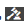

# 自適應表單的標準驗證錯誤消息 {#standard-validation-error-messages}

自適應表單基於預設定的驗證標準驗證您在欄位中提供的輸入。 驗證標準參考自適應表單中欄位的可接受輸入值。 您可以根據與自適應表單一起使用的資料源設定驗證標準。 例如，如果使用REST風格的Web服務作為資料源，則可以在Swagger定義檔案中定義驗證條件。

如果輸入值滿足驗證標準，則將這些值提交到資料源。 否則，自適應表單將顯示錯誤消息。

與此方法類似，自適應表單現在可以與自定義服務整合以執行資料驗證。 如果輸入值不滿足驗證條件，並且伺服器返回的驗證錯誤消息為標準消息格式，則錯誤消息將以表單的欄位級別顯示。

如果輸入值不滿足驗證標準並且伺服器驗證錯誤消息不是標準消息格式，則自適應表單提供將驗證錯誤消息轉換為標準格式的機制，以便它們在表單的欄位級別顯示。 可以使用以下兩種方法中的任意一種將錯誤消息轉換為標準格式：

* 在自適應表單提交中添加自定義錯誤處理程式
* 使用規則編輯器將自定義處理程式添加到調用服務操作

本文介紹了驗證錯誤消息的標準格式以及將錯誤消息從自定義格式轉換為標準格式的說明。

## 標準驗證錯誤消息格式 {#standard-validation-message-format}

如果伺服器驗證錯誤消息採用以下標準格式，則自適應表單將在欄位級別顯示錯誤：

```javascript
   {
    errorCausedBy : "SERVER_SIDE_VALIDATION/SERVICE_INVOCATION_FAILURE"
    errors : [
        {
             somExpression  : <somexpr>
             errorMessage / errorMessages : <validationMsg> / [<validationMsg>, <validationMsg>]

        }
    ]
    originCode : <target error Code>
    originMessage : <unstructured error message returned by service>
}
```

其中：

* `errorCausedBy` 描述了失敗的原因
* `errors` 提及驗證條件失敗的欄位的SOM表達式以及驗證錯誤消息
* `originCode` 包含外部服務返回的錯誤代碼
* `originMessage` 包含外部服務返回的原始錯誤資料

## 配置自適應表單提交以添加自定義處理程式 {#configure-adaptive-form-submission}

如果伺服器驗證錯誤消息未以標準格式顯示，則可以啟用非同步提交並在自適應表單提交中添加自定義錯誤處理程式，以將消息轉換為標準格式。

### 配置非同步自適應表單提交 {#configure-asynchronous-adaptive-form-submission}

在添加自定義處理程式之前，必須配置非同步提交的自適應表單。 執行以下步驟：

1. 在自適應表單創作模式中，選擇「表單容器」對象並點擊  開啟其屬性。
1. 在 **[!UICONTROL 提交]** 屬性部分，啟用 **[!UICONTROL 使用非同步提交]**。
1. 選擇 **[!UICONTROL 在伺服器上重新驗證]** 在提交之前驗證伺服器上的輸入欄位值。
1. 選擇提交操作：

   * 選擇 **[!UICONTROL 使用表單資料模型提交]** 並選擇相應的資料模型（如果使用基於REST風格的Web服務） [表單資料模型](work-with-form-data-model.md) 作為資料源。
   * 選擇 **[!UICONTROL 提交到REST終結點]** 並指定 **[!UICONTROL 重定向URL/路徑]**，如果使用REST風格的Web服務作為資料源。

   

1. 點擊  的子菜單。

### 在自適應表單提交中添加自定義錯誤處理程式 {#add-custom-error-handler-af-submission}

AEM Forms為表單提交提供開箱即用的成功和錯誤處理程式。 處理程式是基於伺服器響應執行的客戶端函式。 當提交表單時，資料被傳輸到伺服器以進行驗證，伺服器返回對客戶端的響應，其中包含有關提交的成功或錯誤事件的資訊。 資訊作為參數傳遞給相關處理程式以執行該函式。

執行以下步驟，在自適應表單提交中添加自定義錯誤處理程式：

1. 在創作模式下開啟自適應表單，選擇任何表單對象，然後點擊 <!----> 開啟規則編輯器。
1. 選擇 **[!UICONTROL 窗體]** 在「表單對象」樹中按一下 **[!UICONTROL 建立]**。
1. 選擇 **[!UICONTROL 提交時出錯]** 從事件下拉清單中。
1. 編寫規則以將自定義錯誤結構轉換為標準錯誤結構並點擊 **[!UICONTROL 完成]** 來保存規則。

以下是將自定義錯誤結構轉換為標準錯誤結構的示例代碼：

```javascript
var data = $event.data;
var som_map = {
    "id": "guide[0].guide1[0].guideRootPanel[0].Pet[0].id_1[0]",
    "name": "guide[0].guide1[0].guideRootPanel[0].Pet[0].name_2[0]",
    "status": "guide[0].guide1[0].guideRootPanel[0].Pet[0].status[0]"
};

var errorJson = {};
errorJson.errors = [];

if (data) {
    if (data.originMessage) {
        var errorData;
        try {
            errorData = JSON.parse(data.originMessage);
        } catch (err) {
            // not in json format
        }

        if (errorData) {
            Object.keys(errorData).forEach(function(key) {
                var som_key = som_map[key];
                if (som_key) {
                    var error = {};
                    error.somExpression = som_key;
                    error.errorMessage = errorData[key];
                    errorJson.errors.push(error);
                }
            });
        }
        window.guideBridge.handleServerValidationError(errorJson);
    } else {
        window.guideBridge.handleServerValidationError(data);
    }
}
```

的 `var som_map` 列出要轉換為標準格式的自適應表單域的SOM表達式。 通過按一下欄位並選擇，可以以自適應形式查看任意欄位的SOM表達式 **[!UICONTROL 查看SOM表達式]**。

使用此自定義錯誤處理程式，自適應表單將轉換中列出的欄位 `var som_map` 格式。 結果，驗證錯誤消息以自適應形式在欄位級顯示。

## 使用Invoke Service操作添加自定義處理程式

執行以下步驟，添加錯誤處理程式，以使用 [規則編輯器](rule-editor.md) 調用服務操作：

1. 在創作模式下開啟自適應表單，選擇任何表單對象，然後點擊  開啟規則編輯器。
1. 點擊 **[!UICONTROL 建立]**。
1. 在 **[!UICONTROL 當]** 的子菜單。 例如，When[欄位名稱] 的子菜單。 選擇 **[!UICONTROL 已更改]** 從 **[!UICONTROL 選擇狀態]** 下拉清單以達到此條件。
1. 在 **[!UICONTROL 然後]** 選擇 **[!UICONTROL 調用服務]** 從 **[!UICONTROL 選擇操作]** 的子菜單。
1. 從中選擇Post服務及其相應的資料綁定 **[!UICONTROL 輸入]** 的子菜單。 例如，如果要驗證 **名稱**。 **ID**, **狀態** 欄位，選擇Post service(pet)，然後在 **[!UICONTROL 輸入]** 的子菜單。

由於此規則，您為其輸入的值 **名稱**。 **ID**, **狀態** 在第2步中定義的欄位被更改後，您即會從窗體中的欄位中選出標籤，欄位即會被驗證。

1. 選擇 **[!UICONTROL 代碼編輯器]** 的子菜單。
1. 點擊 **[!UICONTROL 編輯代碼]**。
1. 從現有代碼中刪除以下行：

   ```javascript
   guidelib.dataIntegrationUtils.executeOperation(operationInfo, inputs, outputs);
   ```

1. 編寫規則以將自定義錯誤結構轉換為標準錯誤結構並點擊 **[!UICONTROL 完成]** 來保存規則。
例如，在末尾添加以下示例代碼，以將自定義錯誤結構轉換為標準錯誤結構：

   ```javascript
   var errorHandler = function(jqXHR, data) {
   var som_map = {
       "id": "guide[0].guide1[0].guideRootPanel[0].Pet[0].id_1[0]",
       "name": "guide[0].guide1[0].guideRootPanel[0].Pet[0].name_2[0]",
       "status": "guide[0].guide1[0].guideRootPanel[0].Pet[0].status[0]"
   };
   
   
   var errorJson = {};
   errorJson.errors = [];
   
   if (data) {
       if (data.originMessage) {
           var errorData;
           try {
               errorData = JSON.parse(data.originMessage);
           } catch (err) {
               // not in json format
           }
   
           if (errorData) {
               Object.keys(errorData).forEach(function(key) {
                   var som_key = som_map[key];
                   if (som_key) {
                       var error = {};
                       error.somExpression = som_key;
                       error.errorMessage = errorData[key];
                       errorJson.errors.push(error);
                   }
               });
           }
           window.guideBridge.handleServerValidationError(errorJson);
       } else {
           window.guideBridge.handleServerValidationError(data);
       }
     }
   };
   
   guidelib.dataIntegrationUtils.executeOperation(operationInfo, inputs, outputs, null, errorHandler);
   ```

   的 `var som_map` 列出要轉換為標準格式的自適應表單域的SOM表達式。 通過按一下欄位並選擇，可以以自適應形式查看任意欄位的SOM表達式 **[!UICONTROL 查看SOM表達式]** 從 **[!UICONTROL 更多選項]** (..)。

   確保將示例代碼的以下行複製到自定義錯誤處理程式：

   ```javascript
   guidelib.dataIntegrationUtils.executeOperation(operationInfo, inputs, outputs, null, errorHandler);
   ```

   executeOperation API包括 `null` 和 `errorHandler` 參數基於新的自定義錯誤處理程式。

   使用此自定義錯誤處理程式，自適應表單將轉換中列出的欄位 `var som_map` 格式。 結果，驗證錯誤消息以自適應形式在欄位級顯示。
