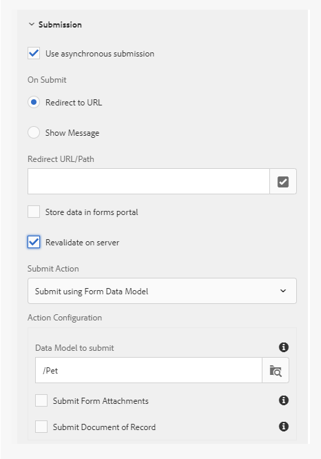

# 適用性表單的標準驗證錯誤訊息 {#standard-validation-error-messages}

調適型表單會根據預先設定的驗證條件，驗證您在欄位中提供的輸入。 驗證條件是指最適化表單中欄位的可接受輸入值。 您可以根據搭配最適化表單使用的資料來源來設定驗證條件。 例如，如果您使用RESTful Web服務做為資料來源，您可以在Swagger定義檔案中定義驗證條件。

如果輸入值符合驗證准則，則會將值提交至資料來源。 否則，最適化表單會顯示錯誤訊息。

與此方法類似，調適型表單現在可與自訂服務整合，以執行資料驗證。 如果輸入值不符合驗證准則，且伺服器傳回的驗證錯誤訊息為標準訊息格式，則錯誤訊息會在表單的欄位層級顯示。

如果輸入值不符合驗證准則，且伺服器驗證錯誤訊息不是標準訊息格式，則適用性表單會提供機制，將驗證錯誤訊息轉換為標準格式，以便它們在表單的欄位層級顯示。 您可以使用下列任一種方法，將錯誤訊息轉換為標準格式：

* 在最適化表單提交時新增自訂錯誤處理常式
* 使用規則編輯器新增自訂處理常式以叫用服務動作

本文說明驗證錯誤訊息的標準格式，以及將錯誤訊息從自訂轉換為標準格式的指示。

## 標準驗證錯誤訊息格式 {#standard-validation-message-format}

如果伺服器驗證錯誤訊息為以下標準格式，適用性表單會在欄位層級顯示錯誤：

```javascript
   {
    errorCausedBy : "SERVER_SIDE_VALIDATION/SERVICE_INVOCATION_FAILURE"
    errors : [
        {
             somExpression  : <somexpr>
             errorMessage / errorMessages : <validationMsg> / [<validationMsg>, <validationMsg>]

        }
    ]
    originCode : <target error Code>
    originMessage : <unstructured error message returned by service>
}
```

其中：

* `errorCausedBy` 說明失敗的原因
* `errors` 提及未通過驗證准則的欄位的SOM運算式以及驗證錯誤訊息
* `originCode` 包含外部服務傳回的錯誤碼
* `originMessage` 包含外部服務傳回的原始錯誤資料

## 設定最適化表單提交以新增自訂處理常式 {#configure-adaptive-form-submission}

如果伺服器驗證錯誤訊息未以標準格式顯示，您可以啟用非同步提交，並在最適化表單提交上新增自訂錯誤處理常式，以將訊息轉換為標準格式。

### 設定非同步的最適化表單提交 {#configure-asynchronous-adaptive-form-submission}

在新增自訂處理常式之前，您必須設定非同步提交的最適化表單。 執行以下步驟：

<!-- 1. In adaptive form authoring mode, select the Form Container object and tap  to open its properties.
1. In the **[!UICONTROL Submission]** properties section, enable **[!UICONTROL Use asynchronous submission]**.
1. Select **[!UICONTROL Revalidate on server]** to validate the input field values on server before submission.
1. Select the Submit Action:

    * Select **[!UICONTROL Submit using Form Data Model]** and select the appropriate data model, if you are using RESTful web service based [form data model](work-with-form-data-model.md) as the data source.
    * Select **[!UICONTROL Submit to REST endpoint]** and specify the **[!UICONTROL Redirect URL/Path]**, if you are using RESTful web services as the data source.

    

1. Tap  to save the properties.-->

### 在最適化表單提交時新增自訂錯誤處理常式 {#add-custom-error-handler-af-submission}

AEM Forms為表單提交提供現成可用的成功和錯誤處理常式。 處理常式是根據伺服器回應執行的使用者端功能。 提交表單時，資料會傳送至伺服器進行驗證，伺服器會傳回回應給使用者端，其中包含提交成功或錯誤事件的相關資訊。 此資訊會以引數形式傳遞至相關處理常式，以執行函式。

執行以下步驟，在提交最適化表單時新增自訂錯誤處理常式：

1. 在撰寫模式中開啟最適化表單，選取任何表單物件，然後點選 <!----> 以開啟規則編輯器。
1. 選取 **[!UICONTROL 表單]** 在「表單物件」樹狀結構中，點選 **[!UICONTROL 建立]**.
1. 選取 **[!UICONTROL 提交時發生錯誤]** 從「事件」下拉式清單。
1. 撰寫規則以將自訂錯誤結構轉換為標準錯誤結構，然後點選 **[!UICONTROL 完成]** 以儲存規則。

以下是將自訂錯誤結構轉換為標準錯誤結構的範常式式碼：

```javascript
var data = $event.data;
var som_map = {
    "id": "guide[0].guide1[0].guideRootPanel[0].Pet[0].id_1[0]",
    "name": "guide[0].guide1[0].guideRootPanel[0].Pet[0].name_2[0]",
    "status": "guide[0].guide1[0].guideRootPanel[0].Pet[0].status[0]"
};

var errorJson = {};
errorJson.errors = [];

if (data) {
    if (data.originMessage) {
        var errorData;
        try {
            errorData = JSON.parse(data.originMessage);
        } catch (err) {
            // not in json format
        }

        if (errorData) {
            Object.keys(errorData).forEach(function(key) {
                var som_key = som_map[key];
                if (som_key) {
                    var error = {};
                    error.somExpression = som_key;
                    error.errorMessage = errorData[key];
                    errorJson.errors.push(error);
                }
            });
        }
        window.guideBridge.handleServerValidationError(errorJson);
    } else {
        window.guideBridge.handleServerValidationError(data);
    }
}
```

此 `var som_map` 列出您要轉換為標準格式的最適化表單欄位的SOM運算式。 您可以點選任何欄位並選取「 」，以最適化表單檢視該欄位的SOM運算式 **[!UICONTROL 檢視SOM運算式]**.

此自訂錯誤處理常式，可讓最適化表單轉換 `var som_map` 至標準錯誤訊息格式。 因此，驗證錯誤訊息會在最適化表單的欄位層級顯示。

## 使用叫用服務動作新增自訂處理常式

執行以下步驟來新增錯誤處理常式，以使用將自訂錯誤結構轉換為標準錯誤結構 [規則編輯器的](rule-editor.md) 啟動服務動作：

<!-- 1. Open the adaptive form in authoring mode, select any form object, and tap  to open the rule editor.
1. Tap **[!UICONTROL Create]**.
1. Create a condition in the **[!UICONTROL When]** section of the rule. For example, When[Name of field] is changed. Select **[!UICONTROL is changed]** from the **[!UICONTROL Select State]** drop-down list to achieve this condition.
1. In the **[!UICONTROL Then]** section, select **[!UICONTROL Invoke Service]** from the **[!UICONTROL Select Action]** drop-down list.
1. Select a Post service and its corresponding data bindings from the **[!UICONTROL Input]** section. For example, if you want to validate **Name**, **ID**, and **Status** fields in the adaptive form, select a Post service (pet) and select pet.name, pet.id, and pet.status in the **[!UICONTROL Input]** section.-->

    此規則的結果是，您在欄位**Name**、**ID**和**Status**中輸入的值會在步驟2中定義的欄位發生變更且您以定位鍵移出表單中的欄位後立即驗證。

1. 選取 **[!UICONTROL 代碼編輯器]** 從模式選取下拉式清單中。
1. 點選 **[!UICONTROL 編輯程式碼]**.
1. 從現有程式碼中刪除下列行：

   ```javascript
   guidelib.dataIntegrationUtils.executeOperation(operationInfo, inputs, outputs);
   ```

1. 撰寫規則以將自訂錯誤結構轉換為標準錯誤結構，然後點選 **[!UICONTROL 完成]** 以儲存規則。
例如，在結尾新增下列範常式式碼，以將自訂錯誤結構轉換為標準錯誤結構：

   ```javascript
   var errorHandler = function(jqXHR, data) {
   var som_map = {
       "id": "guide[0].guide1[0].guideRootPanel[0].Pet[0].id_1[0]",
       "name": "guide[0].guide1[0].guideRootPanel[0].Pet[0].name_2[0]",
       "status": "guide[0].guide1[0].guideRootPanel[0].Pet[0].status[0]"
   };
   
   
   var errorJson = {};
   errorJson.errors = [];
   
   if (data) {
       if (data.originMessage) {
           var errorData;
           try {
               errorData = JSON.parse(data.originMessage);
           } catch (err) {
               // not in json format
           }
   
           if (errorData) {
               Object.keys(errorData).forEach(function(key) {
                   var som_key = som_map[key];
                   if (som_key) {
                       var error = {};
                       error.somExpression = som_key;
                       error.errorMessage = errorData[key];
                       errorJson.errors.push(error);
                   }
               });
           }
           window.guideBridge.handleServerValidationError(errorJson);
       } else {
           window.guideBridge.handleServerValidationError(data);
       }
     }
   };
   
   guidelib.dataIntegrationUtils.executeOperation(operationInfo, inputs, outputs, null, errorHandler);
   ```

   此 `var som_map` 列出您要轉換為標準格式的最適化表單欄位的SOM運算式。 您可以點選任何欄位並選取「 」，以最適化表單檢視該欄位的SOM運算式 **[!UICONTROL 檢視SOM運算式]** 從 **[!UICONTROL 更多選項]** (...)功能表。

   請確定您將下列這行範常式式碼複製到自訂錯誤處理常式：

   ```javascript
   guidelib.dataIntegrationUtils.executeOperation(operationInfo, inputs, outputs, null, errorHandler);
   ```

   executeOperation API包含 `null` 和 `errorHandler` 引數為基礎的新的自訂錯誤處理常式。

   此自訂錯誤處理常式，可讓最適化表單轉換 `var som_map` 至標準錯誤訊息格式。 因此，驗證錯誤訊息會在最適化表單的欄位層級顯示。