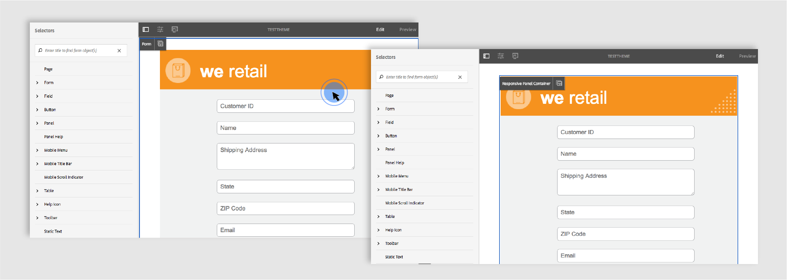

# 設定最適化表單的樣式 {#do-not-publish-style-your-adaptive-form}

瞭解如何建立自訂主題、設定個別元件的樣式，以及在主題中使用網頁字型

本教學課程是「建立您的第 [一個最適化表單](https://helpx.adobe.com/experience-manager/6-3/forms/using/create-your-first-adaptive-form.html) 」系列的步驟。 建議依序依序依序排列，以瞭解、執行和展示完整的教學課程使用案例。

## 關於教學課程 {#about-the-tutorial}

您可以使用主題為最適化表單提供獨特的外觀和樣式。 您可以套用隨附於最適化表單編輯器的方塊外主題，或建立您自己的自訂主題。 AEM Forms提供主題編 [輯器](https://helpx.adobe.com/experience-manager/6-3/forms/using/themes.html) ，以建立自訂主題。 單一主題可針對在行動裝置、平板電腦或桌上型電腦上開啟的相同最適化表單提供不同的外觀。 使用主題編輯器時，不需具備任何CSS或LESS的先前知識，但需要它。

在教學課程結束時，您將學習：

* 將立即可用的主題套用至最適化表單
* 使用主題編輯器建立最適化表單的主題
* 設定個別元件的樣式
* 附加部分：在自訂主題中使用網頁字型

在您完成教學課程後，表單看起來會類似下列：

## 開始之前 {#before-you-start}

在您的本機電腦上下載標題樣式和標誌影像，如下所示。 最適化表單的 `shipping-address-add-update-form` 頁首使用頁首樣式和標誌影像。 標題樣式影像會出現在標題的右側。

[取得檔案](assets/header-style.png)

[取得檔案](assets/logo-1.png)

## 步驟1:將主題套用至最適化表單 {#step-apply-a-theme-to-your-adaptive-form}

最適化表單編輯器提供多種現成可用的主題。 如果您打算不針對最適化表單使用自訂樣式，也可以使用現成可用的主題來發佈最適化表單。 主題與最適化表單無關。 您可以將相同的主題套用至多個調適性表單。 若要將主題套用至最適化表單：

1. 開啟最適化表單以進行編輯。

   [http://localhost:4502/editor.html/content/forms/af/shipping-address-add-update-form.html](http://localhost:4502/editor.html/content/forms/af/shipping-address-add-update-form.html)

1. 開啟最適化表 **單容器的屬性**。 在屬性瀏覽器中，導覽至「基 **本** >最適 **化表單主題」**。 「 **最適化表單主題** 」欄位會列出所有現成可用的主題和自訂主題。 依預設，會套用「畫布」主題。
1. 從「最適化表單主題」 **欄位中選取主題** 。 例如，「調 **查」主題**。 點  ，以套用選取的主題。

**** 圖：具有 *預設主題的最適化表單*

**** 圖：具有 *調查主題的最適化表單*

## 步驟2:更新您的最適化表單 {#step-update-your-adaptive-form}

上述設計需要變更現有最適化表單的預留位置文字和標誌。 執行下列步驟以進行必要的變更：

1. 變更標題的現有標誌和文字。 若要移除標誌：

   1. 在表單編輯器中開啟表單。

      [http://localhost:4502/editor.html/content/forms/af/shipping-address-add-update-form.html](http://localhost:4502/editor.html/content/forms/af/shipping-address-add-update-form.html)

   1. 在頁首元件中點選標誌影像，然後點選  properties。 在影像屬性中，點選X以移除現有的標誌影像。
   1. 點選「上傳」、選取logo.png，然後點選  ，以儲存變更。 影像已下載至「開始 [之前](/help/forms/using/style-your-adaptive-form.md#before-you-start) 」區段。
   1. 點選標題文 `We.Retail`字，點  **edit**。 將頁首文字變更為 `we retail`。 僅將粗體格式套用 `we`於 `we retail`。
   

1. 移除標題並新增預留位置文字：

   1. 點選「客戶ID」欄位並點選  properties。
   1. 將「標題」欄位的內 **容複製** 到「預留位 **置文字」欄位** 。
   1. 刪除「標題 **」欄位的內容，並** 點選aem_6_3_forms_save 。
   1. 對表單中的所有文字方塊、數值方塊和電子郵件欄位重複上述三個步驟。
   

## 步驟3:為最適化表單建立自訂主題 {#step-create-a-custom-theme-for-your-adaptive-form}

您可以使用 [主題編輯器](/help/forms/using/themes.md) ，建立自訂主題。 主題編輯器是功能強大的WYSIWYG編輯器。 它是將CSS套用至自適應表單各元件的視覺化方法。 它提供更精細的控制項，讓元件和面板在最適化表單中變樣。

主題是個別的實體，如最適化表單。 它包含最適化表單的元件和面板樣式(CSS)。 樣式包括CSS屬性，例如背景顏色、狀態顏色、透明度、對齊方式和大小。 應用主題時，指定的樣式將應用於自適應表單的相應元件。

在本教學課程中，您將設定頁首和頁尾、文字和數值元件、附件元件和按鈕的樣式。 讓我們從建立主題開始：

### 建立主題 {#create-a-theme}

1. 登入AEM作者例項，並導覽至 **Adobe Experience Manager** > **Forms** >主 **題**。 預設URL為 [http://localhost:4502/aem/forms.html/content/dam/formsanddocuments-themes](http://localhost:4502/aem/forms.html/content/dam/formsanddocuments-themes)。
1. 點選「 **[!UICONTROL 建立]** 」並選 **[!UICONTROL 取「主題」]**。 此時將顯示「建立主題」頁，其中包含建立主題所需的欄位。 「標題」和「名稱」欄位是必填欄位：

   * **** 標題：指定主題的標題。 例如，全 **域主題。** 標題可協助您從主題清單中識別主題。
   * **** 名稱：指定主題的名稱。 例如， **Global-Theme。** 在儲存庫中建立具有指定名稱的節點。 當您開始輸入標題時，系統會自動產生名稱欄位的值。 您可以變更建議的值。 名稱欄位只能包含英數字元、連字型大小和底線。 所有無效輸入都會以連字型大小取代。

1. 點選「 **建立**」。 將建立一個主題，並出現一個用於開啟表單進行編輯的對話框。 點選 **「開啟** 」，在新標籤中開啟新建立的主題。 主題在主題編輯器中開啟。 對於樣式，主題編輯器會使用AEM Forms隨附的現成可用最適化表單。

   如需使用主題編輯器UI的詳細資訊，請參 [閱關於主題編輯器](/help/forms/using/themes.md#aboutthethemeeditor)。

1. 點選 **主題選項** >設 **定**。 在「預 **覽表單** 」欄位中，選取 **shipping-address-add-update-form** adaptive表單、點選 、點選 **** SaveJost。 現在，主題編輯器已設定為使用您自己的最適化表單，而非預設的最適化表單。 點選「 **取消** 」可返回主題編輯器。

   

   **** 圖：具 *有shipping-add-update-form自適應表單的主題編輯器*

   

   **** 圖：具有 *預設表單的最適化表單*

### 樣式頁首和頁尾 {#style-header-and-footer}

頁首和頁尾為最適化表單提供一致且獨特的外觀。 一般而言，頁首包含組織的標誌和名稱，頁尾包含版權資訊，而且這些資訊在組織的多種形式上都相同。 要設定發運地址添加更新表單自適應表單的頁眉和頁腳的樣式，請執行以下操作：

1. 導覽「選 **擇器** 」面板中的「頁首 **>文字** 」選項。 「選擇器」面板位於主題編輯器的左側。 如果面板不可見，請點選「切換  側面板」。

1. 在 **Text** accordion中設定下列屬性，並點 。

   | 屬性 | 值 |
   |---|---|
   | 字型系列 | Arial |
   | 字型色彩 | FFFFFF |
   | 字型大小 | 54px |

1. 點選頁首介面工具集並點選「頁 **首」**。 標題介面工具集樣式的選項會顯示在左側。 展開「 **Dimensions &amp; Position** 」(尺寸與位置 **)accordion、將「** Height `120px`」（高度）設 aem_6_3_forms_save。
1. 展開頁首介面工具集的「背景」accordion，將「背景顏 **色」設為**`F6921E.`

   將滑鼠指標暫 **留在「影像與漸層** > **+新增」上，點選「**&#x200B;影像 ****」。 設定下列屬性， 。

   | 屬性 | 值 |
   |---|---|
   | 影像 | 上傳header-style.png。 影像已下載至「開始 [之前](/help/forms/using/style-your-adaptive-form.md#before-you-start) 」區段。 |
   | 位置 | 右下 |
   | 並排顯示 | 不重複 |

1. 在主題編輯器中，點選頁首中的標誌，然後點選「頁首標 **志」**。 展開「維度與位置」accordion，設定下列屬性並點 。

<table> 
 <tbody> 
  <tr> 
   <td>邊距</td> 
   <td>值</td> 
  </tr> 
  <tr> 
   <td>邊距</td> 
   <td> 
    <ul> 
     <li>頂部：1.5rem</li> 
     <li>底部：-35px</li> 
     <li>左：1rem<strong> </strong></li> 
    </ul> 
<strong></strong> 提示：點選連  結圖示，為每個欄位提供不同的值。  
 </td> 
  </tr> 
  <tr> 
   <td>高度</td> 
   <td>4.75rem</td> 
  </tr> 
 </tbody> 
</table>

1. 點選頁尾Widget並點選頁尾 **Footer**。 展開 **Background** accordion，將「Background Color **」（背景顏色）設為** ，然後點選 `F6921E`aem_6_3_forms_save 。

### 設定資料擷取元件的樣式，並將背景套用至最適化表單 {#style-the-data-capture-component-and-apply-a-background-to-the-adaptive-form}

您可以在最適化表單中使用多個元件來擷取資料。 例如，文字方塊和數值方塊。 您可以提供與所有資料擷取元件相同的樣式，或為每個元件提供個別的樣式。 在本教學課程中，相同的樣式會套用至數值方塊（客戶ID、郵遞區號）和文字方塊（客戶ID、名稱、送貨地址、狀態、電子郵件）。 要設定資料捕獲元件的樣式：

1. 點選「客戶ID」欄位，然後點選「欄 **位介面工具集** 」選項。 設定下列屬性， 。

<table> 
 <tbody> 
  <tr> 
   <td>折疊式面板</td> 
   <td>屬性</td> 
   <td>值</td> 
  </tr> 
  <tr> 
   <td>邊框</td> 
   <td>邊框顏色</td> 
   <td>A7A9AC</td> 
  </tr> 
  <tr> 
   <td>邊框</td> 
   <td>邊框半徑 </td> 
   <td> 
    <ul> 
     <li>頂部：7px  </li> 
     <li>右：7px  </li> 
     <li>底部：7px  </li> 
     <li>左：7px  </li> 
    </ul> </td> 
  </tr> 
  <tr> 
   <td>文字</td> 
   <td>字型系列</td> 
   <td>Arial</td> 
  </tr> 
  <tr> 
   <td>文字</td> 
   <td>字型色彩</td> 
   <td>939598  </td> 
  </tr> 
  <tr> 
   <td>文字</td> 
   <td>字型大小</td> 
   <td>18px</td> 
  </tr> 
  <tr> 
   <td>尺寸和位置</td> 
   <td>寬度</td> 
   <td>60%</td> 
  </tr> 
  <tr> 
   <td>尺寸和位置</td> 
   <td>邊距</td> 
   <td> 
    <ul> 
     <li>左：10rem</li> 
    </ul> </td> 
  </tr> 
 </tbody> 
</table>

1. 點選「Customer ID」欄位上方的空白區域，然後點選「 **Responsive Panel Container**」。 將「背 **景** >背 **景顏色** 」設定為F1F2F2。 點 。

   

### 設定按鈕的樣式 {#style-the-buttons}

您可以使用自訂主題，將相同的樣式套用至最適化表單的所有按鈕，並 [將樣式套用](/help/forms/using/inline-style-adaptive-forms.md) 至特定按鈕。 要設定按鈕的樣式，請執行以下操作：

1. 點選「 **Submit** 」按鈕並點選「 **Button** 」選項。 設定下列屬性， 。

<table> 
 <tbody> 
  <tr> 
   <td>折疊式面板</td> 
   <td>屬性</td> 
   <td>值</td> 
  </tr> 
  <tr> 
   <td>背景</td> 
   <td>背景色彩</td> 
   <td>F6921E</td> 
  </tr> 
  <tr> 
   <td>邊框  </td> 
   <td>邊框顏色</td> 
   <td>F6921E</td> 
  </tr> 
  <tr> 
   <td>邊框</td> 
   <td>邊框半徑 </td> 
   <td> 
    <ul> 
     <li>頂部：7px  </li> 
     <li>右：7px  </li> 
     <li>底部：7px  </li> 
     <li>左：7px</li> 
    </ul> </td> 
  </tr> 
  <tr> 
   <td>文字  </td> 
   <td>字型系列</td> 
   <td>Arial</td> 
  </tr> 
  <tr> 
   <td>文字</td> 
   <td>字型色彩</td> 
   <td>FFFFFF</td> 
  </tr> 
  <tr> 
   <td>文字</td> 
   <td>字型大小</td> 
   <td>18px</td> 
  </tr> 
 </tbody> 
</table>

1. [將自訂主題](/help/forms/using/style-your-adaptive-form.md#step-apply-a-theme-to-your-adaptive-form)「全域主題」套用至最適化表單。 如果樣式未反映在最適化表單上，請清除瀏覽器快取，然後再試一次。

   

## 步驟4:設定個別元件的樣式 {#step-style-individual-components}

有些樣式只適用於特定元件。 這些元件是在最適化表單編輯器中建立樣式的。

1. 開啟最適化表單以進行編輯。 [http://localhost:4502/editor.html/content/forms/af/shipping-address-add-update-form.html](http://localhost:4502/editor.html/content/forms/af/change-billing-shipping-address.html)
1. 在頂欄上，選取「樣式 **」選項** 。

   

1. 點選「 **Attach** （附加）」按鈕並點 editicon」。 在「維度與位置」accordion中 **設定下列屬性** :

   | 屬性 | 值 |
   |---|---|
   | 浮點 | 左 |
   | 寬度 | 10% |

1. 點選「 **Government approved address proof** (政府機關核准的地址證明 選「aem_6_3_editicon」。 設定下列屬性：

<table> 
 <tbody> 
  <tr> 
   <td>折疊式面板</td> 
   <td>屬性</td> 
   <td>值</td> 
  </tr> 
  <tr> 
   <td>尺寸及位置</td> 
   <td>浮點</td> 
   <td>左</td> 
  </tr> 
  <tr> 
   <td>尺寸及位置</td> 
   <td>寬度</td> 
   <td>73%</td> 
  </tr> 
  <tr> 
   <td>尺寸及位置</td> 
   <td>邊距</td> 
   <td> 
    <ul> 
     <li>左：10px</li> 
    </ul> </td> 
  </tr> 
  <tr> 
   <td>尺寸及位置</td> 
   <td>高度</td> 
   <td>40px</td> 
  </tr> 
  <tr> 
   <td>尺寸及位置  </td> 
   <td>邊距</td> 
   <td>  
    <ul> 
     <li>右：2rem</li> 
     <li>左：10rem </li> 
    </ul> </td> 
  </tr> 
  <tr> 
   <td>背景</td> 
   <td>背景色彩</td> 
   <td>FFFFFF</td> 
  </tr> 
  <tr> 
   <td>邊框</td> 
   <td>邊框寬度</td> 
   <td>1px</td> 
  </tr> 
  <tr> 
   <td>邊框</td> 
   <td>邊框樣式</td> 
   <td>堅固</td> 
  </tr> 
  <tr> 
   <td>邊框</td> 
   <td>邊框顏色</td> 
   <td>A7A9AC</td> 
  </tr> 
  <tr> 
   <td>邊框</td> 
   <td>邊框半徑</td> 
   <td>7px</td> 
  </tr> 
  <tr> 
   <td>文字</td> 
   <td>字型系列</td> 
   <td>Arial</td> 
  </tr> 
  <tr> 
   <td>文字</td> 
   <td>字型色彩</td> 
   <td>BCBEC0</td> 
  </tr> 
  <tr> 
   <td>文字</td> 
   <td>字型大小</td> 
   <td>18px</td> 
  </tr> 
  <tr> 
   <td>文字</td> 
   <td>行高</td> 
   <td>2</td> 
  </tr> 
 </tbody> 
</table>

1. 點選「 **Submit** （送出）」按鈕並點  」圖示。 設定下列屬性：

<table> 
 <tbody> 
  <tr> 
   <td>折疊式面板</td> 
   <td>屬性</td> 
   <td>值</td> 
  </tr> 
  <tr> 
   <td>尺寸和位置</td> 
   <td>浮點</td> 
   <td>右</td> 
  </tr> 
  <tr> 
   <td>尺寸和位置</td> 
   <td>邊距</td> 
   <td> 
    <ul> 
     <li>頂部：5rem</li> 
     <li>右：14rem</li> 
     <li>底部：20px</li> 
     <li>左：20px  </li> 
    </ul> </td> 
  </tr> 
  <tr> 
   <td>背景</td> 
   <td>背景色彩</td> 
   <td>F6921E</td> 
  </tr> 
  <tr> 
   <td>邊框</td> 
   <td>邊框顏色</td> 
   <td>F6921E</td> 
  </tr> 
 </tbody> 
</table>

## 步驟5:附加部分：在自訂主題中使用網頁字型 {#step-bonus-section-using-web-fonts-in-a-custom-theme}

您可以使用各種字型來設計最適化表單。 在檢視最適化表單的所有裝置上，可能沒有用於設計最適化表單的字型。 您可以使用網頁字型服務，將必要的字型傳送至目標裝置。

Adobe Typekit是網頁字型服務。 您可以設定並使用具有最適化表單的服務。 若要以最適化形式使用Adobe Typekit:

>[!NOTE]
>
> Typekit現在稱為Adobe Fonts，並隨附於Creative cloud和其他訂閱。 [了解更多](https://fonts.adobe.com/).

1. 建立 [Adobe Typekit帳戶](https://typekit.com/) 、建立套件、將Myriad Pro字型加入套件、發佈套件並取得套件ID。 您必須以最適化表單使用Adobe Typekit字型（Web字型）。
1. 在AEM Forms伺服器中，導覽至  **Adobe Experience Manager** Manager **Hammer Tools** > Deployment ******** Cloud Services。 在「雲端服務」頁面上，導覽至「第 **三方服務** > **Typekit**」，然後按一下「Typekit」下的「 **Configure** Now」（立即設定）。 如果配置已可用，請按一下+按鈕以建立新實例。

   在「建立配置」對話框中，為配 **置指定Title** ，然後按一下「 **建立」**。 系統會將您重新導向至設定頁面。 在出現的「編輯元件」對話方塊中，提供您的套 **件ID** ，然後按一 **下「確定」**。

1. 設定您的主題以使用TypeKit設定。 在作者實例上，在主題編 **輯器中開啟** 「全局主題」。 在主題編輯器中，導覽至「主題選項  >設定」。 在「 **Typekit設定** 」欄位中，選取套件，然後按一下「 **儲存」**。

   新增至Typekit的字型可供所有元件的 **Text** accordion中選取。

