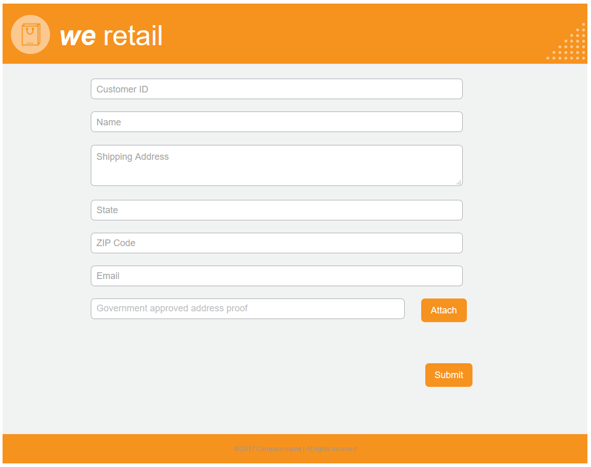

# 最適化表單的樣式 {#do-not-publish-style-your-adaptive-form}

瞭解如何建立自訂主題、設定個別元件的樣式，以及在主題中使用Web Fonts。

本教學課程是 [建立第一個最適化表單](https://helpx.adobe.com/tw/experience-manager/6-3/forms/using/create-your-first-adaptive-form.html) 數列。 Adobe建議您依照時間順序來瞭解、執行和示範完整的教學課程使用案例。

## 關於教學課程  {#about-the-tutorial}

您可以使用主題來為最適化表單提供獨特的外觀和樣式。 您可以套用最適化表單編輯器隨附的現成主題，或是建立您自己的自訂主題。 AEM [!DNL Forms] 提供 [主題編輯器](https://helpx.adobe.com/experience-manager/6-3/forms/using/themes.html) 以建立自訂主題。 單一主題可為在行動裝置、平板電腦或桌上型電腦上開啟的相同最適化表單提供不同外觀。 使用主題編輯器不需要有CSS或LESS的任何先前知識，但這是必要的。

在本教學課程結束時，您應該能夠進行下列工作：

* 將立即可用的主題套用至最適化表單
* 使用主題編輯器建立最適化表單的主題
* 個別元件的樣式
* 額外區段：在自訂主題中使用Web Fonts

完成本教學課程後，您的表單應看起來類似下列內容：

## 開始之前 {#before-you-start}

在本機電腦上下載標題樣式和標誌影像（如下所示）。 「 」的標題 `shipping-address-add-update-form` 最適化表單使用頁首樣式和標誌影像。 頁首樣式影像會出現在頁首的右側。

[取得檔案](assets/header-style.png)

[取得檔案](assets/logo-1.png)

## 步驟1：將主題套用至最適化表單 {#step-apply-a-theme-to-your-adaptive-form}

調適型表單編輯器提供多個現成可用的主題。 如果您不打算將自訂樣式用於最適化表單，也可以使用現成可用的主題發佈最適化表單。 主題與調適型表單無關。 您可以將相同主題套用至多個最適化表單。

**若要將主題套用至最適化表單：**

1. 開啟最適化表單進行編輯。

   [http://localhost:4502/editor.html/content/forms/af/shipping-address-add-update-form.html](http://localhost:4502/editor.html/content/forms/af/shipping-address-add-update-form.html)

1. 開啟屬性 **[!UICONTROL 最適化表單容器]**. 在屬性瀏覽器中導覽至 **[!UICONTROL 基本]** > **[!UICONTROL 最適化表單主題]**. 此 **[!UICONTROL 最適化表單主題]** 欄位會列出所有現成可用的主題和自訂主題。 依預設，會套用畫布主題。
1. 從中選擇主題 **[!UICONTROL 最適化表單主題]** 欄位。 例如， **意見調查主題**. 點選  以便套用選取的主題。

   

   **圖：** *具有預設主題的最適化表單*

   

   **圖：** *包含調查主題的最適化表單*

## 步驟2：更新最適化表單 {#step-update-your-adaptive-form}

以上顯示的設計需要變更您現有的最適化表單的預留位置文字和標誌。

**若要更新您的最適化表單：**

1. 變更頁首的現有標誌和文字。 若要移除標誌：

   1. 在表單編輯器中開啟表單。

      [http://localhost:4502/editor.html/content/forms/af/shipping-address-add-update-form.html](http://localhost:4502/editor.html/content/forms/af/shipping-address-add-update-form.html)

   1. 點選中的標誌影像 [!UICONTROL 頁首] 元件並點選  **[!UICONTROL 屬性]**. 在 [!UICONTROL 影像] 屬性，點選X以移除現有的標誌影像。
   1. 點選 **[!UICONTROL 上傳]**，選取logo.png，然後點選  以儲存變更。 此影像下載於 [開始之前](/help/forms/using/style-your-adaptive-form.md#before-you-start) 區段。
   1. 點選頁首文字， `We.Retail`，然後點選  **[!UICONTROL 編輯]**. 將頁首文字變更為 `we retail`. 僅套用粗體格式至 `we`在 `we retail`.

      

1. 移除標題並新增預留位置文字：

   1. 點選「客戶ID」欄位並點選  屬性。
   1. 複製 **[!UICONTROL 標題]** 欄位至 **[!UICONTROL 預留位置文字]** 欄位。
   1. 刪除的內容 **[!UICONTROL 標題]** 欄位並點選 .
   1. 對表單中的所有文字方塊、數值方塊和電子郵件欄位重複前三個步驟。

      

## 步驟3：建立最適化表單的自訂主題 {#step-create-a-custom-theme-for-your-adaptive-form}

您可以使用 [主題編輯器](/help/forms/using/themes.md) 以建立自訂主題。 主題編輯器是功能齊全的WYSIWYG編輯器。 這是一種將CSS套用至最適化表單各種元件的視覺方法。 它提供更細微的控制項，以便設定最適化表單的元件和面板的樣式。

佈景主題是獨立的實體，例如調適型表單。 它包含最適化表單之元件和面板的樣式(CSS)。 樣式包含CSS屬性，例如背景顏色、狀態顏色、透明度、對齊方式和大小。 套用主題時，指定的樣式會套用至最適化表單的對應元件。

在本教學課程中，您可為頁首與頁尾、文字與數值元件、附件元件及按鈕設定樣式。 讓我們從建立佈景主題開始：

### 建立主題 {#create-a-theme}

1. 登入AEM作者執行個體並導覽至 **[!UICONTROL Adobe Experience Manager]** > **[!UICONTROL Forms]** > **[!UICONTROL 主題]**. 預設URL為 [http://localhost:4502/aem/forms.html/content/dam/formsanddocuments-themes](http://localhost:4502/aem/forms.html/content/dam/formsanddocuments-themes).
1. 點選 **[!UICONTROL 建立]** 並選取 **[!UICONTROL 主題]**. 此 [!UICONTROL 建立主題] 包含建立佈景主題所需欄位的頁面隨即顯示。 此 **[!UICONTROL 標題]** 和 **[!UICONTROL 名稱]** 欄位為必填欄位：

   * **標題：** 指定主題的標題。 例如， **全域主題。** 標題可幫助您從主題清單中識別主題。
   * **名稱：** 指定主題的名稱。 例如， **全域佈景主題。**&#x200B;存放庫中會建立具有指定名稱的節點。當您開始輸入標題時，會自動產生名稱欄位的值。 您可以變更建議的值。名稱欄位只能包含字母數字字元、連字號和底線。所有無效的輸入都會以連字號取代。

1. 點選「**[!UICONTROL 建立]**」。主題隨即建立，並出現對話方塊以開啟表單進行編輯。 點選 **[!UICONTROL 開啟]** 在新標籤中開啟新建立的主題。 主題會在主題編輯器中開啟。 對於樣式，主題編輯器使用AEM隨附的現成最適化表單 [!DNL Forms].

   如需有關使用主題編輯器UI的資訊，請參閱 [關於主題編輯器](/help/forms/using/themes.md#aboutthethemeeditor).

1. 點選 **[!UICONTROL 主題選項]**  > **[!UICONTROL 設定]**. 在 **[!UICONTROL 預覽表單]** 欄位，選取 **shipping-address-add-update-form** 最適化表單，點選 ，點選 **[!UICONTROL 儲存]**. 現在，主題編輯器已設定為使用您自己的最適化表單，而不是預設的最適化表單。 點選 **[!UICONTROL 取消]** 以返回主題編輯器。

   

   **圖：** *具有shipping-address-add-update-form最適化表單的主題編輯器*

   

   **圖：** *具預設表單的最適化表單*

### 樣式頁首與頁尾 {#style-header-and-footer}

頁首和頁尾提供最適化表單的一致且獨特外觀。 一般而言，頁首包含組織的標誌和名稱，頁尾包含版權資訊，而在組織的多個表單中，這些維持相同。 若要設定shipping-address-add-update-form最適化表單頁首與頁尾的樣式：

1. 瀏覽 **[!UICONTROL 頁首]** > **[!UICONTROL 文字]** 選項。 「選取器」面板位於主題編輯器的左側。 如果看不到面板，請點選  切換側面板。

1. 在中設定下列屬性 **[!UICONTROL 文字]** 摺疊式功能表並點選 .

   | 屬性 | 值 |
   |---|---|
   | 字型系列 | Arial® |
   | 字型色彩 | FFFFFF |
   | 字型大小 | 54畫素 |

1. 點選 [!UICONTROL 頁首] Widget和點選 **[!UICONTROL 頁首]**. 「頁首」Widget樣式的選項會顯示在左側。 展開 **[!UICONTROL Dimension與位置]** 收合式選單，設定 **[!UICONTROL 高度]** 至 `120px`，然後點選 .
1. 展開 **[!UICONTROL 背景]** 頁首Widget的摺疊式功能表，設定 **[!UICONTROL 背景顏色]** 至 `F6921E.`

   暫留在 **[!UICONTROL 影像與漸層]** > **[!UICONTROL +新增]**，點選 **[!UICONTROL 影像]**. 設定以下屬性並點選 .

   | 屬性 | 值 |
   |---|---|
   | 影像 | 上傳header-style.png。 此影像下載於 [開始之前](/help/forms/using/style-your-adaptive-form.md#before-you-start) 區段。 |
   | 位置 | 右下 |
   | 並排顯示 | 不重複 |

1. 在主題編輯器中，點選標頭中的標誌並點選 **[!UICONTROL 頁首標誌]**. 展開「Dimension與位置」設定追蹤器，設定下列屬性並點選 .

   <table> 
    <tbody> 
     <tr> 
      <td><b>邊距</b></td> 
      <td><b>值</b></td> 
     </tr> 
     <tr> 
      <td>邊距</td> 
      <td> 
       <ul> 
        <li>上： 1.5rem</li> 
        <li>下：-35px</li> 
        <li>左： 1rem<strong>  </strong></li> 
       </ul> 
<strong>秘訣：</strong> 點選  連結圖示可提供每個欄位的不同值。  
 </td> 
     </tr> 
     <tr> 
      <td>高度</td> 
      <td>4.75rem</td> 
     </tr> 
    </tbody> 
   </table>

1. 點選頁尾Widget並點選 **[!UICONTROL 頁尾]**. 展開 **[!UICONTROL 背景]** 收合式選單，設定 **[!UICONTROL 背景顏色]** 至 `F6921E`，然後點選 .

### 設定資料擷取元件的樣式，並將背景套用至最適化表單 {#style-the-data-capture-component-and-apply-a-background-to-the-adaptive-form}

您可以在調適型表單中使用多個元件來擷取資料。 例如，文字方塊和數值方塊。 您可以為所有資料擷取元件提供相同的樣式，或為每個元件提供個別的樣式。 在本教學課程中，相同的樣式會套用至數值方塊（客戶ID、郵遞區號）和文字方塊（客戶ID、名稱、送貨地址、州、電子郵件）。 設定資料擷取元件的樣式：

1. 點選 **[!UICONTROL 客戶ID]** 欄位並點選 **[!UICONTROL 欄位Widget]** 選項。 設定以下屬性並點選 .

   <table> 
    <tbody> 
     <tr> 
      <td><b>折疊式面板</b></td> 
      <td><b>屬性</b></td> 
      <td><b>值</b></td> 
     </tr> 
     <tr> 
      <td>邊框</td> 
      <td>邊框顏色</td> 
      <td>A7A9AC</td> 
     </tr> 
     <tr> 
      <td>邊框</td> 
      <td>邊框半徑 </td> 
      <td> 
       <ul> 
        <li>上： 7畫素  </li> 
        <li>右： 7畫素  </li> 
        <li>下： 7畫素  </li> 
        <li>左： 7畫素  </li> 
       </ul> </td> 
     </tr> 
     <tr> 
      <td>文字</td> 
      <td>字型系列</td> 
      <td>Arial®</td> 
     </tr> 
     <tr> 
      <td>文字</td> 
      <td>字型色彩</td> 
      <td>939598  </td> 
     </tr> 
     <tr> 
      <td>文字</td> 
      <td>字型大小</td> 
      <td>18畫素</td> 
     </tr> 
     <tr> 
      <td>Dimension和位置</td> 
      <td>寬度</td> 
      <td>60%</td> 
     </tr> 
     <tr> 
      <td>Dimension和位置</td> 
      <td>邊距</td> 
      <td> 
       <ul> 
        <li>左： 10個剩餘</li> 
       </ul> </td> 
     </tr> 
    </tbody> 
    </table>

1. 點選上方空白區域 **[!UICONTROL 客戶ID]** 欄位並點選 **[!UICONTROL 有回應的面板容器]**. 設定 **[!UICONTROL 背景]** > **[!UICONTROL 背景顏色]** 至F1F2F2。 點選 .

   

### 設定按鈕的樣式 {#style-the-buttons}

您可以使用自訂主題，將相同的樣式套用至最適化表單的所有按鈕，並 [內嵌樣式](/help/forms/using/inline-style-adaptive-forms.md) 將樣式套用至特定按鈕。 設定按鈕的樣式：

1. 點選 **[!UICONTROL 提交]** 按鈕並點選 **[!UICONTROL 按鈕]** 選項。 設定以下屬性並點選 .

   <table> 
    <tbody> 
     <tr> 
      <td><b>折疊式面板</b></td> 
      <td><b>屬性</b></td> 
      <td><b>值</b></td> 
     </tr> 
     <tr> 
      <td>背景</td> 
      <td>背景色彩</td> 
      <td>F6921E</td> 
     </tr> 
     <tr> 
      <td>邊框  </td> 
      <td>邊框顏色</td> 
      <td>F6921E</td> 
     </tr> 
     <tr> 
      <td>邊框</td> 
      <td>邊框半徑 </td> 
      <td> 
       <ul> 
        <li>上： 7畫素  </li> 
        <li>右： 7畫素  </li> 
        <li>下： 7畫素  </li> 
        <li>左： 7畫素</li> 
       </ul> </td> 
     </tr> 
     <tr> 
      <td>文字  </td> 
      <td>字型系列</td> 
      <td>Arial®</td> 
     </tr> 
     <tr> 
      <td>文字</td> 
      <td>字型色彩</td> 
      <td>FFFFFF</td> 
     </tr> 
     <tr> 
      <td>文字</td> 
      <td>字型大小</td> 
      <td>18畫素</td> 
     </tr> 
    </tbody> 
   </table>

1. [套用自訂主題](/help/forms/using/style-your-adaptive-form.md#step-apply-a-theme-to-your-adaptive-form)，全域佈景主題，新增至最適化表單。 如果樣式沒有反映在自適應表單上，請清除瀏覽器快取並重試。

   

## 步驟4：設定個別元件的樣式 {#step-style-individual-components}

某些樣式僅套用至特定元件。 這些元件會在最適化表單編輯器中設定樣式。

1. 開啟最適化表單進行編輯。 [http://localhost:4502/editor.html/content/forms/af/shipping-address-add-update-form.html](http://localhost:4502/editor.html/content/forms/af/change-billing-shipping-address.html)
1. 在頂端列上，選取 **[!UICONTROL 樣式]** 選項。

   

1. 點選 **[!UICONTROL 附加]** 按鈕並點選 圖示。 在中設定下列屬性 **[!UICONTROL Dimension和位置]** 收合式選單：

   | 屬性 | 值 |
   |---|---|
   | 浮點數 | 左 |
   | 寬度 | 10% |

1. 點選 **[!UICONTROL 政府核准的地址證明]** 選項，然後點選 圖示。 設定下列屬性：

   <table> 
    <tbody> 
     <tr> 
      <td><b>折疊式面板</b></td> 
      <td><b>屬性</b></td> 
      <td><b>值</b></td> 
     </tr> 
     <tr> 
      <td>尺寸及位置</td> 
      <td>浮點數</td> 
      <td>左</td> 
     </tr> 
     <tr> 
      <td>尺寸及位置</td> 
      <td>寬度</td> 
      <td>73%</td> 
     </tr> 
     <tr> 
      <td>尺寸及位置</td> 
      <td>邊距</td> 
      <td> 
       <ul> 
        <li>左： 10畫素</li> 
       </ul> </td> 
     </tr> 
     <tr> 
      <td>尺寸及位置</td> 
      <td>高度</td> 
      <td>40畫素</td> 
     </tr> 
     <tr> 
      <td>尺寸及位置  </td> 
      <td>邊距</td> 
      <td>  
       <ul> 
        <li>右：2剩餘</li> 
        <li>左： 10個剩餘 </li> 
       </ul> </td> 
     </tr> 
     <tr> 
      <td>背景</td> 
      <td>背景色彩</td> 
      <td>FFFFFF</td> 
     </tr> 
     <tr> 
      <td>邊框</td> 
      <td>邊框寬度</td> 
      <td>1畫素</td> 
     </tr> 
     <tr> 
      <td>邊框</td> 
      <td>邊框樣式</td> 
      <td>堅固</td> 
     </tr> 
     <tr> 
      <td>邊框</td> 
      <td>邊框顏色</td> 
      <td>A7A9AC</td> 
     </tr> 
     <tr> 
      <td>邊框</td> 
      <td>邊框半徑</td> 
      <td>7畫素</td> 
     </tr> 
     <tr> 
      <td>文字</td> 
      <td>字型系列</td> 
      <td>Arial®</td> 
     </tr> 
     <tr> 
      <td>文字</td> 
      <td>字型色彩</td> 
      <td>BCBEC0</td> 
     </tr> 
     <tr> 
      <td>文字</td> 
      <td>字型大小</td> 
      <td>18畫素</td> 
     </tr> 
     <tr> 
      <td>文字</td> 
      <td>行高</td> 
      <td>2</td> 
     </tr> 
     </tr> 
    </tbody> 
   </table>

1. 點選 **[!UICONTROL 提交]** 按鈕並點選  圖示。 設定下列屬性：

   <table> 
    <tbody> 
     <tr> 
      <td><b>折疊式面板</b></td> 
      <td><b>屬性</b></td> 
      <td><b>值</b></td> 
     </tr> 
     <tr> 
      <td>Dimension和位置</td> 
      <td>浮點數</td> 
      <td>右</td> 
     </tr> 
     <tr> 
      <td>Dimension和位置</td> 
      <td>邊距</td> 
      <td> 
       <ul> 
        <li>上：5個剩餘</li> 
        <li>右：14分米</li> 
        <li>下： 20畫素</li> 
        <li>左： 20畫素  </li> 
       </ul> </td> 
     </tr> 
     <tr> 
      <td>背景</td> 
      <td>背景色彩</td> 
      <td>F6921E</td> 
     </tr> 
     <tr> 
      <td>邊框</td> 
      <td>邊框顏色</td> 
      <td>F6921E</td> 
     </tr> 
    </tbody> 
   </table>

   

## 步驟5：額外區段：在自訂主題中使用Web Fonts {#step-bonus-section-using-web-fonts-in-a-custom-theme}

您可以使用各種字型來設計最適化表單。 所有在其中檢視最適化表單的裝置可能沒有用來設計最適化表單的字型。 您可以使用Web字型服務，將所需的字型傳送至目標裝置。

[!DNL Adobe Fonts] 是Web Fonts服務。 您可以透過最適化表單來設定和使用服務。 使用 [!DNL Adobe Fonts] 在最適化表單中：

>[!NOTE]
>
> [!DNL Typekit] 現在稱為Adobe Fonts，並包含在Creative Cloud和其他訂閱中。 [深入了解](https://fonts.adobe.com/)。

1. 建立 [Adobe Fonts](https://fonts.adobe.com/?ref=tk.com) 帳戶、建立套件、將字型Myriad Pro新增至套件、發佈套件並取得套件ID。 必須使用 [!DNL Adobe Fonts] (Web Fonts)的最適化表單。
1. 在AEM中 [!DNL Forms] 伺服器，瀏覽至  **[!UICONTROL Adobe Experience Manager]** > **[!UICONTROL 工具]**  > **[!UICONTROL Adobe Fonts]**. 現在，開啟設定資料夾。 如果已有組態可用，請按一下 **[!UICONTROL 建立]** 按鈕以建立例項。

   在「建立組態」對話方塊中，指定 **標題** ，然後按一下 **[!UICONTROL 建立]**. 系統會將您重新導向至設定頁面。 在 [!UICONTROL 編輯元件] 對話方塊顯示，提供您的 **套件ID** 並按一下 **[!UICONTROL 確定]**.

1. 設定您的主題以使用 [!DNL Adobe Fonts] 設定。 在作者執行個體上，開啟 **[!UICONTROL 全域主題]** 在主題編輯器中。 在主題編輯器中，導覽至 **[!UICONTROL 主題選項]**  > **[!UICONTROL 設定]**. 在 **[!UICONTROL Adobe Fonts設定]** 欄位，選取套件，然後按一下 **[!UICONTROL 儲存]**.

   新增至的字型 **[!UICONTROL Adobe Fonts]** 可供您選取 **[!UICONTROL 文字]** 所有元件的摺疊。
