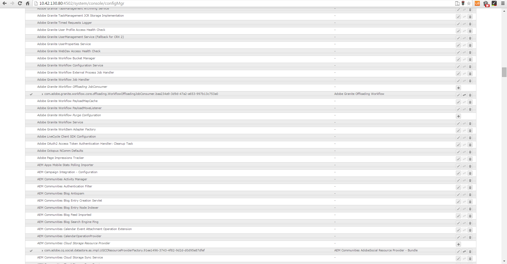

# 信函的後處理和互動式通信{#post-processing-of-letters-and-interactive-communications}

## 後處理 {#post-processing}

工程師可以關聯並執行信件和交互通信的後處理工作流。 可以在Letter模板的「屬性」視圖中選擇要執行的後置進程。 您可以設定貼文程式，以電子郵件、列印、傳真或封存您的最終信件。

若要將貼文程式與信件或互動式通訊建立關聯，您必須先設定貼文程式。 可在提交的信件上執行兩種工作流程：

1. **** 表單工作流程：這些是JEE流程管理工作流程上的AEM Forms。 設定表單工作 [流程的指示](../../forms/using/submit-letter-topostprocess.md#main-pars-header-3)。

1. **** AEM Workflow:AEM工作流程也可用作已提交信件的貼文處理。 設定 [AEM Workflow的指示](../../forms/using/aem-forms-workflow.md)。

## 表單工作流程 {#formsworkflow}

1. 在AEM中，使用下列URL開啟您伺服器的Adobe Experience Manager Web Console設定： `https://<server>:<port>/<contextpath>/system/console/configMgr`

   

1. 在此頁面上，找出「AEM Forms Client SDK設定」，然後按一下以展開它。
1. 在伺服器URL中，輸入JEE伺服器上的AEM Forms名稱、登入詳細資訊，然後按一下「儲 **存**」。

   

1. 指定使用者名稱和密碼。
1. 確保將sun.util.calendar添加到還原序列化防火牆配置中。

   轉到還原序列化防火牆配置，並在包前置詞的白名單類下添加sun.util.calendar。

1. 現在，您的伺服器已經對應，而且AEM Forms on JEE中的貼文程式可在建立字母時，於AEM使用者介面中使用。

   

1. 若要驗證程式／服務，請復製程式名稱，然後返回「Adobe Experience Manager Web Console設定」頁面> AEM Forms用戶端SDK設定」，並將程式新增為新服務。

   例如，如果字母的「屬性」頁面中的下拉式清單將流程名稱顯示為Forms Workflow -> ValidCCPostProcess/SaveXML，請新增服務名稱 `ValidCCPostProcess/SaveXML`。

1. 若要在JEE工作流程中使用AEM Forms進行後期處理，請設定必要的參數和輸出。 參數的預設值如下所示。

   前往「Adobe Experience Manager Web Console設定」頁面>「對 **[!UICONTROL 應管理設定]** 」，並設定下列參數：

   1. **** inPDFoc（PDF檔案參數）:輸入PDF檔案。 此輸入包含已轉換的字母作為輸入。 所指示的參數名稱是可配置的。 它們可從配置中從「對應管理」配置進行配置。
   1. **** inXMLDoc（XML資料參數）:輸入XML檔案。 此輸入包含使用者以XML格式輸入的資料。
   1. **** inXDPDoc（XDP文檔參數）:輸入XML檔案。 此輸入包含基礎版面(XDP)。
   1. **** inAttachmentDocs（Attachment Documents參數）:清單輸入參數。 此輸入包含所有作為輸入的附件。
   1. **** 重新導向URL（重新導向URL輸出）:指示要重新導向至之URL的輸出類型。
   您的表單工作流程必須有PDF檔案參數或XML資料參數作為輸入，且名稱必須與「對應管理設定」中 **[!UICONTROL 指定的名稱相同]**。 此為「後置進程」下拉式清單中列出的進程所必需。

## 發佈例項的設定 {#settings-on-the-publish-instance}

1. 登入至 `https://localhost:publishport/aem/forms`。
1. 導覽至 **[!UICONTROL 字母]** ，以檢視發佈例項上可用的已發佈字母。
1. 設定AEM DS設定。 請參 [閱設定AEM DS設定](../../forms/using/configuring-the-processing-server-url-.md)。

>[!NOTE]
>
>使用表單或AEM工作流程時，在您從發佈伺服器提交任何內容之前，必須先設定DS設定服務。 否則，提交表單應當失敗。

## 字母實例檢索 {#letter-instances-retrieval}

使用LetterInstanceService中定義的下列API，可進一步處理儲存的字母例項，例如擷取字母例項並刪除字母例項。

<table>
 <tbody>
  <tr>
   <td><strong>伺服器端API</strong></td>
   <td><strong>操作名稱</strong></td>
   <td><strong>說明</strong></td>
  </tr>
  <tr>
   <td>
Public LetterInstanceVO
 
getLetterInstance(String letterInstanceId)
 
拋出ICCException; 
 </td>
   <td>getLetterInstance</td>
   <td>提取指定的字母實例 </td>
  </tr>
  <tr>
   <td>Public void deleteLetterInstance(String letterInstanceId)throws ICCException; </td>
   <td>deleteLetterInstance </td>
   <td>刪除指定的字母實例 </td>
  </tr>
  <tr>
   <td>List getAllLetterInstances(Query)throws ICCException; </td>
   <td>getAllLetterInstances </td>
   <td>此API會根據輸入查詢參數讀取字母實例。 若要擷取所有字母例項，可將查詢參數傳遞為null。  </td>
  </tr>
  <tr>
   <td>Public Boolean letterInstanceExists(String letterInstanceName)拋出ICCException; </td>
   <td>letterInstanceExists </td>
   <td>檢查給定名稱是否存在LetterInstance </td>
  </tr>
 </tbody>
</table>

## 將貼文流程與信函關聯 {#associating-a-post-process-with-a-letter}

在CCR用戶介面中，完成以下步驟，將後置進程與字母關聯：

1. 將滑鼠指標暫留在字母上，然後點選「 **檢視屬性」**。
1. 選擇 **編輯**。
1. 在「基本屬性」中，使用「後置處理」下拉式清單，選擇要與信件關聯的後置處理。 AEM和Forms相關的貼文程式都會列在下拉式清單中。
1. 點選「 **儲存**」。
1. 使用「後置處理」設定信件後，請發佈該信件，並選擇性地在發佈例項上，在AEM DS設定服務中指定處理URL。 這可確保後置進程在處理實例上運行。

## 重新載入草稿字母例項 {#reloaddraft}

您可使用下列URL，在使用者介面中重新載入草稿字母例項：

`https://<server>:<port>/aem/forms/`

`createcorrespondence.html?/random=$&cmLetterInstanceId=$<LetterInstanceId>`

LetterInstaceID:已提交字母實例的唯一ID。

有關保存草稿信函的詳細資訊，請參閱 [保存草稿和提交信函實例](../../forms/using/create-correspondence.md#savingdrafts)。
