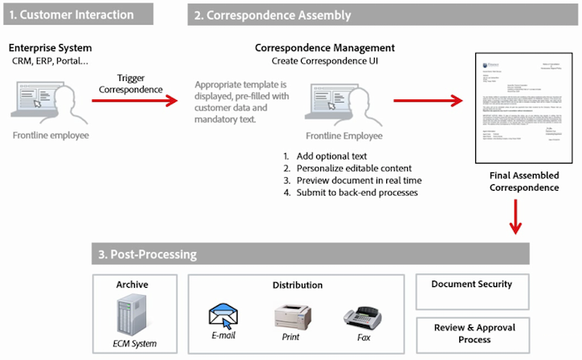

# 信件和互動式通信的後處理{#post-processing-of-letters-and-interactive-communications}

## 後處理 {#post-processing}

代理可以關聯並執行信函和互動式通訊的後處理工作流程。 可在「信函」範本的「屬性」檢視中選取要執行的後置程式。 您可以設定郵寄程式，以傳送電子郵件、列印、傳真或封存最終信函。

若要將貼文處理與信函或互動式通訊建立關聯，您必須先設定貼文處理。 可對提交的信函執行兩種類型的工作流程：

1. **Forms Workflow:** 這些是JEE上的AEM Forms流程管理工作流程。 設定說明 [Forms Workflow](#formsworkflow).

1. **AEM工作流程：** AEM工作流程也可作為已提交信函的貼文程式。 設定說明 [AEM Workflow](../../forms/using/aem-forms-workflow.md).

## 表單工作流程 {#formsworkflow}

1. 在AEM中，使用下列URL開啟您伺服器的Adobe Experience Manager Web Console設定： `https://<server>:<port>/<contextpath>/system/console/configMgr`

   

1. 在本頁中，找出AEM Forms用戶端SDK設定，然後按一下以展開它。
1. 在伺服器URL中，在JEE伺服器上輸入AEM Forms的名稱、登入詳細資訊，然後按一下 **儲存**.

   

1. 指定使用者名稱和密碼。
1. 確保將sun.util.calendar添加到反序列化防火牆配置中。

   轉到「反序列化防火牆配置」，並在「允許列出的包前置詞類」下，添加sun.util.calendar。

1. 現在您的伺服器已對應，且JEE上AEM Forms的貼文處理程式可在建立信函時於AEM使用者介面中使用。

   

1. 若要驗證程式/服務，請復製程式名稱，然後返回「Adobe Experience Manager Web主控台設定」頁面> 「AEM Forms用戶端SDK設定」 ，並將程式新增為新服務。

   例如，如果信函的「屬性」頁面中的下拉式清單將程式名稱顯示為「Forms Workflow-> ValidCCPostProcess/SaveXML」，請新增「服務名稱」作為 `ValidCCPostProcess/SaveXML`.

1. 若要在JEE上使用AEM Forms工作流程進行後置處理，請設定必要的參數和輸出。 參數的預設值如下所示。

   前往Adobe Experience Manager Web主控台設定頁面> **[!UICONTROL 通信管理配置]** 並設定下列參數：

   1. **在PDFDoc(PDF文檔參數)中：** 作為輸入的PDF文檔。 此輸入包含作為輸入的已呈現字母。 所指示的參數名稱是可配置的。 可從「通信管理」設定從設定進行設定。
   1. **inXMLDoc（XML資料參數）:** 作為輸入的XML文檔。 此輸入包含用戶以XML形式輸入的資料。
   1. **在XDPDoc（XDP文檔參數）中：** 作為輸入的XML文檔。 此輸入包含基礎配置(XDP)。
   1. **inAttachmentDocs（Attachment Documents參數）:** 清單輸入參數。 此輸入包含所有作為輸入的附件。
   1. **重新導向URL（重新導向URL輸出）:** 指出要重新導向的url的輸出類型。

   您的表單工作流必須具有PDF文檔參數或XML資料參數，作為輸入，其名稱與 **[!UICONTROL 通信管理配置]**. 此為程式在「後續程式」下拉式清單中列出的必要項目。

## 發佈例項的設定 {#settings-on-the-publish-instance}

1. 登入 `https://localhost:publishport/aem/forms`.
1. 導覽至 **[!UICONTROL 字母]** 檢視發佈執行個體上可用的已發佈信函。
1. 配置AEM DS設定。 請參閱 [配置AEM DS設定](../../forms/using/configuring-the-processing-server-url-.md).

>[!NOTE]
>
>使用Forms或AEM工作流程時，必須先設定DS設定服務，才能從發佈伺服器提交。 否則，提交表格應當失敗。

## 信函例項擷取 {#letter-instances-retrieval}

使用LetterInstanceService中定義的下列API，可進一步操作保存的信函實例，例如檢索信函實例和刪除信函實例。

<table>
 <tbody>
  <tr>
   <td><strong>伺服器端API</strong></td>
   <td><strong>操作名稱</strong></td>
   <td><strong>說明</strong></td>
  </tr>
  <tr>
   <td>
公用LetterInstanceVO
 
getLetterInstance(String letterInstanceId)
 
擲回ICCException; 
 </td>
   <td>getLetterInstance</td>
   <td>擷取指定的信函例項 </td>
  </tr>
  <tr>
   <td>公用void deleteLetterInstance(String letterInstanceId)擲回ICCException; </td>
   <td>deleteLetterInstance </td>
   <td>已刪除指定的信函實例 </td>
  </tr>
  <tr>
   <td>List getAllLetterInstances(Query)擲回ICCException; </td>
   <td>getAllLetterInstances </td>
   <td>此API會根據輸入查詢參數擷取信函例項。 若要擷取所有信函例項，可將查詢參數傳入null。  </td>
  </tr>
  <tr>
   <td>公用布林值letterInstanceExists(String letterInstanceName)擲回ICCException; </td>
   <td>letterInstanceExists </td>
   <td>檢查LetterInstance是否按給定名稱存在 </td>
  </tr>
 </tbody>
</table>

## 將貼文處理與信函關聯 {#associating-a-post-process-with-a-letter}

在CCR用戶介面中，完成以下步驟，將後置處理與信函關聯：

1. 將滑鼠移到信函上，然後點選 **檢視屬性**.
1. 選取&#x200B;**編輯**。
1. 在「基本屬性」中，使用「後置處理」下拉清單，選擇要與信函關聯的後置處理。 與AEM和Forms相關的貼文程式都會列在下拉式清單中。
1. 點選 **儲存**.
1. 使用「後置處理」設定信函後，請發佈信函，並選擇性地在發佈執行個體上，在AEM DS設定服務中指定處理URL。 這可確保後續程式在處理執行個體上執行。

## 重新載入草稿信函例項  {#reloaddraft}

您可以使用下列url，在使用者介面中重新載入草稿信函例項：

`https://<server>:<port>/aem/forms/`

`createcorrespondence.html?/random=$&cmLetterInstanceId=$<LetterInstanceId>`

LetterInstaceID:已提交信函例項的唯一ID。

如需儲存草稿信函的詳細資訊，請參閱 [保存草稿和提交信函實例](../../forms/using/create-correspondence.md#savingdrafts).
