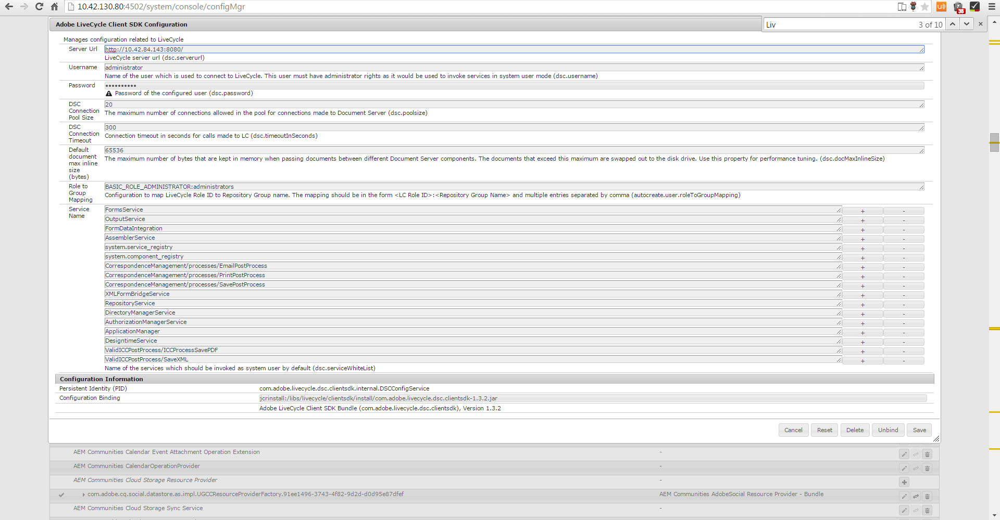

# Post處理信函和互動式通訊{#post-processing-of-letters-and-interactive-communications}

## Post處理中 {#post-processing}

代理程式可以關聯並執行信函和互動通訊的後處理工作流程。 可以在Letter範本的「屬性」檢視中選取要執行的Post程式。 您可以設定郵件程式，以電子郵件、列印、傳真或封存最終信件。

若要將郵寄處理與信件或互動式通訊建立關聯，您必須先設定郵寄處理。 提交信件上可執行兩種型別的工作流程：

1. **Forms Workflow：**&#x200B;這些是JEE上的AEM Forms程式管理工作流程。 設定[Forms Workflow](#formsworkflow)的說明。

1. **AEM工作流程：** AEM工作流程也可以用來作為已提交信件的後置處理程式。 設定[AEM工作流程](../../forms/using/aem-forms-workflow.md)的說明。

## 表單工作流程 {#formsworkflow}

1. 在AEM中，使用下列URL開啟伺服器的Adobe Experience Manager Web主控台設定： `https://<server>:<port>/<contextpath>/system/console/configMgr`

   

1. 在此頁面中，找到AEM Forms使用者端SDK設定，然後按一下以展開它。
1. 在伺服器URL中，輸入JEE伺服器上AEM Forms的名稱、登入詳細資料，然後按一下[儲存]。****

   

1. 指定使用者名稱和密碼。
1. 確認已將sun.util.calendar新增至「還原序列化防火牆設定」。

   移至[還原序列化防火牆組態]，並在[允許清單套裝程式首碼的類別]下，新增sun.util.calendar。

1. 現在，您的伺服器已對應完畢，且在建立信件時，可在AEM使用者介面中使用AEM Forms on JEE中的發佈程式。

   

1. 若要驗證程式/服務，請復製程式名稱，然後返回「Adobe Experience Manager Web主控台設定」頁面> 「AEM Forms使用者端SDK設定」 ，並將程式新增為新服務。

   例如，如果信函的「屬性」頁面中的下拉式清單將處理序名稱顯示為Forms Workflow-> ValidCCPostProcess/SaveXML，請新增「服務名稱」為`ValidCCPostProcess/SaveXML`。

1. 若要在JEE工作流程中使用AEM Forms進行後續處理，請設定必要的引數和輸出。 引數的預設值如下所示。

   前往「Adobe Experience Manager Web主控台組態」頁面> **[!UICONTROL 通訊管理組態]**，並設定下列引數：

   1. **inPDFDoc (檔案引數PDF)：**&#x200B;作為輸入的PDF檔案。 此輸入包含轉譯字母作為輸入。 指定的引數名稱是可設定的。 您可從設定的「通訊管理」設定中進行設定。
   1. **inXMLDoc （XML資料引數）：**&#x200B;作為輸入的XML檔案。 此輸入包含使用者以XML格式輸入的資料。
   1. **inXDPDoc （XDP檔案引數）：**&#x200B;作為輸入的XML檔案。 此輸入包含基礎配置(XDP)。
   1. **inAttachmentDocs （附件檔案引數）：**&#x200B;清單輸入引數。 此輸入包含作為輸入的所有附件。
   1. **redirectURL （重新導向URL輸出）：**&#x200B;指出重新導向目標URL的輸出型別。

   您的表單工作流程必須有PDF的檔案引數或XML資料引數作為輸入，且名稱與&#x200B;**[!UICONTROL 通訊管理設定]**&#x200B;中指定的名稱相同。 必須將它列在Post流程下拉式清單中。

## Publish執行個體上的設定 {#settings-on-the-publish-instance}

1. 登入`https://localhost:publishport/aem/forms`。
1. 瀏覽至&#x200B;**[!UICONTROL 信件]**&#x200B;以檢視發佈執行個體上可用的已發佈信件。
1. 設定AEM DS設定。 請參閱[設定AEM DS設定](../../forms/using/configuring-the-processing-server-url.md)。

>[!NOTE]
>
>使用Forms或AEM工作流程時，您必須先設定DS設定服務，才能從發佈伺服器提交任何內容。 否則，表單提交將會失敗。

## 信件例項擷取 {#letter-instances-retrieval}

已儲存的信件例項可透過使用LetterInstanceService中定義的下列API進一步操作，例如擷取信件例項和刪除信件例項。

<table>
 <tbody>
  <tr>
   <td><strong>伺服器端API</strong></td>
   <td><strong>作業名稱</strong></td>
   <td><strong>說明</strong></td>
  </tr>
  <tr>
   <td>
公開LetterInstanceVO
 
getLetterInstance(String letterInstanceId)
 
擲回ICCException； 
 </td>
   <td>getLetterInstance</td>
   <td>擷取指定的字母例項 </td>
  </tr>
  <tr>
   <td>公用void deleteLetterInstance(String letterInstanceId)擲回ICCException； </td>
   <td>deleteLetterInstance </td>
   <td>已刪除指定的字母例項 </td>
  </tr>
  <tr>
   <td>清單getAllLetterInstances（查詢）擲回ICCException； </td>
   <td>getAllLetterInstances </td>
   <td>此API會根據輸入查詢引數擷取信件例項。 若要擷取所有信件執行個體，可將查詢引數傳遞為null。  </td>
  </tr>
  <tr>
   <td>公用布林值letterInstanceExists（字串letterInstanceName）擲回ICCException； </td>
   <td>Lettinstanceexists </td>
   <td>檢查指定的名稱是否存在LetterInstance </td>
  </tr>
 </tbody>
</table>

## 建立後處理與字母的關聯 {#associating-a-post-process-with-a-letter}

在CCR使用者介面中，完成下列步驟，將後處理與信函產生關聯：

1. 將滑鼠指標暫留在信函上，並選取&#x200B;**檢視內容**。
1. 選取&#x200B;**編輯**。
1. 在「基本屬性」中，使用「Post程式」下拉式清單，選取與信函關聯的後置程式。 AEM和Forms相關的發佈程式都會列在下拉式清單中。
1. 選取「**儲存**」。
1. 使用Post流程設定信函後，請發佈信函，並選擇在發佈執行個體上指定AEM DS設定服務中的處理URL。 這可確保在處理執行個體上執行後續程式。

## 重新載入草稿字母例項  {#reloaddraft}

草稿信件例項可以使用以下URL在使用者介面中重新載入：

`https://<server>:<port>/aem/forms/`

`createcorrespondence.html?/random=$&cmLetterInstanceId=$<LetterInstanceId>`

LetterInstanceID：已提交信件例項的唯一ID。

如需儲存信函草稿的詳細資訊，請參閱[儲存草稿及提交信函例項](../../forms/using/create-correspondence.md#savingdrafts)。
