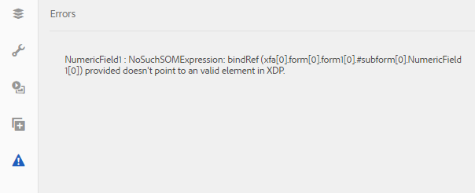

# 使用XFA表單範本同步化最適化表單{#synchronizing-adaptive-forms-with-xfa-form-templates}

## 簡介 {#introduction}

您可以根據XFA表單範本（檔案）建立最適 `*.XDP` 化表單。 此重複使用可讓您保留現有XFA表單的投資。 有關如何使用XFA表單模板建立自適應表單的資訊，請 [基於模板建立自適應表單](../../forms/using/creating-adaptive-form.md#p-create-an-adaptive-form-based-on-an-xfa-form-template-p)。

您可以以最適化表單重複使用XDP檔案的欄位。 這些欄位稱為「已裝訂」欄位。 系統會從XDP檔案複製已裝訂欄位的屬性（例如指令碼、標籤和顯示格式）。 您也可以選擇覆寫部分屬性的值。

AEM Forms提供一種方式，可協助您讓最適化表單的欄位與XDP檔案中後續對應欄位所做的任何變更保持同步。 本文將說明如何啟用此同步。

在AEM Forms製作環境中，您可以將欄位從XFA表單（左）拖曳至最適化表單（右）

## 必備條件 {#prerequisites}

若要使用本文中的資訊，建議您熟悉下列區域：

* [建立最適化表單](../../forms/using/creating-adaptive-form.md)

* XFA（XML表單架構）

若要使用文章中的範例所提供的資產，請下載範例套件，如下一節「範例套件」中 [所述](../../forms/using/synchronizing-adaptive-forms-xfa.md#p-sample-package-p)。

## 範例套件 {#sample-package}

文章使用範例來示範如何將最適化表單與更新的XFA表單範本同步。 範例中使用的資產可在套件中使用，可從本文的「下載  」區段下載。

上傳套件後，您可以在AEM Forms UI中檢視這些資產。

使用軟體包管理器安裝軟體包： `https://<server>:<port>/crx/packmgr/index.jsp`

套件包含下列資產：

1. `sample-form.xdp`:以XFA表單範本為例

1. `sample-xfa-af`:基於sample-form.xdp檔案的自適應表單。 但是，此最適化表單不包含任何欄位。 在下個步驟中，我們將新增內容至此最適化表單。

### 將內容新增至最適化表單 {#add-content-to-adaptive-form-br}

1. 導覽至https://&lt;server>:&lt;port>/aem/forms.html。 如有詢問，請輸入您的認證。
1. 開啟範例af-xfa，以在作者模式中進行編輯。
1. 從側欄的「內容」瀏覽器中，選擇「資料模型物件」標籤。 將NumericField1和TextField1拖曳至最適化表單。
1. 將NumericField1的標題從「數值」 **欄位變更****為「AF數值」欄位。**

>[!NOTE]
>
>在前述步驟中，我們覆寫XDP檔案中欄位的屬性。 因此，如果稍後修改XDP檔案中的對應屬性，則不會同步此屬性。

## 檢測XDP檔案中的更改 {#detecting-changes-in-xdp-file}

每當XDP檔案或片段有任何變更時，AEM Forms UI會標示所有以XDP檔案或片段為基礎的最適化表單。

更新XDP檔案後，您必須在AEM Forms UI中重新上傳檔案，才能標幟變更。

例如，讓我們使用下列步 `sample-form.xdp` 驟更新檔案：

1. 如果出現提 `https://<server>:<port>/projects.html.` 示，請導覽至「輸入您的認證」。
1. 按一下左側的「表單」標籤。
1. 在本機 `sample-form.xdp` 電腦上下載檔案。 XDP檔案作為檔案下載， `.zip` 可以使用任何檔案解壓縮實用程式來解壓縮。

1. 開啟檔 `sample-form.xdp` 案並將欄位TextField1的標題從「文字欄位」 **變更為** 「我 **的文字欄位」**。

1. 將檔案 `sample-form.xdp` 上傳回AEM Forms UI。

如果XDP檔案更新，當您根據XDP檔案編輯最適化表單時，會在編輯器中看到圖示。 此表徵圖表示最適化表單與XDP檔案不同步。 在下列影像中，請參閱側邊欄旁的圖示。

## 將最新的XDP檔案同步化最適化表單 {#synchronizing-adaptive-forms-with-the-latest-xdp-file}

在下次開啟與XDP檔案不同步的自適應表單以進行創作時，將顯示以下消息：已 **更新最適化表單的架構／表單範本。`Click Here`以新版本重新建立基礎。**

按一下訊息會同步最適化表單中的欄位與XDP檔案中的對應欄位。

對於本文中使用的範例，請在編寫模 `sample-xfa-af` 式中開啟。 該消息顯示在最適化表單的底部。

### 更新屬性 {#updating-the-properties}

除了由作者在最適化表單（從「元件對話框」）中明確覆寫的屬性外，所有從XDP檔案複製到最適化表單的屬性都會更新。 已更新的屬性清單可在伺服器記錄檔中使用。

若要更新範例最適化表單中的屬性，請按一下訊息中的連結( `"Click Here"`標示為)。 TextField1的標題會從「文字欄位」 **變更為「我****的文字欄位」**。

>[!NOTE]
>
>AF數值欄位標籤未變更，因為您已從元件屬性對話方塊中覆寫此屬性，如新增內容至最適化表 [單中所述](../../forms/using/synchronizing-adaptive-forms-xfa.md#p-add-content-to-adaptive-form-br-p)。

### 從XDP檔案新增欄位至最適化表單 {#adding-new-fields-from-xdp-file-to-adaptive-form-nbsp}

任何稍後添加到原始XDP檔案的欄位都會顯示在「表單層次」頁籤中，您可以將這些新欄位拖動到自適應表單中。

您不需要按一下錯誤訊息中的連結，即可更新「表單階層」索引標籤中的欄位。

### 已刪除XDP檔案中的欄位 {#deleted-fields-in-xdp-file}

如果先前複製至最適化表單的欄位從XDP檔案中刪除，在編寫模式中會顯示錯誤訊息，指出該欄位不存在於XDP檔案中。 在這種情況下，從最適化表單中手動刪除欄位，或清除元 `bindRef` 件對話方塊中的屬性。

下列步驟說明本文章範例中資產的使用流程：

1. 更新檔 `sample-form.xdp` 案並刪除NumericField1。
1. 在AEM Forms `sample-form.xdp` UI中上傳檔案
1. 開啟適 `sample-xfa-af` 應性表單以製作。 將顯示以下錯誤消息：已更新最適化表單的架構／表單範本。 `Click Here` 以新版本重新建立基礎。

1. 按一下訊息中的連 `Click Here`結（標示為「」）。 會顯示錯誤訊息，指出XDP檔案中不再存在欄位。

已刪除的欄位也會標示圖示，以指出欄位中的錯誤。

>[!NOTE]
>
>最適化表單中具有不正確系結的欄位(編輯對話 `bindRef` 框中的無效值)也視為已刪除欄位。 如果作者未修正這些錯誤並發佈最適化表單，則該欄位會視為一般未加入的最適化表單欄位，並包含在輸出XML檔案的未加入區段中。

## 下載 {#downloads}

本文中範例的內容封裝

[取得檔案](assets/sample-xfa-af-sync-1.0.zip)
