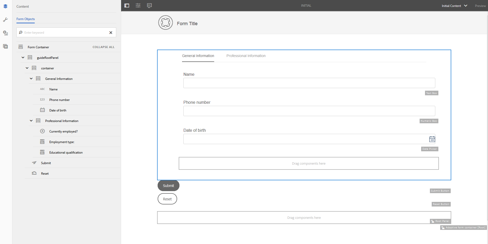

# 最適化表單範本{#adaptive-form-templates}

當您製作表單時，您會新增欄位和元件，以在編輯器中定義表單結構、內容和動作。 您可在表單容器中新增 `guideRootPanel` 欄位和元件。 使用範本編輯器，您可以建立範本，其中包含作者可用來建立表單的基本結構和初始內容。

例如，您希望所有表單作者在註冊表單中都有特定的文字方塊、導覽按鈕和送出按鈕。 您可以建立範本，其中包含作者可用來建立與其他註冊表單一致的表單的元件。 當作者使用範本建立最適化表單時，新表單會繼承您在範本中指定的結構和元件。 範本編輯器可讓您：

* 在結構層中添加表單的頁首和頁尾元件。
* 提供表單的初始內容。
* 指定主題、提交動作。

## 使用範本 {#working-with-templates}

您可以從「工具」選單導覽至「 **Adobe Experience Manager >工具>範本」，以存取範本編輯器**。 在這裡，範本會組織在可編輯範本的資料夾中。 AEM提供全域資料夾以組織範本。 但是，預設未啟用。 您可以要求管理員啟用全域資料夾或建立範本的新資料夾。 有關如何建立資料夾的詳細資訊，請參閱模 [板資料夾](/help/sites-developing/page-templates-editable.md)。

點選以開啟資料夾後，您會發現「建立」按鈕，允許為最適化表單建立新範本。

### 建立範本 {#create-template}

建立資料夾後，開啟該資料夾並執行以下步驟以建立模板：

1. 在範本主控台中，點選 **您在已建立的資料夾中** 「建立」。
1. 在「挑選範本類型」區段中，選取「最適化表 **單範本」** ，然後點選「 **下一步」**。

1. 在「範本詳細資料」區段中，提供範本標題並點選「建 **立**」。
您可以提供說明和縮圖，當您在製作表單時，可以選取已建立的範本。

1. 點選 **「完成** 」以返回主控台，或點選「 **開啟** 」以在編輯器中開啟範本。

### 範本編輯器UI {#template-editor-ui}

當您開啟範本進行編輯時，可以看到下列AEM Editor元件：

* **頁面工具列**&#x200B;包含下列選項：

   * **切換側面板**:可讓您顯示或隱藏側邊欄。
   * **頁面資訊**:可讓您指定資訊，例如發佈／解除發佈時間、縮圖、用戶端程式庫、頁面原則和頁面設計用戶端程式庫。
   * **模擬器**:可讓您模擬和自訂不同裝置的外觀。
   * **** 圖層選擇器：可讓您變更圖層。
可以選擇「結 **構」** (Structure)層 **或「初始內容** 」(Initial Content)層。 結構圖層可讓您新增及自訂頁首和頁尾。 初始內容圖層可讓您自訂表單內容。

   * **** 預覽：可讓您預覽範本在發佈時的外觀。 您可以使用「圖層選擇器」和「預覽」來切換編輯和預覽模式。

* **** 側欄：提供內容、屬性、資產和元件瀏覽器。
* **** 元件工具列：當您選取元件時，會看到工具列，可讓您自訂元件。
* **頁面**:新增內容以建立範本的區域。

請參 [閱製作最適化表單的簡介](../../forms/using/introduction-forms-authoring.md) ，以瞭解Touch UI編輯器。

### 編輯範本 {#editing-a-template}

使用兩個圖層建立最適化表單範本：

* 結構
* 初始內容

圖層選擇器位於畫面右上角的「預覽」選項旁。

### 結構 {#structure}

在「範本編輯器」中選取結構圖層時，您可以在「最適化表單容器」的上下看到版面容器。 作者可將這些版面容器用於頁首和頁尾。 您可以新增、編輯或自訂頁首和頁尾。 將「最適化表單標題」元件拖放至「最適化表單容器」上方的版面容器中，以自訂範本標題。 將「最適化表單頁尾」元件拖放至「最適化表單容器」下方的版面容器中，以自訂範本頁尾。

結構圖層中的版面容器

******答：頁首元件** B的版面容器。頁尾元件的版面容器

將「最適化表單標題」元件拖放至「最適化表單容器」上方的版面容器中。 新增元件後，您可以指定其屬性，讓您新增標誌並提供標題。

同樣地，當您將頁尾元件拖放至版面容器中最適化表單容器下方時，您可以提供版權資訊和公司詳細資訊。

在「結構」圖層中新增的頁首和頁尾

#### 在結構層中鎖定／解鎖元件 {#locking-unlocking-components-in-the-structure-layer}

在編輯已選取結構層的模板時，可以解除鎖定模板的頁眉和頁腳。 如果在模板中解除鎖定元件，表單作者可以使用模板在自適應表單中編輯元件。 鎖定元件可防止表單作者在最適化表單中編輯它。 元件工具列中提供鎖定選項。

例如，您可在範本中新增標題元件。 選擇元件時，可在元件工具欄中看到鎖定選項。 通常，頁首包含公司名稱和標誌，而您不希望表單作者變更範本中的標誌和頁首。 在使用模板建立且標題元件已鎖定的自適應表單中，表單作者不能更改徽標和公司名稱。

>[!NOTE]
>
>不建議在頁首元件中個別鎖定或解鎖影像或標誌。 您可以解除鎖定標題元件。

### 初始內容 {#initial-content}

當選取「初始內容」選項時，範本的「最適化表單容器」會像最適化表單一樣開啟以供編輯。 如同製作最適化表單，您可以指定初始設定，例如選取主題和提交動作。

表單製作者會將其當做建立表單的基礎。 內容流結構是在範本的「初始內容」層中指定。 若要切換至編輯表單範本的初始內容，請在頁面工具列中的「預覽」之前，點選「畫 **>初始內容」**。

範本編輯器中的初始內容圖層，顯示為指定屬性而選取的最適化表單容器。

在「初始內容」圖層中，您會建立作者做為基礎的最適化表單範本。 編寫範本與編寫表單類似，您可使用「側欄」中的選項。 邊欄提供內容、屬性、資產和元件瀏覽器。

請參閱 [側欄](../../forms/using/introduction-forms-authoring.md#sidebar)。

>[!NOTE]
>
>當您選取「儲存內容」或「儲存PDF」做為「提交動作」時，您可以選擇指定「儲存路徑」。 如果您在範本中指定路徑，則從中建立的所有表單都有相同的路徑。 您可以指定正確的儲存路徑，或確保表單作者更新該路徑，以防止每個表單的資料儲存在相同的位置。

#### 使用標籤和面板建立最適化表單範本 {#creating-an-adaptive-form-template-with-tabs-and-panels-nbsp}

例如，您要建立具有下列標籤的範本：

* 一般資訊
* 專業資訊

您已在結構圖層中新增標誌、提供標題和頁尾。 當表單作者使用範本建立表單時，鎖定頁首和頁尾，以阻止他們編輯表單。

將圖層從「結構」變更為「初始內容」，然後開始將內容新增至表單。 若要建立標籤式結構，請在「最適化表單」容器的guideRootPanel中新增子面板。 若要新增面板：

* 當您選取「拖曳元件到此處」選 **項時** ，可以點選+ **按鈕來新增面板** 。

* 您可從側欄的元件瀏覽器拖放面板元件。
* 您可以從元件工具列新增 `guideRootPanel` 子面板。

要建立「一般資訊」和「專業資訊」頁籤，請在的子面板中添加兩個面板 `guideRootPanel`。 選取面板並點選  ，以在側欄中開啟屬性。 將元素名稱分別變 `general-info` 更為「 `professional-info`一般資訊」和「專業資訊」。 在側欄中，點選內容以開啟內容瀏覽器。 在「表單對象」頁籤中，選擇 `guideRootPanel`。 在編輯器中，選取guideRootPanel。 在元件  ，點選cmppr以開啟其屬性。 在「面板配置」欄位中，選取「 **頂端標籤」** ，然後點 **選「完成」**。 標籤式範本結構即會套用。

#### 在標籤中新增內容 {#adding-content-in-tabs}

[在 

在範本中新增欄位

](assets/template-edit-initial-content-1.png)在您新增面板並將其結構為標籤後，您可以在標籤中新增欄位。 在編輯器中選擇頁籤時，可看到「將元件拖 **曳到此處** 」選項。 您可以拖放元件，例如文字方塊、清單項目和按鈕。 您可從側欄的元件瀏覽器拖放元件。

每個元件都具有增強資料擷取和控制的屬性。 例如，您可以啟用元 **件的「必要** 」欄位屬性。 您的作者可以指定客戶在略過填寫必要欄位時看到的訊息。 在「必填欄位訊息 **」屬性中指定訊息** 。

在示例模板中，「一般資訊」頁籤中添加了「名稱」、「電話號碼」和「出生日期」欄位。 在「專業資訊」(Professional Information)頁籤中，添加「當前聘用」(Currently)、「雇傭類型」(Educational celification)欄位。

新增欄位後，您可以新增「提交」和「重設」等按鈕。

### 啟用範本 {#enabling-the-template}

當您建立範本時，範本會新增為草稿。 啟用範本，以用於建立最適化表單。 要啟用模板，請執行以下操作：

1. 導覽至 **Adobe Experience Manager >工具>範本**，然後開啟您建立範本的檔案夾。

1. 您已建立的範本會標示為「草稿」。
1. 選取範本，然後點選工 **具列中的** 「啟用」。
當您建立最適化表單時，會要求您選擇範本時，您會看到列出的範本。

## 導入或導出模板 {#importing-or-exporting-a-template}

表單可與其範本搭配運作。 當您下載使用自訂範本建立的最適化表單時，不會下載範本。 當您在不同的AEM Forms例項上匯入表單時，會匯入不含其範本的表單。 如果表單已匯入但其範本不可用，則不會轉譯表單。 您可以從中的節點封 `/conf` 裝自訂范 `https://<server>:<port>/crx/packmgr`本，並將它移植到您要上傳表單的AEM Forms例項中。

## 使用範本建立最適化表單 {#creating-an-adaptive-form-using-the-template}

建立並啟用範本後，當您建立最適化表單時，範本就可在表單管理員中使用。 要使用模板並建立自適應表單，請參 [閱建立自適應表單](../../forms/using/creating-adaptive-form.md)。

## 變更現成可用範本的顯示選項 {#change-display-option-of-out-of-the-box-templates}

您可以建立自訂範本以自訂最適化表單，以定義基本結構和初始內容。 AEM Forms也提供一套現成可用的最適化表單範本。 您可以選擇顯示或隱藏範本。

執行下列步驟以顯示和隱藏範本：

1. 登入AEM Forms作者例項，並導覽至「工 **具** > **作業** > **Web Console**」。

   >[!NOTE]
   >
   >AEM網頁主控台的URL是https://[server]:[port]/system/console/configMgr

1. 找到並開啟 **FormsManager組態設定** :

   * 若要顯示或隱藏自適應表單範本，請勾選或取消勾選「包 **含現成可用的AF和AD範本」選項** 。
   * 若要顯示或隱藏已新增至AEM 6.0 Forms或AEM 6.1 Forms版本但現已停用的可調式表單範本，請勾選或取消勾選「 **Include AEM 6.0 AF Templates** 」選項。 如果選中此選項，則要生效，它需要啟用「 **Include Out of the box AF and AD Templates** （包含現成可用的AF和AD模板）」配置。

1. 按一下&#x200B;**「儲存」**。現成範本的顯示選項會變更。

## 建議 {#recommendations}

* 在模板編輯器中修改表單的屬性時，請勿使用BindReference屬性。
* 如果要添加斷點，請在編寫自適應表單模板時建立斷點。
如需有關中斷點的詳細資訊，請參閱「自適應 [版面配置」](/help/sites-authoring/responsive-layout.md)。

