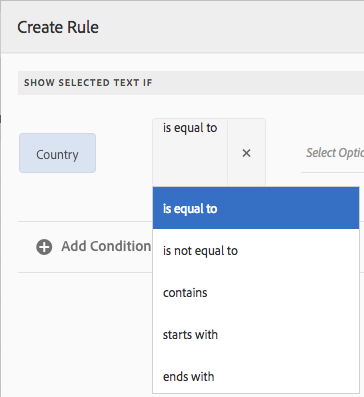

# 互動式通訊中的文字{#texts-in-interactive-communications}

## 概覽 {#overview}

文本文檔片段由一個或多個文本段落組成。 段落可以是靜態或動態。 動態段落可包含表單資料模型屬性和變數。 您也可以套用規則，並在文字檔案片段中重複。 例如，問候語中的客戶名稱可以是表單資料模型(FDM)屬性，其值在運行時可用。 變更這些值後，您就可使用相同的互動式通訊功能，為不同客戶使用代理程式UI準備互動式通訊。

Interactive Communication中的文字檔案片段支援下列類型的動態資料：

* **資料模型物件**:資料屬性使用後端資料來源。
* **規則型內容**:根據規則顯示或隱藏文字中的部分內容。 規則也可以以表單資料模型屬性和變數為基礎。
* **變數**:在文字檔案片段中，變數不會系結至後端資料來源。 代理在準備互動通訊以提交至後置程式時，會填入／選取變數中的值，或將變數系結至資料來源。
* **重複**:您的互動式通訊中可能包含動態資訊，例如信用卡對帳單中的交易，其發生次數可能會隨著每個產生的互動式通訊而不斷變更。 使用重複，可以格式化和構造此類動態資訊。 如需詳細資訊，請參 [閱內嵌條件並重複](https://helpx.adobe.com/experience-manager/6-3/forms/using/cm-inline-condition.html)。

## Create text {#createtext}

1. 選擇「 **[!UICONTROL 表單]** >文 **[!UICONTROL 件片段」]**。
1. 選擇「 **[!UICONTROL 建立]** > **[!UICONTROL 文字」]**。
1. 指定下列資訊：

   * **[!UICONTROL 標題]**:（可選）輸入文本文檔片段的標題。 標題不必是唯一的，而且可以有特殊字元和非英文字元。 文字會以標題（如果有的話）來參照，例如縮圖和屬性。
   * **[!UICONTROL 名稱]**:資料夾內文字的唯一名稱。 任何狀態下，檔案夾中都不能有相同名稱的兩個檔案片段（文字、條件或清單）。 在「名稱」欄位中，您只能輸入英文字元、數字和連字型大小。 「名稱」欄位會根據「標題」欄位自動填入。 在「標題」欄位中輸入的特殊字元、空格、數字和非英文字元將在「名稱」欄位中替換為連字元。 雖然「標題」欄位中的值會自動複製到「名稱」，但您可以編輯值。

   * **[!UICONTROL 說明]**:鍵入文本的說明。
   * **[!UICONTROL 表單資料模型]**:（可選）選擇「表單資料模型」單選按鈕，以基於表單資料模型建立文本。 選擇「表單資料模型」單選按鈕後，將 **[!UICONTROL 顯示「表單資料模型]** 」欄位。 瀏覽並選取表單資料模型。 建立互動式通訊的文字和條件時，請確定您使用的資料模型與您打算在互動式通訊中使用的資料模型相同。 如需表單資料模型的詳細資訊，請參閱資 [料整合](/help/forms/using/data-integration.md)。

   * **[!UICONTROL 標籤]**:（可選）要建立自定義標籤，請在文本欄位中輸入值，然後按Enter。 儲存此文字時，會建立新增的標籤。

1. 點選「 **[!UICONTROL 下一步]**」。

   「建立文本」頁面。 如果您選擇建立基於表單資料模型的文本，則表單資料模型屬性將顯示在左窗格中。

1. 在文字中輸入，並使用下列選項來設定格式、條件化和在文字中插入表單資料模型屬性和變數：

   * [表單資料模型](#formdatamodel)
   * [變數](#variables)
   * [規則編輯器](#rules)
   * [格式選項](#formatting)

      * [從其他應用程式複製貼上格式的文字](#paste)

      * [反白顯示部分文字](#highlight)
   * [重複](/help/forms/using/cm-inline-condition.md)
   * [特殊字元](#special)
   * [搜尋和取代文字](#searching)
   * [鍵盤快速鍵](/help/forms/using/keyboard-shortcuts.md)
   >[!NOTE]
   >
   >您可以在文字編輯器中使用@符號來新增「表單資料模型」元素、「資料字典」元素和變數。 在文本編輯器中輸入前面帶有@的字串時，將搜索所有資料模型元素、資料字典元素和變數，並顯示包含搜索字串的元素或變數。 您可以瀏覽搜尋結果並選取元素或變數。 如果沒有匹配結果，則顯示「 *找不到匹配結果* 」消息。

1. 點選「 **[!UICONTROL 儲存]**」。

   文字隨即建立。 現在，您可以在建立互動式通訊時，繼續將文字當做建置區塊。

## 編輯文字 {#edittext}

您可以使用下列步驟編輯現有的文本文檔片段。 您也可以選擇在互動式通訊編輯器中編輯文字檔案片段。

1. 選擇「 **[!UICONTROL 表單]** >文 **[!UICONTROL 件片段」]**。
1. 導覽至文字檔案片段並加以選取。
1. 點選 **[!UICONTROL 編輯]**。
1. 進行必要的變更。 有關文本中選項的詳細資訊，請參 [閱建立文本](#createtext)。
1. 點選「 **[!UICONTROL 儲存]** 」，然後點 **[!UICONTROL 選「關閉」]**。

## 使用表單資料模型屬性個人化文字檔案片段 {#formdatamodel}

您可以插入表單資料模型屬性，以個人化文字檔案片段。 通過在文本中插入表單資料模型屬性，可以在預覽交互通信時從關聯資料源中提取和填充特定於收件人的資料。 如需表單資料模型的詳細資訊，請參閱「 [AEM Forms資料整合」](/help/forms/using/data-integration.md)。

如果在建立文本時指定了表單資料模型，則表單資料模型中的屬性將顯示在文本編輯器的左窗格中。 指定的表單資料模型對於文字檔案片段以及包含其的互動式通訊應相同。

* 若要將表單資料模型屬性插入文字，請將游標置於要插入屬性的位置，然後點選左窗格中的 **[A]** 屬性，然後點選 **[!UICONTROL [B]Add Selected]**。 您也可以點選兩下屬性，將其插入**[ C ]**游標位置。 表單資料模型屬性會以褐色背景色彩反白顯示。

或者，您也可以使用文字編輯器中的@符號來搜尋和新增表單資料模型屬性。 將游標置於要插入屬性的位置。 鍵入@ ，後面跟搜索字串。 對文檔片段中可用的所有表單資料模型屬性和變數執行搜索操作。 會擷取包含搜尋字串的屬性或變數，並顯示為下拉式清單。 瀏覽搜尋結果，然後按一下您要在游標位置插入的屬性。 按Esc可隱藏搜尋結果。

* 要允許代理在使用代理UI準備和發送交互通信時編輯代理UI中的表單資料模型屬性值，請點選該屬性的 [D](/help/forms/using/prepare-send-interactive-communication.md)**[]** 鎖定表徵圖，並確保該屬性處於解鎖狀態。 屬性的預設狀態已鎖定，且代理無法在代理UI中編輯屬性。

您也可以使用表單資料模型屬性來建構用於顯示或隱藏內容的部分規則。 如需詳細資訊，請參 [閱「在文字中建立規則」](#rules)。

## 在文字檔案片段中建立和使用變數 {#variables}

變數是可在建立互動式通訊時加以系結的預留位置。 變數可系結至表單資料模型屬性或文字片段。 變數也可留給代理人填寫。

在下列情況下，您可以使用變數來取代表單資料模型屬性：

* 文字檔案片段應用於多種互動式通訊，其中不同互動式通訊的系結需要不同。
* 文本文檔片段建立時沒有表單資料模型。 您可以插入變數，並在稍後在建立互動式通訊時將其系結至表單資料模型屬性。
* 您需要從文字檔案片段系結和擷取文字。 只有這些文字檔案片段可以系結至變數，其中不應包含任何變數。

建立或編輯文字檔案片段時，您可以建立和插入變數。 您建立的變數會顯示在代理UI的「資料」索引標籤中。 代理在使用代理UI準備和發送互 [動通信時指定變數的值](/help/forms/using/prepare-send-interactive-communication.md)。

### 建立變數 {#createvariables}

1. 在左窗格中，點選「變 **[!UICONTROL 數」]**。

   此時會出現「變數」窗格。

   

1. 點選「 **[!UICONTROL 建立]**」。

   「建立變數」窗格隨即出現。

1. 輸入下列資訊並點選「 **[!UICONTROL 建立]**:

   * **[!UICONTROL 名稱]** :變數的名稱。
   * **[!UICONTROL 說明]** :（可選）輸入有關變數的說明。
   * **[!UICONTROL 類型]** :選取變數類型：字串、數字、布林值或日期。
   * **[!UICONTROL 僅允許特定值]** :對於字串和數字變數，您可以確保代理從特定值集中選擇，以用於代理UI中的預留位置。 若要指定值集，請選取此選項，然後指定值欄位中允許的逗號分 **[!UICONTROL 隔值]** 。

1. 點選「 **[!UICONTROL 建立]**」。

   變數會建立並列在「變數」窗格中。

1. 若要在文字中插入變數，請將游標置於適當的位置，選取變數，然後點選「新增選取的 **[!UICONTROL 項目」]**。

   

   變數會以淺藍色背景顏色反白顯示，而表單資料模型屬性則會以棕色反白顯示。

   或者，您也可以在文字編輯器中使用@符號來搜尋和新增變數。 將游標置於要插入變數的位置。 鍵入@ ，後面跟搜索字串。 對文檔片段中可用的所有表單資料模型屬性和變數執行搜索操作。 會擷取包含搜尋字串的屬性和變數，並顯示為下拉式清單。 在搜尋結果中導覽，然後按一下您要在游標位置插入的變數。 按Esc可隱藏搜尋結果。

1. 點選「 **[!UICONTROL 儲存]**」。

## 在文字中建立規則 {#rules}

在文字中使用規則編輯器，您可以建立規則，根據預設條件顯示或隱藏文字字串或 **內容**。 這些條件可基於：

* 字串
* 數字
* 數學表達
* 日期
* 關聯表單資料模型的屬性
* 您在文字中建立的任何變數

### 在文字中建立規則 {#create-rules-in-text}

1. 在建立或編輯文字時，選取您要使用規則條件化的文字字串、段落或內容。

   

1. 點選「 **[!UICONTROL 建立規則]**」。

   此時將顯示「建立規則」對話框。 除了字串、數字、數學運算式和日期之外，規則編輯器中也提供下列功能，以建立規則的陳述式：

   * 關聯表單資料模型的屬性
   * 您所建立的任何變數
   選擇要評估的適當選項。

    、規 

   >[!NOTE]
   >
   >不支援建立規則來條件化和顯示文字的Collection屬性。

1. 選取適當的運算子來評估規則，例如「等於」、「包含」和「開頭為」。

   

1. 插入評估運算式、值、資料模型屬性或變數。

   

   如果收件者的位置是US（根據FDM的源資料），則顯示選定文本的規則

   * 在建立或編輯規則時，您也可以點選  (Resize)以展開「建立規則／編輯規則」對話方塊。 展開的全視窗對話方塊可讓您拖放表單資料模型屬性和變數，以建立規則。 再次點選「調整大小」，返回「建立規則」對話方塊。
   * 您也可以在規則中建立多個條件。
   * 您也可以建立重疊規則，其中規則會套用至已套用規則之內容的一部分。

1. 點選「 **[!UICONTROL 完成]**」。

   套用規則。 套用規則的文字或內容會以綠色反白顯示。 當您將滑鼠指標暫留在反白顯示的左側控點上時，會出現套用的規則。

   

   按一下套用規則的左側控制代碼後，您就可以取得編輯或移除規則的選項。

## 格式化文字 {#formatting}

在建立或編輯文字時，工具列會依您選擇進行的編輯類型而變更：段落、對齊或清單：[選 

選擇工具列類型：段落、對齊或清單

](assets/toolbarselection.png)字型編 

字型編輯工具列

對齊工具列

清單工具欄

### 反白顯示／強調部分文字 {#highlight}

若要反白\強調可編輯檔案片段中的部分文字，請選取文字並點選「反白顯示顏色」。

您可以直接點選「基本顏色」浮動視窗中顯示的基本顏色 **[A]** ，或在使用滑桿 **B後點選「選取」****[]** ，以選擇適當的顏色陰影。

或者，您也可以前往「進階」索引標籤，選取適當的「色相」、「明度」和「飽和度 **[C]** 」以建立精確的色彩，然後點選「選取 **[D]** 」以套用色彩來反白顯示文字。

### 貼上格式化文字 {#paste}

若要重複使用其他應用程式（例如從Microsoft® word或HTML頁面）中存在的多段文字，請將文字複製並貼入文字編輯器中。 複製的文本的格式將保留在文本編輯器中。

您可以複製和貼上可編輯文字檔案片段中的一或多個文欄位落。 例如，您可能有Microsoft® word檔案，其中包含可接受的居住證明項目清單，例如：

您可以直接將Microsoft® word檔案中的文字複製並貼至可編輯的文字檔案片段。 文字檔案片段中會保留項目清單、字型和文字顏色等格式。

>[!NOTE]
>
>不過，貼上文字的格式有一些 [限制](https://helpx.adobe.com/aem-forms/kb/cm-copy-paste-text-limitations.html)。

## 在文字中插入特殊字元 {#special}

如果需要，請在文檔片段中插入特殊字元。 例如，您可以使用「特殊字元」浮動視窗來插入：

* 貨幣符號，例如€、¥和英鎊
* 數學符號，如∑、√、÷和^
* 標點符號‟，例如&quot;

文字編輯器內建支援210個特殊字元。 管理員可 [以透過自訂新增更多／自訂特殊字元的支援](/help/forms/using/custom-special-characters.md)。

## 搜尋和取代文字 {#searching}

使用包含大量文字的文字檔案片段時，您需要搜尋特定的文字字串。 您也可能需要以替代字串取代特定文字字串。

「尋找和取代」功能可讓您搜尋（和取代）文字檔案片段中的任何文字字串。 此功能也包含強大的規則運算式搜尋功能。

1. 開啟文字檔案片段以 [進行編輯](#edittext)。
1. 點選「 **[!UICONTROL 尋找和取代」]**。

1. 在「查找」( **[!UICONTROL Find]** )文本框中輸入要搜索的文本，在「替換」( **[!UICONTROL Replace]** )文本框中輸入新文本（替代文字），然後點選「替 **[!UICONTROL 換」(Replace]**)。

1. 如果找到所搜尋的文字，文字會由取代文字取代。

   * 如果找到搜索文本的另一個實例，該實例會在文本文檔片段中突出顯示。 如果再次點選「 **[!UICONTROL 取代]** 」(Replace)，則會替換突出顯示的實例，並且如果找到第三個實例，游標會向前移動。
   * 如果找不到其他例項，「尋找與取代」對話方塊會顯示訊息：已到模組結束。
   您也可以點選「全部取代」，在單次執行中取代所有相符項目。

   「尋找與取代」也包含功能強大的規則運算式搜尋。 若要在搜尋中使用規則運算式，請選取「 **[!UICONTROL Reg ex]** 」，然後點選「 **[!UICONTROL 尋找]** 」 **[!UICONTROL 或「取代]**」。

