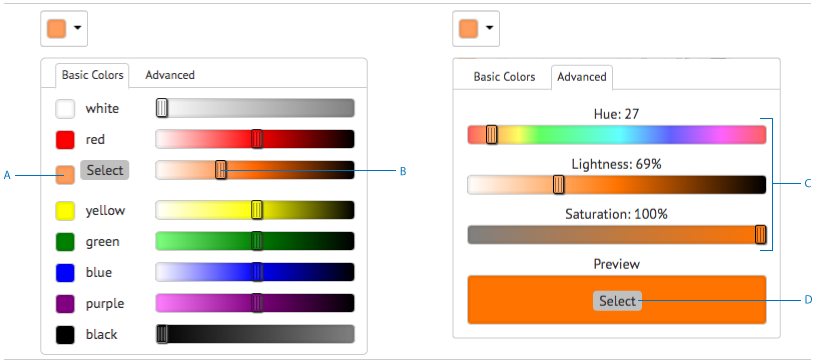

# 互動交流中的文本{#texts-in-interactive-communications}

## 概觀 {#overview}

文本文檔片段由一個或多個文本段落組成。 段落可以是靜態的或動態的。 動態段落可能包含表單資料模型屬性和變數。 您還可以應用規則並在文本文檔片段中重複。 例如，稱呼中的客戶名稱可以是「表單資料模型(FDM)」屬性，其值在運行時可用。 通過更改這些值，可以使用相同的互動式通信為使用代理用戶介面的不同客戶準備互動式通信。

Interactive Communication中的文本文檔片段支援以下類型的動態資料：

* **資料模型對象**:資料屬性使用後端資料源。
* **基於規則的內容**:基於規則顯示或隱藏的文本中的部分內容。 規則也可以基於表單資料模型屬性和變數。
* **變數**:在文本文檔片段中，變數未綁定到後端資料源。 代理在準備互動式通信以將其提交到後續進程時填充/選擇變數中的值或將變數綁定到資料源。
* **重複**:您的互動式通信中可能包含動態資訊，例如信用卡對帳單中的事務，其發生次數可能隨著每個生成的互動式通信而不斷變化。 使用重複，可以格式化和構造此類動態資訊。 有關詳細資訊，請參見 [內聯條件和重複](https://helpx.adobe.com/experience-manager/6-3/forms/using/cm-inline-condition.html)。

## 建立文本 {#createtext}

1. 選擇 **[!UICONTROL Forms]** > **[!UICONTROL 文檔片段]**。
1. 選擇 **[!UICONTROL 建立]** > **[!UICONTROL 文本]**。
1. 指定以下資訊：

   * **[!UICONTROL 標題]**:（可選）輸入文本文檔片段的標題。 標題不必是唯一的，可以有特殊字元和非英文字元。 文本由其標題（如果可用）引用，例如在縮略圖和屬性中。
   * **[!UICONTROL 名稱]**:資料夾內文本的唯一名稱。 任何狀態下的兩個文檔片段（文本、條件或清單）都不能在資料夾中以相同的名稱存在。 在「名稱」欄位中，只能輸入英語字元、數字和連字元。 「名稱」(Name)欄位將基於「標題」(Title)欄位自動填充。 在「標題」欄位中輸入的特殊字元、空格、數字和非英文字元將替換為「名稱」欄位中的連字元。 儘管「標題」(Title)欄位中的值會自動複製到「名稱」(Name)中，但您可以編輯該值。

   * **[!UICONTROL 說明]**:鍵入文本的說明。
   * **[!UICONTROL 窗體資料模型]**:（可選）選擇「表單資料模型」單選按鈕以基於表單資料模型建立文本。 選擇「表單資料模型」單選按鈕時， **[!UICONTROL 窗體資料模型]** 的子菜單。 瀏覽並選擇表單資料模型。 在為互動式通信建立文本和條件時，請確保使用的資料模型與要在互動式通信中使用的資料模型相同。 有關表單資料模型的詳細資訊，請參見 [資料整合](/help/forms/using/data-integration.md)。

   * **[!UICONTROL 標籤]**:（可選）要建立自定義標籤，請在文本欄位中輸入值，然後按Enter。 保存此文本時，將建立新添加的標籤。

1. 點擊 **[!UICONTROL 下一個]**。

   「建立文本」(Create Text)頁面。 如果選擇建立基於表單資料模型的文本，則表單資料模型屬性將顯示在左窗格中。

1. 在文本中鍵入，然後使用以下選項在文本中格式化、條件化和插入表單資料模型屬性和變數：

   * [表單資料模式](#formdatamodel)
   * [變數](#variables)
   * [規則編輯器](#rules)
   * [格式設定選項](#formatting)

      * [從其他應用程式複製貼上格式化文本](#paste)

      * [突出顯示文本的部分](#highlight)
   * [重複](/help/forms/using/cm-inline-condition.md)
   * [特殊字元](#special)
   * [搜索和替代文字](#searching)
   * [鍵盤快速鍵](/help/forms/using/keyboard-shortcuts.md)

   >[!NOTE]
   >
   >可以使用文本編輯器中的@符號添加表單資料模型元素、資料字典元素和變數。 在文本編輯器中輸入以@開頭的字串時，將搜索所有資料模型元素、資料字典元素和變數，並顯示包含搜索的字串的元素或變數。 您可以瀏覽搜索結果並選擇一個元素或變數。 如果沒有匹配結果， *未找到匹配結果* 的子菜單。

1. 點擊 **[!UICONTROL 保存]**。

   文本即建立。 現在，您可以在建立互動式通信時將文本用作構建塊。

## 編輯文字 {#edittext}

您可以使用以下步驟編輯現有文本文檔片段。 也可以選擇在互動式通信編輯器中編輯文本文檔片段。

1. 選擇 **[!UICONTROL Forms]** > **[!UICONTROL 文檔片段]**。
1. 導航到文本文檔片段並選擇它。
1. 點擊 **[!UICONTROL 編輯]**。
1. 進行所需的更改。 有關文本中選項的詳細資訊，請參見 [建立文本](#createtext)。
1. 點擊 **[!UICONTROL 保存]** 然後點擊 **[!UICONTROL 關閉]**。

## 使用表單資料模型屬性個性化文本文檔片段 {#formdatamodel}

可以通過插入表單資料模型屬性來個性化文本文檔片段。 通過在文本中插入表單資料模型屬性，可以在預覽互動式通信時從關聯資料源獲取和填充特定於收件人的資料。 有關表單資料模型的詳細資訊，請參見 [AEM Forms資料整合](/help/forms/using/data-integration.md)。

如果在建立文本時指定了表單資料模型，則表單資料模型中的屬性將顯示在文本編輯器的左窗格中。 指定的表單資料模型對於文本文檔片段以及包含它的互動式通信來說應該相同。

* 要將表單資料模型屬性插入文本，請將游標置於要插入該屬性的位置，然後選擇 **[A]** 按住左窗格中的屬性，然後點擊 **[!UICONTROL [B] 添加選定項]**。 也可以按兩下該屬性，將其插入 **[C]** 游標位置。 表單資料模型屬性以褐色背景顏色加亮。

或者，也可以使用文本編輯器中的@符號搜索和添加表單資料模型屬性。 將游標置於要插入屬性的位置。 鍵入@ ，然後鍵入搜索字串。 對文檔片段中可用的所有表單資料模型屬性和變數執行搜索操作。 將檢索包含搜索字串的屬性或變數並將其顯示為下拉清單。 在搜索結果中導航，然後按一下要在游標位置插入的屬性。 按Esc隱藏搜索結果。

* 允許代理在代理UI中編輯表單資料模型屬性的值，同時 [準備和發送互動式通信](/help/forms/using/prepare-send-interactive-communication.md) 使用代理UI，點擊 **[D]** 該屬性的鎖定表徵圖，並確保其處於未鎖定狀態。 屬性的預設狀態已鎖定，代理無法編輯代理UI中的屬性。

還可以使用表單資料模型屬性來構造用於顯示或隱藏內容部分的規則。 有關詳細資訊，請參見 [在文本中建立規則](#rules)。

## 在文本文檔片段中建立和使用變數 {#variables}

變數是可在建立互動式通信時綁定的佔位符。 變數可以綁定到表單資料模型屬性或文本片段。 也可以保留變數供代理填充。

在以下情況下，可以使用變數代替窗體資料模型屬性：

* 文本文檔片段將用於多個互動式通信中，其中綁定對於不同的互動式通信需要不同。
* 文本文檔片段在建立時沒有表單資料模型。 可以插入變數，然後在建立交互通信時將它們綁定到表單資料模型屬性。
* 您需要綁定和檢索文本文檔片段中的文本。 只有那些文本文檔片段可以綁定到變數中，不應包含其中的變數。

建立或編輯文本文檔片段時，可以建立和插入變數。 您建立的變數將出現在代理UI的「資料」頁籤中。 代理指定變數的值，而 [使用代理UI準備和發送交互通信](/help/forms/using/prepare-send-interactive-communication.md)。

### 建立變數 {#createvariables}

1. 在左窗格中，點擊 **[!UICONTROL 變數]**。

   將出現「變數」窗格。

   

1. 點擊 **[!UICONTROL 建立]**。

   將顯示「建立變數」窗格。

1. 輸入以下資訊並點擊 **[!UICONTROL 建立]**:

   * **[!UICONTROL 名稱]** :變數的名稱。
   * **[!UICONTROL 說明]** :（可選）輸入有關變數的說明。
   * **[!UICONTROL 類型]** :選擇變數的類型：字串、數字、布爾或日期。
   * **[!UICONTROL 僅允許特定值]** :對於字串和數字變數，可以確保代理從代理UI中佔位符的特定值集中選擇。 要指定值集，請選擇此選項，然後指定在 **[!UICONTROL 值]** 的子菜單。

1. 點擊 **[!UICONTROL 建立]**。

   變數將建立並列在「變數」窗格中。

1. 要在文本中插入變數，請將游標放在適當的位置，選擇變數，然後點擊 **[!UICONTROL 添加選定項]**。

   

   變數以淡藍色背景顏色加亮，而表單資料模型屬性以淡藍色加亮。

   或者，也可以使用文本編輯器中的@符號搜索和添加變數。 將游標置於要插入變數的位置。 鍵入@ ，然後鍵入搜索字串。 對文檔片段中可用的所有表單資料模型屬性和變數執行搜索操作。 將檢索包含搜索字串的屬性和變數並將其顯示為下拉清單。 在搜索結果中導航，然後按一下要在游標位置插入的變數。 按Esc隱藏搜索結果。

1. 點擊 **[!UICONTROL 保存]**。

## 在文本中建立規則 {#rules}

在文本中使用規則編輯器，可以建立規則以根據 **預設條件**。 這些條件可以基於：

* 字串
* 數字
* 數學表達式
* 日期
* 關聯表單資料模型的屬性
* 在文本中建立的任何變數

### 在文本中建立規則 {#create-rules-in-text}

1. 在建立或編輯文本時，選擇要使用規則條件化的文本字串、段落或內容。

   

1. 點擊 **[!UICONTROL 建立規則]**。

   將出現「建立規則」對話框。 除了字串、數字、數學表達式和日期之外，規則編輯器中還提供了以下內容，用於建立規則的語句：

   * 關聯表單資料模型的屬性
   * 您可能建立的任何變數

   選擇要評估的相應選項。

    

   >[!NOTE]
   >
   >建立規則時不支援集合屬性以條件化和顯示文本。

1. 選擇相應的運算子來評估規則，如「等於」、「包含」和「開始於」。

   

1. 插入計算表達式、值、資料模型屬性或變數。

   

   根據FDM的源資料，如果收件人的位置為US，則顯示所選文本的規則

   * 在建立或編輯規則時，也可以點擊  （調整大小）以展開「建立規則/編輯規則」對話框。 通過展開的全窗口對話框，可以拖放表單資料模型屬性和變數以構建規則。 再次點擊「調整大小」以返回「建立規則」對話框。
   * 也可以在規則中建立多個條件。
   * 您還可以建立重疊規則，在這些規則中，規則應用於已應用規則的內容的一部分。

1. 點擊 **[!UICONTROL 完成]**。

   將應用規則。 應用規則的文本或內容以綠色突出顯示。 懸停在加亮的左手柄上時，將顯示應用的規則。

   

   按一下所應用規則的左手柄後，將獲得編輯或刪除規則的選項。

## 設定文本格式 {#formatting}

建立或編輯文本時，工具欄會根據您選擇進行的編輯類型而更改：段落、對齊或清單：

選擇工具欄類型：段落、對齊或清單

字型編輯工具欄

對齊工具欄

清單工具欄

### 加亮/強調文本的部分 {#highlight}

要突出顯示可編輯文檔片段中的部分文本，請選擇文本並點擊「突出顯示顏色」。

可以直接點擊基本顏色 `**[A]**` 在「基本顏色」調色板中顯示或點擊 **選擇** 使用滑塊後 `**[B]**` 的雙曲餘切值。

（可選）您還可以轉到「高級」頁籤以選擇適當的「色相」、「明度」和「飽和度」 `**[C]**` 建立精確顏色，然後點擊「選擇」 `**[D]**` 按鈕。

### 貼上格式化文本 {#paste}

要重新使用另一個應用程式中存在的多個文本段落中的一個，請將文本複製並貼上到文本編輯器中。 複製文本的格式將保留在文本編輯器中。

可以複製和貼上可編輯文本文檔片段中的一個或多個文本段落。 例如，您可以有一份Microsoft® Word文檔，其中包含可接受居住證明的項目符號清單，如下所示：

您可以直接將文本從Microsoft® Word文檔複製並貼上到可編輯的文本文檔片段。 文本文檔片段中保留格式，如項目符號清單、字型和文本顏色。

>[!NOTE]
>
>但是，貼上的文本的格式有 [限制](https://helpx.adobe.com/aem-forms/kb/cm-copy-paste-text-limitations.html)。

## 在文本中插入特殊字元 {#special}

如果需要，請在文檔片段中插入特殊字元。 例如，可以使用「特殊字元」調色板插入：

* 貨幣符號，如€、¥和英鎊
* 數學符號∑、√、∂和^
* 標點符號，如&quot;和&quot;

文本編輯器內置了對210個特殊字元的支援。 管理員可以 [通過自定義添加對更多/自定義特殊字元的支援](/help/forms/using/custom-special-characters.md)。

## 搜索和替代文字 {#searching}

使用包含大量文本的文本文檔片段時，需要搜索特定的文本字串。 您可能還需要用替代字串替換特定文本字串。

「查找和替換」功能允許您搜索（和替換）文本文檔片段中的任何文本字串。 該功能還包括功能強大的規則運算式搜索。

1. 開啟文本文檔片段 [編輯](#edittext)。
1. 點擊 **[!UICONTROL 查找和替換]**。

1. 輸入要在 **[!UICONTROL 查找]** 的子菜單。 **[!UICONTROL 替換]** 文本框和點擊 **[!UICONTROL 替換]**。

1. 如果找到搜索的文本，則文本將被替代文字替換。

   * 如果找到搜索文本的另一個實例，則該實例會在文本文檔片段中突出顯示。 如果點擊 **[!UICONTROL 替換]** 同樣，如果找到第三個實例，則會替換突出顯示的實例，游標會向前移動。
   * 如果找不到另一個實例，則「查找和替換」對話框將顯示一條消息：已到模組末尾。

   您也可以點擊「全部替換」以一次性替換所有匹配項。

   「查找和替換」還包括功能強大的規則運算式搜索。 要在搜索中使用規則運算式，請選擇 **[!UICONTROL Reg ex]** 然後點擊 **[!UICONTROL 查找]** 或 **[!UICONTROL 替換]**。
